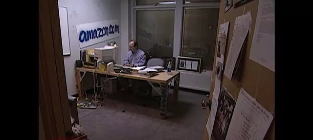

今天在网易云阅读里面，买了方丈（雪球CEO方三文）的新书《您厉害，您赚得多》。

读了三分之一，收获很多，把笔记整理在这里。

我读的书，多半都是观念革新类的，可以带给我认知升级的书。昨天看到一句话，"对每个人伤害最大的观念，一般都是那些他们都懂，但往往都理解错了的观念"，很认同，举个例子，"股市里面的技术流派，那类认为研究过去的K线，数浪，然后可以预测未来的股价走势，就可以做到追涨杀跌，一年翻10倍"。不否认这种方法可以赚到钱，但长期看，这类人一定赚不到钱，不仅耗费了时间颗粒无收，往往还损失本金，无法翻身，因为他们的观念认知"我可以预测股价走势"是片面、狭隘的。他们没有赔率思维和概率思维。

书中有一个观点，"炒股某种程度来说，其实也是赌博，你需要概率思维和赔率思维，才能在这个市场里玩下去"。巴菲特就是一个概率思维和赔率思维非常强的人，不轻易下注，等研究清楚了再下手。

读这本书的一个好处，是可以挖掘哪些是雪球上面的大V，即你可以找到真正有水平的人。

@坚信价值，说他研究过一份基金经理从业人员表，公募出来的人转投私募，很少有成功的；但券商出身的人转投私募成功的有不少。他给出的理由是，公募的人追求的都是固定回报，不追求绝对回报，钱都是从市场募集而来的，不是自己的钱，你亏了不心疼，不亏或微赚，能稳定住客户不流失，这是最稳妥的，这种理念模式会让他的投资行为趋于保守和稳健，一旦转换私募，多半还会采取这种策略，而且他们不擅长与投资人沟通，公募基金经理不需要和股民们沟通，转投私募的话，则需要大量和投资人沟通的工作。我觉得这很有意思。

方丈说，"主动择时，是不可取的；被动择时，也就是分析估值，选择低估的公司，才可取"。 你或许有点不服，但你试试就知道，主动择时，追涨杀跌，图的是操作上的那个爽劲，根本不是长期赚钱之道。

前天在微博上看到一张图片和这个视频。

图中的人是亚马逊创始人Jeff Bezos，这是他1999年在西雅图的办公室。亚马逊今天是市值8000亿美金的公司，目前占据了电子商务、云计算、语音入口三个领域的世界第一，Jeff Bezos也是新世界首富。1999年，亚马逊市值也有300亿美金，这办公室看起来太寒酸了吧。

看看CBS对他的采访，你可能能明白一点什么。[视频链接](https://v.qq.com/x/page/v0527okizp5.html)在此。

我看完后，记住了他的大笑和他说的一个词，nerd，他说自己就是一个nerd。看看nerd这个词的中文涵义，它并不是一个褒义词。

Jeff Bezos给nerd这个词正名了，今天我突然意识到，我其实也是一个nerd，不擅长交际，总在电脑上面搞，喜欢死读书。

读这么多书的目的是为什么？认知升级。世界太复杂了，个人的知识储备极其有限，尤其在投资领域，方丈在书里面说，"为什么我的钱要交给专业投资人打理，他们持仓的股票其实都是我们大众所熟悉，我们自己都能买的，为什么要把钱交给他们？"，答案是"他们可以做到深入研究，帮你有定力拿得住这些股票"。

@Ricky，说其实大多数人，炒股赚不到钱，不是买不到好公司，是弄不清公司的价值，拿不住好公司，这是需要学习的地方，也是学习可以提升你的地方。

举个例子说，你可能知道陌陌这个公司，它做了一个"约炮"app，截止今天它的市值是60亿美金；今日头条这个看新闻的app，它最近的一次投前估值是200亿美金。你可能会惊讶，就一个app，它们怎么能值这么多钱？我以前就是这么想的，如果你也这么想，这就是你认知需要升级的地方。

还有很多诸如此类的公司，你根本想不到它们能创造出来的价值。等哪天它们变成了腾讯和茅台，你才知道你又错过了一大波赚钱的机会。

