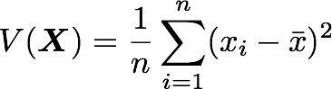
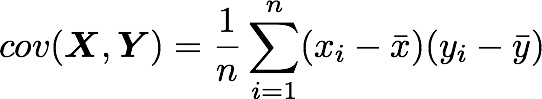
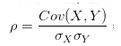

目前看到对Numpy里协方差矩阵讲解最准确的一篇文章是：

https://blog.csdn.net/winter_evening/article/details/71773502

**方差，标准差与协方差之间的联系与区别：**

1. 方差和标准差都是对一组(一维)数据进行统计的，反映的是一维数组的离散程度；而协方差是对2组数据进行统计，反映的是2组数据之间的相关性。
2. 标准差和均值的量纲（单位）是一致的，在描述一个波动范围时标准差比方差更方便。比如一个班男生的平均身高是170cm,标准差是10cm,那么方差就是10cm^2。可以进行的比较简便的描述是本班男生身高分布是170±10cm，方差就无法做到这点。
3. 方差可以看成是协方差的一种特殊情况，即2组数据完全相同。
4. 协方差只表示线性相关的方向，取值正无穷到负无穷。
5. 协方差的相关系数，不仅表示线性相关的方向，还表示线性相关的程度，取值[-1,1]。也就是说，相关系数为正值，说明一个变量变大另一个变量也变大；取负值说明一个变量变大另一个变量变小，取0说明两个变量没有相关关系。同时，相关系数的绝对值越接近1，线性关系越显著。
6. 方差和协方差分母使用N时，计算结果为有偏性；分母使用N－1，计算结果为无偏性。
7. 对于Numpy里面np.var默认计算结果是有偏的，使用参数ddof=1，计算结果才是无偏；
8. 对于Numpy里面np.cov默认计算结果是无偏的，使用参数ddof=0或bias=True，计算结果才是有偏；

方差：

标准差：

方差开根号

协方差：

相关系数：

相关系数：用X、Y的**协方差**除以**X的标准差**和**Y的标准差**。

了解概念，请查看参考文档。

参考：

https://www.zhihu.com/question/20852004/answer/134902061

https://www.investopedia.com/articles/financial-theory/11/calculating-covariance.asp

https://en.wikipedia.org/wiki/Covariance_and_correlation

https://www.face2ai.com/Math-Probability-4-6-Covariance-and-Correlation/

https://blog.csdn.net/winter_evening/article/details/71773502

https://www.cnblogs.com/xunziji/p/6772227.html