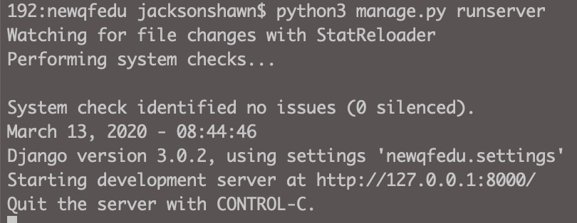
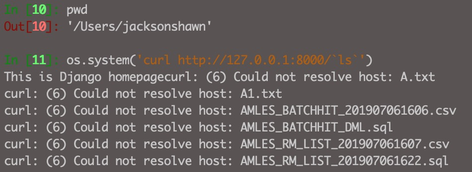
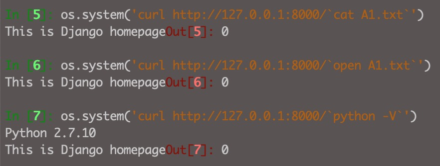

启动Django服务器，默认会开始Debug模式，开启后，当你在页面上输入的url无法匹配视图函数时，Django会将错误日志栈在页面上暴露出来，生产环境千万不能使用。




开启一个IPython终端，在里面执行`ls`命令：

```python
os.system('curl http://127.0.0.1:8000/`ls`')
```

即将当前目录下的文件列表给输出出来。




我们尝试执行一下`cat`命令，没有返回结果：

```python
os.system('curl http://127.0.0.1:8000/`cat A1.txt`')
```


执行一下`open`命令，可以将A1.txt文件打开；

```
os.system('curl http://127.0.0.1:8000/`open A1.txt`')
```




如果当前目录下有可被执行的Python脚本，当前用户如果具备执行权限，也可以使用`python`命令执行脚本程序。