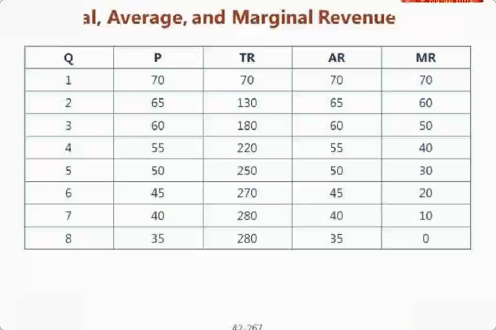

今天学习经济学的内容。
先分析宏观经济、再行业、最后分析公司。

CFA的economics分为三大块，分别是微观经济学、宏观经济学和国际经济学（主要分为国际贸易和外汇）。

经济学开山鼻祖：亚当斯密，市场自发形成，由看不见的手推动。
1930金融危机，凯恩斯写了利息货币通论，提出了经济不能由看不见的手推动，大萧条这种情况需要国家政策进行干预。
1963年萨缪尔森提出了宏观经济学和微观经济学的概念。

**微观经济学**
微观经济学：供需关系、公司和市场结构

**供给与需求关系**

1、需求函数：
一件商品X的需求量是由该商品本身的价格、消费者的收入以及商品Y的价格等因素共同决定。
比如，汽油的需求量由消费者收入水平、汽车价格、油价本身三个因素决定。在收入和汽车价格固定的情况下，油价上升，汽油的需求量会减少。

2、经济学里面都将价格画在Y轴，将数量画在X轴。价格是自变量，数量是因变量。

3、供给函数：
一件商品X的供给由商品X本身的售价、原材料成本、工人工资等因素决定。

4、Movements along demand and supply curves
Changes in quantity demanded or supplied of product X casued by changes in market price of the product X.
商品X的供需数量由X价格变动引发的，称之为Movements along demand and supply curves。

5、Shifts in demand and supply curves
Changes in quantity demanded or supplied of product X caused by other independent variables other than changes in market price the product X.
商品X的供需数量不是由X价格变动引发的，称之为Shifts in demand and supply curves。

参考：
https://zhuanlan.zhihu.com/p/24857400

6、Equilibrium price and the equilibrium quantity(均衡价格和均衡数量)
当商品X的价格太高时，此时处于一个供给比较多，需求比较少的情况，此时商品处于盈余状态；
当商品X的价格太低时，此时处于一个攻击比较少，需求比较多的情况，此时商品处于短缺状态；
市场会自发调节供给和需求，当供给等于需求时，商品X便达到了一个均衡价格，这时候的供给和需求数量就是均衡数量

当供给和需求达到均衡数量时，整个社会的福利是最大化的；过度生产（overprodction）或生产不足（underproduction）都会造成社会福利损失，即无谓损失（deadweight loss）。

带来deadweight loss（阻碍社会福利最大化）的因素有：

限制价格（医院专家号的挂号费、最低工资标准）、税收、政府补贴（出口退税）、配额（分配配额会限制生产，从而导致生产不足）、垄断（政府管制带来的垄断，比如幼儿园）、外部受损（第三方受损，比如环境污染）、外部利益（第三方受益，比如植树造林）、公共福利（比如国防（没有排他性，没有利益性））、公共资源（煤炭、电力）

7、Price elasticity of demand（需求的价格弹性）
A measure of how sensitive changes in quantity demanded to a change in price,and it is expressed as the ratio of percentage changes in each variable.

需求的价格弹性结果一定是一个负数。

弧弹性：粗略研究，计算供给或需求曲线上面，某一段弧的弹性，分母使用beginning value和ending vlaue的求和平均数。

点弹性：精确研究，计算供给货需求曲线上面，某一个点的弹性。

Price elasticity of demand（价格的需求弹性）

1. When elasticity < 1,the demand is said to be inelastic;
2. When elasticity > 1,the demand is said to be elastic;
3. When elasticity = 1,the demand is said to be unitary elastic;

上图这张需求价格弹性图，如果是水平线，说明需求对价格的变化非常明显，价格上升一点点，需求瞬间就降为0；价格下降一点点，需求瞬间就上升为无穷大；
比如：大白菜市场价格是2块，如果你提价为2.01，没有人来买，需求瞬间消失

如果是垂直线，说明需求对价格的变化一点不敏感，价格上升一点点，需求只减少一点点，价格上升到无限，需求也不会降低多少；价格下降一点点，需求只增加一点点，价格下降到无限，需求也不会增多；
比如：胰岛素价格100块钱一针，一天只会打一针；上升到1000块或下降到10块钱，仍然只会一天打一针；

1、价格的需求弹性值一定是一个负数
2、弹性值等于1的时，说明它是一个单位弹性，此时公司的经营策略已经达到最大化
3、当一个商品的处于高弹性时(弹性值大于1)，采取降价政策，能刺激需求产生，公司的经营策略应该降价；当一个商品处于低弹性时（弹性值小于1），应该采取涨价策略
比如：飞机的经济舱和头等舱，经济舱弹性大；头等舱弹性小；经济舱可以打折促销，头等舱从来不会打折促销；

影响弹性的因素
1. 可替代品容易获得时，商品的弹性值越大，替代品的可获得性与弹性具有正相关性；刚需产品则是低弹性；
2. 消费花费与收入比率，也会影响价格的需求弹性
3. 可以挑选的时间越长，商品的弹性越大；

8、Cross-price elasticity of demand（需求的交叉弹性）
交叉弹性研究的是Y的价格变动对X的需求影响
比如：梨是苹果的替代品，苹果价格上涨，会影响梨的消费上升，是一个正向的弹性关系。或者比如钢笔和铅笔
比如：汽油和汽车是互补品，汽车价格上升，影响汽油的消费降低；汽油价格上升，买车的欲望也会减少，是一个负向的弹性关系。或者比如铅笔与铅笔刀

9、Income elasticity of demand（收入弹性）
Positive income elasticity：收入上升，需求上升。比如：奢侈品、餐厅下馆子等
Negative income elasciticy：收入上升，需求下降。比如：方便面、大宝护肤品、火腿肠等

10、替代效应和收入效应
前提：替代效应和收入效益的前提是，商品X的价格下降。
替代效应的结果一定是一个正数值；因为商品X可以替代同等其它产品，商品X价格下降，对其的需求会增加；
收入效益对于正常商品来说是一个正数值；对于劣等品来说是一个负数值；因为商品X如果是正常品，消费者有能力购买更多产品；如果是劣等品，消费者并不会购买更多产品；

11、Giffen goods（吉芬商品）
大饥荒时，收入效益超过了替代效应。导致土豆的价格越高，需求越高；需求越高，价格越高，如此强化增加。

12、Veblen goods（韦伯伦商品，炫耀性商品）
价格越贵，需求越大。比如非常贵的奢侈珠宝，豪华汽车这一类顶端的贵族阶层使用的商品。
与Giffen goods不同点是：CFA认为Veblen goods无法使用经济学原理解释，Giffen goods可以被经济学解释。

13、Economic profit（经济利润，也就是超额利润）
Accounting profit（会计利润）
Implicit opportunity costs（隐性机会成本）

Economic profit = Accounting profit - Implicit opportunity costs
比如：一天的工资为300块，去肯德基端盘子工资为一天80块；不考虑其它因素，经济利润为220块一天。

14、边际效应和边际效应递减

第一列L表示工人人数；第二列TP表示总的生产件数；第三列AP表示平均生产件数；第四列MP表示边际生产件数

边际效应递减示意图，当工人数量增加到一定程度，边际生产件数反而下降

1.Marginal product是Total product的斜率
2.当Marginal product等于0时，Total product数值最大
3.MP（Marginal product）与AP（Average product）的关系
当Marginal product大于Average product时，Average product会增加；
当Marginal product小于Average product时，Average product会减少；
当Marginal product等于Average product时，Average product达到最大值；

Total revenue和Average revenue和Marginal revenue
与Total product、Average product、Marginal product非常类似

15、市场结构

当Marginal revenue等于0时，Total revenue可以达到最大。

MR与价格P，价格弹性Price elasticity关系如下：
MR=P[1-1/Ep]

TR=P\*Q
MR=$\Delta$TR/$\Delta$Q
$\Delta$TR=P\*$\Delta$Q + Q\*$\Delta$P
将$\Delta$TR代入MR进行推导，得出：
MR=P+Q\*$\frac{$\Delta$P}{$\Delta$Q}$
	=P\*(1+$\frac{$\Delta$P}{$\Delta$Q}$\*$\frac{Q}{P}$)
	=P(1+$\frac{1}{Ep}$)

由于Ep是一个负数值，因此MR=P(1-$\frac{1}{$|Ep|$}$)

16、平均总成本、平均可变成本、平均固定成本、边际成本关系

1.AFC逐渐减少
2.MC与ATC和AVC相交在其最低点
3.MC是一条U形的曲线，先降低，再上升
4.ATC和AVC也是U形的曲线
5.ATC最低点并不代表利润最大化
6.利润最大化
TR减去TC得到最大值时，利润可以达到最大化；即MR等于MC时，可以达到利润最大化

17、Breakeven point和Shutdown point
盈亏平衡点和关闭点。

**公司和市场结构**

1、市场结构
Perfect competition（完全竞争）：农场品，比如大白菜，无数多的供应商，极多的买家和卖家，商品是同质的，进入和推出都很容易，商家没有定价权，商品只能卖一个市场价

Monopolistic competition（垄断竞争）：市场上只有少数几家供应商，比如日化品。公司具有一定的定价权，产品本质是没有差异化，但公司的市场策略会通过创新、品牌、广告来给产品实现差异化

Oligopoly（寡头竞争）：只有少数几家公司提供服务，比如钢铁和石油、汽车，产品和服务完全是同质的，不容易进入。存在一个Interdependence效应，竞争对手的决策会相互影响，比如肯德基和麦当劳、可口可乐和百事可乐。寡头竞争存在规模经济效应。研究寡头市场时，需要研究竞争对手之间的互动

Pure monopoly（完全垄断）：只有一个Seller，独家产品，没有替代品。比如水电煤，非常难进入也非常难进出。政府授权导致的垄断或自然形成的垄断比如微软的windows系统。

但实际中，完全竞争和完全垄断（因为永远有替代品存在）并不存在，它是一个经济学意义上的概念。

2、完全竞争市场，短期可能会存在超额利润（Economic profit为负数）或超额亏损（Economic profit为负数），但长期不存在超额利润或超额亏损；

3、垄断竞争，MR等于MC时，可以实现利润最大化，生产数量确定下来；通过生产数量Quantity去寻找价格，将销售价格确定下来。短期内可能存在超额利润或超额亏损，长期不存在超额利润或超额亏损

4、研究寡头竞争市场时，存在4个模型，分别是
Kinked demand curve model、Cournot duopoly model（最不重要的模型）、Nash equilibrium model（pisoner's dilemma，最重要的模型）、Stacklberg dominant firm model

***Kinked demand curve model特征：***
a.我涨价时，别人不涨价，导致我的销售数量减少很快；我降价时，别人也降价，导致我的销售数量无法增长。

b.由于Kinked demand curve model是一个折线模型，它的MR是两段断开的直线，无法找到MR等于MC的点，来预估Quantity，从而无法做到Price searcher，无法决定最优价格。

c.能够解释市场竞争对手之间的互动性

***Cournot model特征：***
假设市场中只有两家公司，并且两家公司的MC一样。

***Nash equilibrium model特征：***
a.只有两家公司串谋时，才能达到双方利益最大化。成功串谋是有条件的，主要影响因素有：供应商越少越容易串谋、产品存在同质化、订单的规模相对较小、订单的频次发生的比较频繁、成本结构、违约的惩罚代价、
比较少的外部竞争才易于串谋

b.寡头市场里，大家想串谋，如果串谋成功，则是cartel效应；因为很难串谋成功，纳什均衡研究的串谋失败的情况下，利益最大化

***Stacklberg dominant firm model特征：***
a.条件是市场中有一家独大，再加上一群小公司。这家大公司具备产品的定价权。
b.小公司里出现降价行为，会导致主导公司的市场份额上升。

5、完全垄断情况下，公司具备超额利润。政府授权导致的垄断比如：电视台；自然竞争导致的垄断，比如水电煤，它只能由一家来铺设管道，才能让全社会的成本最低。完全垄断情况下，商家不会最求价格的最大化，只需要定一个适当的价格，让利润达到最大化即可。

6、价格歧视
a.一级价格歧视，对所有消费者都采用最高价格来销售
b.二级价格歧视，按照产品质量优劣设定不同价格进行销售
c.三级价格歧视，将消费者进行分群，对不同的人群使用不同的价格进行销售

7、市场集中度检测（Concentration measures）
The N-firm concentration ratio：最大的N家公司的市场份额。有人认为4家公司的市场份额之和加起来超过60%，就认为是一个高度垄断的市场。

The Herfindahl-HirschmanIndex（HHI指数）：将市场中所有份额的平方之和相加到一起，取值范围为0到10000。低于1000时，表示充分竞争；高于1000低于1800时出现了垄断，高于1800时，发生了垄断程度比较高。

HHI指数更容易发现大公司之间的合并。

**宏观经济学**
宏观经济学：总产出和经济增长（GDP是研究增长的一个最好的指标。）、经济周期、货币政策、财政政策。

1、微观经济学和宏观经济学的核心

微观经济学的核心是供给和需求决定的均衡理论；宏观经济学的核心是GDP理论。研究发现，人均GDP越高的地方，婴儿的寿命越高。

2、GDP包涵商品和服务、自住房、政府服务（警察、法官、消防、医院等公共服务），不包含没有市场化的服务，比如自己提供的婴儿养育、家庭劳动、地下经济（钟点工，收入不通过税务体系计量、贩毒等等违法行为）、物物交易（用自家养的鸡换别人种的大米）。

地下经济不计入GDP，但也会带来经济繁荣；GDP是一个流量概念，不是存量概念。

3、GNP和GDP的区别。
GNP指本国公民产生的经济，包括本国国民和本国国民去海外投资产生的经济效益；GDP是一个地理概念，指本国和他国国民在本国产生的经济效益。

GDP includes,and GNP excludes,the production of goods and services or income to capital owned by foreigners within that country.
GNP includes,and GDP excludes,the production of goods and services or income to capital owned by its citizens outside of the country.

用GDP来衡量一个国家或地区的经济，比GNP更准确。

Nominal GDP:使用今年的价格乘以今年的产量
Real GDP:使用基准年的价格乘以今年的产量
Per capita GDP:使用Real GDP除以人口数量，可以得到人均GDP。人均GDP越高的地方，人均寿命越高。
GDP deflator = (Nominal GDP/Real GDP)\*100,这个指标反映整个经济体的通货膨胀。

4、GDP的度量口径。

支出法：消费商品和服务的总和，绝大部份国家会使用支出法对该国的GDP进行统计
GDP = C + I + G + (X-M)
C = Consumer spending on final goods and services
I = Gross private domestic investment,which includes business investment in capital goods(plant and equipment) and changes in inventory(inventory investment)
G = Government spending on final goods and services
X = Exports
M = Imports

收入法(Income-based approach)：销售商品和服务的总和
GDP = National income + Capital consumption allowance + Statistical discrepancy（统计调整项）

National income（国民收入）包含:工薪基层、资本家的税前收入、债主、个体户(也是资本家的一种)、地主、
政府增值税
Capital consumption allowance(CCA) :维持资本生产性必须投入的折旧养护费用

**IS curve and LM curve**

IS曲线:Income-saving曲线，研究商品市场的均衡。
当自变量(利率)变动引起因变量(GDP)变动，我们称之为Movement along曲线；利率越高，投资下降，产出也会下降；利率R与GDP产出是一个反向关系;
当其它因素变动引起GDP变动，比如企业财政则政策导致GDP变化，称之为Shift;

IS曲线带来的等式关系如下：
S=I+(G-T)+(X-M)

IS曲线说明居民的储蓄在宏观方向上被用在三个方面。一是被企业用来做投资；二是用作政府开销(G-T)；外国人消费(X-M)

(G-T)=(S-I)-(X-M)
说明政府支出比税收高，政府资金要么来自居民储蓄，要么来自外汇储备。

LM曲线:Liquidity-money，研究货币市场的均衡。
货币需求分为三块,第1点加第2点称之为L1需求，与产出（GDP）是同向关系：第3点是L2需求，L2与利率是反向关系。利率与GDP是同向关系。其它因素比如货币供给或物价下降，会导致GDP变动，称之为Shift;

1.交易性需求
2.预防性需求
3.投机性需求(利率越高，投机性需求越低)

Aggregate demand Curve(AD):总需求(理解为GDP的四部门需求)
把IS曲线和LM曲线相交的点组成的线是AD曲线，表示的含义是商品市场和货币市场都达到了均衡，此时总需求曲线是最佳状态。
AD的Y轴式价格水平;X轴是GDP;价格水平越高，GDP水平越低，呈现反向关系;

GDP=C+I+G+NX(Net export)

家庭财务增加会促进C(consumer spending)增加;
消费者预期和商业预期:对C和I都会产生正相关效益;
Fiscal policy:财政政策,政府的花费增加(G增加)或政府减税(C增加)
Monetary policy:货币政策,影响C和I;
Exchange Rate:汇率改变,会影响NX;本币贬值增加出口减少进口;本币升值减少出口增加进口
Growth in the Global economy:外国经济好,增加本国出口;本国经济好,增加本国进口

Aggregate supply(AS):总供给
非常短期总供给:短期内,价格不会影响总供给
短期总供给:物价水平越高,产出越多
长期总供给:长期来看,价格水平对供应量不会产生影响,理解为Full employment下的产出量

**Economic growth and sustainablity**

经济增长的可持续性:Cobb-Douglas production function
长期来看,影响GDP的因素有三个:科技、资本、劳动力
影响短期,但不影响长期的因素归纳起来就是:价格水平

Stagflation:经济停滞,通货膨胀
滞涨起因原材料价格上涨,导致供给减少,导致GDP减少,物价上升,失业增加,工资减少,导致物价下降。

Total factor productivity(TFP):全要素生产效力
Y=T\*(K**a)\*L**(1-a)

a:资本家资本获得的社会效益部份，它是分配系数
1-a:劳动人民获得的社会效益部份

Solow residual认为科技推动GDP产生了多少增长很难估算，可以使用
$\Delta$Y/Y-a\*$\Delta$K/K-(1-a)\*$\Delta$L/L计算出来

通过过去的科技增长率来推算未来的GDP可能增长率是多少;除了科技，其它因素对GDP的影响都存在边际递减效应.

**经济周期**
经济周期大致可以分为4个部分:
Rivivals（最低点）,Expansions（增长期，最低点向最高点爬坡的阶段）,
Recessions（最高点）,Contractions（衰退期）

Inventory-sales ratio:存货销售比率
在经济顶峰时这个参数值能够达到最高点；

Utilization of labor levels:劳动力使用效率
在经济复苏一段时间才会增加雇佣；在经济衰退一段时候才会开始解雇。

Fluctution in Capital Spending:资本投入
复苏初期就会开始投资，资本投资是非常敏感的。

**Business Cycle Characteristics**
对于通货膨胀:
增长初期会发生温和通胀，通胀水平会随经济增长而持续降低；
增长晚期也会产生温和通胀；
经济顶峰时期，通货膨胀会加速；
衰退期通胀膨胀会减速并且伴随一个衰退；

**Keynesian School(凯恩斯主义)**

Conclusion：
1.经济周期主要由需求变动导致，需求变动可以被财政政策影响；
2.工人工资的减少在短期内具备downward stickiness属性；
Limitations：
1.财政赤字对政府来说是一个危险情况
2.激进的政府干预可能会过热
3.财政政策的实施存在滞后性

**New Keynesians(Neo-Keynesians，即新凯恩斯主义)**
短期内商品价格的维持原状存在粘性，需要政府来干预将经济退回均衡状态

Long-term unemployed：3到4个月失业就认为长期失业
Frictionally unemployed：摩擦性失业，无法避免，劳资双方互配需要时间
Structural unemployment：结构性失业，科技进步带来的失业，整体角度来看，是好事
Cyclical unemployment：周期性失业，经济周期衰退带来的失业
 
Natural rate of unemployment(NARU)：自然失业率，完全就业情况下的失业率

Hyperinflation:恶性通货膨胀，一年500%或1000％的增长
Deflation:通缩，物品越来越便宜，抑制消费
Disinflation:在下降的通货膨胀率
Stagflation:滞涨，高通货膨胀率和经济放缓的结合，并且会伴随高失业率

CPI：消费者物价指数
PPI/WPI：制造者物价指数，批发者物价指数。它是CPI的领先指标

Core inflation:排除了食品和能源的通货膨胀，因为这两者是大宗商品，全球统一价格。
Headline inflation：包含一切的通货膨胀。
Laspeyes index：构成CPI篮子里面的物品保持不变。容易比较，但会存在偏差。
Paasche index:使用今天的一揽子商品来估算CPI。
Fisher index:将上面两者进行加权平均。If=开根号(Ip\*Il)

通货膨胀的两个原因：
Cost-push（成本推动）、Demand-pull（需求拉动）

Leading economic indicator:下面4种是经济发展的先行指标。
S&P 500 stokck index,
Money supply real M2,
Interest rate spread between 10-year treasury yields and overnight borrowing rates
(经济变差，Credit spread将会变大；Maturity spread将会降低，因为会降息；)
Index of consumer expectations

Lagging economic indicator:经济发展的滞后指标。
Inventory-sales ratio:存货销售指标。经济巅峰时期达到最高点，此后会一直下降。

**货币政策和财政政策**

财政政策
1.税收
2.政府支出

货币政策
宽松货币政策：Expansionary/Accomodative/Easy，增加货币供应及扩大信贷
紧缩货币政策：Contractionary/Restrictive/Tight，减少货币供应及收紧信贷

Narrow Money:Notes and coins + high liquidity deposits
Broad Money:Narrow money + liquid assets that can complete purchase

M0:一个国家发行的真实货币数量（纸币加上硬币）
M1:M0加上活期存款和支票存款
M2:M1加上定期存款，M2是派生货币，本质是一种信用；M2是被动生成的
（M2增加，是信用扩张再增加；M2减少，则是信用收缩在减少）

The Quantity Theory of Money(货币的量化理论):
money supply * velocity = price * real output(MV=PY)
Velocity：表示资金流转的速率
real output：生产力水平，基本上是恒定的。

Money neutrality（货币中性）:
增加货币供应，在长期过程中，会推动物价水平上涨和通货膨胀，但是对GDP和就业率的带动几乎没有影响，即对经济刺激几乎
不起作用。
结论：控制货币供应的速度会影响物价水平和通胀的速率。

Money demand:
Transactions-related和Precautionary:交易性和预防性
Speculative:投机性

Money supply:长期来看基本稳定不变，因为只能由央行供应货币。
Interest rate decrease，货币供应增加。
Interest rate increase，持有货币的成本变高，从而导致货币供应下降。

**Fisher Effect**: Nominal interest rate约等于Real interest rate加上Expected inflation.
（名义利率等于真实利率加上通货膨胀利率）

**Improvement Fisher effect**: Risk premium is encompassed in the equation to illustrate
the compensation for investors' uncertainty about future values of some economic variables.
such as inflation and real growth.

Nominal interest rate等于Real interest rate加上Expected inflation加上RP(风险溢价).

**Roles of Central Bank**
1.Monopoly supplier of the currency（唯一的货币供给者）
2.Banker to the government and bankers' bank
3.Lender of last resort（最后借款人）
4.Regulator and supervisor of the payments system
5.Conductor of monetary policy
6.Supervisor of the banking system

**Objectives of Central Bank**
1.Maintain price stability through target inflation(发达国家一般定2%-3%)
2.Maintain exchange rate stability through foreign reserves
3.Prompt economic growth
4.Achieve full employment(促进就业)
5.Moderate long term interest rates

**Unexpected anticipated inflation**
通货膨胀会导致物价上涨，如果发生恶性通货膨胀，则会出现下面两种不好的情况：

1.财富转移（从存款人转移到贷款人身上，从债权人转移到债务人身上）
2.加剧经济周期

**国际经济学**
国际经济学：国际贸易和外汇

**Tools of the Central Bank**
央行的工具主要有三个：基准利率（比较中性）、存款准备金率（效果最强烈）、公开市场操作
（使用得最频繁，可以微调）、窗口指导（中国特有）

**The Central Bank's Policy Rate**
基准利率下降，会降低融资成本，形成扩张的货币政策；
基准利率上升，会提高融资成本，对货币政策进行紧锁；

基准利率的几种叫法：

1.Official interest rate
Repo rate:short-term collateralized lending rates of repurchase agreement
Discount rate:the rate for banks to borrow reserves from Fed
2.Base rate
3.Official refinancing rate
4.Fed fund rate

**Reserve  Requirements**
存款准备金率提高，导致市场中可以借出的资金减少，进而导致货币供应减少，最终导致利率上升；

**Open Market Operations(most commonly used)**
从商业银行或特定的市场参与者买卖政府债券，从而控制货币的供应。
央行购买债券，会导致货币供应增加；
央行卖出债券，会导致货币供应减少，紧锁的货币政策；

这种公开市场操作可以帮助商业银行和市场达成预定的准备金率和预期的市场利率。

**政府的财政政策**
包括Spending Tools（支付性工具）和Revenue Tools（收入性工具）

Spending Tools包括：转移支付、基础设施投资、政府运转的支出（三公消费、公务员工资）
Revenue Tools包括：Direct taxes（直接税收）、Indirect taxes（间接征税）

Direct taxes：对人和企业直接征收的税收，比如工资所得税、遗产税、房产税、资本利得税
Indirect taxes：对商品和服务征收的税称之为间接税，包括：增值税、消费税

（Indirect taxes对经济的影响更快速，调节效果更快）

征税的原则：
1、简单
2、高效率
3、公平（水平公平：同样状态的人征收相同的税率；垂直公平：富人应该征收更多的税）
4、充分（税收应该覆盖政府开支）

**Fiscal Multiplier**

Fiscal multiplier = $/frac{1}{(1-MPC(1-t))}$ = $/frac{1}{(1-b(1-t))}$

（其中t表示税率，b表示消费倾向）

MPC(Marginal propensity of consumption):边际消费倾向
如果我收入100，愿意消费80块，则MPC饰80％

Fiscal multipiler：政府消费对经济的刺激放大器

1、与税率负相关
2、与MPC正相关

（税率越低，刺激效果越大；消费倾向越大，刺激效果越大）

**Fiscal policy的局限性**
1.错误的预期（对经济形势的误判，导致材质政策失效）
2.财政政策的迟滞
  a.Recognition lag(政府对经济衰退的观测滞后)
  b.Action lag（财政政策的实施出现延缓，新的财政政策在国外需要立法）
  c.Impact lag（产生效果需要时间）
（奥地利学派认为政府干预会带来经济危机。

**Crowding out effect(挤出效应)**
政府的投资会抑制私营企业的投资，比如政府刺激经济，对一些领域加大投资，会抑制该行业同类型公司自己
进行投资。再比如，政府去市场中借钱，拉高市场利率；导致私营企业的成本提高，导致产生薄利或不赚钱的情况。

**Ricardian Equivalence(李嘉图均衡)**
政府给个人减税，个人会意识到政府未来一定会加税，减税并不会增加消费，无法刺激经济。

****

****

****

****

****

****

****

