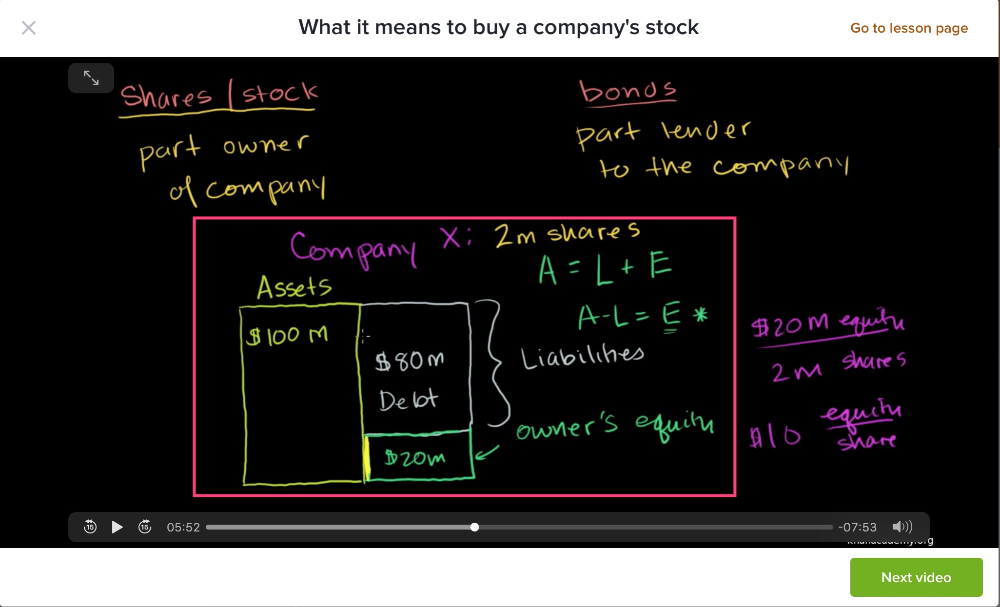
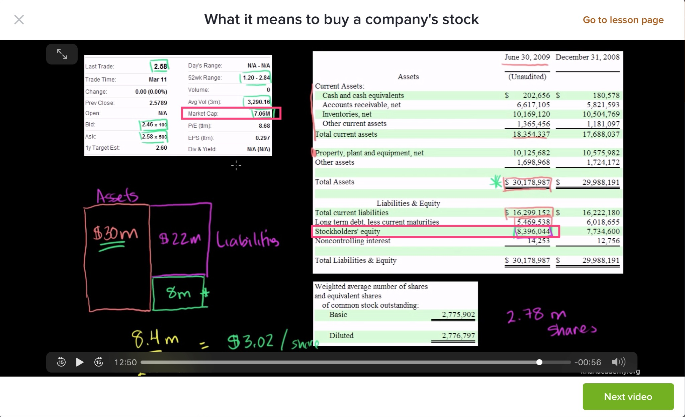
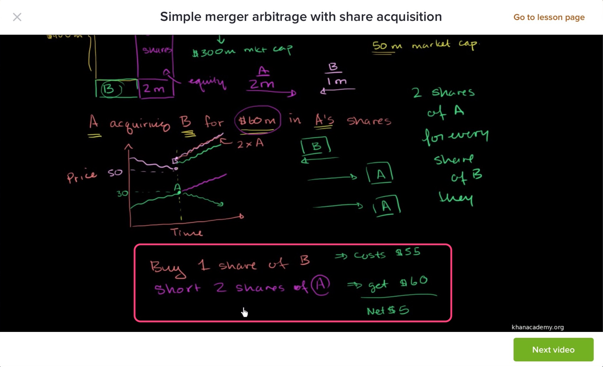

一直在酝酿把自己对股票的理解总结出来，因为我有一个特点，学过的东西很容易忘记（不是开玩笑，这里囧字脸），对一个新事物的吸收经常需要学个三五遍才能真正掌握它。这很郁闷，也很痛苦，因为经常会看到后面忘记前面，因此，整理一份笔记，对我来说就变得非常重要，方便日后随时翻阅不说，还能够起到"输出倒逼输入"的作用。

去年年底，我趁休假的时间重看了一些可汗学院的金融课，目的是加深对证券的理解。这也是这一系列文章的来源，今天是第一讲，"买公司股票意味着什么？"。

### 什么是证券？

通常我们理解股市就代表证券市场，但其实这很片面，证券市场由股市和债市两个部分组成，只不过大多数人很少或者几乎从来不买债券，误以为证券就是股市。

在金融世界中，股票(stock shares)这种权证对应的是权益(Equity)，你拥有股票，表示你拥有这家企业的一部分股权。债券(bonds)这种权证对应的是债务(Debt)，你拥有债券，表示你拥有这家企业的债权，"别人欠你钱"，英文缩写叫IOU（I owe you）。

买入股票，或者跟朋友合伙开公司入股，即表示你参与这个生意，你拥有这个公司的一部分。法律将公司这个整体当做一个独立的个人来看待，你买上市公司的股票，并不代表说，你就占有上市公司的一部分，你可以去人家公司搬一台电脑、一张椅子回家，它不是这样理解的。

借钱给公司或者借钱给你朋友，则表示你是公司或者你朋友的债权人，这里的公司和你朋友也就是你的债务人。

stock和bond合起来统称为security，就表示证券。

> 股权和债权所不同的是，你买入股份后，哪怕只买1股，你就是公司的一部分拥有者，如果公司赢利，你可以享受对应的权益分红；如果公司亏损，你需要承担相应的资产损失，买入股票，名义上你就是公司的股东了。
>
> 债权则不同，基本上在各个国家，"欠债还钱"都是约定俗成的事，它是受法律保护的，当然这里不是说股权就不受法律保护。债权有一个"刚性兑付"的特点，你借钱给了公司，公司万一破产，经营不下去，必须得优先偿还债权人的债务，债权债务都清算完之后，剩下的才属于公司股东；如果公司赢利，你是享受不到权益分红的，因为你不是所有者。

上面这一大段废话，如果你已经懂了，直接跳过看后面的内容。

### 公司归股东所有，还是股东归公司所有？

不熟悉产权制度的人，可能会对这个问题出现疑虑，懂的人一口就能答出来，公司归股东所有，公司是股东们出资成立的，它的所有权当然属于股东，但不要搞混淆下面这点，我们普通小散买入公司的股票，就也把自己当做公司股东了，名义上你是，但实际上不可能是真正意义上的股东，因为你的份量太小；除非，你像姚员外，买入万科总股本的25%（一般把上市公司股份买到5%就表示你算是一个有份量的股东，这被称之为举牌），你拥有足够的股份，你有足够的话语权，足够的份量，你现在去万科办公室搬一台电脑，或者搬一张椅子回家，人家是不敢拦你的。

公司破产，不会损害股东们的资产。

大股东破产，无权变卖公司的资产，也无法损坏公司的资产。

### 有限责任公司？

我们再明白一个概念，什么叫做有限责任公司。

比如在深圳开了20年厂的一个小老板，他赶上了改革开放的好时机，生意发财，打拼20年，现在拥有了1000万的身价（这里指剔除所有负债之外的资产，也就是净资产1000万），这两年经济走L型曲线，它的工厂生意也不好做了，他看滴滴打车搞得不错，在老家交通局和县政府有一些人脉关系，现在决定回老家所在的县城搞一个本地的"滴滴打车"出租车公司，他出资300万，拉了两个人合伙，总共出资500万，拥有了一个出租车公司，他没有注册成有限责任公司。

某天，他名下的一台出租车将一个国足球员的腿撞残了。这位国足是个明星球员，废了人家的足球生涯，人家打官司，索赔2000万人民币。法院认定合理，让这位小老板，赔偿2000万。

它没有注册成有限责任公司，那么赔偿就需要用他个人的资产去赔偿。如果他注册成立了有限责任公司，那么将以他公司的名义赔偿，只需要赔偿500万即可，不用承担额外的赔偿损失。

这张图，重点就是理解左边这个A=L+E公式（assets=liabilities+equity），其实就是资产＝负债＋所有者权益，有点基本概念，就能理解了。假如这家公司，总股本是2m股，那么可以计算得出，book value就是美股10美元（$20m/2m=$10），book value就是我们经常听到的每股净资产。

不熟悉没关系，这些名词后面会继续讲。

### 市值到底是什么？

这张图里面，一度最让我困惑的是Market cap这个词，上市公司的市值。

注意我标红色的两个地方，一个是Market Cap，另一个是Stockholders's equity。市值是7.06M，但是所有者权益是8.396M，这表示这家公司目前市值较所有者权益出现了折价，也就是市场先生不认为这家公司的真实价值（如果我们把所有者权益理解为真实价值的话）可以值8.396M。

***市值其实就是所有者权益的折价或者溢价。***

按照会计学来算，所有者权益，反映的是这家公司的真实价值。上市之后，资本市场所带来的流动性和关注度，可以使一家公司获得无限溢价或者折价。

一般来说公司上市都能带来溢价效应，因为关注度变高了，流动性变强了，上市之前，有些投资人要退出，必须与对手签署纸面合同，以协议转让的方式成交；但现在可以直接在股市里卖股票，无疑变得方便很多。

但有时候，太过于高溢价则让市场充斥着泡沫，像A股是典型的高溢价市场，因为中国的资本市场还不够成熟，公司上市之前和之后本质上没有任何变化，但市值会变高很多倍。

美国或者香港则不一样，一大堆公司出现破净的情况，一家公司的市值可以比公司所有者拥有的权益低很多。

市净率(PB)这个指标就是表示市值与所有者权益的倍率关系。PB＝1表示不高不低；PB>1表示溢价；PB<1表示折价。一个理性的市场，可能保持适度的溢价，才是健康良性的。

视频链接：[what it means to buy company's stock](https://www.khanacademy.org/economics-finance-domain/core-finance/stock-and-bonds/modal/v/what-it-means-to-buy-a-company-s-stock)

sal在课程发行股份进行公司并购这节课中讲到一种很有意思的玩法。

当公司A发行股份收购公司B时，收购方式是发行一定数额新股份，每2股A换取1股B，将B全部收购。如果你能**确认这个交易100%发生，但市场有分歧的时候**（很重要的前提条件，如果无法确定，后面的套利机会就不成立），做下面一组pair trading，就可以进行套利。

假设当前股价，A是¥30，B是¥50，那么可以这样做：

1、买入1股B

如果确定A会收购B成功，那么股价对应关系理论上就是1B＝2A。现在市场发生分歧，部分认为这个交易不会发生，那么B的价格就会低于2A，比如¥55。现在买入1股B，花费¥55元。

2、卖出2股A

卖出2股A，收到¥60。

因为你确定A收购B会发生，手里的1股B迟早会涨¥60，那到时卖掉这1股B，得到的¥60覆盖买1股A的成本。这样一买一卖，你就可以赚到¥5套利。

merger arbitrage（收购、合并套利）

讲解股票的网站：

https://www.investopedia.com/university/stocks/

http://ir.lendingclub.com/Cache/1500105141.PDF?Y=&O=PDF&D=&fid=1500105141&T=&iid=4213397