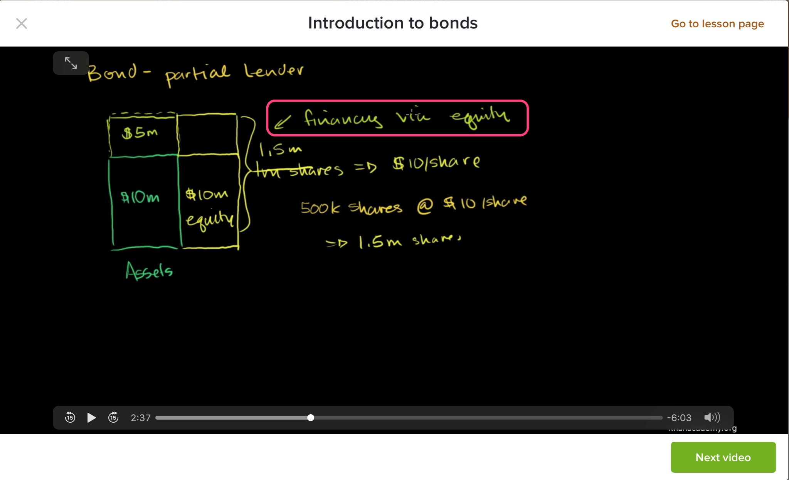
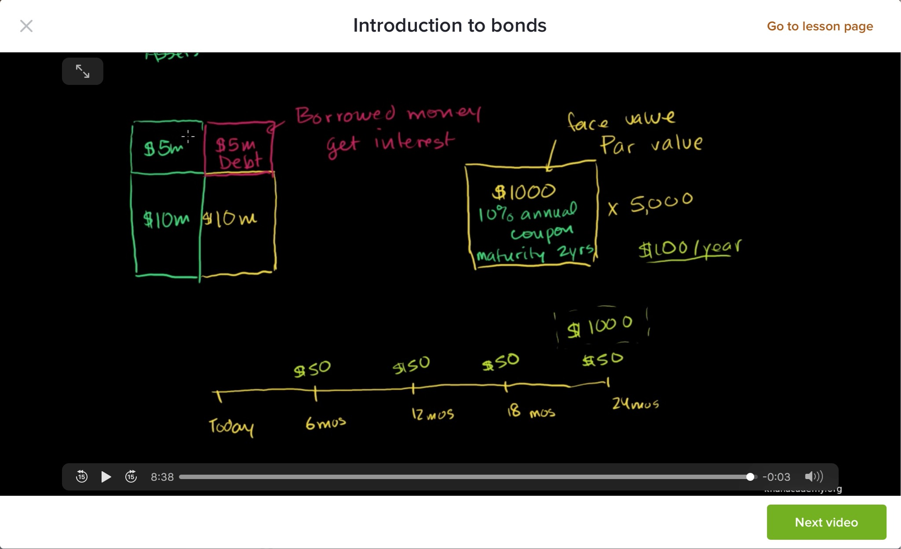

当一家公司资本金不够时，可以采用发行股份，引入股东方式融资；也可以发现债券，使用债权融资。

股权融资付出的是股份，会导致现有股东对公司控制力的下降，同时公司成长的部分收益让渡给了投资人，好处是公司通过股权融资拿来的钱理论上是不需要偿还的，即使亏光了也不用担心你，即把风险分摊出去了。

债权融资，公司付出的是利息，通常需要进行资产抵押或者担保，只需要考虑公司赚到的收益能不能cover住利息，因此，债主或银行看中的是一家企业的稳定盈利能力，这就导致了初创企业比较难进行债权融资。

当一个生意好赚钱时，应该优先使用债权融资，优先考虑向银行借钱；

当生意不好赚钱时，优先使用股权融资，分摊风险；

现实是，很多企业同时进行股权融资和债权融资。

这一节课听到一个观点，以前我从来没有思考过。

我们在二级市场买卖股票，买的都是其它股民卖出的股票，并不是直接买公司IPO发行的股票，转过很多道手的；我们买股票花的钱并不是直接流入这家发行股票公司的账户。

只有当IPO时，你买的股票才是公司IPO发行的股票，你花的钱扣除承销商、经纪商等手续费用后，剩下的钱才是真正流入IPO公司银行帐户的钱。大多数股民，在股市里的作用是充当或促进流动性，这就是普通小散对股市创造的价值；较少数股民参与线上或线下打新，这部分钱是真正流入里上市公司帐户，资金流转给了需要资金的公司，促进了公司的发展和扩张。

