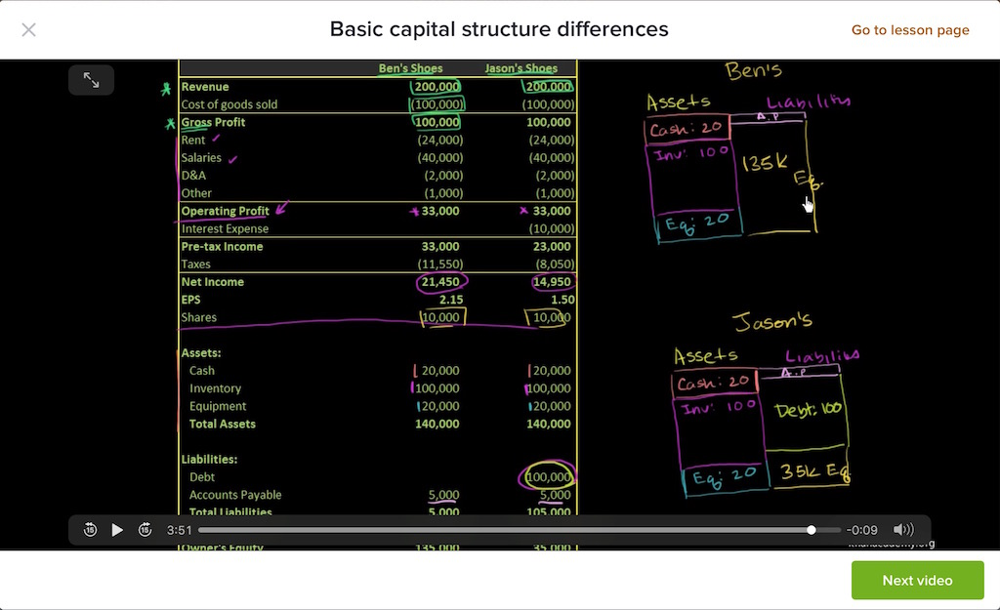

这一节讲企业之间资产结构，我们从一个案例图看起。

有两家公司，Ben's Shoes和Jason's Shoes，他们的营业收入、原材料成本、毛利、店铺租金、员工薪资结构、折旧、摊销、其它成本统统都是一样的，都有10K股份，唯一一点不同的是Jason有100K的借款，Ben没有借款，全部都是用自己的钱。

这张图把资产负债表和现金流量表整合到一起去了，可能不大清晰，从Revenue到EPS都是现金流量表的部分；Shares那一行表示股份数额；Assets到最下面的Owner's Equity都是资产负债表的部分。

那么，我们看到，因为Jason有借款，他需要偿还利息，表中显示的Interest Expense就是表示借款产生的利息，是10K。Jason和Ben做的是同样的买卖，在万达广场的同一层商铺里面，一个有有息负债，一个无负债，最后两家店的净利润是差别很大的，看Net Income那一行，Ben的净利润是21.45K，Jason的净利润是14.95K，计算美股净收益就分别是2.15和1.50。

看第二张图的右边，我们把资产负债表画出来了。

Ben和Jason的资产端是一样的，负债端，Ben只有5K的应付帐款，其余的135K都是自己的钱，也就是股东权益。

Jason除了5K应付帐款外，还有100K的有息负债（年利率是10%），他的股东权益是35K。

我们假设这两家都是上市公司，现在两家公司的股价分别是，Ben的是21.50一股，Jason的是12.00一股。那么，我们就可以计算出Ben这家鞋店的市值是220K，Jason鞋店的市值是120K。对应图4。

那么也就是说，Ben这家账面价值135K的鞋店，当前的市值是220K；Jason这家鞋店，账面价值35K，当前市值是120K。

我们可以计算得出，当前的市净率，PB（Ben）＝220/135=1.63；PB（Jason）＝3.43，也就是说Jason通过使用财物杠杆，将资产扩大了3.43倍，而Ben没有使用财物杠杆，资产只扩大1.63倍。

怎么理解图中问号代表的含义呢？

Ben的鞋店，原本只有140K的资产，现在市值220K，多出来的80K怎么理解它？可汗给出的解释，这属于无形资产，可以理解为资本市场给Ben的经营能力，这家店铺的口碑，给了一个估值，它们是无形的资产，你看不见，也没法在资产负债表里体现。它们加在一起，值80K。

同样市场先生给Jason的店铺，它们值85K。

