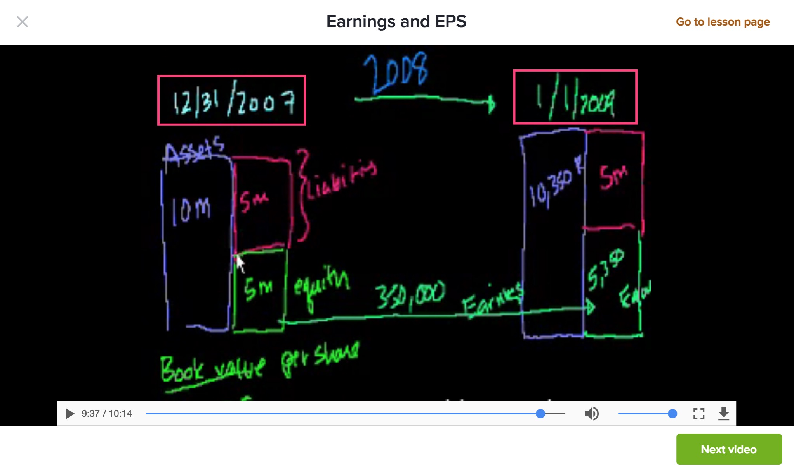
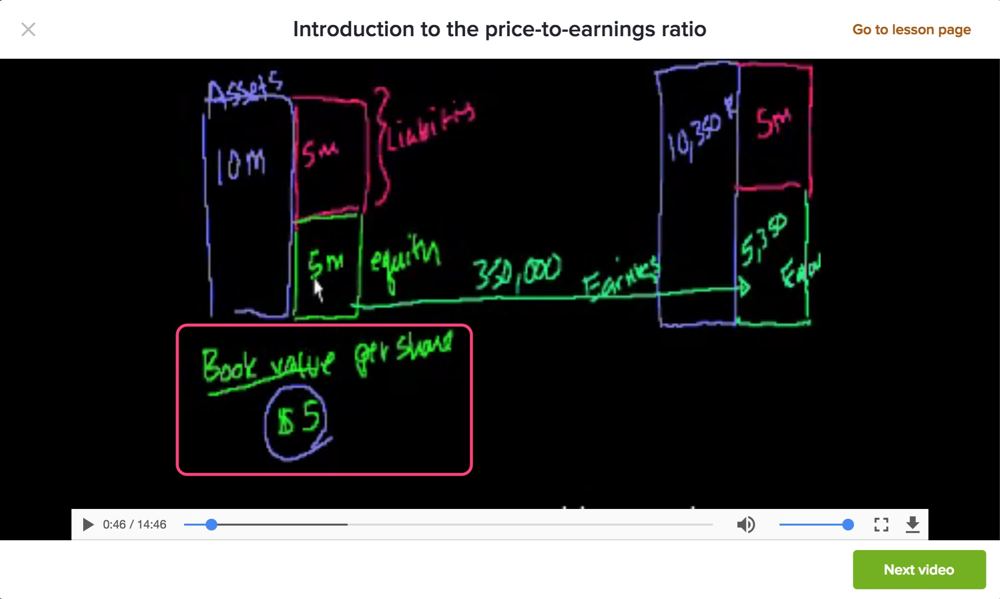

**Introduction to the income statement：**

对ROE和ROA进行探讨，有pre-tax ROA和post-tax ROA

参考对ROA和ROE的理解：

1、https://aaronhychen.com/2014/06/30/本益比、roe及roa的意義/

2、人大经管论坛回答

http://bbs.pinggu.org/thread-739428-1-1.html

> 作为一个长期从事财务管理课程教学的老师，对此问题解答如下：
> （1）ROE=净利润/净资产，净资产是股东的投入，所以此指标用于衡量股东的回报率。
> （2）资产的来源除了股东投入之外，还有负债，即负债+股东权益=资产，所以，当分母是总资产时，分子不宜只是净利润，因为净利润只是给股东的回报，而给债权人的回报应该是利息，利息已经在计算利润时扣除了。所以当分母是总资产时，分子应该是净利润+利息，而在实务中，往往用净利润+所得税+利息来替代，及用息税前利润EBIT来替代，即ROA=EBIT/总资产。很多教材上的总资产净利率=净利润/总资产的概念，实际的经济含义并不清楚，也没有经济意义。因为，净利润是给净资产的报酬，不是给总总产的报酬，EBIT才是总资产带来的报酬。
> （3）由此，ROE=净利润/净资产反映了股东的回报率。ROA=EBIT/总资产反映了总资产的回报率。

**Earings and EPS：**

现金流量表，计算**<u>一段时期</u>**公司生成的净利润；通过**<u>一个时间点</u>**的资产负债表获取股东权益。

分别除以总股本（stock shares）就可以得到这家公司的EPS和book value。

EPS＝net income/stock shares

book value = equity/stock shares

通过现金流量表计算出来净利润后，变可以将其归并到**<u>下一个时间点</u>**的资产负债表里面。

图中列出，<u>**一个时间点**</u>的资产负债表到**<u>下一个时间点</u>**的资产负债表的变化关系，就是由现金流量表的变化来体现。

视频链接：[Earnings and EPS](https://www.khanacademy.org/economics-finance-domain/core-finance/stock-and-bonds/modal/v/earnings-and-eps)

 **Introduction to price-to-earings ratio：**

ticker symbol和stock code都是股票代码的意思

book value值是$5

计算银行账号的PE值，比如现在1万人民币，定期存一年，年利率是3%，年底可以拿到300块的收益。

那么ROE是3%，PE＝P/eps=33.33

我们都知道PE表示一家公司的市盈率，表示收回投资成本的年限，即我投入1万人民币，现在全仓买入一家PE为50的公司，那么意味着我要花50年时间才能赚1万块钱，这里意思是我1万块钱本金不变，50年时间里回拿到1万块钱的分红，这里有个假设前提是，公司会把每年净利润全部拿来分红，但实际上很少有公司那么干，一般都不采取分红，而是将净利润投入扩大再研发再生产。但有些公司还是愿意分红啊，分一部分也是意思嘛，所以有一个名词叫分红率，将净利润的百分比用于分给股东。

**ROA Discussion:**

ROA的定义，一般有好几种。

第一种是net income除以assets

第二种是net income加上interest减掉tax savings from interest，然后除以assets 

第三种是operating profit除以assets

第四种是EBIT除以assets，也就是earnings before interest and tax。当一个公司没有non-operating profit的时候，第四种和第三种其实是一样的。使用EBIT这个名词，作用就是包含operating profit以外的non-operating profit。

**Depreciation and Amorization**

Depreciation is tangible

Amortization is intangible

Basic captial structure differences

市值反映的是上市公司权益的价值，并不是指上市公司本身的价值。

Market Cap对应Equity在资本市场的折溢价，它会随股价波动而发生变化；而一家公司实际价值，是它能够产生利润的那部分资产，我们称之为EV（Enterprise Value），一般这样进行计算EV＝Market Cap＋Debt－Free Cash，画下面这个图就可以理解。

它的值对应Equity＋Debit－Free Cash。