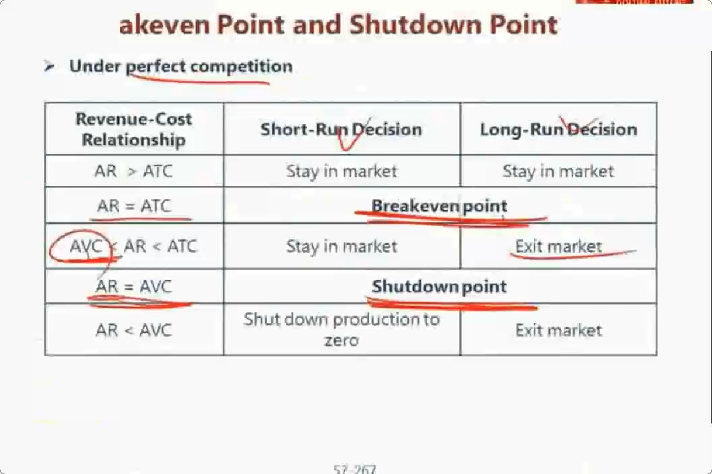
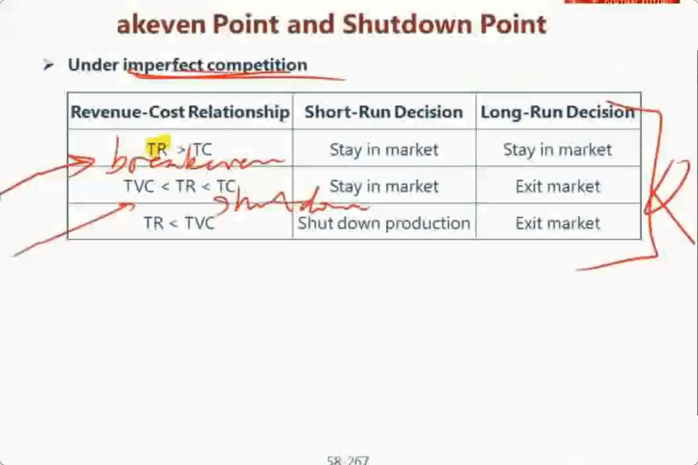

在微观经济学的角度上来看，公司收益最大化的情况是：总收入减去总支出最大的时候，数学公式上即是Max(Total Revenue - Total Cost)。

也就是边际收益等于边际成本时，收益才能最大化，数学公式上即是Marginal Revenue=Marginal Cost。

1、市场完全竞争情况下，单价是固定的，即消费者是price taker。平均收入和平均成本就可以表示总体收入和总体成本，因此可以直接用来衡量企业收支平衡点和关闭点。

2、非完全竞争情况下，单价是不固定的，即消费者是price searcher。数量不同，价格也不同。需要用总的收入和总的成本去衡量企业收支平衡点和关闭点。

