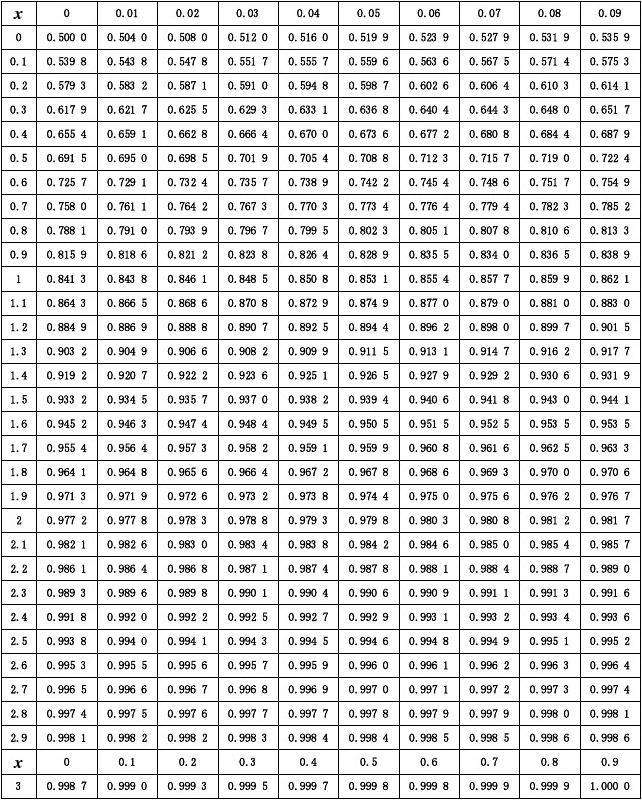

今天在学习"正态分布"。

正态分布：连续性随机变量X的概率使用密度函数（正态分布图形面积）来进行表示。

方差是用来衡量随机变量的离散程度。

1、正态分布性质

X~N(u,O^2),u是均值，O是标准差，正态分布这里使用的是方差

正态分布是对称图形，偏度（Skewness）是0，峰度（Kurtosis）是3

如果X服从正态分布，X的线性组合也服从正态分布

如果X，Y服从正态分布，X、Y的线性组合比如aX+bY也服从正态分布

随机变量X的值只会无限趋近于0，取值不会等于0，永远不会与X轴相交

2、置信区间(Confidence Interval)：个体落在某个区间的概率

68%置信区间为[u-o,u+o]

90%置信区间为[u-1.65o,u+1.65o]

95%置信区间为[u-1.96o,u+1.96o]

99%置信区间为[u-2.58o,u+2.58o]

3、标准正态分布（Standard Normal Distribution）

X~N(0,1^2)：将均值为0，方差为1的分布定义为标准正态分布

正态分布的标准化：

将符合正态分布的随机变量，减去均值，除以标准差，得到的随机变量，取值就复合标准正态分布

如果X~N(u,O^2)服从正态分布，那么Z=(X-u)/O服从标准正态分布。

即Z~N(0,1)

标准正态分布概率表：

统计的是累计区间的概率。如F(0.33)=0.6293，即随机变量X取值小于等于0.33的概率为0.6293。表示标准正态分布图形中，0.33左边图形的面积。  

