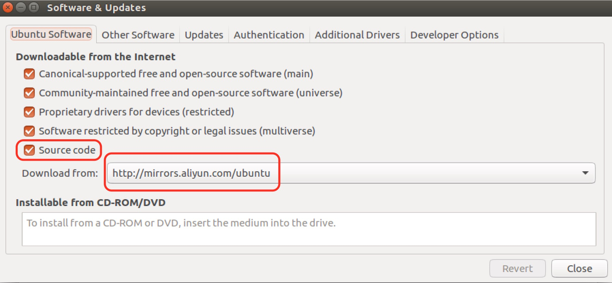
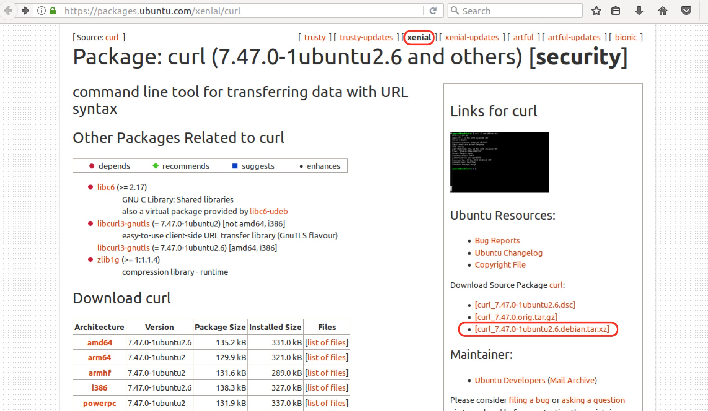

最近看了阮一峰老师关于Docker服务的讲解，我觉得很有趣，打算在Ubuntu里面尝试安装配置一个。教程里面轻描淡写，实际自己动手实操一遍，困难重重，安装curl就卡我半天的时间，"事非经过不知难"。

这篇文章把整个过程遇到的问题，和解决办法都记录下来，供日后参考。

我在Ubuntu xenial 16.04版本下进行实验的。

### 安装curl

参照[Docker官网安装教程](https://docs.docker.com/install/linux/docker-ce/ubuntu/#set-up-the-repository)，安装Docker之前，我需要将依赖包都装上，其它包都通过sudo apt-get install方式安装成功，但curl怎么样也装不上去。我参照网上搜到的方法更改软件更新源配置，勾选Source code模式，安装一个PPA证书，等等，全部尝试过，最终经朋友提醒，才知道curl包已经不包含在16.04版本里面。

（更新源配置，感觉国内使用阿里云的源，更新速度最快）

于是，选择源代码形式安装。

在[curl这个页面](https://packages.ubuntu.com/xenial/curl)下，我找到curl对应Ubuntu 16.04版本的压缩包。

通过Firfox将其下载下来后，我把压缩包"curl_7.47.0-1ubuntu2.6.debian.tar.xz"拷贝到Home/Downloads下面，这个目录好找，方便在Terminal里面定位使用解压缩命令。

这个.tar.xz文件，使用了两层压缩，外层是xz压缩，里层是tar压缩。先后使用

jacksonshawn@ubuntu:~/Downloads$ xz -d curl_7.47.0-1ubuntu2.6.debian.tar.xz

和

jacksonshawn@ubuntu:~/Downloads$ tar xvf curl_7.47.0-1ubuntu2.6.debian.tar

压缩后，得到了纯Debian包，搞到这儿又卡住了，拿这个Debian目录，不知道怎么办。

经同学提醒，才知道，这样搞，把问题弄复杂了。直接使用下面这几行命令，轻而易举把curl安装起来。

> wget <https://curl.haxx.se/download/curl-7.58.0.tar.gz>
>
> tar xvf curl-<7.58.0.tar.gz>
>
> cd curl-7.58.0
>
> ./configure
>
> make
>
> sudo make install

参考资料：

[Docker入门教程](http://www.ruanyifeng.com/blog/2018/02/docker-tutorial.html)

[Docker微服务教程](http://www.ruanyifeng.com/blog/2018/02/docker-wordpress-tutorial.html)