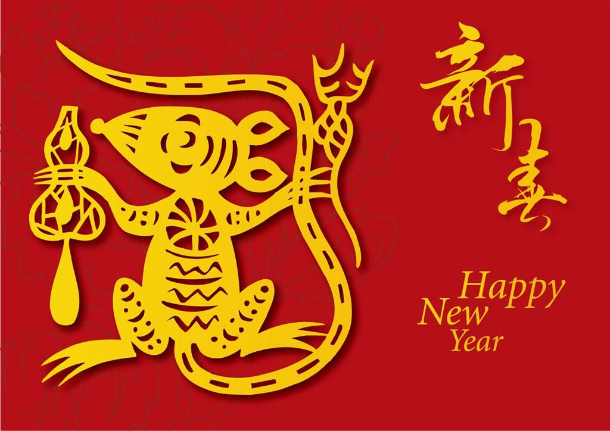

在开往回家方向的T398列车上，此时此刻的我，祝大家2020农历新年快乐，祝大家以一个健康的身体和积极的心态迎接新年的到来。

2019年对我来说是非常重要的一年，我想清楚了自己想要的东西是多少，想清楚了自己能够做的事情是什么，想明白了自己以后（未来10年内）要做的事情是什么。这其实是一个很大的话题，三言两语不容易讲清楚，以后再慢慢细说。

工作方面，2019年在公司参与了3个项目，对我来说意义非凡，让我对自己的职业技能有了新的认识，对自己的职业方向有了新的思考。它们让我认识和明确了以下几点：

- 一个优秀的技术人员在项目团队里是非常有价值的
- 我想成为一名优秀的技术人员
- 目前我的技术能力离一个优秀的技术人员还相差很远
- 我定一个10年的计划来达到这个目标，慢的话10年快的话5年我一定可以实现这个目标

<!--more-->

学习方面，2019年我阅读了很多技术文章和书籍资料，也敲了很多代码。阮一峰老师的《科技爱好者周刊》是每周必不可少的读物，抛开技术方面的内容，他的这份周刊我觉得适合每一个具备英语阅读能力的人看。Tinyfool的油管视频是意外的收获，特别是他分享自己的英语学习方法，对我来说犹如醍醐灌顶，他用自己的行动力证明自己的学习方法行之有效，非常具备说服力。

编程方面，从0到1完成了一个Python Airflow项目，从本机开发到部署Kubernetes，从整个过程中学到很多，意外地打开了容器化编程的大门，我觉得Docker这种软件部署和其背后的设计思想非常有趣，也进一步激发了我学习Go语言的想法；比较遗憾的是职业生涯的前5年（从事Cobol语言开发）走了一个巨大的弯路，对目前的技术提升几乎一点帮助和积累都没有，以至于现在在就业市场缺乏竞争力，好在已经意识到并且正在努力追赶中。至于为什么我认为这5年是一个巨大的弯路，以后有机会再单独撰文细说。

生活方面，见证了小女从2岁到3岁的成长，她聪明可爱、能说会道、机灵活泼，简直是我们全家的开心果。有时候996加班劳累，想辞职不干，但想一想为了妻儿父母，只能默默忍受，所有的付出都是值得的。2019年比较遗憾的是太缺乏锻炼，身体体质变差了很多。平时加班较多，周末基本都宅在家里看书写代码，运动锻炼的次数屈指可数。

投资方面，买了聚美优品的股票，持仓将近快有2年，一直处于被腰斩状态，愿赌服输，仓位就丢那儿难得动了；A股2019年稍有盈利，但也不吓人，整体加到一起看，还是处于亏损状态。

其它方面也有一些心得体会，但比较杂乱和零碎，多半是一些个人的碎碎念，比较适合和朋友聊天叙说，就不在这儿废话了。

2020年我的目标是在继续夯实Python的基础上，学习Go语言。Python生态强大，可以应用的领域很多，2020年计划染指Django开发和机器学习这两块，目标是各做一个小应用出来。对Go语言的学习，其实2019年我已经开始了，不过现在了解得比较基础，等学到一定程度，我再来写一些心得和总结吧。

2020年还有另外一个目标是，加强英语听力的学习，准备尝试一下tinyfool介绍的新方法。

就写这么些吧，祝大家新年快乐，一年更比一年好。

**参考资料**

- [科技爱好者周刊](http://www.ruanyifeng.com/blog/)
- [Tinyfool](https://www.youtube.com/user/tinyfoolgmail)