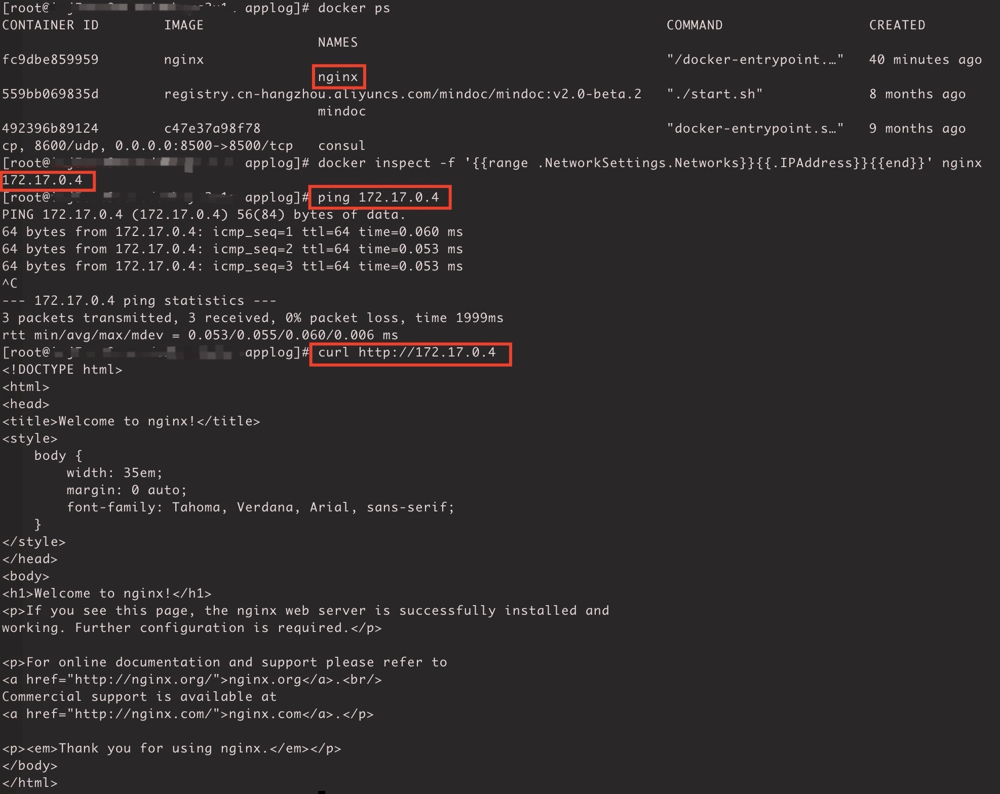
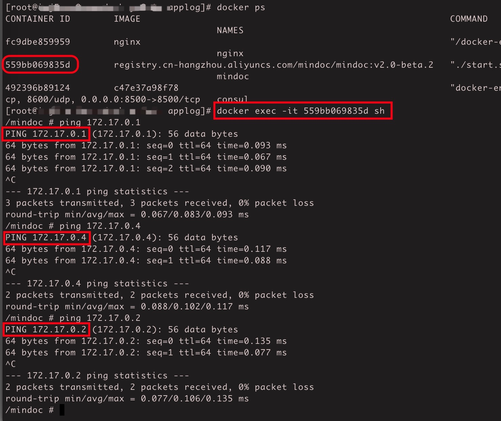
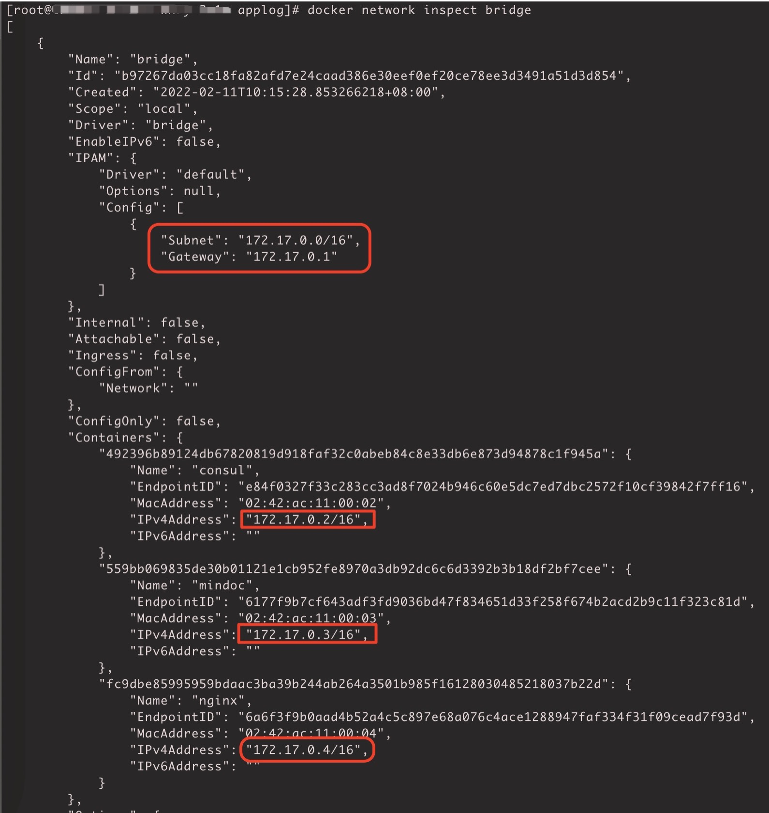
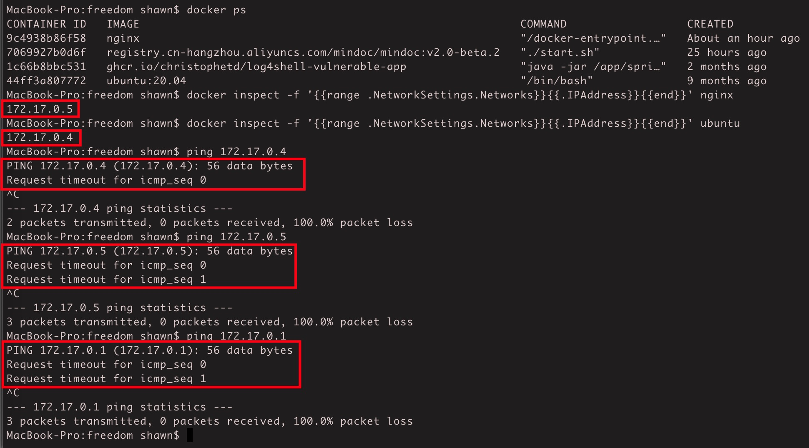
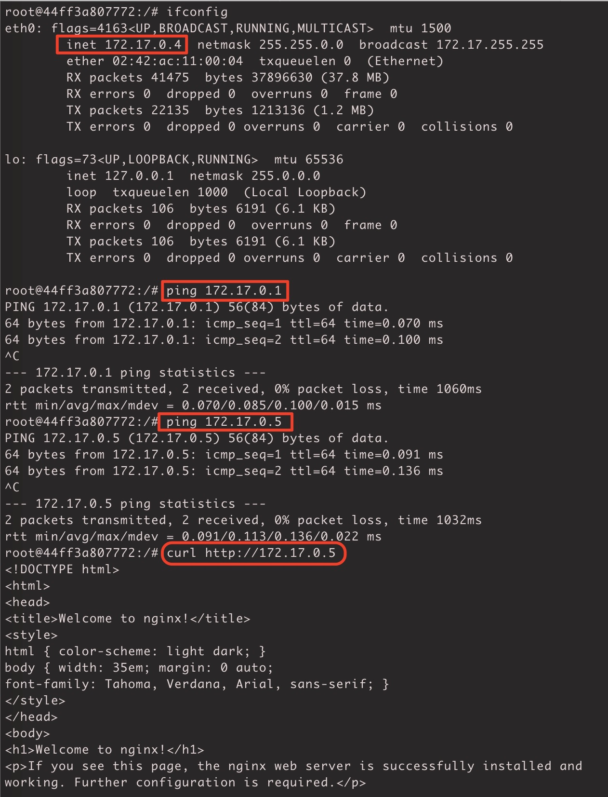
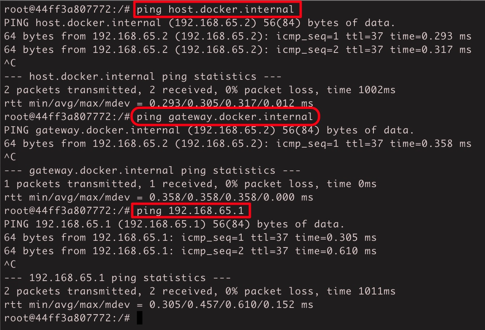
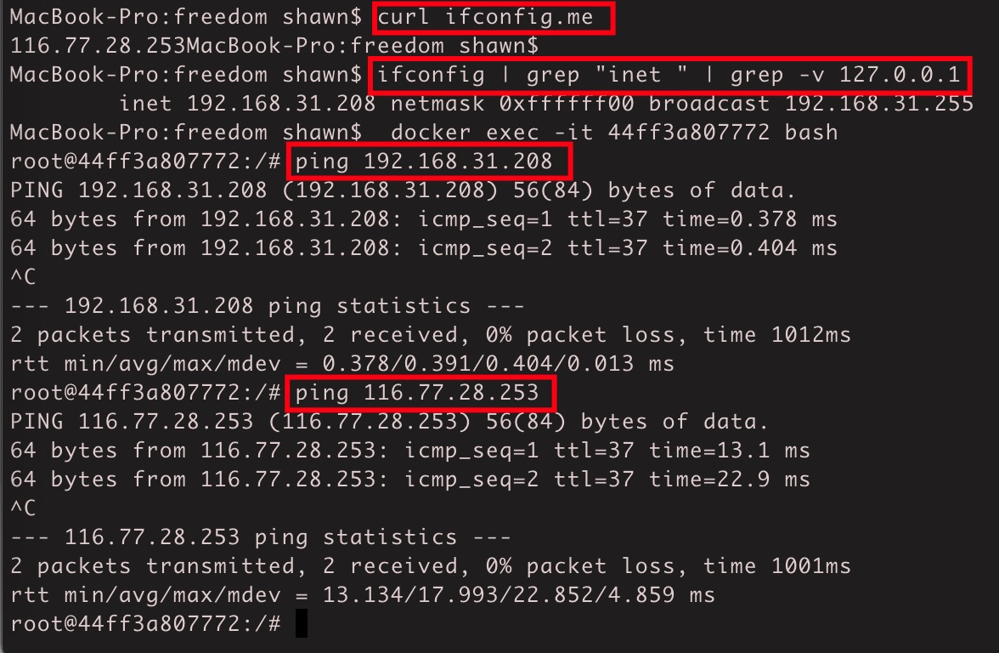

(Photo by [Venti Views](https://unsplash.com/@ventiviews?utm_source=unsplash&utm_medium=referral&utm_content=creditCopyText) on [Unsplash](https://unsplash.com/s/photos/docker?utm_source=unsplash&utm_medium=referral&utm_content=creditCopyText)  )

macOS上面Docker实现方式和Linux不一样，简单说macOS将Docker服务端(docker daemon守护进程)部署在一台虚拟机里面，而Linux里面Docker服务端直接作为宿主机的一个进程。这导致两种平台上Docker容器和其宿主机的网络通信方式有很大不同。

简单的表象是，Linux主机上会有一个docker0网卡，而macOS上没有docker0网卡；带来的区别是Linux上部署的容器应用默认和宿主机就是互联互通的，而macOS宿主机不能直接连通容器。


### Linux查看docker0网卡

在阿里云ECS里面启动了Docker服务，终端输入ifconfig查看docker0网卡（容器默认使用bridge模式部署，都通过这个docker0网卡与宿主机通信）


### Linux宿主机ping容器

启动一个nginx容器（默认使用bridge模式）：

```shell
docker run -d --name nginx nginx
```

查找nginx容器ip地址：

```shell
docker inspect -f '{{range .NetworkSettings.Networks}}{{.IPAddress}}{{end}}' nginx
```

在宿主机使用`curl http://172.17.0.4`访问容器中nginx页面，可以看到返回结果，说明宿主机可以连通容器网络。



### Linux容器ping宿主机和其它容器

容器里面ping宿主机可以ping得通，说明容器可以连通宿主机；容器里面ping其它容器可以ping得通，说明容器之间的网络也互通。



### Linux查看bridge模式网络信息

Docker默认使用bridge模式启动容器服务，使用`docker network inspect bridge`命令查看bridge模式网络信息。



由此可见，**Linux宿主机与容器网络是互联互通的**。


### macOS宿主机ping容器

在macOS里面启动nginx和ubuntu容器，使用docker inspect命令获取nginx和ubuntu容器的ip地址。



由上可见，**macOS宿主机与容器网络默认不连通；并且宿主机ping容器网关地址(172.17.0.1)也ping不通**。

### macOS容器ping其它容器

进入ubunut容器，如果没有安装过相关命令工具先参照下面方法安装网络工具包。

```
ubuntu安装curl:
apt install curl
(使用curl ifconig.me查询本机ip)

ubuntu安装ipconfig:
apt-get install net-tools

ubuntu安装ping:
apt-get install iproute2

ubuntu安装ip:
apt-get install iproute2

ubuntu安装netcat经典版本:
apt-get -y install netcat-traditional

ubuntu安装telnet客户端:
apt-get install telnet

ubuntu安装telnet服务端:
apt-get install telnetd

ubuntu安装lsof：
apt-get install lsof安装lsof

ubuntu启动telnet服务(启动后使用lsof可以看到23端口被使用，macOS telnet服务):
/etc/init.d/openbsd-inetd restart启动telnet
```

使用ifconfig查看ubuntu容器ip地址是172.17.0.4，容器本地地址是127.0.0.1，注意这个127.0.0.1是ubuntu容器的localhost地址，和宿主机的127.0.0.1不是一回事。

在容器里ping容器网关地址(172.17.0.1)可以ping通，ping其它容器(nginx容器ip地址172.17.0.5)可以ping通，访问nginx容器主页可以成功，说明容器之间的网络是互通的。



### macOS容器查看宿主机ip地址

Docker for Mac有两个内置的域名`host.docker.internal`和`gateway.docker.internal`分别表示宿主机ip和网关ip。

容器中ping `host.docker.internal`得到宿主机ip地址192.168.65.2，ping `gateway.docker.internal`得到同样的ip地址，ping 192.168.65.1也可以ping通。奇怪为什么默认把宿主机和网关ip都设置为192.168.65.2而不是192.168.65.1。



查看Docker For Mac配置信息，发现192.168.65.2地址和默认设置的网段有关。


### macOS容器ping宿主机真实ip地址

使用`curl ifconfig.me`获取运营商分配的"真实"ip地址，使用`ifconfig | grep "inet " | grep -v 127.0.0.1`获取宿主机局域网ip地址，在ubuntu容器里面都可以ping通。



容器如果需要连接macOS宿主机上的服务，比如MySQL数据库，那么数据库host地址可以使用192.168.65.2，也可以使用192.168.31.208，但显而易见使用192.168.65.2更为可靠。


### macOS部署mindoc作为在线文档工具

mindoc是一款在线文档管理系统，其它就不多介绍了，自己看官网吧。

为了方便文档数据备份和迁移，我使用本地MySQL数据库替换默认的sqlite3数据库，将容器内文件上传目录映射到本地目录，这样以后我添加的所有文档都保存在macOS本地。

1. 先使用内置sqlite3数据库默认启动一个mindoc服务

   ```shell
   docker run -p 8181:8181 --name mindoc -e httpport=8181 -d registry.cn-hangzhou.aliyuncs.com/mindoc/mindoc:v2.0-beta.2
   ```

2. 进入mindoc容器，将容器里面/mindoc/conf/app.conf拷贝到宿主机

3. 在宿主机app.conf填写启动配置信息，主要是数据库配置信息

   ```shell
   ####################MySQL 数据库配置###########################
   #支持MySQL和sqlite3两种数据库，如果是sqlite3 则 db_database 标识数据库的物理目录
   #db_adapter="${MINDOC_DB_ADAPTER||sqlite3}"
   #db_host="${MINDOC_DB_HOST||127.0.0.1}"
   #db_port="${MINDOC_DB_PORT||3306}"
   #db_database="${MINDOC_DB_DATABASE||./database/mindoc.db}"
   #db_username="${MINDOC_DB_USERNAME||root}"
   #db_password="${MINDOC_DB_PASSWORD||123456}"
   
   db_adapter=mysql
   db_host=192.168.65.2(宿主机ip，我这里也可以写192.168.31.208，但局域网ip容易变动因此不用)
   db_port=3306
   db_database=mindoc
   db_username=XXXXXX
   db_password=XXXXXX
   ```

4. 在宿主机创建mindoc数据库，字符集使用utf8mb4，排序规则使用utf8mb4_general_ci

5. 关闭并删除原容器，将本地app.conf映射到/mindoc/conf/app.conf，将本地文件上传目录映射到/mindoc/uploads，重新部署mindoc服务

   ```shell
   docker run -p 8181:8181 --name=mindoc --restart=always -v /Users/XXX/XXX/app.conf:/mindoc/conf/app.conf -v /Users/XXX/XXX/uploads:/mindoc/uploads -e httpport=8181 -e MINDOC_ENABLE_EXPORT=true -d registry.cn-hangzhou.aliyuncs.com/mindoc/mindoc:v2.0-beta.2
   ```

6. 使用docker logs查看容器日志，如果初始化成功会在宿主机mindoc数据库创建相关的表；如果出现数据库连接异常，有可能需要修改MySQL配置文件将bing-address改为0.0.0.0，然后重启MySQL即可；如果数据库还连接不上，检查数据库连接用户是否有操作mindoc表的权限，配置好即可

   

### macOS宿主机连接容器网络

查到几种方式，比较一下发现使用[docker-connector](https://github.com/wenjunxiao/mac-docker-connector)最简单。

#### 安装docker-connector服务

1. 使用brew安装docker-connector

```shell
brew install wenjunxiao/brew/docker-connector
```

2. 执行下面命令将docker所有 `bridge` 网络都添加到docker-connector路由

```shell
docker network ls --filter driver=bridge --format "{{.ID}}" | xargs docker network inspect --format "route {{range .IPAM.Config}}{{.Subnet}}{{end}}" >> /usr/local/etc/docker-connector.conf
```

（/usr/local/etc/docker-connector.conf是安装docker-connector后生成的配置文件）

3. 使用sudo启动docker-connector服务

```shell
sudo brew services start docker-connector
```

4. 使用下面命令创建wenjunxiao/mac-docker-connector容器，要求使用 `host` 网络并且允许 `NET_ADMIN`

```shell
docker run -it -d --restart always --net host --cap-add NET_ADMIN --name connector wenjunxiao/mac-docker-connector
```

5. docker-connector容器启动成功后，macOS宿主机即可访问其它容器网络


### 其它补充

如果macOS里面需要使用代理，proxychains4是比较好的选择。

```shell
1. 使用brew install proxychains4进行安装
2. 在/usr/local/Cellar/proxychains-ng/4.8.1/etc/proxychains.conf配置Socks5地址
3. 使用proxychains4 command走代理访问，不加proxychains4的command不受影响
```


**参考资料**

- [Docker for Mac 的网络问题及解决办法](https://www.haoyizebo.com/posts/fd0b9bd8/)
