## Airflow操作流程

### 登录

使用账号、密码登录Airflow，登录成功后进到Airflow主页面。

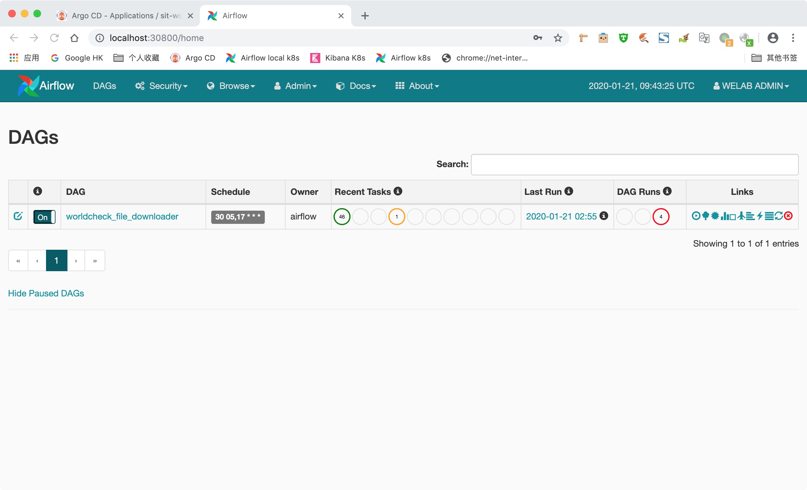

（图1）

<!--more-->

### 打开Dag开关

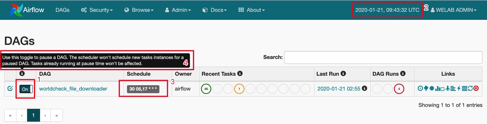

（图2）

选中需要执行的DAG，如图2中，数字1表示打开DAG开关，数字2表示当前UTC时间；数字3表示该DAG自动触发的时间间隔，参数表示的意思是Airflow调度器每天05:30分和17:30分Trigger一次DAG批量。

由于worldcheck_file_downloader已经设置好了自动Trigger时间，DAG开关打开后，Airflow检测到当前系统时间（数字2）达到了DAG触发的时间，整个DAG就会自动执行，Airflow将DAG的每一次执行命名为一次Dag Run，这个词不太好翻译，我们将它理解为一个批次就好。

注意：

如数字4，DAG开关打开后，如果已经触发了批次，在已有task执行的情况下，关闭DAG开关，不会影响当前正在执行的task；如果当前没有task执行，关闭DAG开关，整个DAG就处于关闭状态，DAG开关关闭后即便task达到触发时间，也不会被调度执行（如图4说明）

### start_date和schedule_interval

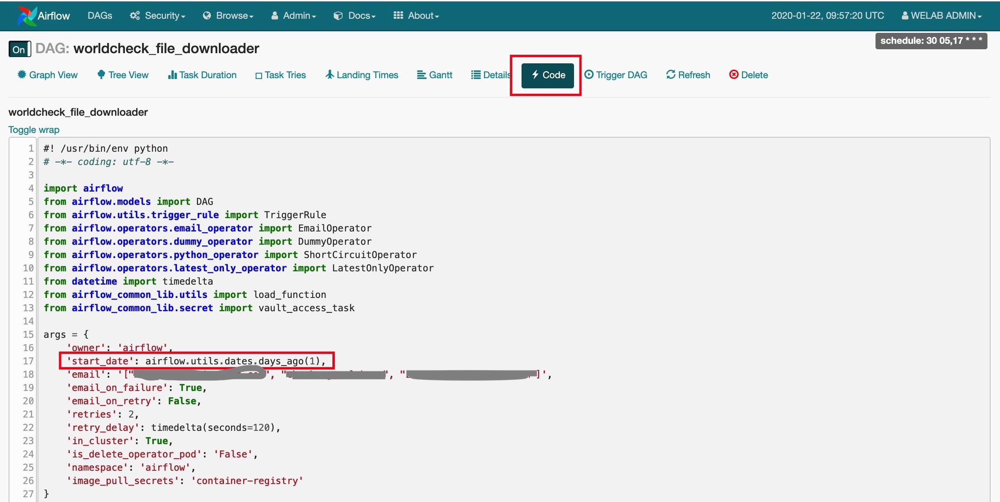

（图3）

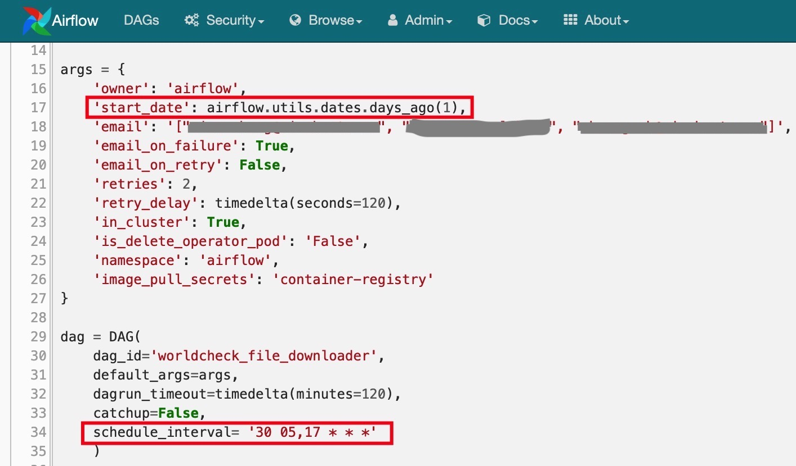

（图4）

进到DAG执行页面，点击"Code"，查看start_date参数，`airflow.utils.dates.days_ago(1)`表示是当前日期前一天的零时零分零秒。schedule_interval参数表示DAG被触发的时间间隔，'30 05,17 * * *'表示每天的05:30和17:30，该DAG会被自动触发，它与Linux cron表达式的格式兼容。

### 理解Dag Run

假如今天日期是2020-01-21，上图中start_date表示2020-01-20这天的零时零分零秒，即"**2020-01-20 00:00:00+00:00**" 这个时间点。

你可能会奇怪，这个时间怎么是一个过去的时间？

其实Airflow的设置规则是：以**start_date** + **schedule_interval**之后的第一个时间点作为第一次触发时间，因此该DAG首次触发时间为2020-01-20 17:30:00+00:00，并不是2020-01-20 05:30:00+00:00；理解这里是一个难点。该DAG首次触发时间是2020-01-20 17:30:00+00:00，此后触发时间依次是2020-01-21 05:30:00+00:00、2020-01-21 17:30:00+00:00、2020-01-22 05:30:00+00:00······注意，这些触发时间并不代表这个批次真正开始执行的时间。

该触发时间只是Dag Run的时间，它只用于确定该批次run_id的时间。见下图5。

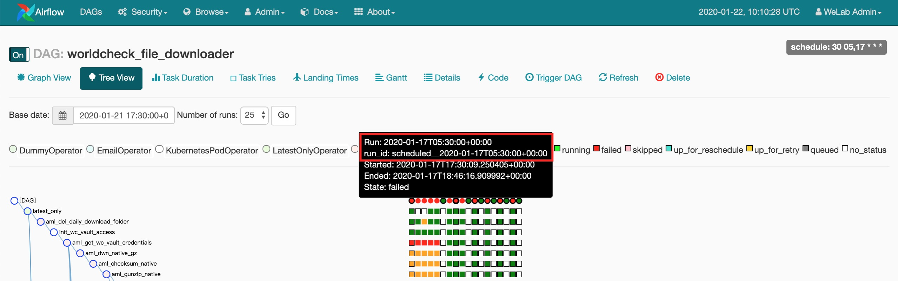

（图5）

红色方框中的Run和run_id是同一个时间"2020-01-17T05:30:00+00:00"，这个批次真正开始执行的时间是Started参数的时间，它是"2020-01-17T17:30:09.250405+00:00".

如果是手工Trigger的批次，run_id会以"manual"开头，Run、run_id两个参数对应的也是同一个时间，手工Trigger的批次，started时间与run_id时间比较一致。见下图6。

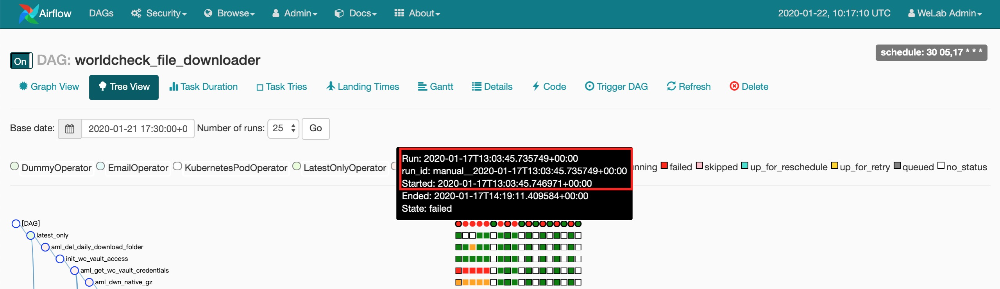

（图6）

理解Airflow每个批次的执行时间是一个难点。

### 查看Dag执行状态

#### 查看Graph View

在`Graph View`查看DAG执行状态。

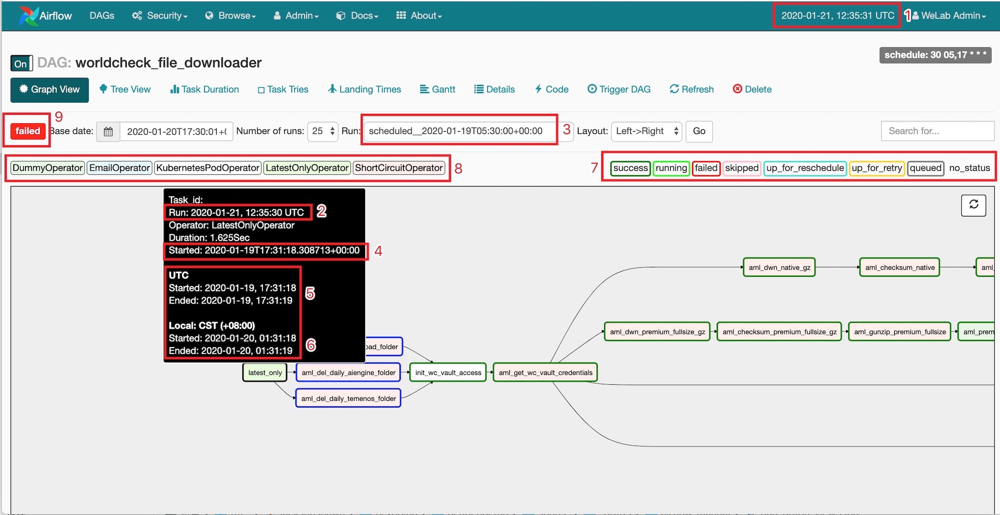

（图7）

DAG是一个有向无环图，它是一个单向流动的ETL流程图，从上图7中可以看到每一个task的先后执行顺序以及前后依赖关系。只有前置task执行成功后，后续task才会被Trigger；如果后续task有并行分支，会被同时Trigger执行。如上图7`aml_get_wc_vault_credentials`执行成功后，后续4个task都会同时执行。

对于已经执行完的task，鼠标停留在task上面，会自动浮现出一个黑色的提醒框，显示该task的基本情况。

如图7，鼠标停留在`latest_only`task上面

1. 数字1：Airflow当前UTC时间

2. 数字2：默认显示一个与数字1一样的时间，自动跟随数字1的时间变动而变动

3. 数字3：DAG当前批次触发的时间，也就是Dag Run时间，没有什么实际意义

4. 数字4：该task开始执行的时间

5. 数字5：该task开始执行和结束执行的UTC时间

6. 数字6：该task开始执行和结束执行的CST时间，也就是香港本地时间

#### 了解task status

Airflow中每一个task可能有8种状态，使用8种不同的颜色标注，分别是`success`、`running`、`failed`、`skipped`、`up_for_reschedule`、`up_for_retry`、`queued`、`no_status`。

每一个task被调度执行前都是`no_status`状态；

当被调度器传入作业队列之后，状态被更新为`queued`；

被调度器调度执行后，状态被更新为`running`；

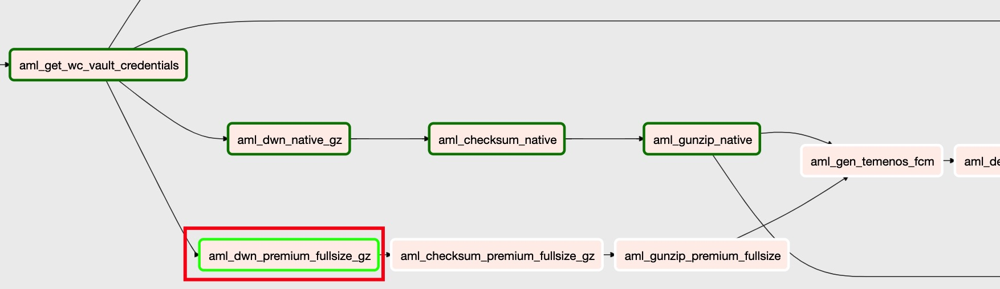

（图8）

如上图8所示，`aml_dwn_premium_fullsize_gz`task正在执行中，后续作业都在pending它的执行结果

如果该task执行成功，状态会被更新为`success`；

如果该task执行失败，如果没有设置retry参数，状态立马被更新为`failed`；如果有设置retry参数，第一次执行失败后，会被更新为`up_for_retry`状态，等待重新被调度执行，执行完retry次数仍然失败则状态会被更新为`failed`；

`skipped`状态是指该task被跳过不执行，在worldcheck_file_downloader这个DAG里没有出现；

`up_for_reschedule`状态是指等待重新调度，在worldcheck_file_downloader这个DAG里没有出现；

7. 数字7：鼠标选中一种状态点击后，所有该状态的task都会高亮显示，再次点击后，高亮效果自动消失；

如下图9，选中"running"状态后，`Graph View`里只将状态为"running"的task高亮出来，再次点击"running"状态，高亮效果自动取消

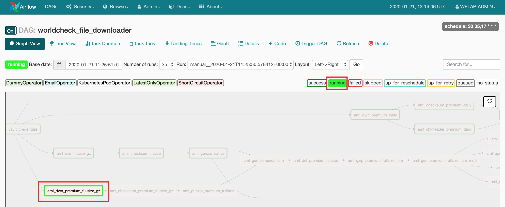

（图9）

#### 了解Operator

8. 数字8：显示当前task属于Airflow哪种类型的Operator。从数字8里可以看出，该DAG一共使用了`DummyOperator`、`EmailOperator`、`KubernetesPodOperator`、`LatestOnlyOperator`、`ShortCircutOperator`5种不同的Operator。更复杂的DAG，可能会使用更多其它类型的Operator。

#### Dag Run状态

9. 数字9：显示DAG当前批次的执行状态，DAG每个批次执行完后，只要有一个task执行状态为`failed`，则该批次的执行状态会被标记为`failed`，只有当所有task执行状态为`success`，该批次的执行状态才会被标记为`success`。

#### 查看Tree View

在`Tree View`查看每一个Dag Run执行情况

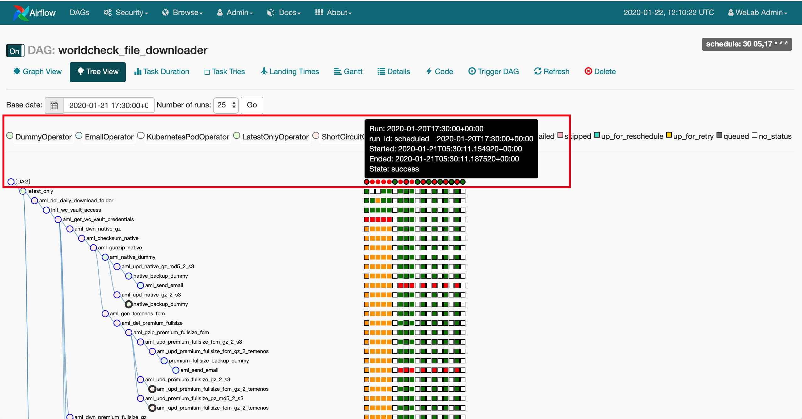

（图10）

如图10所示，Tree View中第一行是每一个Dag Run的执行结果，红色表示该批次执行失败；绿色表示该批次执行成功；鼠标放在每一个圆圈上面，会浮现一个提示框，显示该批次的执行情况。

### 手工Trigger DAG执行

点击"Trigger DAG"图标，Airflow会触发一次批量执行，这种人为干预触发的批量，在"Tree View"页面里，其run_id上会显示以manual开头的字符串，表示该批次是手工触发执行。手工Trigger的Dag Run，Started参数与run_id参数比较一致，只是稍稍晚了几秒钟。

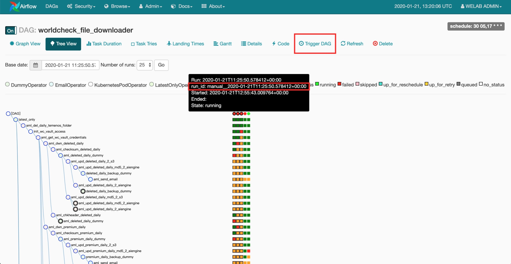

（图11）

手工Trigger的批次，和Airflow调度器自动Trigger的批次一样，也是一个完整的批次，从第一个task开始执行到最后一个task。

### task rerun弹窗

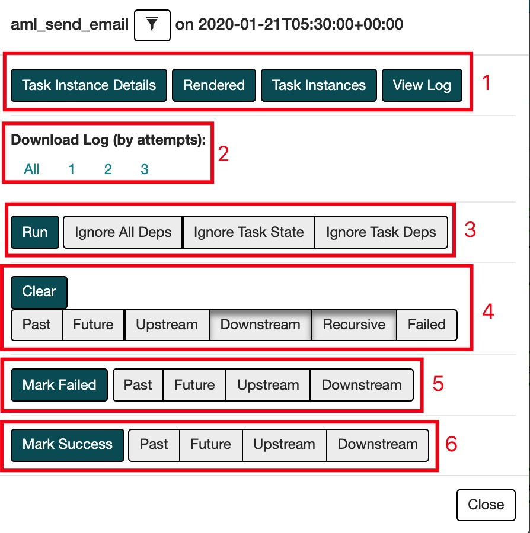

（图12）

点击每一个task，都会弹出这样一个提示框，如上图12所示。

1. 在数字1中分别点击每一个button，可以跳转到对应页面，查看这个task对应的Task Instance Details信息、Rendered信息、Task Instance信息、Log信息。这4个button中对我们最有用的是"View Log"这个button；

2. 数字2显示该task一共被执行了3次，点击"All"会下载全部3次执行的log日志；点击数字1、2、3则分别只下载那一次的执行结果；

3. 点击数字3中的"Run"可以单次执行该task，右边3个button是执行task时可以选择的条件，鼠标停留在每一个条件上会显示该条件表示的含义。选择"Ignore All Deps"表示忽略该task的前后依赖条件及之前批次的执行状态，直接执行该task。后面两个条件使用得不多，暂不做介绍。

4. 数字4里的"Clear"表示可以清除当前task的执行状态，清除执行状态后，该task会被自动重置为`no_status`，等待Airflow调度器自动调度执行；注意数字4中"Downstream"和"Recursive"是默认选中的，它的意思是当你点击"Clear"后，当前task及所有后置task的状态都会被清除，即当前task及所有后置task都会重新等待调度执行；

   数字4中如果在默认选中"Downstream"和"Recursive"同时，选中"Failed"条件，则表示点击"Clear"后当前task及后置task中所有状态为`failed`的task会被重新调度执行；

   如果同时选中"Upstream"和"Recursive"，点击"Clear"后则表示从Dag第一个task到当前task，这条路径上的所有task会被重新调度执行；其它几个参数使用不多，暂不做介绍。

5. 数字5里的button用于标记task的执行状态，可以将单个task的状态标记为`failed`，也可以配合"Upstream"参数或"Downstream"参数，将该task所在分支上的所有task的状态标记为`failed`；

6. 数字6和数字5里功能类似，只是用来将task执行状态标记为`success`。

### task rerun规则

1. 整个DAG有4个分支，每个分支都是独立运行，互相不会产生影响。原则上每个task都可以在自己分支上return，不管它上一次的执行结果是成功还是失败。
2. fullsize分支`aml_gen_temenos_fcm`这个task依赖两个前置task，只有两个前置task执行成功后，才可以rerun当前这个task。
3. 由于vault TTL参数被设置为1h，从vault获取sftp账号密码task只能在TTL有效期内被rerun，超过TTL有效期，需要先执行它的前置task，然后才可以rerun
4. 只要一个task的前置条件得到满足，它就可以被手工rerun。

### 失败task rerun

整个DAG执行流程中，难免会出现task执行失败。如果出现task执行失败，可以选择手工rerun失败task，也可以视情况rerun整个DAG 分支。

#### 单个task rerun

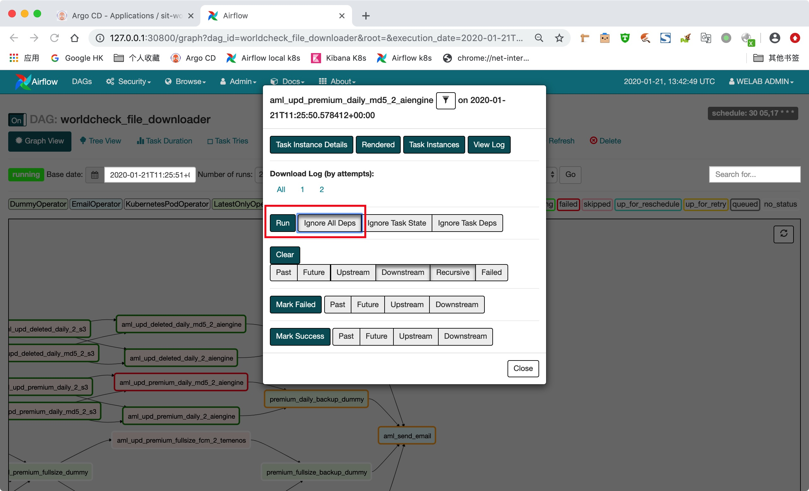

（图13）

如图13，点击失败task，弹出提示框后，选中"Ignore All Deps"然后点击"Run"即可忽略该task的所有依赖条件立刻执行该task，这种方法只会执行当前这一个task。

#### rerun失败task及所有后续作业

1、点击失败task作业，弹出提示框后，选中"Downstream"和"Recursive"后，点击"Clear"按钮

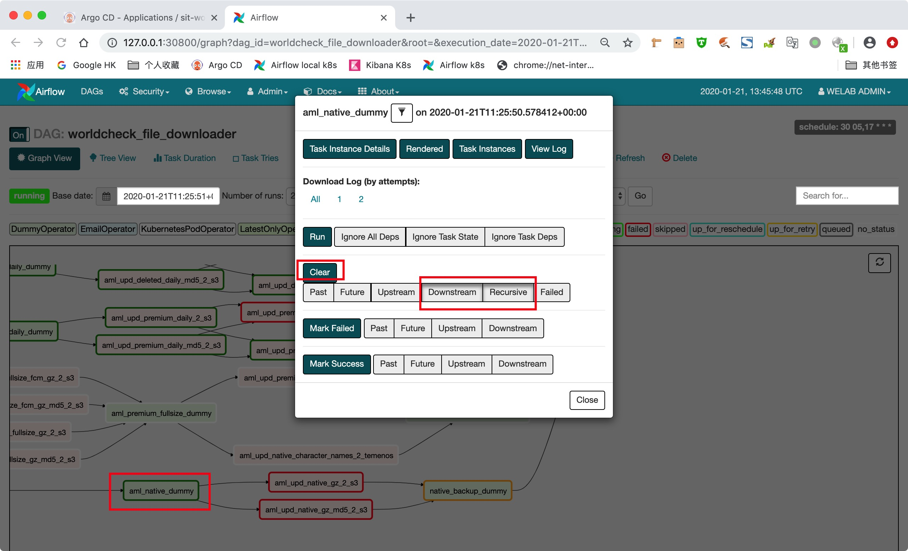

（图14）

2、点击"Clear"按钮后，会将当前task及所有后续task作业的task id打印出来

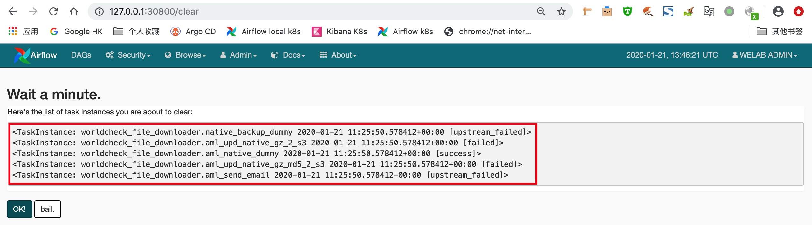

（图15）

3、点击"OK"后，Airflow会将这些task的最近一次执行记录清除，然后将当前task及后续所有task生成新的task instance，将它们放入队列由调度器调度重新执行

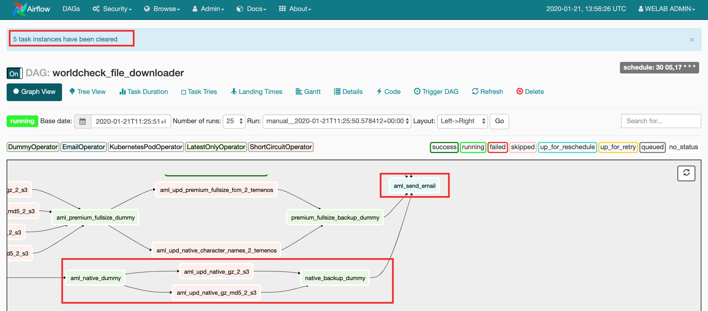

（图16）

从上图可以看到aml_native_dummy task及后续4个task的状态都被更新为"no_status"

#### rerun失败task及所有之前的作业

1、选中需要执行的task，弹出提示框后，选中"Upstream"和"Recursive"后，点击"Clear"按钮

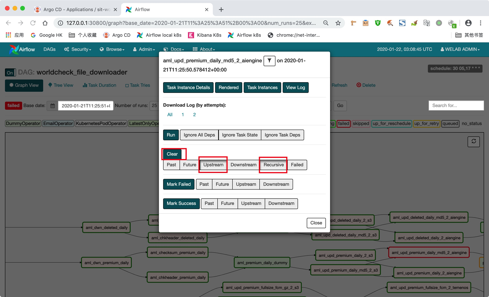

（图17）

2、点击"Clear"按钮后，会将当前task及所有前置task的task id打印出来

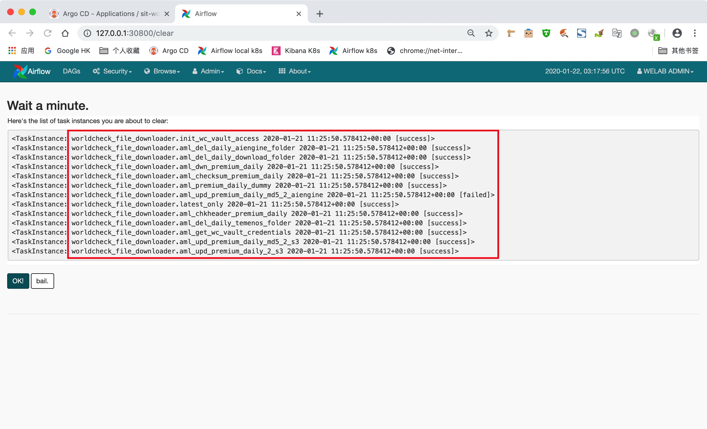

（图18）

3、点击"OK"后，Airflow会将这些task的最近一次执行记录清除，然后为当前task及所有前置task生成新的instance，将它们放入队列由调度器调度执行

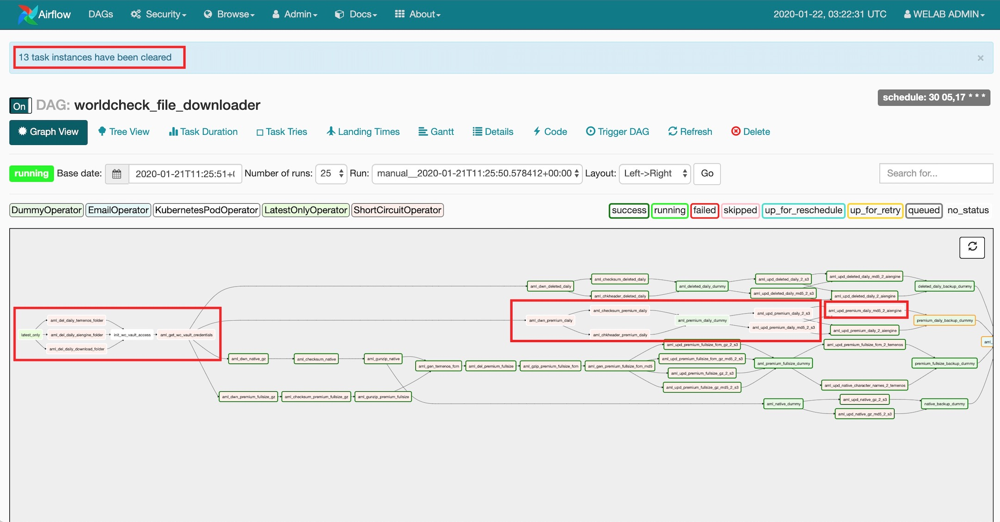

（图19）

从上图可以看到aml_native_dummy task及后续4个task的状态都被更新为"no_status"

### 查看task XCom

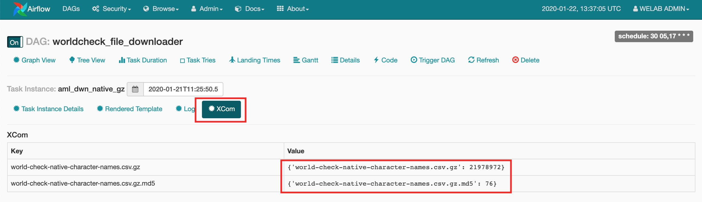

（图20）

在查看task执行日志旁边，有一个"Xcom"按钮，XCom是Ariflow用于在task之间传递参数的组件。在worldcheck_file_downloader这个DAG中大量使用XCom组件进行参数传递。如下载文件task，备份AWS S3这些task，都有使用XCom功能传递参数，参数传递成功后，参数内容会在XCom页面保留，可以用来辅助查看这些task的执行情况是否符合预期。

## 查看Airflow日志

Dev环境中，可以直接点击"View Log" button查看task的执行日志；由于SIT环境作业日志被定向收集到日志服务器，需要在Kibana里搜索task name查询日志。

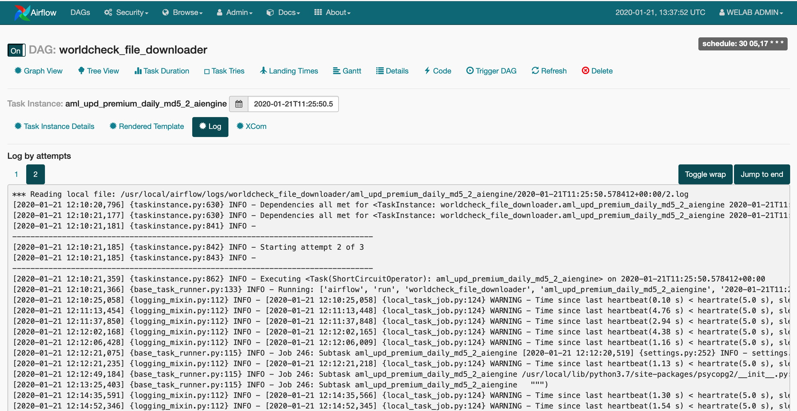

**参考资料**

- [Airflow Documentaion](https://airflow.apache.org/docs/stable/index.html)
