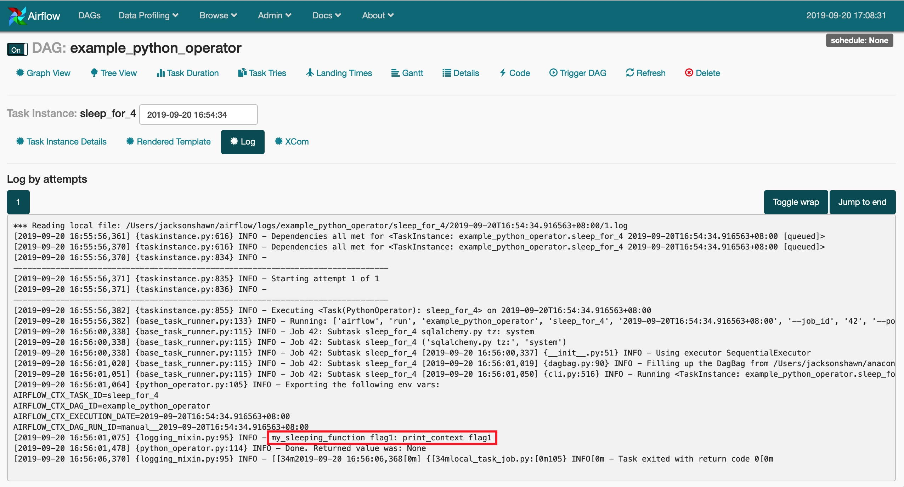
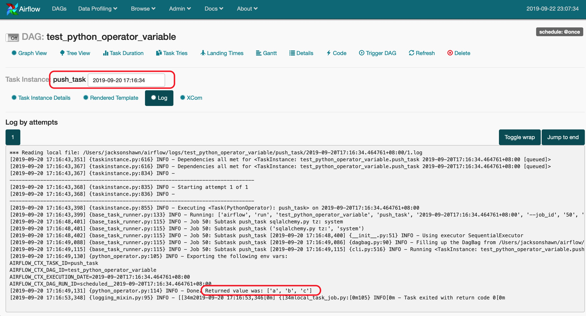
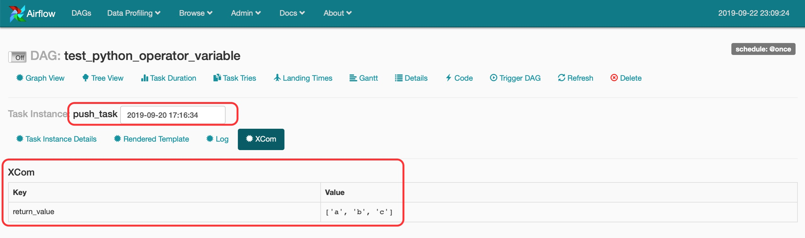
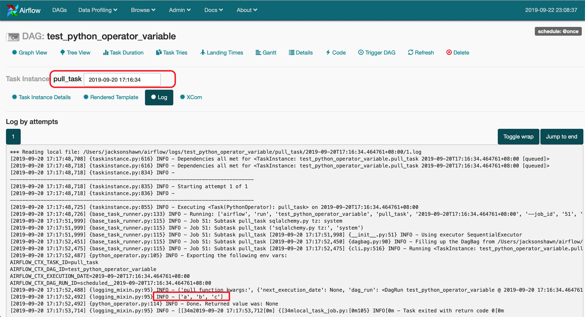

（Photo by [Iker Urteaga](https://unsplash.com/@iurte?utm_source=unsplash&utm_medium=referral&utm_content=creditCopyText) on [Unsplash](https://unsplash.com/s/photos/air-flow?utm_source=unsplash&utm_medium=referral&utm_content=creditCopyText)）

工作项目需要，最近在研究Airflow，Apache基金会下的一款任务流管理工具，基于Python而生，官网链接[在此](https://airflow.apache.org)。这几天弄清楚了PythonOperator中不同Task之间如何传递参数，目前主要找到了两种方法。

第一种方法是使用Variable.set和Variable.get方法；第二种方法使用Xcoms。

<!--more-->

**方法1:**

在Airflow自带的example_python_operator这个DAG里面，从airflow.models导入Variable模块，使用Variable.set先设置变量；然后在另外一个Task里面使用Variable.get获取参数。设置变量时可以使用deserialize_json参数，deserialize_json=True时，表示被设置的变量为序列化对象；后面使用Variable.get获取该变量的地方，也需要对应加上deserialize_json参数。

Variable.set和Variable.get方法直接查看[Source code for airflow.models.variable](https://airflow.apache.org/_modules/airflow/models/variable.html#Variable.set)这份文档。

在example_python_operator这个DAG里面，如下方式即可实现不同Task之间传递参数。

```python
# [START howto_operator_python]
def print_context(ds, **kwargs):
    # Set variable without serialization parameter
    Variable.set('flag1', 'print_context flag1')

    # Set variable with serialization parameter
    # Variable.set('flag1', 'print_context flag1', deserialize_json=True)
    pprint(kwargs)
    print("print_context ds:", ds, len(ds))
    print("print_context kwargs:", kwargs, len(kwargs))
    return 'Whatever you return gets printed in the logs'


run_this = PythonOperator(
    task_id='print_the_context',
    provide_context=True,
    python_callable=print_context,
    dag=dag,
)
# [END howto_operator_python]


# [START howto_operator_python_kwargs]
def my_sleeping_function(random_base):
    """This is a function that will run within the DAG execution"""
    flag1 = Variable.get('flag1')
    # Get variable by serialization method
    # flag1 = Variable.get('flag1', deserialize_json=True)
    print("my_sleeping_function flag1:", flag1)
    time.sleep(random_base)


# Generate 5 sleeping tasks, sleeping from 0.0 to 0.4 seconds respectively
for i in range(5):
    task = PythonOperator(
        task_id='sleep_for_' + str(i),
        python_callable=my_sleeping_function,
        op_kwargs={'random_base': float(i) / 10},
        dag=dag,
    )

    run_this >> task
# [END howto_operator_python_kwargs]
```

执行结果请看下面红色方框处：




**方法2:**

在Task A中使用return返回要被Task B引用的变量；在Task B中直接使用xcom_pull即可引用该变量。参考代码如下。

```python
#! /usr/bin/env python
# -*- coding: utf-8 -*-

from datetime import datetime
from airflow.models import DAG
from airflow.operators.python_operator import PythonOperator

DAG = DAG(
  dag_id='test_python_operator_variable',
  start_date=datetime.now(),
  schedule_interval='@once'
)


def push_function(**kwargs):
    ls = ['a', 'b', 'c']
    return ls

push_task = PythonOperator(
    task_id='push_task',
    python_callable=push_function,
    provide_context=True,
    dag=DAG)


def pull_function(**kwargs):
    print("pull_function kwargs:", kwargs, len(kwargs))
    ti = kwargs['ti']
    ls = ti.xcom_pull(task_ids='push_task')
    print(ls)

pull_task = PythonOperator(
    task_id='pull_task',
    python_callable=pull_function,
    provide_context=True,
    dag=DAG)

push_task >> pull_task
```

执行结果：

push_task这个Task执行完后Return的值如下所示。



push_task这个Task执行完后Xcom的内容如下所示。



pull_task执行过程中打印出了变量ls的值，说明参数传递成功。



方法2是从StackOverflow翻出来的，参考链接见[这里](https://stackoverflow.com/questions/46059161/airflow-how-to-pass-xcom-variable-into-python-function)。

ti是kwargs字典里面内置的变量，表示的是当前这个Task Instance。
