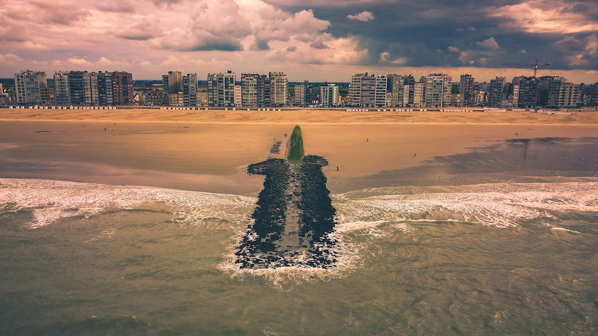
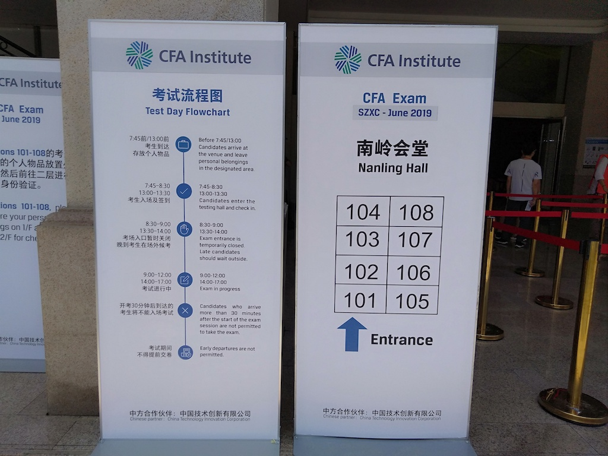

（Photo by [Filip Bunkens](https://unsplash.com/@thebeardbe?utm_source=unsplash&utm_medium=referral&utm_content=creditCopyText) on [Unsplash](https://unsplash.com/search/photos/bad-investment?utm_source=unsplash&utm_medium=referral&utm_content=creditCopyText)）

CFA一级考完那天，我发朋友圈说"题目做完时间多出一个小时，趴在桌子上睡了一觉"。让挺多人误以为我水平牛逼，一副胜卷在握的样子，其实这完全是自我调侃。多出一小时时间， 是因为大部分题都是靠蒙，对考试过关根本没做指望。😂

我是在考前大概两个月的时候，意识到自己这次考试没戏的，因为Ethics的模拟题，我做10个基本错7个，而且几个月前看的东西很多都忘记了，这次考试我的目标就是去走个过场，体验一下"金融行业第一考"的氛围。😉

我是18年12月报的名，那时项目做得比较顺，心里面有点小膨胀；加上大学同学的推荐怂恿，脑子一热，一天时间不到就报了名，当时真以为自己半年时间可以过关拿证，现在想一想，真的是“很傻很天真”。😂

<!--more-->

------

8000多块钱的注册费加报名费，没有充分考虑和调研，一下子就花了出去，很失败的一笔投资。

CFA一级一共考10门：

> 道德与职业行为标准（Ethics and Professional Standards）
>
> 定量分析（Quantitative）
>
> 经济学（Economics）
>
> 财务报表分析（Financial Statement Analysis）
>
> 公司理财（Corporate Finance）
>
> 投资组合管理 （Portfolio Management）
>
> 权益投资（Equity Investments）
>
> 固定收益投资（Fixed Income）
>
> 衍生工具（Derivatives）
>
> 其他类投资（Alternative Investments）

除此之外，我再加上一门，金融计算器使用的学习。哈哈，别笑，真的是这样哦。

…...

全英文教程，英语基础差的题目可能都读不懂。这些课程里面，相对来说我比较擅长的是“定量分析”和“衍生工具”，“财务报表分析”和“权益投资”稍微了解一些，其余是一点都不懂。

现阶段的目标是“好好干好编程这份很有前途的职业”，等以后有空了，再回头来翻一翻“定量分析”和“衍生工具”这两块内容吧。

考前两个月，我跟老婆调侃说，“如果能退款，我一定选择退款”。8000多块钱，做啥不好，买点计算机的书看也比这个强啊。人总是要花很多钱买到教训后，才知道自己的份量。

CFA一级的考纲很宽泛，即便一级考试通过，也说明不了啥。这10门里的任何一门，想深钻，都要花挺多时间，CFA学习对挺拓展知识面挺有用的，对于想转型金融行业或进银行相关行业的人来说，是一个不错的敲门砖。基于我的亲身经历，有以下几点分享给想报考的朋友：

1、考这个证的目的是什么，一定要先想清楚。这个证可以给简历上加分，但给职业发展带来的作用可能有限。

2、真想考，先评估好时间和精力，知乎大V说至少400小时复习时间。对于上班族或有家庭的人来说，我估计翻倍都不够。没有足够的时间看书和做题，过关挺难的。

3、公众号后台回复“**2019CFA**”，看看我这份Quicksheet，你有信心弄懂里面的80%再报名。

4、如果预算充足，建议报补习班，人家老师有经验，能起到帮助作用，但关键还是靠自己看书和做题。

------

对于已经报名待考的朋友，我有几点建议：

1、官网没有短信通知，不会提前通知你考试地点和考试时间。自己去官网查清楚，千万别错过，据说考试开始后30分钟进场视为弃考不让进。

2、打印准考证一定要趁早，提前1个月打印的时候还可以自己更换考点，晚了就是系统随机分配，可能会分到离家很远的地方。

3、一定要好好做模拟题。

4、公众号后台回复“**2019CFA**”，看看我这份Quicksheet，你弄懂了里面的80%我觉得基本上可以过关了。

（图1-考试现场拍图）

考完当天的几点感受：

1、CFA考试很专业。

- 只允许带HB和2B铅笔、橡皮擦、手表和计算器进考场，其它一律不许带。你带了手机钱包怎么办，放酒店门口保安看管的物品架上；你带了草稿纸怎么办？也放外面，人家考卷是一本小册子，考卷空白页有的是对方让你打草稿。
- 整个考场分8个区，每个区3-4名工作人员，听广播指令操作，严谨有素。你提前把考卷翻个面，监考人员都要来纠正一下；厕所里还专门安排一个人全天候看守，
- 试卷、答题卡全英文内容，答题卡上考试地点和座位号千万别填反；考完后试卷和答题卡全收走，保密性做得很好。
- 只使用护照作为唯一报名证件。

2、CFA考试很累。上午3小时，下午3小时，下午题明显比上午难，动脑多，中午又没时间休息。下午考试结束，人会感觉非常疲惫。

3、CFA协会很牛逼很赚钱。

- 我所在的求水山酒店南岭会堂，满员1000人，管你去不去，8000元赚到手不退；整个酒店大概有5个这样的考场，算一下一天就4000万进账；整个深圳市有会展中心、宝立方、罗湖体育馆等几个考点，一个城市就赚到1.6个小目标。它在中国大陆有11个这样的城市，粗略算一下，光一级考试全年收入就有35个亿，这还没算二级和三级。如果CFA背后有一家上市公司，我一定买它的股票。
- 考试现场所有工作都交由供应商来做，租酒店、布置考场、收发试卷、请安保等等，应该都是由这家“中国技术创新有限公司“来做；CFA协会只需要维护好这个证书的品牌和声誉，打造出“CFA证书很吊很牛逼，你们快来考吧”就行。
- 2019年全球参考人数创新高，考证真tm是个好生意。