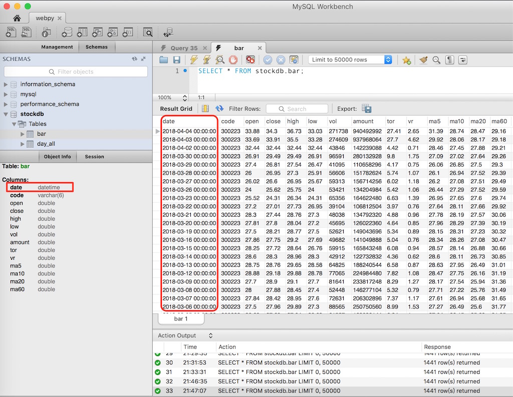
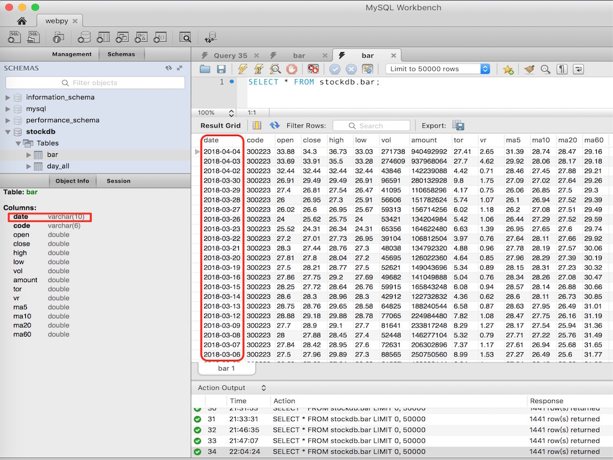
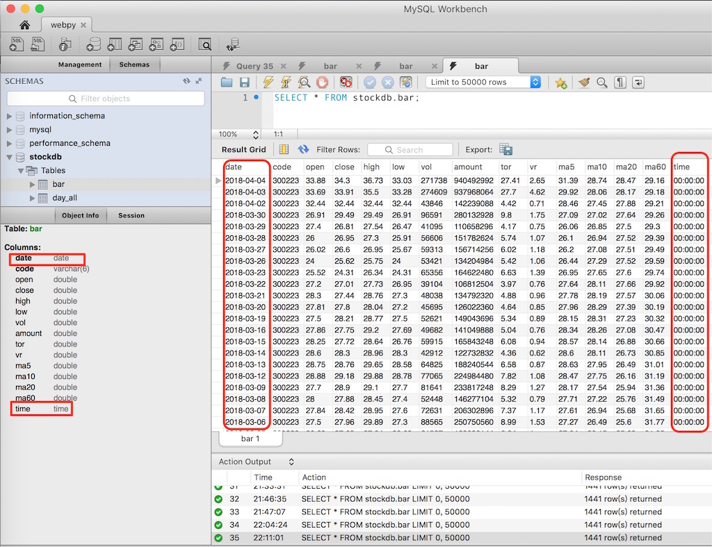

（Photo by [Goran Ivos](https://unsplash.com/photos/_yBEyYR8wps?utm_source=unsplash&utm_medium=referral&utm_content=creditCopyText) on [Unsplash](https://unsplash.com/search/photos/code?utm_source=unsplash&utm_medium=referral&utm_content=creditCopyText)）

今天使用Tushare获取个股的bar数据时，遇到这样一个问题。获取数据写入MySQL后，表里面date字段显示带有“00:00:00”格式，而且字段类型为datetime，如下图所示。 



这或许没有什么问题，但和我预期的结果有差异，我预期date字段的数据类型是date，不希望它是datetime。并且，我不想date字段的值里面带有“00:00:00”这些内容。

排查原因，最后发现是Tushare包里面bar函数，获取到数据后，通过Pandas.to_datetime函数，将日期字段转换为带“00:00:00”格式的日期值。

见trading.py程序里面第861行，如下所示。

```python
data['datetime'] = pd.to_datetime(data['datetime'])
```

<!--more-->

起初想直接修改这行代码，让它不返回带“00:00:00”格式的数据，有点遗憾，试过几个方法，都没能成功。在数据源头下手，其实是最好的方法，但目前功力不够，只能采用其它方法。

生成bar数据的原始代码如下。

```python
def store_bar(code,
              start_date=None,
              end_date=None):
    
    """
    store_bar:获取指定个股成交明细数据
    """    
    
    df_bar = bar(code,
                 start_date=start_date,
                 end_date=end_date)

    df_bar = df_bar.loc[:,[
                        'code',
                        'open',
                        'close',
                        'high',
                        'low',
                        'vol',
                        'amount',
                        'tor',
                        'vr',
                        'ma5',
                        'ma10',
                        'ma20',
                        'ma60'
                        ]]
                                
    # 将DataFrame的index转换成列'date'
    df_bar['date'] = df_bar.index
    
    # 设置索引值  
    df_bar = df_bar.set_index(['date','code'], 
                              drop=True,
                              verify_integrity=True)

    dict_bar ={
                'code': VARCHAR(df_bar.index.
                               get_level_values('code').str.len().max())
              }
    
    write_records_into_mysql(df_bar, 
                             'bar',
                             dtype=dict_bar)

#----------------------------------------------------------        
#--------------- 存储bar数据到数据库 -----------------------       
#----------------------------------------------------------        
if __name__ == '__main__':
    print "PGM begin"
    store_bar('300223')  
    print "PGM end" 
```

其它方法，就只能是，生成带“00:00:00”格式的数据后，将其进行类型转换或数据拆分。

方法一，进行类型转换。

我们知道数据库里面“2018-04-04 00:00:00”这种格式的数据，属于Numpy的datetime64类型。因此我们的思路是先将其转换为Python自带的datetime类型，然后提取YY-MM-DD部分。以下是采取方法一后的程序代码。

```python
def store_bar(code,
              start_date=None,
              end_date=None):
    
    """
    store_bar:获取指定个股成交明细数据
    """    
    
    df_bar = bar(code,
                 start_date=start_date,
                 end_date=end_date)

    df_bar = df_bar.loc[:,[
                        'code',
                        'open',
                        'close',
                        'high',
                        'low',
                        'vol',
                        'amount',
                        'tor',
                        'vr',
                        'ma5',
                        'ma10',
                        'ma20',
                        'ma60'
                        ]]
                                
    # 将DataFrame的index转换成列'date'
    df_bar['date'] = df_bar.index
    
    """
    to_pydatetime函数将DatetimeIndex类型转换为array类型，把DataFrame的dtype从
    datetime64转换为了object，然后使用apply函数只获取'%Y-%m-%d'格式，即将index字段
    里面的时间参数去掉了。
    
    转换前:
    DatetimeIndex(['2018-04-04', '2018-04-03', '2018-04-02', '2018-03-30',
               '2018-03-29', '2018-03-28', '2018-03-27', '2018-03-26',
               '2018-03-23', '2018-03-22',
               ...
               '2011-06-14', '2011-06-13', '2011-06-10', '2011-06-09',
               '2011-06-08', '2011-06-07', '2011-06-03', '2011-06-02',
               '2011-06-01', '2011-05-31'],
              dtype='datetime64[ns]', name=u'datetime', length=1441, freq=None)
    
    转换后:
    array([datetime.datetime(2018, 4, 4, 0, 0),
       datetime.datetime(2018, 4, 3, 0, 0),
       datetime.datetime(2018, 4, 2, 0, 0), ...,
       datetime.datetime(2011, 6, 2, 0, 0),
       datetime.datetime(2011, 6, 1, 0, 0),
       datetime.datetime(2011, 5, 31, 0, 0)], dtype=object)
    
    参考：
    https://blog.csdn.net/dm_vincent/article/details/48696857

    """
    
    # 第一种方法，将Numpy的datetime64类型先转换为Python里面的datetime类型，
    # 再使用函数进行格式化，只提取我们需要的YY:MM:DD部分
    df_bar['date'] = df_bar.index.to_pydatetime()
    
    # 提取YY-MM-DD部分
    df_bar['date'] = df_bar['date'].apply(lambda x: x.strftime('%Y-%m-%d'))
   
    df_bar = df_bar.set_index(['date','code'], 
                              drop=True,
                              verify_integrity=True)

    dict_bar ={
                # 方法一，需要添加date字段
                # 将'date'字段转换为str类型后，必须指定其长度，否则报1170错误，转换后'date'字段
                # 变成一个VARCHAR类型，不再是date类型
                'date':VARCHAR(df_bar.index.
                               get_level_values('date').str.len().max()),
                'code': VARCHAR(df_bar.index.
                               get_level_values('code').str.len().max())
                }
    
    write_records_into_mysql(df_bar, 
                             'bar',
                             dtype=dict_bar)

#----------------------------------------------------------        
#--------------- 存储bar数据到数据库 -----------------------       
#----------------------------------------------------------        
if __name__ == '__main__':
    print "PGM begin"
    store_bar('300223')  
    print "PGM end" 
```

采用这种方法，能够解决问题，但生成出来的数据如下图所示，date字段它的类型变成了VARCHAR。并且，对DataFrame的index使用to_pydatetime进行类型转换，以及将date转换为VARCHAR类型，两步操作都挺影响性能。



方法二，进行数据拆分。

将Numpy的datetime64拆分为两个列date和time，date字段存放日期，time字段存放时间。以下是采取方法二后的程序代码。

```python
def store_bar(code,
              start_date=None,
              end_date=None):
    
    """
    store_bar:获取指定个股成交明细数据
    """    
    
    df_bar = bar(code,
                 start_date=start_date,
                 end_date=end_date)

    df_bar = df_bar.loc[:,[
                        'code',
                        'open',
                        'close',
                        'high',
                        'low',
                        'vol',
                        'amount',
                        'tor',
                        'vr',
                        'ma5',
                        'ma10',
                        'ma20',
                        'ma60'
                        ]]
                                
    # 将DataFrame的index转换成列'date'
    df_bar['date'] = df_bar.index
    
    # 第二种方法，使用split将Numpy的datetime64类型拆分为date和time两个字段，这样存入MySQL里面的
    # HH:MM:SS就会剥离到time字段了
    df_bar[['date','time']] = df_bar['date'].apply(
            lambda x: pd.Series([i for i in str(x).split(" ")]))
          
    df_bar = df_bar.set_index(['date','code'], 
                              drop=True,
                              verify_integrity=True)
    
    dict_bar ={
               
                'code': VARCHAR(df_bar.index.
                               get_level_values('code').str.len().max()),
                # 方法二，需要设置date和time类型
                'date': Date,
                'time': Time
                }
    
    write_records_into_mysql(df_bar, 
                             'bar',
                             dtype=dict_bar)

#----------------------------------------------------------        
#------------------- 存储bar数据到数据库 ---------------------       
#----------------------------------------------------------        
if __name__ == '__main__':
    print "PGM begin"
    store_bar('300223')  
    print "PGM end" 
```

方法二生成结果如下图所示，效果比方法一要好，生成出来的date字段是预期的date类型，额外多出来的time字段，完全可以删除。



这个问题可能根本不是一个问题，因为date字段包含“00:00:00”格式，并没有导致程序出错；也不是说date字段包含“00:00:00”格式，数据就无法使用，只是我单纯觉得datetime类型没有date类型好、包含“00:00:00”格式的内容不易于理解，这两点不符合我预期才做出的修改。

如果从源头出发，可能会有更好的解决办法，以后找到方法再做补充。

**参考资料：**

- [Pandas 将“字符类型的日期列”转化成“时间戳索引（DatetimeIndex）”](https://www.jianshu.com/p/4ece5843d383)
- [[Pandas] 转换DatetimeIndex为一个日期字符串的Series](https://blog.csdn.net/dm_vincent/article/details/48696857)
- [Converting between datetime, Timestamp and datetime64](https://stackoverflow.com/questions/13703720/converting-between-datetime-timestamp-and-datetime64)
- [Datetimes and Timedeltas](https://docs.scipy.org/doc/Numpy/reference/arrays.datetime.html)
- [编码格式处理、文件或dataFrame的操作](https://blog.csdn.net/qimiejia5584/article/details/78565953)