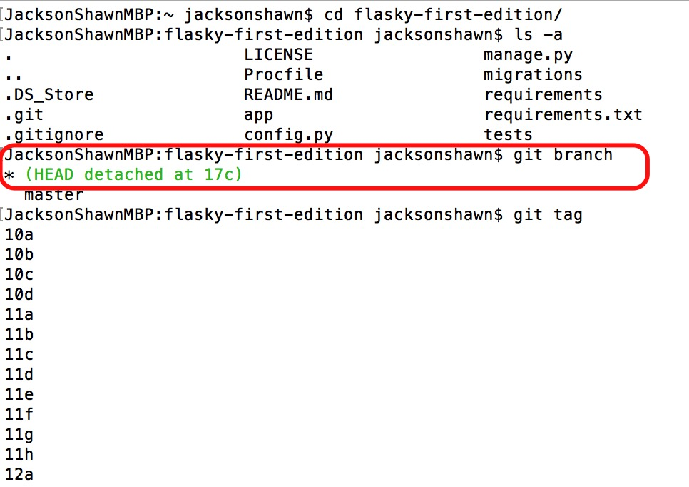
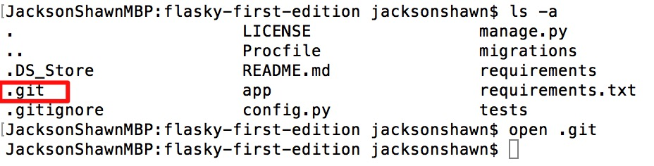
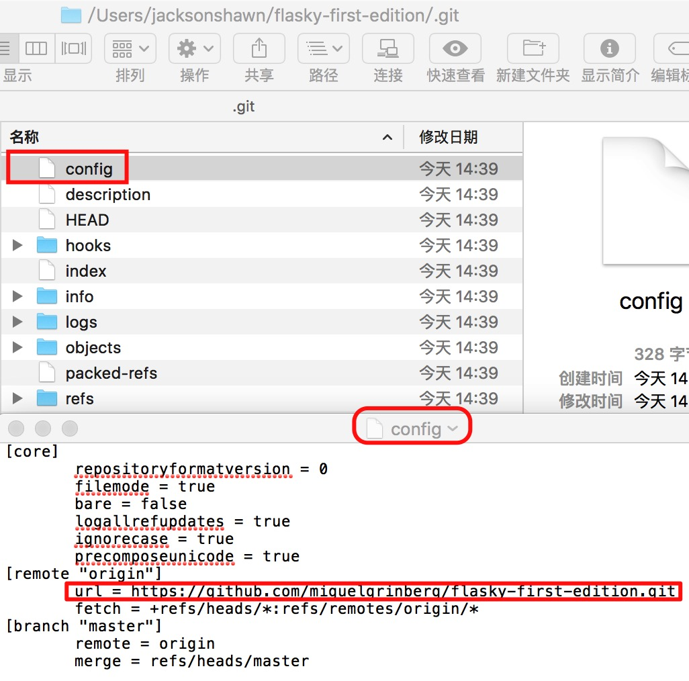
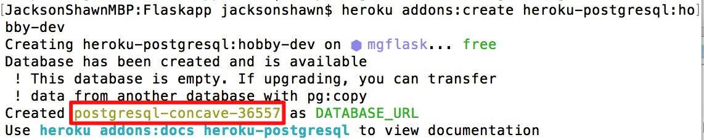
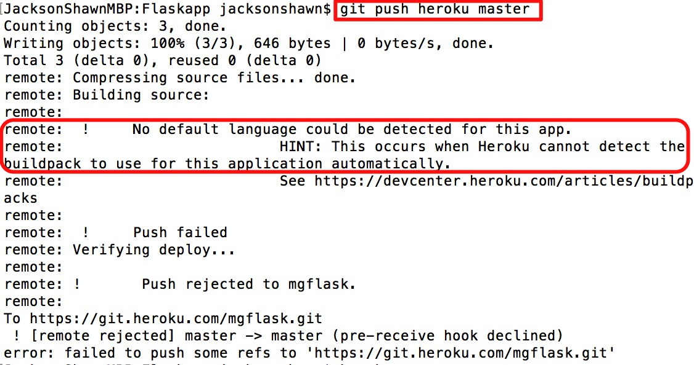
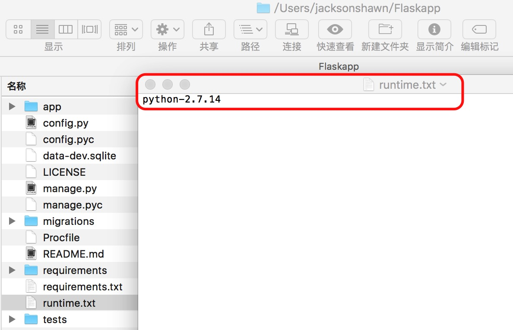
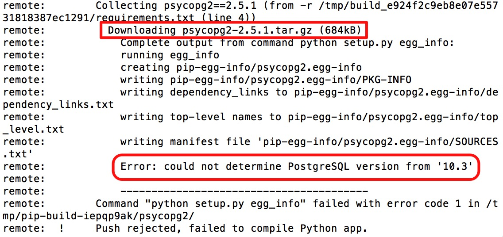
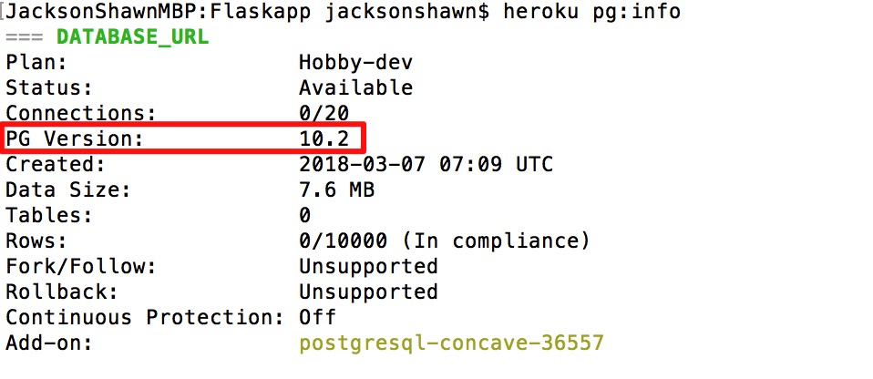

(题图来自Heroku官网截图，注册Heroku需要翻墙)

学习完《FlaskWeb开发：基于Python的Web应用开发实战》(第一版)后，我参照本书及网络上的方法将[**Flasky项目第一版**](https://github.com/miguelgrinberg/flasky-first-edition.git)成功部署到Heroku，这里是README.md说明纪录。部署上线网址:https://mgflask.herokuapp.com

部署项目上线对我来说并不是一件容易的事，Flaskapp项目代码全部来自于flasky-first-edition，不过结合实际业务测试和功能测试，对很多地方进行了修改，部署分为两个部分，Part1是提取正确的git版本，Part2是push代码到Heroku。

<!--more-->

#### Part1: 提取正确的git版本

首先参考[(first update)终于成功部署在heroku上了，欢迎交流](http://cocode.cc/t/first-update-heroku/3711)里面的第一、二两步提取正确代码版本，这两步操作过程中，我踩过的坑如下。

#### Flasky项目版本

作者guog是在15年11月部署的，现在是18年3月，时间隔了这么久，Miguel Grinberg的Flasky项目本身就迭代了很多版本。我使用的书是《FlaskWeb开发：基于Python的Web应用开发实战》第一版，因此Flasky版本必须使用**[Flasky项目第一版](https://github.com/miguelgrinberg/flasky-first-edition.git)**，一开始我取错了版本，拿的是**[Flasky项目第二版](https://github.com/miguelgrinberg/flasky.git)**，参照guog操作时总是弄不对。千万注意这一点。

#### Github checkout操作务必熟练

部署项目到Heroku这个过程很考验对Git命令的熟练程度，如果你对Git命令各种操作已经驾轻就熟，那么相对来说，这里你会容易很多。我在实际部署中，采用的是[分享一下flask程序部署到heroku平台的过程](http://cocode.cc/t/flask-heroku/4253)作者Rain建议的17c版本，并没有使用guog同学说的17d版本。以下是Rain同学建议使用17c的理由。

> 3.要使用Heroku,程序必须托管在远程Git仓库中，本地也要有一个一样的Git仓库。你的程序代码应该与作者代码的版本”17c“类似,17b也行,不过用17c的话部署的过程就不用再打代码和提交变动到远程仓库，所以我建议是用17c。（ps 17d版本是把程序架设在传统的托管上的， 跟部署在Heroku无关）

通过这篇[Git如何clone非maser分支代码](http://blog.csdn.net/github_35160620/article/details/53869906)讲解git checkout命令的文章，我弄明白了git checkout操作，不带疑问地将17c版本提取出来。



将flasky-first-edition clone到本地后，使用git branch和git tag命令可以检查当前分支和所有历史版本。然后使用“git checkout 17c”就可以提取我们需要的17c版本。这两个命令现在对我来说驾轻就熟，但解决问题之前，花费了我不少时间。

#### 拷贝Git代码注意事项

我按照作者guog描述的步骤，使用"git clone https://github.com/benbendemo/Flaskapp" 操作先在本地建立了一个Flaskapp仓库（注意:一开始Flaskapp是空仓库）。然后将flasky-first-edition里面全部内容拷贝到Flaskapp里面来，有前辈提醒注意不要把flasky-first-edition包里的.git文件夹拷贝到待部署的仓库（我的就是Flaskapp），否则后面会出错。可能我使用的是Mac，并没有发生这个情况。

Mac终端里使用"ls -a"查看目录，使用"open .git"可以打开.git文件夹（**真的是文件夹！**）。



点击.git文件夹里面的config文本文件，可以查看当前git仓库的源信息。



我就是使用这种方法，确保从flasky-first-edition包拷贝到Flaskapp包，git配置信息没有弄错。

#### Part2: push代码到Heroku

部署过程过程参照作者Rain这篇[分享一下flask程序部署到heroku平台的过程](http://cocode.cc/t/flask-heroku/4253)文章。当然，部署过程中出现很多问题，他这篇文章写于2015年12月，相对现在也有些古老。Heroku平台本身进行了迭代升级，比如postgresql版本升级到了10.2，requirements.txt里面需要安装的驱动psycopg2对应也需要使用新的版本。另外，需要提一下的是，<u>文中提醒在程序修改数据库的地方都加上"db.session.commit()"</u>。我没有这样做，直接用的17c源码，部署成功后测试各个功能，没有出现任何问题。

#### Heroku创建数据库名称发生变化

基本操作和Rain同学的一致，只不过现在创建出来的Postgresql数据库，名称不是他文中所写的形式，现在变成"postgresql-concave-36557"这种形式。



使用Heroku config设置好环境变量后，就可以将本地Flaskapp仓库里面的内容提交到Heroku服务器。设置config变量参照Rain同学文中步骤即可，我就不多余贴图了。

#### Delopy到Heroku注意事项

注意，Rain同学文章中，在设置好config参数后，直接使用"git push heroku master"进行Deploy，这是有问题的，完整的git提交命令如下，这也是Heroku官方给出的Deploy操作。

```shell
$ git add .
$ git commit -am "make it better"(描述信息可以随便输，会保存到git操作记录里面)
```

#### 创建runtime.txt文件

我在push代码过程中，遇到图中"No default language could be detected for this app"的问题。



上面这个问题，在Flaskapp仓库下面使用"git init"命令即可解决，解决后重新push时提示安装的是python 3.6.4版本，因为Heroku现在对新建的Python应用默认都使用`python-3.6.4`版本。在参考SO人家的发帖后，通过Heroku官网给出关于[Buildpacks](https://devcenter.heroku.com/articles/buildpacks)和[Python runtime](https://devcenter.heroku.com/articles/python-runtimes#supported-python-runtimes)的提示，我创建了runtime.txt文件，加入到了Flaskapp包的根目录。

在Mac终端Flaskapp目录下使用"touch runtime.txt"即可创建文件，文件内容用来指定Heroku部署项目时使用的编译环境，这里我使用`python-2.7.14`。



#### 安装Postgresql驱动包psycopg2报错

解决了Python部署问题后，我以为可以大功告成，没想到在安装psycopg2包时出现报错。报错提示："Error: could not determine PostgreSQL version from '10.3'"，在SO和github上都搜不到解决办法。最后想到可能是psycopg2包和当前Postgresql版本不匹配的原因。



使用"heroku pg:info"查看Heroku服务器里面Postgresql当前版本，版本号为10.2。



查询psycopg2官网后，最新版本是psycopg2 2.7.4。于是将requirements.txt文件"psycopg2==2.5.1"换成"psycopg2==2.7.4"。重新push后，Deploy成功。

#### 部署成功信息

忍不住贴出部署成功信息。

```shell
JacksonShawnMBP:Flaskapp jacksonshawn$ git push heroku master
Counting objects: 96, done.
Delta compression using up to 4 threads.
Compressing objects: 100% (86/86), done.
Writing objects: 100% (96/96), 33.59 KiB | 0 bytes/s, done.
Total 96 (delta 20), reused 0 (delta 0)
remote: Compressing source files... done.
remote: Building source:
remote: 
remote: -----> Python app detected
remote: -----> Installing python-2.7.14
remote: -----> Installing pip
remote: -----> Installing requirements with pip
remote:        Collecting Flask==0.12 (from -r /tmp/build_20fb038843640507b4fcd293d5e9fa6b/requirements/common.txt (line 1))
remote:          Downloading Flask-0.12-py2.py3-none-any.whl (82kB)
remote:        Collecting Flask-Bootstrap==3.0.3.1 (from -r /tmp/build_20fb038843640507b4fcd293d5e9fa6b/requirements/common.txt (line 2))
remote:          Downloading Flask-Bootstrap-3.0.3.1.tar.gz (250kB)
remote:        Collecting Flask-HTTPAuth==2.7.0 (from -r /tmp/build_20fb038843640507b4fcd293d5e9fa6b/requirements/common.txt (line 3))
remote:          Downloading Flask-HTTPAuth-2.7.0.tar.gz
remote:        Collecting Flask-Login==0.3.1 (from -r /tmp/build_20fb038843640507b4fcd293d5e9fa6b/requirements/common.txt (line 4))
remote:          Downloading Flask-Login-0.3.1.tar.gz
remote:        Collecting Flask-Mail==0.9.0 (from -r /tmp/build_20fb038843640507b4fcd293d5e9fa6b/requirements/common.txt (line 5))
remote:          Downloading Flask-Mail-0.9.0.tar.gz (43kB)
remote:        Collecting Flask-Migrate==2.0.3 (from -r /tmp/build_20fb038843640507b4fcd293d5e9fa6b/requirements/common.txt (line 6))
remote:          Downloading Flask-Migrate-2.0.3.tar.gz
remote:        Collecting Flask-Moment==0.2.1 (from -r /tmp/build_20fb038843640507b4fcd293d5e9fa6b/requirements/common.txt (line 7))
remote:          Downloading Flask-Moment-0.2.1.tar.gz
remote:        Collecting Flask-PageDown==0.1.4 (from -r /tmp/build_20fb038843640507b4fcd293d5e9fa6b/requirements/common.txt (line 8))
remote:          Downloading Flask-PageDown-0.1.4.tar.gz
remote:        Collecting Flask-SQLAlchemy==2.1 (from -r /tmp/build_20fb038843640507b4fcd293d5e9fa6b/requirements/common.txt (line 9))
remote:          Downloading Flask-SQLAlchemy-2.1.tar.gz (95kB)
remote:        Collecting Flask-Script==2.0.5 (from -r /tmp/build_20fb038843640507b4fcd293d5e9fa6b/requirements/common.txt (line 10))
remote:          Downloading Flask-Script-2.0.5.tar.gz (42kB)
remote:        Collecting Flask-WTF==0.14.2 (from -r /tmp/build_20fb038843640507b4fcd293d5e9fa6b/requirements/common.txt (line 11))
remote:          Downloading Flask_WTF-0.14.2-py2.py3-none-any.whl
remote:        Collecting Jinja2==2.9.5 (from -r /tmp/build_20fb038843640507b4fcd293d5e9fa6b/requirements/common.txt (line 12))
remote:          Downloading Jinja2-2.9.5-py2.py3-none-any.whl (340kB)
remote:        Collecting Mako==1.0.6 (from -r /tmp/build_20fb038843640507b4fcd293d5e9fa6b/requirements/common.txt (line 13))
remote:          Downloading Mako-1.0.6.tar.gz (575kB)
remote:        Collecting Markdown==2.3.1 (from -r /tmp/build_20fb038843640507b4fcd293d5e9fa6b/requirements/common.txt (line 14))
remote:          Downloading Markdown-2.3.1.tar.gz (267kB)
remote:        Collecting MarkupSafe==0.23 (from -r /tmp/build_20fb038843640507b4fcd293d5e9fa6b/requirements/common.txt (line 15))
remote:          Downloading MarkupSafe-0.23.tar.gz
remote:        Collecting SQLAlchemy==1.1.5 (from -r /tmp/build_20fb038843640507b4fcd293d5e9fa6b/requirements/common.txt (line 16))
remote:          Downloading SQLAlchemy-1.1.5.tar.gz (5.1MB)
remote:        Collecting WTForms==2.1 (from -r /tmp/build_20fb038843640507b4fcd293d5e9fa6b/requirements/common.txt (line 17))
remote:          Downloading WTForms-2.1.zip (553kB)
remote:        Collecting Werkzeug==0.11.15 (from -r /tmp/build_20fb038843640507b4fcd293d5e9fa6b/requirements/common.txt (line 18))
remote:          Downloading Werkzeug-0.11.15-py2.py3-none-any.whl (307kB)
remote:        Collecting alembic==0.8.10 (from -r /tmp/build_20fb038843640507b4fcd293d5e9fa6b/requirements/common.txt (line 19))
remote:          Downloading alembic-0.8.10.tar.gz (976kB)
remote:        Collecting bleach==1.4.0 (from -r /tmp/build_20fb038843640507b4fcd293d5e9fa6b/requirements/common.txt (line 20))
remote:          Downloading bleach-1.4.tar.gz
remote:        Collecting blinker==1.3 (from -r /tmp/build_20fb038843640507b4fcd293d5e9fa6b/requirements/common.txt (line 21))
remote:          Downloading blinker-1.3.tar.gz (91kB)
remote:        Collecting click==6.7 (from -r /tmp/build_20fb038843640507b4fcd293d5e9fa6b/requirements/common.txt (line 22))
remote:          Downloading click-6.7-py2.py3-none-any.whl (71kB)
remote:        Collecting html5lib==1.0b3 (from -r /tmp/build_20fb038843640507b4fcd293d5e9fa6b/requirements/common.txt (line 23))
remote:          Downloading html5lib-1.0b3.tar.gz (884kB)
remote:        Collecting itsdangerous==0.24 (from -r /tmp/build_20fb038843640507b4fcd293d5e9fa6b/requirements/common.txt (line 24))
remote:          Downloading itsdangerous-0.24.tar.gz (46kB)
remote:        Collecting python-editor==1.0.3 (from -r /tmp/build_20fb038843640507b4fcd293d5e9fa6b/requirements/common.txt (line 25))
remote:          Downloading python-editor-1.0.3.tar.gz
remote:        Collecting six==1.4.1 (from -r /tmp/build_20fb038843640507b4fcd293d5e9fa6b/requirements/common.txt (line 26))
remote:          Downloading six-1.4.1.tar.gz
remote:        Collecting Flask-SSLify==0.1.4 (from -r /tmp/build_20fb038843640507b4fcd293d5e9fa6b/requirements.txt (line 2))
remote:          Downloading Flask-SSLify-0.1.4.tar.gz
remote:        Collecting gunicorn==18.0 (from -r /tmp/build_20fb038843640507b4fcd293d5e9fa6b/requirements.txt (line 3))
remote:          Downloading gunicorn-18.0.tar.gz (366kB)
remote:        Collecting psycopg2==2.7.4 (from -r /tmp/build_20fb038843640507b4fcd293d5e9fa6b/requirements.txt (line 4))
remote:          Downloading psycopg2-2.7.4-cp27-cp27mu-manylinux1_x86_64.whl (2.7MB)
remote:        Installing collected packages: itsdangerous, click, Werkzeug, MarkupSafe, Jinja2, Flask, Flask-Bootstrap, Flask-HTTPAuth, Flask-Login, blinker, Flask-Mail, SQLAlchemy, Flask-SQLAlchemy, Mako, python-editor, alembic, Flask-Script, Flask-Migrate, Flask-Moment, WTForms, Flask-PageDown, Flask-WTF, Markdown, six, html5lib, bleach, Flask-SSLify, gunicorn, psycopg2
remote:          Running setup.py install for itsdangerous: started
remote:            Running setup.py install for itsdangerous: finished with status 'done'
remote:          Running setup.py install for MarkupSafe: started
remote:            Running setup.py install for MarkupSafe: finished with status 'done'
remote:          Running setup.py install for Flask-Bootstrap: started
remote:            Running setup.py install for Flask-Bootstrap: finished with status 'done'
remote:          Running setup.py install for Flask-HTTPAuth: started
remote:            Running setup.py install for Flask-HTTPAuth: finished with status 'done'
remote:          Running setup.py install for Flask-Login: started
remote:            Running setup.py install for Flask-Login: finished with status 'done'
remote:          Running setup.py install for blinker: started
remote:            Running setup.py install for blinker: finished with status 'done'
remote:          Running setup.py install for Flask-Mail: started
remote:            Running setup.py install for Flask-Mail: finished with status 'done'
remote:          Running setup.py install for SQLAlchemy: started
remote:            Running setup.py install for SQLAlchemy: finished with status 'done'
remote:          Running setup.py install for Flask-SQLAlchemy: started
remote:            Running setup.py install for Flask-SQLAlchemy: finished with status 'done'
remote:          Running setup.py install for Mako: started
remote:            Running setup.py install for Mako: finished with status 'done'
remote:          Running setup.py install for python-editor: started
remote:            Running setup.py install for python-editor: finished with status 'done'
remote:          Running setup.py install for alembic: started
remote:            Running setup.py install for alembic: finished with status 'done'
remote:          Running setup.py install for Flask-Script: started
remote:            Running setup.py install for Flask-Script: finished with status 'done'
remote:          Running setup.py install for Flask-Migrate: started
remote:            Running setup.py install for Flask-Migrate: finished with status 'done'
remote:          Running setup.py install for Flask-Moment: started
remote:            Running setup.py install for Flask-Moment: finished with status 'done'
remote:          Running setup.py install for WTForms: started
remote:            Running setup.py install for WTForms: finished with status 'done'
remote:          Running setup.py install for Flask-PageDown: started
remote:            Running setup.py install for Flask-PageDown: finished with status 'done'
remote:          Running setup.py install for Markdown: started
remote:            Running setup.py install for Markdown: finished with status 'done'
remote:          Running setup.py install for six: started
remote:            Running setup.py install for six: finished with status 'done
remote:          Running setup.py install for html5lib: started
remote:            Running setup.py install for html5lib: finished with status 'done'
remote:          Running setup.py install for bleach: started
remote:            Running setup.py install for bleach: finished with status 'done'
remote:          Running setup.py install for Flask-SSLify: started
remote:            Running setup.py install for Flask-SSLify: finished with status 'done'
remote:          Running setup.py install for gunicorn: started
remote:            Running setup.py install for gunicorn: finished with status 'done'
remote:        Successfully installed Flask-0.12 Flask-Bootstrap-3.0.3.1 Flask-HTTPAuth-2.7.0 Flask-Login-0.3.1 Flask-Mail-0.9.0 Flask-Migrate-2.0.3 Flask-Moment-0.2.1 Flask-PageDown-0.1.4 Flask-SQLAlchemy-2.1 Flask-SSLify-0.1.4 Flask-Script-2.0.5 Flask-WTF-0.14.2 Jinja2-2.9.5 Mako-1.0.6 Markdown-2.3.1 MarkupSafe-0.23 SQLAlchemy-1.1.5 WTForms-2.1 Werkzeug-0.11.15 alembic-0.8.10 bleach-1.4 blinker-1.3 click-6.7 gunicorn-18.0 html5lib-1.0b3 itsdangerous-0.24 psycopg2-2.7.4 python-editor-1.0.3 six-1.4.1
remote: 
remote:  !     Hello! Your requirements.txt file contains the six package.
remote:  !     This library is automatically installed by Heroku and shouldn't be in
remote:  !     Your requirements.txt file. This can cause unexpected behavior.
remote:  !       -- Much Love, Heroku.
remote: 
remote: -----> Discovering process types
remote:        Procfile declares types -> web
remote: 
remote: -----> Compressing...
remote:        Done: 36.3M
remote: -----> Launching...
remote:        Released v7
remote:        https://mgflask.herokuapp.com/ deployed to Heroku
remote: 
remote: Verifying deploy... done.
To https://git.heroku.com/mgflask.git
 * [new branch]      master -> master
```

最后执行下面两行命令，https://mgflask.herokuapp.com 网站可以正常访问。撒花！

```shell
heroku run python manage.py deploy
heroku restart
```

#### 更新代码到Github

最后将本地Flaskapp里面全部代码更新到我的Github远程仓库。

> git add . 
> git commit -m "ver 1.0" (描述信息可以随便输，会保存到git操作记录里面)
> git push -u origin master 

#### Heroku App测试成功截图

使用邮箱注册，能成功收到管理员发送的“账户确认”邮件，点击确认链接，邮箱注册确认成功。登陆后，在Home页面，能过成功显示写博客页面。（奇怪的是，我在本地Mac电脑使用17c和17d，安装这个步骤操作，注册邮箱等能够成功，但始终没有写博客页面，不知道为什么？）


测试能够成功，Flaskapp这个练手项目就先到这里，我需要腾出时间去做其它的事情。日后有空再做完善吧。

**参考资料：**

- [(first update)终于成功部署在heroku上了，欢迎交流](http://cocode.cc/t/first-update-heroku/3711)
- [分享一下flask程序部署到heroku平台的过程](http://cocode.cc/t/flask-heroku/4253)
- [【flasky/heroku/部署】（欢迎大家挑刺和补充）可能是目前为止最详细的了](http://cocode.cc/t/flasky-heroku/6589)
- [Heroku 使用教程](https://www.jianshu.com/p/7bc34e56fa39)
- [使用git将本地代码项目上传到github](http://www.cnblogs.com/lazyJavaer-lyn/p/6890388.html)