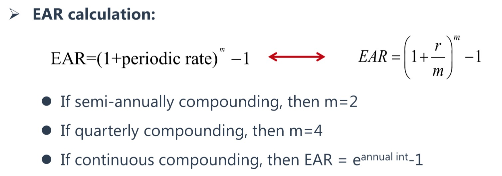

(Photo by [rawpixel](https://unsplash.com/photos/5IiH_UVYdp0?utm_source=unsplash&utm_medium=referral&utm_content=creditCopyText) on [Unsplash](https://unsplash.com/search/photos/loan?utm_source=unsplash&utm_medium=referral&utm_content=creditCopyText))

我们知道银行的定期存款是使用**复利**给客户计息，以1万元的定存作为例子来进行复利计算。

目前国内一年定期存款利率大概为3%，也就是说1万元定存一年，年末可以拿到300元利息，我们记一年定存利率R=3%。

在这个金融行为里面，其实隐藏了一个叫“结息周期”的概念，一年后可以拿到300元利息，这是一年结息1次的情况，也是实际生活中真实的情况。如果银行给你一年结息2次，即每半年银行给你付一次利息，同样是3%的定存利率，那么你年末拿到的利息就不是300元，而是302.25元。

半年末，你拿到10,000\*3%/2=150元利息。

年末，拿到(10,000+150)*3%/2=152.25元利息。（注意：第二次结息周期开始时，已经将第一期产生的利息加入到本金里面进行计算了，这就叫做复利）

全年共拿到302.25元利息，除以本金，得到实际年利率为3.0225%。

<!--more-->

##### 实际年利率换算公式

这里有一个快捷、方便进行实际年利率换算的公式：

> **EAR=(1+R/t)^t-1**
>
> R：名义年利率
>
> t：结息次数
>
> EAR：实际年利率（Effective Annual Rate）

结息2次，计算实际年利率为：

EAR=(1+3%/2)$^2$-1=3.0225%（二次方在网页上可能展示不出来）

------

##### CFA教材标准的EAR计算公式

------

假如一年结息4次，即银行每个季度给你付一次利息，同样是3%的定存利率，那么利息为：

第1个季度末，你拿到10,000*3%/4=75元利息。

第2个季度末，你拿到(10,000+75)*3%/4=75.5625元利息。

第3个季度末，你拿到(10,000+75+75.5625)*3%/4=76.12921875元利息。

第4个季度末，你拿到(10,000+75+75.5625+76.12921875)*3%/4=76.70018789元利息。

......

全年总共拿到303.39190664元利息，即实际的年利率为3.03391907%。

计算实际年利率为：

EAR=(1+3%/4)$^{4}$-1=3.033919%

------

假如一年结息12次，即银行每个月给你付一次利息，同样是3%的定存利率，那么利息为：

第1个月末，你拿到10,000*3%/12=25元利息。

第2个月末，你拿到(10,000+25)*3%/12=25.0625元利息。

第3个月末，你拿到(10,000+25+25.0625)*3%/12=25.12515625元利息。

......

全年总共拿到304.1596元利息，即实际的年利率为3.041596%。

计算实际年利率为：

EAR=(1+3%/12)$^{12}$-1=3.041596%

------

假如一年结息365次，即银行每天给你付一次利息，同样是3%的定存利率，年末你可以拿到304.5326元利息，具体我不去推算了，感兴趣可以自行计算啊。

实际年利率为：

EAR=(1+3%/365)$^{365}$-1=3.045326%

<u>***可见，在给定相同年利率的情况下，结息次数越多，你拿到的利息越多，实际年利率越高。***</u>

------

假如每小时结息一次，我能拿到多少利息？

假如每分钟结息一次，我能拿到多少利息？

假如每秒钟结息一次，我能拿到多少利息？

......

##### 离散复利和连续复利

以上，这些以一个固定时间周期进行复利计算的形式，数学家们称之为**离散复利**，即使用一个固定的时间间隔进行复利计算。

------

我们知道银行如此高频率地给客户结息是不可能出现的情况，但我们想知道，无限次结息的情况下，到底可以拿多少利息，我们往极限的方向去推导。

相对于离散复利，计息周期无限缩短，无限进行复利的形式，数学家们称之为**连续复利**，连续复利其实就是求离散复利的极限值。

##### 连续复利计算公式

连续复利的极限推导公式如下：

> **EAR=$\lim_{t \to +\infty} (1 +\frac{R}{t})^t$-1=e$^R$-1**
>
> R：名义利率
>
> t：结息次数
>
> e：[自然常数e](https://zh.wikipedia.org/wiki/E_(数学常数))
>
> EAR：实际年利率（Effective Annual Rate）

代入R=3%进行计算，连续复利下得到实际年利率为：

EAR=e$^{3\%}$-1=0.03045453=3.045453%

即在给定3%年利率的前提下，即使银行无时无刻都给你结算利息，你也只能拿到3.045453%这个最大利率，即定存1万块钱一年，你最多只能拿到304.5453元利息。

------

##### 钱存银行发不了财

假如银行给你R=100%，极限情况下，你也只能拿到EAR=e$^{100\%}$-1=171.828183%这个利率；即年末，最多你能拿到17182.8183元利息。

这是给定100%利率，无限复利的情况，但实际上我们知道银行肯定给不了这么高的利率，也绝对不可能给你这么频繁地结算利息。

于是，我们通过数学计算得出结论，钱存在银行，无论如何你都发不了财。

##### 参考资料

- [数学常数e的含义](https://www.guokr.com/article/50264/)
- [自然常数e](https://baike.baidu.com/item/自然常数/1298918)

