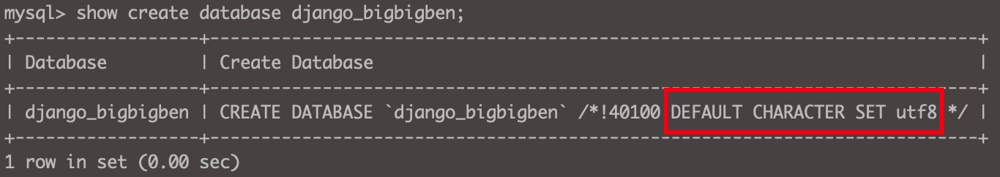
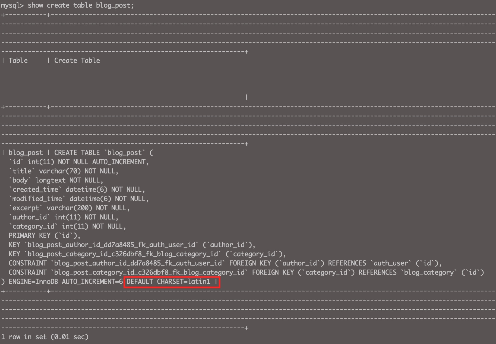
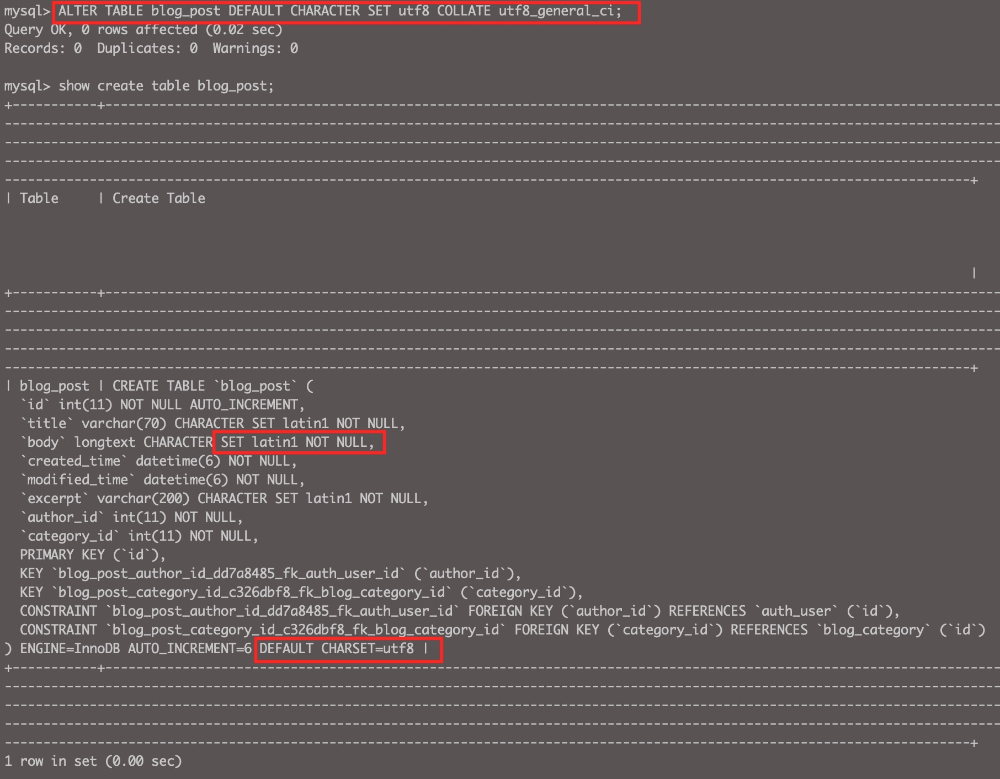
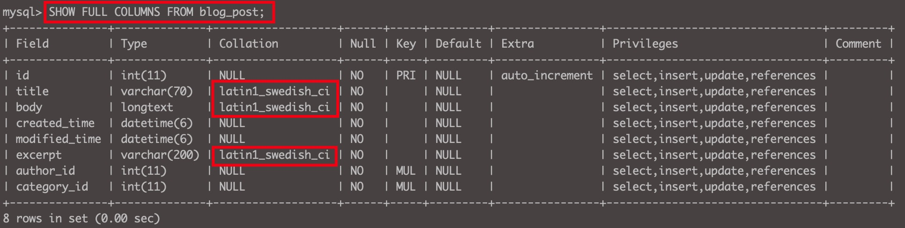
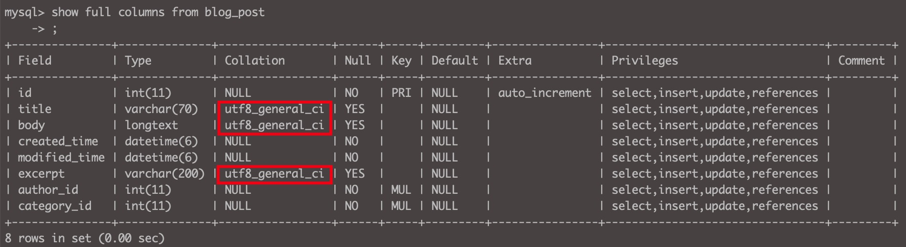

### 保存中文报错

在Django Adminn里编辑文章，保存中文时出现`Incorrect string value: '\xE7\xA8\x8B\xE5\xBA\x8F...' for column 'body' at row 1`报错。

以前使用MySQL遇到过保存中文报错情况，知道这是数据库编码集没设对的问题。

<!--more-->

使用`show create database django_bigbigben;`查看数据库的编码集，发现是`utf8`，说明数据库的编码集并没有问题。




使用`show create table blog_post;`查看数据表的编码集，发现是`latin1`。




### 修改Table字符编码

使用`alter table blog_post default character set utf8 collate utf8_general_ci;`将编码集修改为`utf8`。



以为就此大功告成，结果保存时仍然报错，仔细一看才发现`body`这个column的编码集还是`latin1`，遂修改数据库表字段的编码集。


### 修改Column字符编码

使用`show full columns from blog_post;`查看数据表`blog_post`里每一个字段的编码集，发现这3个字段的编码集是`latin1_swedish_ci`。




使用下面命令将数据表字段编码集更改为`utf8_general_ci`。

```
ALTER TABLE blog_post CHANGE title title varchar(70) CHARACTER SET utf8 COLLATE utf8_general_ci;
ALTER TABLE blog_post CHANGE body body longtext CHARACTER SET utf8 COLLATE utf8_general_ci;
ALTER TABLE blog_post CHANGE excerpt excerpt varchar(200) CHARACTER SET utf8 COLLATE utf8_general_ci;
```




现在保存中文内容成功。

（注意：由于上面alert语句后面没有加`not null`，语句被执行后这3个字段被更新为允许为Null。）

### 修改django_admin_log表字符编码

但是，文章标题中出现中文内容时又报错`Incorrect string value: '\xE6\xA2\xB5\xE8\x92\x82...'for column 'object_repr' at row 1 `，查了一下是Django数据库表`django_admin_log`里`object_repr`字段编码集的问题，按照上面方法修改后，中文标题就没问题了。


### 治本

以上只是临时解决问题，万一Table需要删除重建或Database需要删除重建，岂不是又得重新来操作一遍？治本的方法是修改MySQL的配置文件，在my.cnf里指定数据库默认使用的数据集以及编码集。

#### 查找my.cnf路径

macOS环境下MySQL安装在`/usr/local/mysql`路径下，使用brew安装的可能不是这个路径，使用`ps -ef|grep mysql`可以查出安装路径。

MySQL5.7版本后默认不使用配置文件，也可以运行服务。

#### 修改步骤

1. 停止MySQL服务，将`/usr/local/mysql/support-files/my-default.cnf`内容复制到`/etc/my.cnf`

2. 在里面加上如下配置信息

```shell
[client]
default-character-set = utf8mb4

[mysqld]
character-set-server = utf8mb4
collation-server = utf8mb4_general_ci
```

> 对my.cnf的一点解释说明：
>
> 1. my.cnf配置文件里[client]下面的参数配置与MySQL服务器配套对应的客户端软件，比如workbench，分析工具等；[mysqld]下面的参数配置MySQL服务器端的字符集，[mysql]下面的参数配置mysql cli使用的相关参数，本文未涉及。
>
> 2. my.cnf文件配置参数非常多，其它自行Google查阅资料，这里不做介绍。

3. 重启MySQL

4. 进入shell里面，使用status命令检查

   可以看到server端和client端字符集都被更改为了utf8mb4编码（utf8mb4是utf8的超集，使用utf8mb4可以将emoji表情之类的字符保存到数据库）。

5. 删除重建Database，重新生成迁移文件、执行迁移操作后，现在所有数据表都不会出现保存中文字符报错问题。

   备注：使用下面命令在MySQL shell中可以查看数据库、数据表、表字段、数据库变量的字符集

   show create database <dbname>;

   show create table <tablename>;

   show full columns from <tablename>;

   show variables like 'character%';