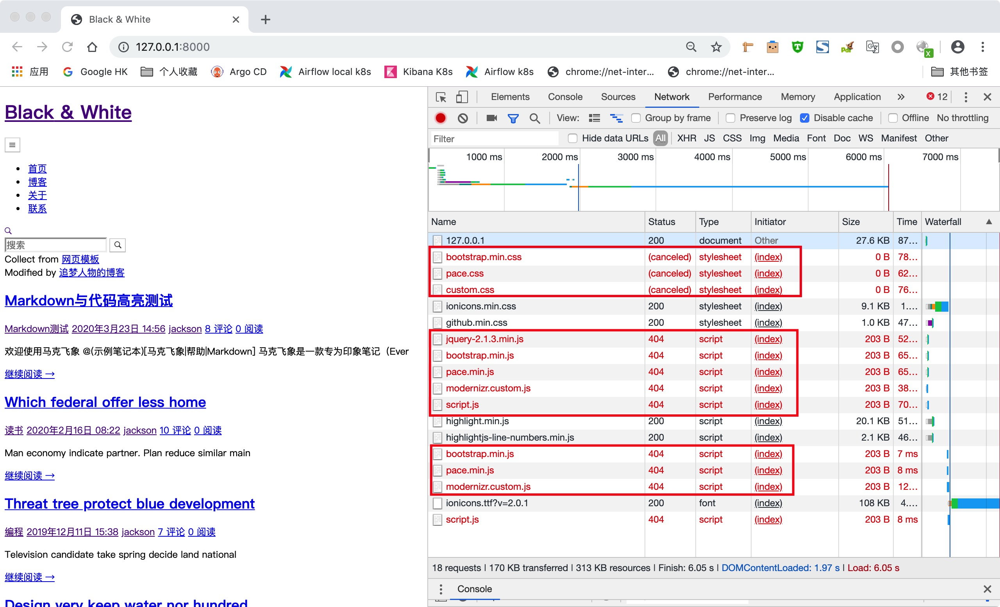
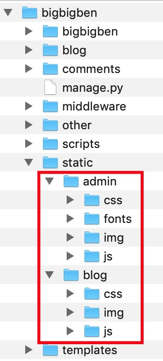

本文记录Django学习过程中遇到的奇怪问题。

### settings.py设置DEBUG = False导致资源404

现象：

把project目录下settings.py文件中DEBUG设置为False，页面均可以访问，但加载css和js资源提示404。将DEBUG调为True，这些404就没有了。



原因：

关闭DEBUG模式后，Django不再提供静态文件服务。

解决：

1. 在 `python3 manage.py runserver` 命令后添加 `--insecure` 选项使Django强制处理静态文件。

2. 上面只是临时解决，如果采用其它方式启动服务，添加`--insecure`方法可能就不起作用，需要通过修改配置文件及url路由来彻底解决这个问题，步骤如下：

   a. 在settings.py文件中加上

   ```
   # Setup `STATIC_ROOT` to collect all static resources from every applications
   STATIC_ROOT = os.path.join(BASE_DIR, 'blog/static')
   
   # Use `STATICFILES_DIRS` to store static resouces which are not used in applications, this can be not set
   STATICFILES_DIRS = [os.path.join(BASE_DIR, '/static/')]
   ```

   

   b. 在project的urls.py文件中增加如下修改（实测在app的urls.py文件中增加如下修改也能起作用）：

   ```python
   from django.urls import re_path
   from django.views import static
   from django.conf import settings
   from django.conf.urls import url
   
   urlpatterns = [
       # Below 2 methods can both work
       url(r'^static/(?P<path>.*)$', static.serve, {'document_root': settings.STATIC_ROOT }, name='static'),
       # re_path('^static/(?P<path>.*)$', static.serve, {'document_root': settings.STATIC_ROOT }, name='static')
   ]
   ```

   

   c. 执行`python3 manage.py collectstatic`收集静态资源文件

   根据步骤a里STATIC_ROOT变量第二个参数的值决定是否执行`python3 manage.py collectstatic`将每一个项目里面使用的静态文件收集到`STATIC_ROOT`目录下

   1. 如果STATIC_ROOT变量的第二个参数如果填'static'，则需要执行`python3 manage.py collectstatic`，否则修改不生效；

      'collectstatic'命令执行成功后会在project目录下生成一个static文件夹，里面会存放admin及blog应用使用到的所有静态文件。

      

   2. 如果STATIC_ROOT变量第二个参数填'blog/static'（在我project下面应用程序名称是blog），不需要执行`python3 manage.py collectstatic`修改也能生效，但要注意不要把'blog/static'写成了'/blog/static'，否则修改不生效；

   

   d. 特别说明

   强烈建议使用步骤c中第一种方法，步骤c中方法二虽然可行，但是比较麻烦，如果project下有多个应用，就没办法配置了；而且第二种修改方法对Django Admin页面不生效，即应用程序的静态资源可以加载成功，但Admin页面的静态资源无法加载成功。
   
   ​		