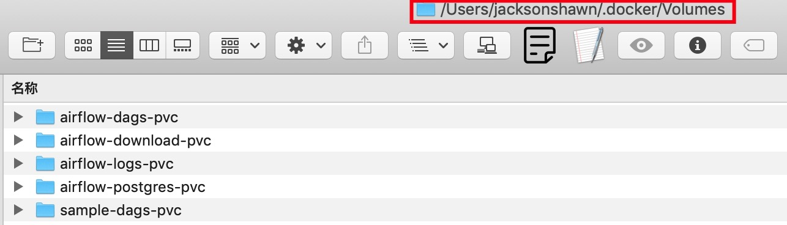

本篇记录工作项目中经常使用的Docker和K8S命令，我所运行Docker和K8S的工作环境如下所示，大部分本文使用的命令都可以在Linux K8S和Windows10 K8S环境使用，少数命令存在预期结果不一致的地方，请自行查阅资料解决。


注意，这并不是一篇介绍Docker和K8S是什么的文章，入门课程请自行查阅官方文档学习；如果安装Docker和K8S环境也请自行查阅资料解决。

<!--more-->

环境安装好之后，便可以直接在Terminal里输入`Docker`和`Kubectl`命令。

------

**测试Docker环境**

1、查看`Docker`版本

```shell
JacksonShawnMBP:~ jacksonshawn$ docker --version
Docker version 19.03.5, build 633a0ea
JacksonShawnMBP:~ jacksonshawn$ docker-compose --version
docker-compose version 1.24.1, build 4667896b
JacksonShawnMBP:~ jacksonshawn$ docker-machine --version
docker-machine version 0.16.2, build bd45ab13
```

2、启动一个nginx服务器，测试Docker环境

```shell
JacksonShawnMBP:~ jacksonshawn$ docker run -d -p 80:80 --name webserver nginx
d943b30fc65b3b1a4875caa3468c46bb86c9aa3ff70fce44a8576aa26fbf4e7e
JacksonShawnMBP:~ jacksonshawn$ docker ps
CONTAINER ID        IMAGE               COMMAND                  CREATED             STATUS              PORTS                NAMES
d943b30fc65b        nginx               "nginx -g 'daemon of…"   17 seconds ago      Up 15 seconds       0.0.0.0:80->80/tcp   webserver
```

`docker run`命令通过镜像创建一个容器，该命令功能强大，参数居多，这里只用到最基本的几个参数。

`docker ps`查看当前正在运行的镜像，Status显示内容"Up 15 seconds"表示该容器已经成功启动15秒钟。

浏览器打开http://localhost，可以看到nginx的欢迎页面，说明nginx服务器启动成功。

3、使用`docker stop container id `或`docker stop container name`停止这个容器(一般倾向于使用container id)

4、容器停止之后，使用`docker ps -a`就可以查到该容器的结束记录

```shell
JacksonShawnMBP:~ jacksonshawn$ docker ps -a
CONTAINER ID        IMAGE                                        COMMAND                  CREATED             STATUS                     PORTS                      NAMES
d943b30fc65b        nginx                                        "nginx -g 'daemon of…"   8 minutes ago       Exited (0) 5 seconds ago                              webserver
```

5、对已停止的容器可以使用`docker start container id`  重新启动这个已停止的容器

6、对正在运行的容器可以使用`docker restart container id`来重新启动该容器；当然`docker restart container id`也可以对已停止的容器使用

7、容器使用后会产生log日志，我发现不管在macOS还是Windows10，PVC对应的默认文件夹路径都在"your currnet username/.docker/Volumes"这个文件夹下面



使用`docker rm container id `可以将已停止运行的容器删除

8、删除已停止的容器后，可以使用`docker rmi image id`删除关联的镜像

9、至此，我们的Docker环境测试就结束了；不管你是*nix系统还是Windows系统，只要Docker环境安装成功了，上面的流程都应该能成功。

------

**Docker基础部分**

1、`docker login private hub url `和`docker logout private hub url` 

环境安装好之后，使用默认的Docker Hub作为镜像仓库；我们工作项目中使用了私有镜像仓库，因此需要先login。

```shell
JacksonShawnMBP:~ jacksonshawn$ docker login XXX.XXX.XXX.XXX
Username: vnb-dev
Password:
Login Succeeded
JacksonShawnMBP:~ jacksonshawn$ docker login XXX.XXX.XXX.XXX
Authenticating with existing credentials...
Login Succeeded
JacksonShawnMBP:~ jacksonshawn$
```

login成功就可以从这个私有仓库拉取镜像；不想使用私有仓库镜像，只需使用`docker logout XXX.XXX.XXX.XXX`退出，就会自动转为使用官方镜像。

2、`docker logs -f container id`或`docker logs -t container id`查看容器日志

3、容器启动成功后，可以使用`docker exec -it container id /bin/bash`或`docker attach container id`进入到容器里面

```shell
JacksonShawnMBP:~ jacksonshawn$ docker ps
CONTAINER ID        IMAGE               COMMAND                  CREATED             STATUS              PORTS               NAMES
1042cb49b1d8        ec5b6a3ab232        "airflow run worldch…"   21 minutes ago      Up 21 minutes                           k8s_base_worldcheckfiledownloaderamlgentemenosfcm-23f4d1df26f147edbcb8d4689cd9c12c_airflow_29d58db0-3a91-11ea-9053-025000000001_0
861173bbd573        ec5b6a3ab232        "/entrypoint.sh sche…"   40 minutes ago      Up 40 minutes                           k8s_scheduler_airflow-858d8c6fcf-lgpm4_airflow_835bfba9-3a8e-11ea-9053-025000000001_0
3da3748064ea        ec5b6a3ab232        "/entrypoint.sh webs…"   40 minutes ago      Up 40 minutes                           k8s_webserver_airflow-858d8c6fcf-lgpm4_airflow_835bfba9-3a8e-11ea-9053-025000000001_0
2f9ef21f9721        vault               "docker-entrypoint.s…"   3 hours ago         Up 3 hours                              k8s_vault_vault-775bfd6575-t28bp_airflow_cc1f7cf0-376f-11ea-bf4f-025000000001_2
e6c41740e6a7        53912975086f        "docker-entrypoint.s…"   3 hours ago         Up 3 hours                              k8s_postgres_postgres-airflow-55659bc6fc-xv76l_airflow_c822fe93-376f-11ea-bf4f-025000000001_2
```

如上所示，我们输入`docker exec -it 3da3748064ea bash`进到了k8s_webserver_airflow-xxxxxxxx容器里面，这个命令非常有用，它可以进到容器里查看环境变量、参数配置、程序代码等信息。

```shell
JacksonShawnMBP:~ jacksonshawn$ docker exec -it 3da3748064ea bash
airflow@airflow-858d8c6fcf-lgpm4:~$ ls
airflow-webserver.pid  airflow.cfg  config  dags  logs  unittests.cfg  webserver_config.py
airflow@airflow-858d8c6fcf-lgpm4:~$ pwd
/usr/local/airflow
```

4、使用`docker save image-id`可以将镜像保存为.tar或.zip文件进行备份

其它常用的Docker命令还有很多，比如`docker build`构建镜像和`docker cp`挂载文件卷等，今天这篇写不完，暂且先跳过，下面写最近常用的K8S命令。


**Kubectl基础使用**

Docker对应的是容器，K8S在容器的基础上抽象出来Pod的概念，容器包含在它里面。集群以Pod为基本单位进行管理。K8S服务启动后，首先可以查看当前启动了哪些Pod。

1、`kubectl get pods --all-namespaces`

```shell
JacksonShawnMBP:~ jacksonshawn$ kubectl get pods --all-namespaces
NAMESPACE     NAME                                     READY   STATUS      RESTARTS   AGE
airflow       airflow-858d8c6fcf-lgpm4                 2/2     Running     0          64m
airflow       airflow-job-d4fcj                        0/1     Completed   0          64m
airflow       postgres-airflow-55659bc6fc-xv76l        1/1     Running     2          4d
airflow       vault-775bfd6575-t28bp                   1/1     Running     2          4d
docker        compose-6c67d745f6-66cgp                 1/1     Running     2          4d
docker        compose-api-57ff65b8c7-prsvq             1/1     Running     3          4d
kube-system   coredns-6dcc67dcbc-h2852                 1/1     Running     5          4d
kube-system   coredns-6dcc67dcbc-hffkr                 1/1     Running     35         4d
kube-system   etcd-docker-desktop                      1/1     Running     2          4d
kube-system   kube-apiserver-docker-desktop            1/1     Running     77         4d
kube-system   kube-controller-manager-docker-desktop   1/1     Running     27         4d
kube-system   kube-proxy-rghht                         1/1     Running     2          4d
kube-system   kube-scheduler-docker-desktop            1/1     Running     25         4d
```

namespace为`docker`和`kube-system`的那些Pod都是K8S环境启动自带的服务，我们不用理会。重点关注namespace为`airflow`的这几个Pod。

使用`kubectl get pods -n airflow`查看namespace为`airflow`的Pod，可以看到airflow-858d8c6fcf-lgpm4这个Pod它里面包含了2个容器，状态都是Running，没有被重启过，Pod成功运行了67分钟。

```shell
JacksonShawnMBP:~ jacksonshawn$ kubectl get pods -n airflow
NAME                                READY   STATUS      RESTARTS   AGE
airflow-858d8c6fcf-lgpm4            2/2     Running     0          67m
airflow-job-d4fcj                   0/1     Completed   0          67m
postgres-airflow-55659bc6fc-xv76l   1/1     Running     2          4d
vault-775bfd6575-t28bp              1/1     Running     2          4d
```

2、使用`kubectl describe pod pod-name -n airflow`查看Pod运行状态，但通常这个命令我觉得看不到什么有效信息

```shell
JacksonShawnMBP:~ jacksonshawn$ kubectl logs airflow-858d8c6fcf-s58tm webserver -n airflow
[2020-01-19 09:44:44,346] {settings.py:252} INFO - settings.configure_orm(): Using pool settings. pool_size=5, max_overflow=10, pool_recycle=1800, pid=1
/usr/local/lib/python3.7/site-packages/psycopg2/__init__.py:144: UserWarning: The psycopg2 wheel package will be renamed from release 2.8; in order to keep installing from binary please use "pip install psycopg2-binary" instead. For details see: <http://initd.org/psycopg/docs/install.html#binary-install-from-pypi>.
  """)
  ____________       _____________
 ____    |__( )_________  __/__  /________      __
____  /| |_  /__  ___/_  /_ __  /_  __ \_ | /| / /
___  ___ |  / _  /   _  __/ _  / / /_/ /_ |/ |/ /
 _/_/  |_/_/  /_/    /_/    /_/  \____/____/|__/
[2020-01-19 09:44:47,550] {__init__.py:51} INFO - Using executor KubernetesExecutor
[2020-01-19 09:44:47,553] {dagbag.py:92} INFO - Filling up the DagBag from /dev/null
[2020-01-19 09:44:48,928] {security.py:453} INFO - Start syncing user roles.
[2020-01-19 09:44:50,479] {security.py:364} INFO - Fetching a set of all permission, view_menu from FAB meta-table
[2020-01-19 09:44:51,504] {security.py:307} INFO - Cleaning faulty perms
Running the Gunicorn Server with:
Workers: 4 sync
Host: 0.0.0.0:8080
Timeout: 120
Logfiles: - -
=================================================================
```

4、使用`kubectl get event -n airflow`查看K8S启动Pod过程中产生的各类事件，对排查Pod无法启动或启动报错等原因有帮助

5、假如程序版本有变动，需要发布新版本，可以使用`kubectl delete pod pod-name`一个一个将Pod删除，然后再重新启动。

逐个删除Pod比较费力，我们可以使用`kubectl delete deployment airflow -n airflow`将namespac为`airflow`里面Pod名字包含`airflow`的全部一次性删除

也可以直接使用`kubectl delete namespace airflow`将namespace为`airflow`的所有Pod都删除。

6、使用`kubectl apply`可以将服务部署到K8S集群里面，这个需要实际操练，本文不做讲解

基础的Docker和K8S命令先简单介绍到这里，经常动手操练，日积月累，才能够做到熟练应用。

------

<!--more-->

**常用Docker命令**

```
# 查看Docker版本
$ docker --version
$ docker-compose --version
$ docker-machine --version

# 测试Docker环境
运行nginx镜像实例，-d表示守护进程，-p表示将宿主机30882端口映射到容器的80端口
$ docker run -d -p 30882:80 --name webserver nginx

http://localhost:30882/

# 刪除nginx服务器
$ docker stop webserver
$ docker rm webserver

# 列出当前执行中的容器
$ docker container ls
$ docker ps

# 列出所有容器
$ docker container ls -a     
$ docker ps -a 

# 列出所有容器id集合
$ docker container ls -q
$ docker ps -q

# 停止容器
$ docker container stop <hash>
$ docker stop <hash>

# 强制退出删除容器
$ docker container kill <hash>
$ docker kill <hash>

# 删除容器
$ docker container rm <hash>
$ docker rm <hash>

# 删除所有容器（谨慎使用）
$ docker container rm $(docker container ls -q)
$ docker run -d -p 8080:80 --name webserver nginx 

# 查看指定容器的端口映射
$ docker port <container-id/container-name>

# 查看容器log日志
$ docker logs -f <container-id/container-name>

# 查看容器里运行的PID(比较少用)
$ docker top <container-id/container-name>

# 检查容器的底层信息（比较少用）
$ docker inspect <container-id/container-name> 

# 查询容器IP地址方法1:
$ docker inspect -f '{{range .NetworkSettings.Networks}}{{.IPAddress}}{{end}}' <container-id>或<container-name>
# 查询容器IP地址方法2：
$ docker inspect <container-id>或<container-name> | grep IPAddress

# 查看宿主机ip地址
在Linux服务器终端里使用下述命令，可以查到ip地址是172.17.0.1
$ ip addr show docker0
macOS终端没有docker0虚拟网卡，宿主机IP默认是192.168.65.1，可在docker-for-desktop里设置。

# 进入容器的两种方法，可以指定使用root用户进入容器
$ docker exec -it <container-id> /bin/bash

# 以root用户进入容器执行操作
$ docker exec -it --user root <container-id> /bin/bash

# 使用docker attach
$ docker attach <container-id>
$ docker attach --sig-proxy=false <container-id>

# docker attach与docker exec的区别
docker attach可以将容器与当前终端共用一个屏幕；使用Ctrl+C可以从容器退出，也就是detach，但实际情况是将容器也停止了；加上--sig-proxy=false参数关联容器后，使用Ctrl+C从容器退出则不会将容器自动停止；
docker exec是进到容器里面执行命令或查看文件，它和docker attach区别其实挺大

# 通过容器制作镜像 
-m参数表示制作image时写的描述信息，container-id/container-name指要制作inage的容器id或容器名称，最后的“ubuntu-python3-airflow:v0.2”表示待制作镜像的image name和其版本号
$ docker commit -m 'create airflow image' <container-id/container-name> ubuntu-python3-airflow:v0.2

# 容器端口映射
docker run命令-it参数后面指定Repository和Tag参数或指定Image ID即可使用这个镜像创建容器并启动容器，-i参数表示可以交互，-t参数表示该容器支持终端登录，-p 8080:8080表示将宿主机的8080端口映射到容器的8080端口
$ docker run -it -p 8080:8080 python3-ubuntu-stockdata:v0.1 /bin/bash
$ docker run -it -p 8080:8080 centos-py3.6-af:0.0.1 /bin/bash

# 容器端口映射
如果使用-P参数，则将容器暴露的所有端口随机映射到宿主机上
$ docker run -P -d nginx:latest

下面表示将容器的80端口随机映射到宿主机的一个高段端口上（高于1024的随机端口号）
$ docker run -P 80 -d nginx:latest

# 挂载文件卷
$ docker run -it -v /Users/jacksonshawn/Downloads/testdocker:/var alpine sh
如上所示，将宿主机`/Users/jacksonshawn/Downloads/testdocker`文件夹挂载到alpine镜像生成的容器的`/var`路径，然后在容器中执行sh命令；

挂载到容器里面的文件如果被修改或删除，对应宿主机上的文件也会被同步修改或删除，一定谨慎使用删除功能

# 宿主机拷贝文件到容器
$ docker cp /Users/jacksonshawn/Downloads/testdocker/a.txt <container id>:/var
从宿主机拷贝到容器里的文件，在容器里被修改或删除后，宿主机里的文件不会被同步修改或删除

$ docker cp /Users/jacksonshawn/airflow/config/airflow.cfg <container-id>:/usr/local/airflow/airflow.cfg 

# 容器拷贝文件到宿主机
$ docker cp <container id>:/var/b.txt /Users/jacksonshawn/Downloads/testdocker
$ docker cp <container-id>:/usr/local/airflow/airflow.cfg /Users/jacksonshawn/airflow/config

# 使用Dockerfile生成镜像，Dockerfile编写比较复杂，不在这里过多展开
$ docker image build -t centos-py3.6-af:0.0.1 .
$ docker image build --no-cache -t centos-py3.6-af:0.0.1 . -f Dockerfile.centos
$ docker image build --no-cache -t centos-py3.6-af:0.0.1 .
$ docker image build -t centos-py3.6-af:0.0.1 .

# 列出所有容器ID然后删除
$ docker ps -aq
$ docker stop $(docker ps -aq)

# 刪除所有容器
$ docker rm $(docker ps -aq)
$ docker container prune -f(谨慎使用)

# 停止所有已经运行完的容器
$ docker stop $(docker ps -a | grep "Exited" | awk '{print $1 }')

# 删除所有已经运行完的容器
$ docker rm $(docker ps -a | grep "Exited" | awk '{print $1 }')

# 删除所有REPOSITORY为None的镜像
$ docker rmi $(docker images | grep "none" | awk '{print $3}')

# 刪除所有镜像（不要使用）
$ docker rmi $(docker images -q)

# 刪除所有不使用的鏡像
$ docker image prune(谨慎使用)

# 删除所有指定名称镜像
$ docker image rm $(docker image ls -q redis)

# 删除所有镜像(不要使用)
$ docker image prune --force --all

# Docker运行mssql(详细查看Docker mssql官方文档)
$ docker run -e 'ACCEPT_EULA=Y' -e 'SA_PASSWORD=zaq1@WSX' -p 1433:1433 --name mssql -d mcr.microsoft.com/mssql/server:2017-latest

$ docker run --memory=512M -e 'ACCEPT_EULA=Y' -e 'SA_PASSWORD=zaq1@WSX' -p 1433:1433 --cap-add SYS_PTRACE --name mssql -d mcr.microsoft.com/mssql/server:2017-latest

$ docker run -m=2G -e 'ACCEPT_EULA=Y' -e 'SA_PASSWORD=zaq1@WSX' -p 1433:1433 --cap-add SYS_PTRACE --name mssql -d mcr.microsoft.com/mssql/server:2017-latest

$ docker exec -it <container-id> /opt/mssql-tools/bin/sqlcmd -S localhost -U sa -P your-password

# 登录私有仓库
$ docker login XXX.XXX.XXX.XXX
$ docker logout XXX.XXX.XXX.XXX

# 将image镜像备份为文件
docker save <image-id> > /XXX/Download/airflow.20200223.tar

# 从备份文件中导入image镜像
$ docker load -q -i /XXX/Download/airflow.20200223.tar
由于导入进来的image镜像REPOSITORY和TAG都为none，需要使用docker tag来标记它的名字和标签

# 标记镜像的tag名称
$ docker tag <image-id> <image-name>:<image-tag>

# 将正在运行的容器打成镜像
$ docker commit <container-id> <image-name>:<image-tag>

# 删除镜像标签
# 对于一个镜像有多个标签的情况，以下可以删除指定的标签；如果该镜像只有一个标签，下面命令就是删除镜像
$ docker rmi <image-name>:<image-tag>

# 查看容器端口映射
$ docker port <container-id>
如下所示，说明容器里的9000和8000端口分别被映射到了宿主机的9000和8000端口
9000/tcp -> 0.0.0.0:9000
8000/tcp -> 0.0.0.0:8000

# 显示容器使用的系统资源
$ docker stats
stats命令每隔1秒会刷新输出内容，在命令后面加上"--no-stream"则只输出当前状态；
如果需要显示指定容器使用的系统资源，则在后面加上容器id或容器名即可，使用Ctrl+C命令退出；
这个命令有个额外的作用是可以防止SSH断开

$ docker stats <container-id>或<container-name>
```

<!--more-->

**常用K8S命令**

```
# 显示pod信息
$ kubectl describe pod airflow-858d8c6fcf-9q4bw --namespace=airflow >> pod.txt
$ kubectl describe pod airflow-job-z7f8f -n airflow >> pod.txt
 
# 显示pvc信息
$ kubectl describe pvc sample-dags-pvc -n airflow

# 打印pod日志信息
$ kubectl logs <pod-name> -n airflow

# 对于一个pod里有多个container的情况
$ kubectl logs <pod-name> webserver -n airflow
$ kubectl logs <pod-name> scheduler -n airflow

# 查看k8s事件
$ kubectl get event -n airflow

# 查看集群健康状态
$ kubectl get cs

# 查看所有namespace
$ Kubectl get ns

# 查看所有service
$ kubectl get service -o wide
$ kubectl get services --all-namespaces
$ kubectl get svc --all-namespaces
$ kubectl describe svc kubernetes

# 查看pods 
$ kubectl get pods -n airflow
$ kubectl get pods --all-namespaces

# 指定yaml文件部署pods
$ kubectl apply -f k8s/airflow
$ kubectl apply -f k8s/vault
$ kubectl apply -f k8s/deploy

# 查看pvc
$ kubectl get pvc --all-namespaces
$ kubectl delete pvc <pvc-name> -n airflow

# 查看pv
$ kubectl get pv --all-namespaces

# 查看job
$ kubectl get jobs --all-namespaces

# 删除job
$ kubectl delete job airflow-job -n airflow

# 查看configmap
$ kubectl get configmap --all-namespaces
$ kubectl get configmap <configmap-name> -o yaml -n airflow
$ kubectl get configmap airflow-configmap -o yaml -n airflow
$ kubectl get configmap airflow-env -o yaml -n airflow

# 查看Secret
$ kubectl get Secret --all-namespaces

# 删除pod
$ kubectl delete pod <pod-name> -n airflow
$ kubectl delete po <pod-name> -n airflow --force --grace-period=0

# 查看并删除deployment
$ kubectl get deployment -n airflow
$ kubectl delete deployment <deployment-name> -n airflow
$ kubectl delete deployment postgres-airflow -n airflow
$ kubectl delete deployment airflow -n airflow

# 查看并删除namespace
$ kubectl get namespaces
$ kubectl delete namespace airflow

# 根据配置文件创建pod
$ kubectl create -f k8s/airflow/download.local.yaml
$ kubectl create -f k8s/airflow/sampledags.local.yaml

# 查看pod环境变量
$ kubectl exec <pod-name> env -n airflow

# 查看cluster信息
$ kubectl cluster-info

# 查看k8s配置文件信息
$ kubectl config view

# 配置k8s dashboard
step1: 安装k8s dashboard镜像
$ kubectl apply -f https://raw.githubusercontent.com/kubernetes/dashboard/v1.10.1/src/deploy/recommended/kubernetes-dashboard.yaml

step2: 启动k8s dashboard服务
$ kubectl proxy

step3: 获取k8s dashboard访问token
$ kubectl -n kube-system describe secret default| awk '$1=="token:"{print $2}'

step 4: 访问k8s dashboard页面
http://localhost:8001/api/v1/namespaces/kube-system/services/https:kubernetes-dashboard:/proxy/#!/login

# 删除k8s dashboard
$ kubectl delete -f https://raw.githubusercontent.com/kubernetes/dashboard/v1.10.1/src/deploy/recommended/kubernetes-dashboard.yaml

# 没有yaml文件时强制重启pod
kubectl get pod <podname> -n <namespace> -o yaml | kubectl replace --force -f -

```


**参考资料**

- [Kubernetes中文社区 | 中文文档](http://docs.kubernetes.org.cn)
- [Kubernetes架构](https://jimmysong.io/kubernetes-handbook/concepts/)
- [Docker-从入门到实践](https://yeasy.gitbooks.io/docker_practice/)