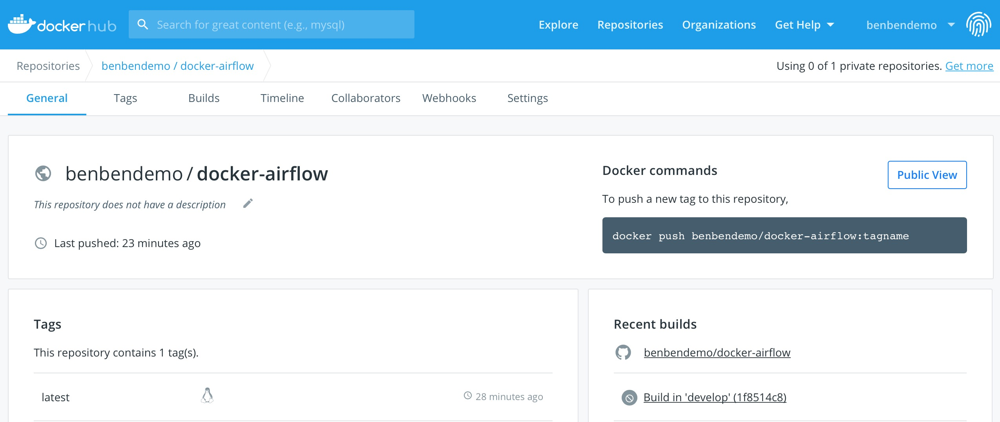
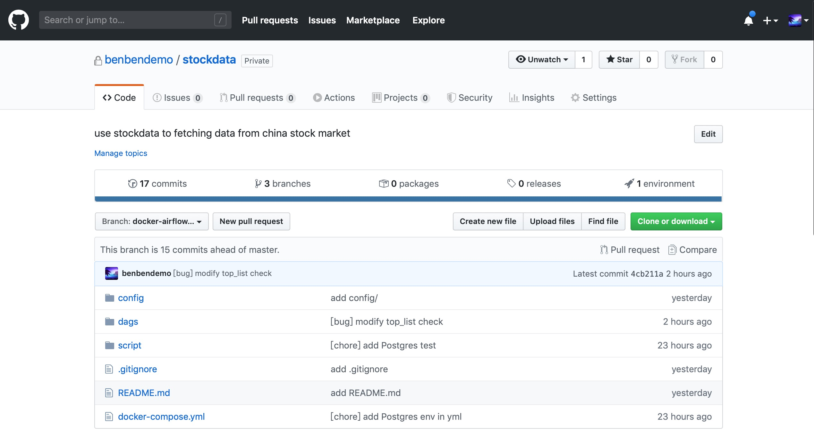
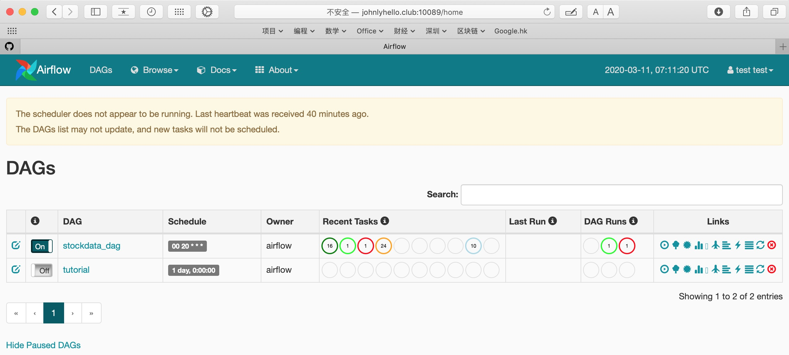

之前一直在本机使用Kubernetes部署Airflow项目，K8S很好，但对于小项目来说，不需要"杀鸡用牛刀"，一般使用Docker-compose就行，这几天将一个Airflow项目改造适配后，使用Docker-compose部署到了腾讯云服务器。


Fork了一份[puckel/docker-airflow](https://github.com/puckel/docker-airflow)的Airflow Dockerfile镜像文件，做了很多调整和修改，比如将Debian apt源换成清华的apt源，将PyPI官方PIP源换成豆瓣的PIP源等等，修改完后的Dockerfile放在[benbendemo/docker-airflow](https://github.com/benbendemo/docker-airflow/tree/develop)仓库的`develop`分支下面。


主要修改内容如下，详细介绍请见`develop`分支README.md文件。

```
1. Add airflow-common-library-master utility
2. Update the default settings in airflow.cfg
3. Use Tsinghua Debian mirror to replace default Debian apt-get source, see apt-source.list
4. Add an email-templates for airflow to automatically send alert email and success email
5. Use Douban PIP mirror to replace default PIP source, see pip.conf
6. As for Dockerfile, i have added some more Debian apt packages and Python pip packages
7. In script/airflow_create_user.py, there are two ways to create airflow login user when RBAC enabled.Oh forget to inform that it's defaulted to enable RBAC in airflow.cfg
```

<!--more-->

本地Build镜像测试成功后，我将其提交到Docker Hub仓库[benbendemo/docker-airflow](https://hub.docker.com/repository/docker/benbendemo/docker-airflow)，并且设置了Automatical Build，以后只要提交git push修改`develop`分支的Dockerfile文件，Hub仓库就会自动Build一次版本。这样，每次使用`docker pull bebendemo/docker-airflow:latest`就可以拿到最新的版本。




Airflow镜像搞定之后，需要安装dag文件，从我的私有仓库里拉取stockdata_dag文件，使用`docker-compose up -d`部署docker-compose.yml文件里定义的服务。




重点介绍一下`docker-compose.yml`文件里的内容，是从puckel提供的docker-compose-LocalExecutor.yml基础上修改得来。

```yaml
version: '3.0'
services:
    postgres:
        image: postgres:11.4
        environment:
            - POSTGRES_USER=airflow
            - POSTGRES_PASSWORD=airflow
            - POSTGRES_DB=airflow
        logging:
            options:
                max-size: 10m
                max-file: "3"
        labels:
            - "stockdata.postgres"
            - "stockdata"

    webserver:
        image: benbendemo/docker-airflow:latest
        restart: always
        depends_on:
            - postgres
        environment:
            - POSTGRES_USER=airflow
            - POSTGRES_PASSWORD=airflow
            - POSTGRES_DB=airflow
            - LOAD_EX=n
            - EXECUTOR=Local
            - SCHEDULE_INTERVAL=00 20 * * *
            - STOCKDATA_AIRFLOW_EMAIL_LIST=xxxx@163.com
            - K_DATA_CODE=600810
        logging:
            options:
                max-size: 10m
                max-file: "3"
        volumes:
            - ./dags:/usr/local/airflow/dags
            # - ./plugins:/usr/local/airflow/plugins
            - ./config/pip.conf:/etc/pip.conf
            - ./script/airflow_create_user.py:/usr/local/airflow/airflow_create_user.py
            - ./dags/stockdata_master/stockdata/requirements.txt:/requirements.txt
        ports:
            - "30810:8080"
        command: >
            webserver
        # user: root
        healthcheck:
            test: ["CMD-SHELL", "[ -f /usr/local/airflow/airflow-webserver.pid ]"]
            interval: 30s
            timeout: 30s
            retries: 3
        labels:
            - "stockdata.webserver"
            - "stockdata"
```

定义了postgres和webserver两个服务，webserver依赖postgres启动后才可以运行；其它内容我不细说，如果你的`docker-compose`版本与yml文件里不一致，直接修改version参数的版本即可；如果部署后发现Airflow task运行时无法写文件，添加`user: root`参数即可，puckle在Dockerfile里定义好了容器启动后默认使用`airflow`用户。


进入容器创建Airflow用户`test`，登录http://johnlyhello.club:10089，即可访问该Airflow服务，由于进行了权限控制，`test`用户只能浏览页面，没有任何页面操作权限。




软件开发是一个细腻的手艺活，这番部署之后，离一个真正面向客户发布的产品还有重要的几步要走，先记录为Todo事项，以后再来完善它。


> Todo事项：
>
> 1.站点开启SSL服务
>
> 2.将webserver和scheduler分拆成两个容器部署
>
> 3.Flask app+Bootstrap前端页面


**参考资料**

- [Overview of Docker Compose](https://docs.docker.com/compose/)
- [Docker Compose 配置文件详解](https://www.jianshu.com/p/2217cfed29d7)