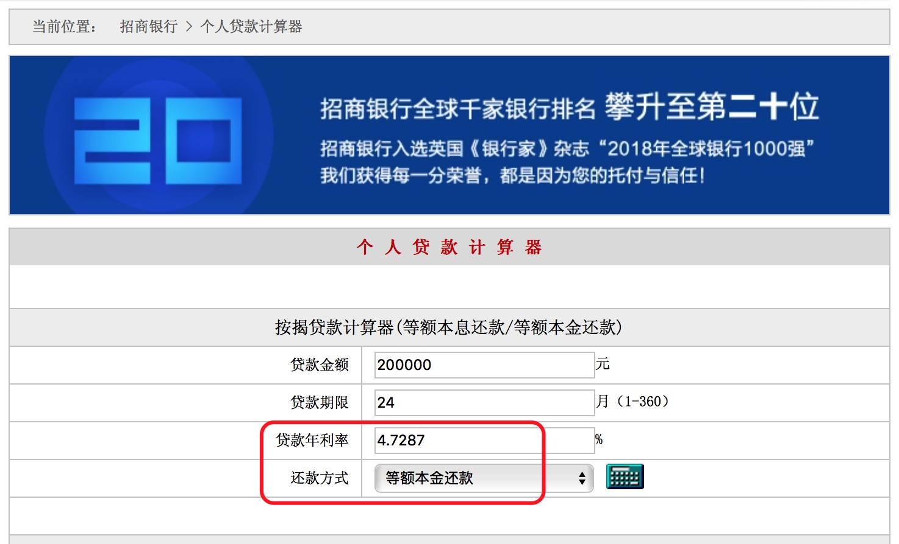
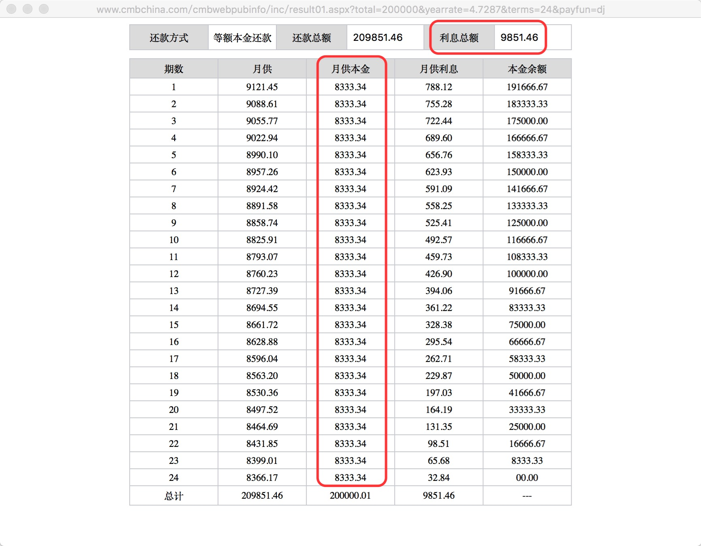
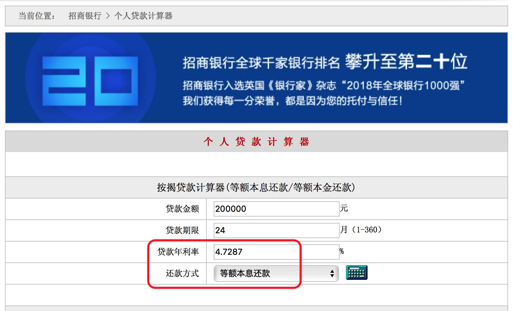
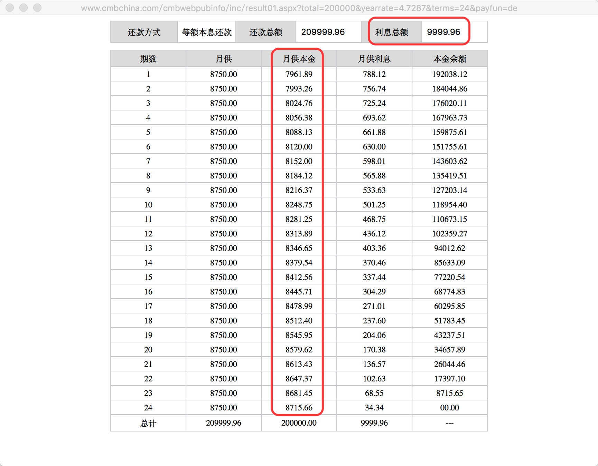
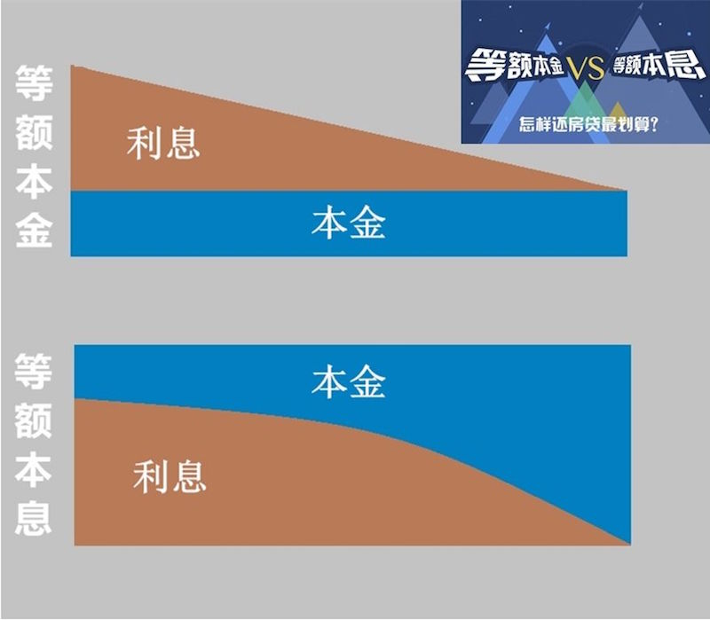

(Photo by [rawpixel](https://unsplash.com/photos/5IiH_UVYdp0?utm_source=unsplash&utm_medium=referral&utm_content=creditCopyText) on [Unsplash](https://unsplash.com/search/photos/loan?utm_source=unsplash&utm_medium=referral&utm_content=creditCopyText))

上周写的[我所知道的贷款业务](/2018/09/30/personal-loans/)一文，对所有贷款业务做了一个提纲式的介绍。今天详细解析Installment Loan里面**等额本金**和**等额本息**两种还款方式的区别。

直接引用上次文章中的内容：

> 银行会根据贷款金额、贷款利率、借款期限、还款频率、还款方式，计算出每一期账单的分期还款额。
>
> > 等额本息：客户每一期偿还的本金加利息是一个固定值，客户刚开始偿还的本金少，利息多；后面每一期本金不断增加，利息不断减少。每一期利息金额使用上一期贷款剩余本金乘以贷款利率计算得出。
> >
> > 等额本金：客户每一期偿还的本金是一个固定值，每一期利息刚开始多，后面每一期不断减少。每一期利息减少的金额是一个固定值，成等差数列形式。每一期利息金额采用78法则摊分计算得出。
>
> 具体看这里：[等额本息和等额本金](https://weibo.com/ttarticle/p/show?id=2309404244705431938357)
>
> 等额本息使用<u>***复利计息***</u>，使用的是Discrete Compound，每一期的利息是使用上一期贷款剩余本金乘以贷款利率计算得出。
>
> 等额本金使用<u>***单利计息***</u>，每一期的利息，使用78法则对利息总金额摊分计算得出。

<!--more-->

### 等额本金

贷款金额20W，年利率4.7287%，贷款期限24个月，还款方式使用等额本金，每一期的还款计划计算如下。

等额本金贷款总利息计算方式：

<u>***贷款总利息=(还款月数+1)×贷款额×月利率/2***</u>

利息总额=(24+1)\*20W\*(4.7287%/12)/2=9851.4583

等额本金月供款额计算方式：

<u>***月供款额=(贷款本金/还款月数)+(贷款本金-已归还本金累计额)×月利率***</u>

等额本金还款方式的月供款额分为月供本金和月供利息两部分进行计算。

1. 每期的月供本金好算，等于贷款金额除以贷款期数。

   这里的月供本金就是20W/24=8333.34(这里是约等于，原值是一个除不断的分数；招商银行这里默认向上取大进行计算，并不是四舍五入)

2. 每期月供利息可以用下面两种方式分别进行计算。

   a.每期月供利息使用本金余额（也就是你欠银行未还的钱）乘以月利率（0.3941%）进行计算

> 第1期月供利息：20W*0.3941%=788.12
>
> 第2期月供利息：19.166667W*0.3941%=755.28
>
> 第3期月供利息：18.333333W*0.3941%=722.44
>
> ......
>
> 第24期月供利息：8333.33*0.3941%＝32.84
>

​	b.在算出贷款总利息后，使用**78法则**对每期月供利息进行摊分

78法则：将所有期数相加作为分母，每一期的期数作为分子。第一期分子使用最大的期数，最后一期分子使用最小的期数，中间依次递减。比如：一共还款24期，第一期摊分贷款总利息的24/300；第二期摊分23/300；......；最后一期摊分1/300。	

> 第1期月供利息：9851.46*$\frac{24}{300}$=788.12
>
> 第2期月供利息：9851.46*$\frac{23}{300}$=755.2786
>
> 第3期月供利息：9851.46*$\frac{22}{300}$=722.44
>
> ......
>
> 第24期月供利息：9851.46*$\frac{1}{300}$=32.8382
>

### 等额本息

贷款金额20W，年利率4.75%，贷款期限24个月，还款方式使用等额本息，每一期的还款计划计算如下。

等额本息月供款额计算方式：

<u>***月供款额=[贷款本金[贷款本金$\times$月利率$\times$(1+月利率)$^{还款月数}$]/[(1+月利率)$^{还款月数}$-1]***</u>

每月还款额=[20W\*(4.7287%/12)\*(1+(4.7287%/12))$^{24}$]$$\div$$[(1+(4.7287%/12))$^{24}$-1]=8750.04

贷款总利息=8750*24-20W=10,000

每一期月供利息使用本金余额（也就是你欠银行未还的钱）乘以月利率（0.3941%）进行计算。

> 第1期月供利息：20W*0.39405833%=788.12
>
> 第2期月供利息：19.203812W*0.39405833%=756.74
>
> 第3期月供利息：18.404486W*0.39405833%=725.24
>
> ......
>
> 第24期月供利息：8715.65*0.39405833%＝34.34

<u>***要注意的是等额本息每期月供利息不能使用78法则进行摊分计算！***</u>

### 等额本金与等额本息比较

网上找到这样一张图，很形象地阐释了等额本金和等额本息两种还款方式的异同点。

等额本金：

1.每期供款额不是一个固定值，呈逐渐减少趋势

2.每期月供本金自始至终都相同；每期月供利息刚开始多，后面逐渐减少

3.在相同贷款金额、年利率、贷款期限条件下，刚开始几期，每期供款额比等额本息的每期供款额要高

等额本息：

1.每期供款额是一个固定值

2.每期月供本金刚开始少，后面逐渐增多；每期月供利息刚开始多，后面逐渐减少

3.在相同贷款金额、年利率、贷款期限条件下，等额本息贷款总利息比等额本金的贷款总利息要高

### 参考资料

- [等额本息和等额本金](https://weibo.com/ttarticle/p/show?id=2309404244705431938357)

- [招商个人贷款计算器](http://www.cmbchina.com/CmbWebPubInfo/Cal_Loan_Per.aspx)

