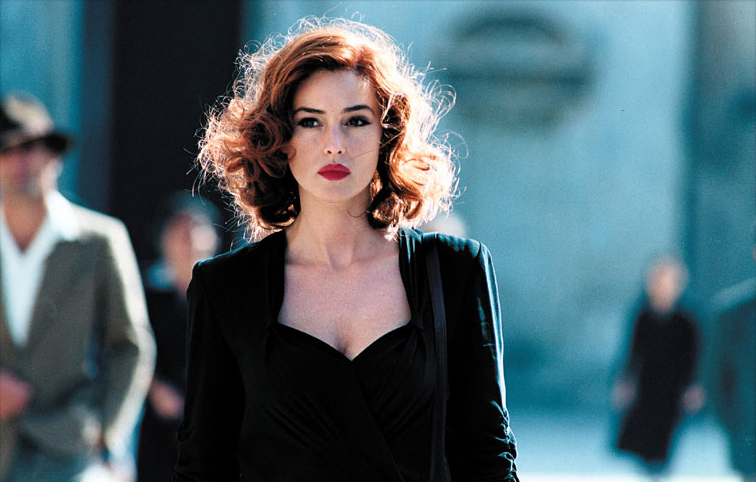
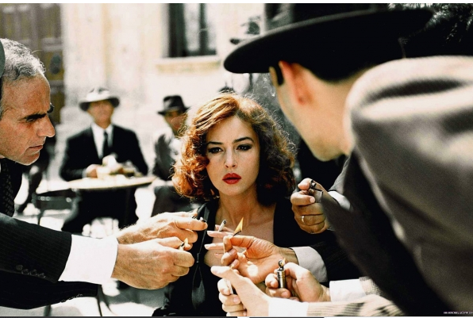
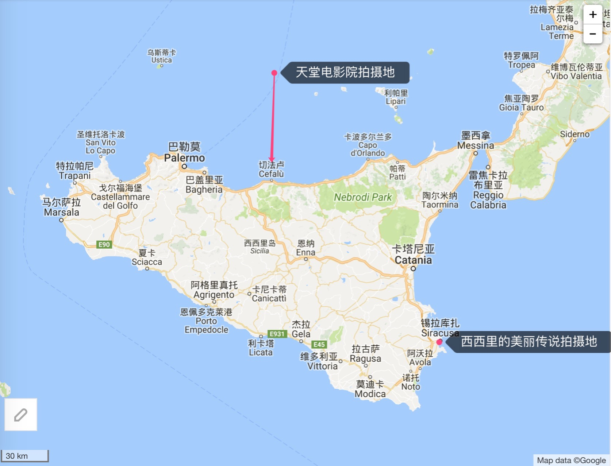
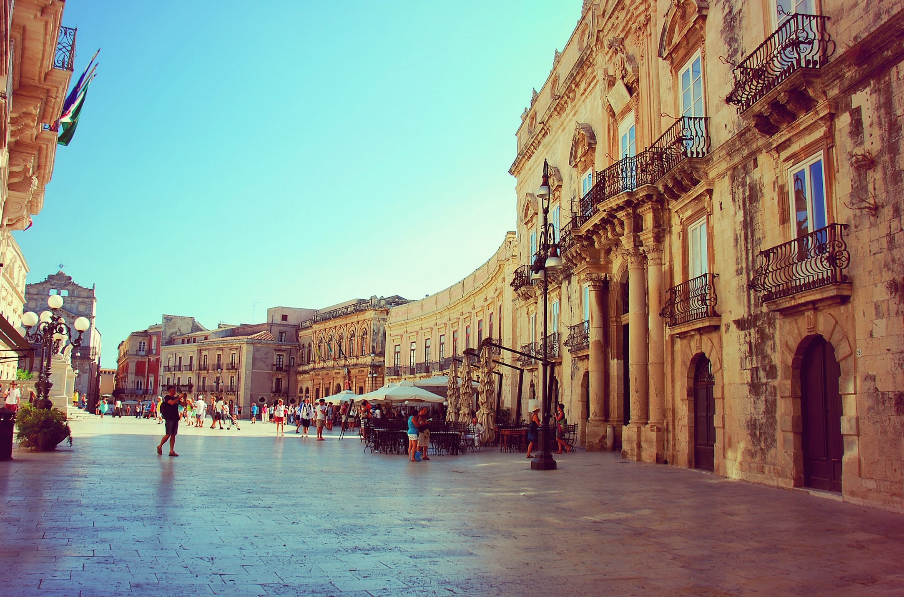

(女主角Malena，性感尤物，意大利演员Monica Bellucci饰)

《*Passeggiata in Paese*》

<iframe frameborder="no" border="0" marginwidth="0" marginheight="0" width=330 height=86 src="//music.163.com/outchain/player?type=2&id=5026665&auto=0&height=66"></iframe>

在我苍白和伤感的青葱岁月里，曾经一度自我标榜“文艺青年”，随着年岁日增，成家立业之后，“文艺”这个标签和我渐行渐远，“柴米油盐酱醋茶”的日常琐碎几乎充斥生活的全部，每天工作着、辛苦着、努力着，这两年连电影都看得少了很多。

#### 一些经典的西方文艺片

我的学生时代，有一阵子疯狂迷恋西方文艺片，看了很多这类型的电影，对其中的一些经典之作比如《美丽人生》、《天堂电影院》、《诺丁山》、《海上钢琴师》、《教父》、《西雅图未眠夜》、《天使爱美丽》等等印象深刻，对片中的一些经典桥段，如数家珍。

前天逛豆瓣电影，搜索“情色”片，发现《[西西里的美丽传说](https://movie.douban.com/subject/1292402/)》这部片子评价很高，我没看过就好奇地下载下来，周末把它刷完了。看完后感觉很舒服，就有了这篇影评。

<!--more-->

#### 电影经典桥段

下面是剧透，我比较喜欢的几个桥段。

> 1、女主Malena一个人在小镇上独步的镜头，配合背景音乐以及小镇居民的回头率以及他们背后的谈论，反衬出女主的美艳，前期冷漠端庄，转变妓女角色后的狂放，叼起香烟一堆人围上来点火那段，霸气十足。
>
> 2、女神人设在男主Renato心目中崩塌后，男主伤心欲绝（也可能是性需求无法得到满足，打飞机纵欲过多），母亲带他用传统巫术进行治疗，他老爸大吼，“儿子根本没病，他鸡鸡那么大，他需要的是性交”，然后果断带儿子去妓院开荤。
>
> 3、德国飞机成群结对地飞过小镇广场，在地面投出一道道影子，防空警报长鸣，人群四处逃窜。战争气氛烘托出一丝伤感，点缀得特别好，《美丽人生》里面有一幕和这个有异曲同工之妙，年幼、不谙世事的儿子躲在木箱里看着即将被拉去枪毙的父亲，父亲故意做出搞怪的摆手踏步走动作，逗他开心，那画面回忆一下就觉得伤感。
>
> 4、西西里岛上居民烟囱里冒出来的炊烟，浓浓的乡土气息，让我想起小时候奶奶家的烟囱，那里是不是也用柴火灶？
>
> 5、男主对女神的性幻想，描写得非常多，经常幻想自己英雄救美、幻想和女神鱼水之欢，很符合一个青春期男孩的心理特征，天天想着女神的大屁股和饱满的乳房在家里打飞机，情节夸张，但非常形象。
>
> 6、一群男孩坐在海边的岩石上丈量自己小鸡鸡的长度，哈哈，男生小时候谁没干过这事儿？

（一堆男人围上来给Malena点香烟）

#### 西西里岛地图

看完后，搜豆瓣影评，才知道这片子的导演就是拍《[天堂电影院](https://movie.douban.com/subject/1291828/)》和《[海上钢琴师](https://movie.douban.com/subject/1292001/)》的导演，**Giuseppe Tornatore(朱塞佩·托纳多雷)**，他是西西里岛土生土长的人，那个地方的人有很浓厚的乡土情结，全球化之前，西西里岛其实和中国的乡村差不多，大批的年轻人出去闯荡，最有名的就是柯里昂，只身闯荡纽约，出人头地后衣锦还乡，黑手党文化就发源于西西里。

看完后，我搜了一下西西里的地图，电影拍摄地是著名的旅游胜地**Siracusa(锡拉库扎)**，一个漂亮的海滨城市，西西里岛东部偏地中海希肭文化，西部偏阿拉伯文化，东部最有名的三个城市之一，另外两个是**Catania(卡塔尼亚)**和**Taormina(陶尔米纳)**，值得一提的是，**切法卢(Cefalu)**是《天堂电影院》的拍摄地，在西西里岛北部沿海，突然有种很想去一趟的冲动。

**Siracusa（锡拉库萨）**小镇街景，影片中Malena行走的大街。

#### 能够代表中国的电影有哪些？

如果说《天堂电影院》、《海上钢琴师》、《西西里的传说》能代表意大利电影，那么有哪些中国电影走出了国门被西方民众广泛认可呢？我搜了一下答案，基本上回答是《英雄》、《卧虎藏龙》、《花样年华》这类，多半是功夫和旗袍，这类典型的中国元素，在西方电影人心目中能够占据一席之地。