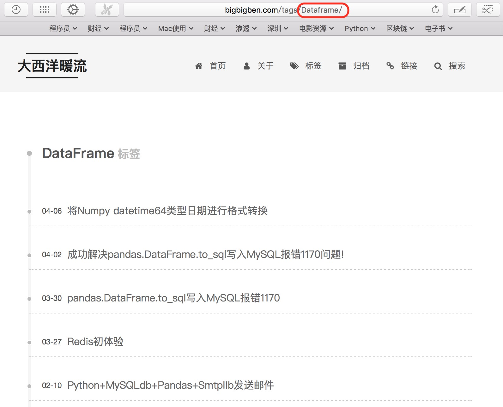

最近遇到一个问题，在我的博客上点击“DataFrame”标签，程序跳转到“腾讯公益失踪儿童”页面，而不是预期的文章列表页面。

起初以为这是一个个例，但一番检查之后，发现一共有8个标签（下图红色方框标出）存在这个问题。

<!--more-->

我知道原因是，修改文章时更改标签所致。最近意识到“**很多软件从业者连编程术语中的专业英文名词都写不对**”这件事的严重性之后，我将所有文章中使用的错误标签都做了调整，比如将“Github”修改为“GitHub”、将“SQLALchemy”修改为“SQLAlchemy”、将“Mysql”修改为“MySQL”。它们前者都是错误写法，后者才是官方发布的正确写法。

使用之前错误的标签，比如在tags后面直接输入“Dataframe”，能够返回预期结果。

定位问题根源，盖因GitHub Repository里面文件夹名称不对，导致无法返回正确结果，这出问题的8个标签，都是同一个情况。

一番搜索，发现可以使用`git mv oldfolder newfolder`操作来修改文件夹名称。由于Mac默认是大小写不敏感（大小写敏感意思是大写字母和小写字母代表不同内容），我们需要使用临时文件名来做转换，得使用`git mv foldername tmp && git mv tmp folderName`这种类型操作来修改文件夹名称。

如下图所示，依次对有问题的8个标签进行“git mv”处理。

然后，使用“git add”命令，对修改名称之后的文件夹一一更新索引；再然后，使用“git commit”进行提交。

最后，使用“git push -u origin master”推送到远程仓库。

这样，就解决了GitHub Repository里面文件夹名称不对的问题。

------

**2018/04/13补充：**

按照上面这样做之后，确实解决了“标签找不到”问题。但第二天使用“Hexo Deploy”后，“标签找不到”问题再次重现。一番排查后，发现根源在于“git默认忽略文件名大小写，文件夹名称大小写变更，git是检测不到的”。参照[**Hexo 部署到 Github Pages 文件夹大小写问题**](http://1mhz.me/2015/hexo-deploy-case-sensitive/)将博客项目下面“.deploy_git/.git/config”这个配置文件里的“ignorecase”值由“true”改为“false”，问题得到彻底解决。

**参考资料：**

- [Rename files and folders with git](https://www.patrick-wied.at/blog/rename-files-and-folders-with-git)
- [In a Git repository, how to properly rename a directory?](https://stackoverflow.com/questions/11183788/in-a-git-repository-how-to-properly-rename-a-directory)
- [How do I commit case-sensitive only filename changes in Git?](https://stackoverflow.com/questions/17683458/how-do-i-commit-case-sensitive-only-filename-changes-in-git)

