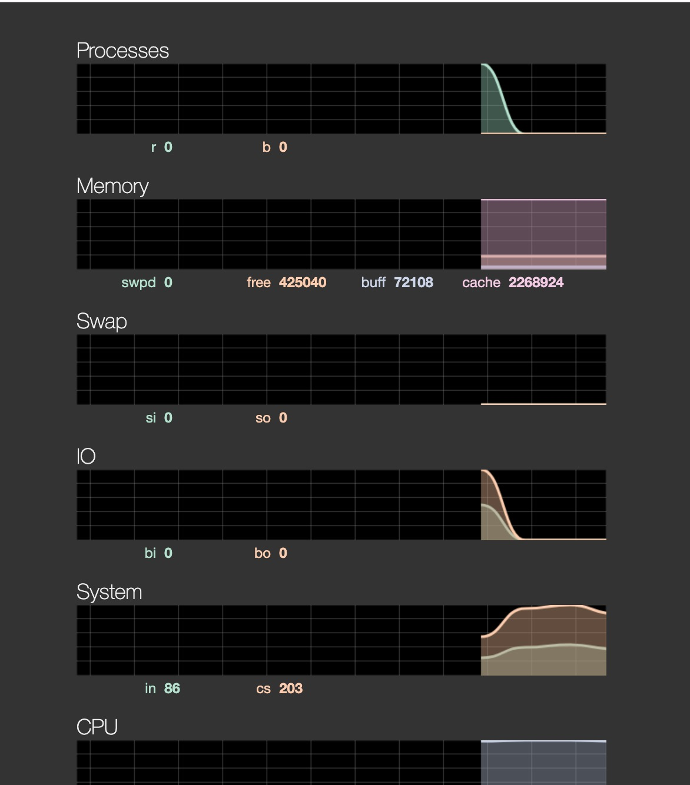

最近在学习Go语言。

发现很多优秀的软件服务其后台程序都是基于Go来实现，今天补缺websocket这一块内容时看到阮一峰老师文章《WebSocket 教程》提到`WebSocketd`，点进去一看，又是一个使用Go语言实现的web服务。

我来了兴趣，决定实现它。

在macOS里实现它非常简单，安装Go语言环境后，直接`brew install websocketd`即可安装成功，参照官方实例开箱即用；但监控Linux CPU/IO/Mem stats的那个example只能在Linux上跑，我想着在Docker Linux上实现。

<!--more-->

步骤如下：

> 1、安装Go环境
>
> 2、安装`WebSocketd`服务
>
> 3、安装`web-vmstat`服务
>
> 4、执行shell脚本


**使用Docker Alpine部署**

最开始尝试在Docker Alpine里面部署，结果发现[Alpine自带的库对Go语言支持不友好](https://stackoverflow.com/questions/52056387/how-to-install-go-in-alpine-linux/53405005)，折腾半天嫌麻烦放弃Alpine改用CentOS，并不是说Alpine里不可以安装Go语言环境。改用CentOS不使用Ubuntu是因为Ubuntu默认自带的shell版本为/bin/dash，部署`websocketd`过程中需要经常使用bash shell命令，想着少一事就少一事，CentOS是最佳的选择。


**使用Docker CentOS部署**

运行CentOS容器：

```
docker run -it -p 8080:8080 --name centoswebsocket <image-id>
```

参照[CentOS 镜像使用帮助](https://mirror.tuna.tsinghua.edu.cn/help/centos/)，更改为清华的源。


下载如下内容：

使用wget下载Go语言包，安装后设置好Go语言环境变量；

使用wget下载websocketd-0.3.0-linux_amd64.zip，解压缩后得到一个二进制文件`websocketd`，将其拷贝到/usr/bin目录，确保`WebSocketd`是一个全局命令；

使用yum-install安装Git，然后使用Git下载web-vmstats；


**更改run脚本文件**

进到web-vmstats目录，修改run这个bash文件。

将`./websocketd --port=9231 --staticdir=web /usr/bin/vmstat -n 1`修改为

`websocketd --port=8080 --staticdir=web /usr/bin/vmstat -n 1`


两点原因：

1、web-vmstats和`websocketd`并不在同一个目录，`./websocketd`命令会报错"not found"

2、端口需要改为使用`docker run`命令打开的端口


**查看监控页面**

上图中执行./run脚本后，服务启动成功，浏览器里输入`http://127.0.0.1:8080`后即可看到这台Docker CentOS服务器实时的资源监控页面。




**参考资料**

- [WebSocket 教程](http://www.ruanyifeng.com/blog/2017/05/websocket.html)
- [GitHub websocketd](https://github.com/joewalnes/websocketd)
- [GitHub web-vmstats](https://github.com/joewalnes/web-vmstats)
- [linux安装websocketd服务](https://www.cnblogs.com/zipon/p/9049433.html)
- [Github 开源项目（一）websocketd （实战：实时监控服务器内存信息）](https://www.cnblogs.com/tinywan/p/6826125.html)

