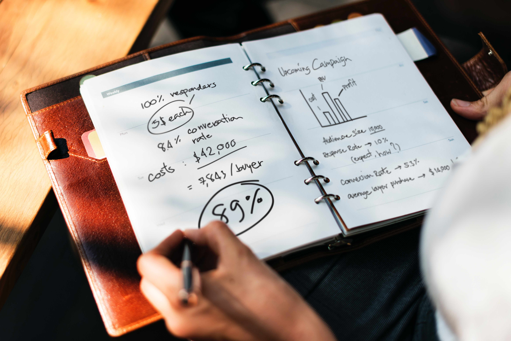
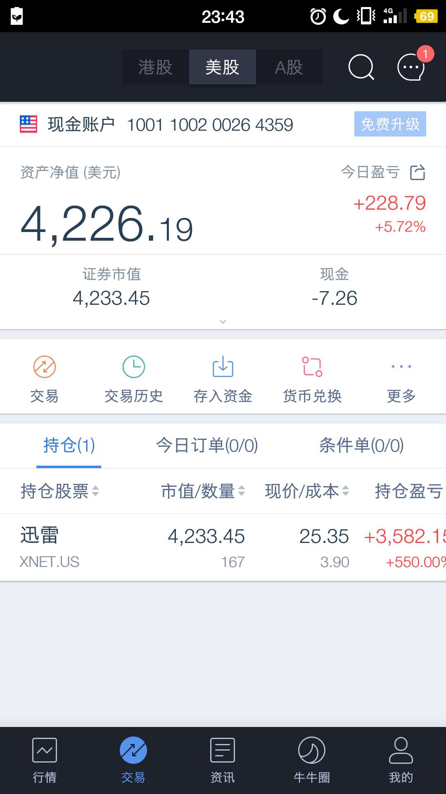

（Photo by rawpixel.com on Unsplash）

今年有一个意外的收获，我买的美股[迅雷](https://xueqiu.com/S/XNET)(NASDAQ:XNET)涨了5.5倍，昨晚25美金一股全部清仓出局，估计很多年都不会再遇到这种好机会，周末有空正好复盘一下，做一个整理。

复盘前，先简单介绍一下我的美股投资历史。

我开美股账户的时间不长，一般喜欢买入后持有不动，静待戴维斯双击，基本上不做T，因为做不好，常常把成本越搞越高，频繁交易，不是我的风格。

2016年年初买JUNO，美国的一家明星初创医疗制药公司，买入大概1个月后，突然有一天股价暴跌30%，幸好买得不多，不然亏惨了。这段经历对我影响至深，打那以后，我就再也不碰医药股，虽然潜力无限，但我搞不懂它们具体业务做什么，不懂不买，巴菲特的名言。今年港股里面的明星[金斯瑞](https://xueqiu.com/S/01548)(HK:01548)，同学强力推荐，我坚决不碰。

JUNO之后，买京东赚了一点钱，买阿里巴巴亏了一点钱，整体来说，较我投入的本金，都没赚到钱。

**买迅雷，是很偶然的一件事。**

<!--more-->

有一天雪球上一个大V分析迅雷的投资价值，他分析迅雷值得投资的理由是，当前市值较净资产低，账上的现金流加上迅雷在深圳的大楼，足够覆盖市值，具备很强的安全边际。迅雷被低估的原因是传统业务增长无力，新的业务[星域CDN](http://mp.weixin.qq.com/s?__biz=MzAxODYyMzU3Mg==&mid=2648960948&idx=1&sn=a1a0e7c0e923c87ddc02e5d03a7a5ec8&chksm=83c4328fb4b3bb99aba3b8561f13d9dec78f6f7047906afd4895cc6988dd98d0f0fd6eb68cf7&scene=21#wechat_redirect)暂时无法释放利润，恰好处于困境反转的局面。

我认同他的分析。

> 在中国互联网圈有一句话，一家互联网公司如果有一个亿的用户规模，那么迟早能找到变现的商业模式，迅雷的星域CDN项目，雷军是非常看好的，这很可能就是未来的趋势，分布式的CDN服务。
>
> 拿迅雷和暴风比较，迅雷的技术和口碑应该比暴风都要好，但暴风在A股上市，市值100亿左右；迅雷在美股上市，市值不到20亿（这里指的是17年3月份左右的市值），虽然A股整体PE比美股高，但差这么多，这明显说不过去啊。
>
> 另外，雷军影响力这么大，还是迅雷的第一大股东，他这么看好星域CDN业务，小米发展势头这么好，随便拉一把，迅雷的股价就能飞上天。

从这几个逻辑讲，投资迅雷站得住脚。于是3月初的时候，一把梭，3.79美金一股全仓买入。但意想不到的是，接下来的4个月里面，迅雷股价仍然一路下跌，7月中旬跌到3.15美金一股的时候，一把梭全部清仓，因为跌破了我的止损点。

7月下旬，出现转机，基于区块链的[玩客云](http://mp.weixin.qq.com/s?__biz=MzA4MjAyMTczNQ==&mid=2649811828&idx=1&sn=571518bd9b3708152ef02d1eadaf8830&chksm=8788577cb0ffde6a979e0f4820cc46c4b2b6a43a93966d059d0f62b7d7704451d44d7fdfa20c&scene=21#wechat_redirect)项目推出来之后，带动迅雷重新进入上升趋势。8月初3.9美金一股，我又一把梭全仓买入，重新上车。

没想到这车开得真猛，40天时间里面翻了5倍。直到昨晚25美金一股，一把梭清仓出局，整体盈利5.5倍。

我向老婆叹口气，涨了这么多，遗憾的是买得太少了，然后自己和自己来了一场柏拉图式对话。

> Q：预想过能涨这么多吗？
>
> A：完全没想到。
>
> Q：中间有加仓吗？
>
> A：没有，主要仓位都在A股里面，恰巧那段时间里面香港银行卡没开出来，不方便往富途里面入金。
>
> Q：中间有减仓吗？
>
> A：没有，回撤25%那天，同学建议减掉部分仓位，把成本降下来，但我判断上涨趋势还会继续，一直没动，也幸好没动，如果一卖，肯定就不会再买回来。
>
> Q：涨到25美金前，有减仓的冲到吗？
>
> A：有，大概在18美金一股时，有过强烈想减仓的瞬间，因为盘中振幅非常大，想获利了解，但最终忍住没动。
>
> Q：清仓后，如果继续涨，会后悔吗？
>
> A：不会，根本就没想到迅雷能让我赚这么多。
>
> Q：能拿住涨到5.5倍的最主要原因是什么？
>
> A：最主要原因是投入本金少，如果投入得多，我很可能就没办法做到那么淡定了。
>
> Q：翻了5.5倍，你这把赚了多少钱？
>
> A：这个，咳咳，有点不好意思说，你直接看图吧。

账户截图如下。

$4226.19/6.5=$650.1831，本金只有650美金，虽然翻了5.5倍，但其实没赚多少钱，错过绝佳的一次屌丝逆袭的机会，一切都是天意，当然投入本金低，这也是我能拿到它涨5.5倍的原因。

**应了一句话，人生暴涨的永远都是轻仓。**