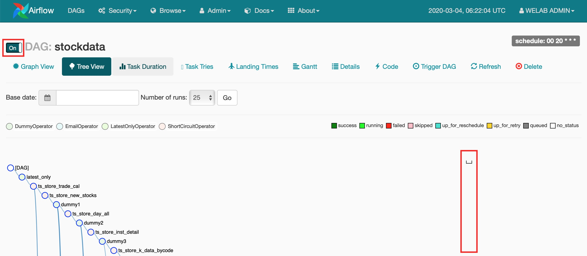
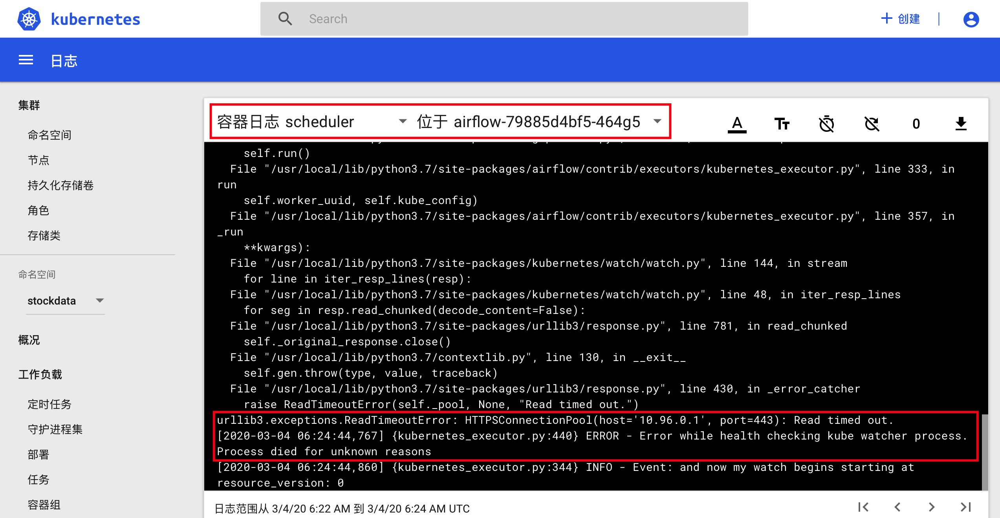

这几天将一个Python Airflow Project部署到了本机K8S环境，前天一切都很正常。昨天开始出现了这样一个异常情况。

一般情况下，在Airflow里打开Dag的开关后，调度器会自动trigger一次Dag Run，但昨天开始Airflow的调度器自动trigger一直不成功。



（图1）

使用`kubectl proxy`和`kubectl -n kube-system describe secret default| awk '$1=="token:"{print $2}'`进入K8S Dashboard，查看容器组（也就是Pod）airflow-79885d4bf5-464g5里shceduler这个容器日志，发现如下报错信息。

<!--more-->



(图2)


其实不用K8S Dashboard，使用`kubectl logs airflow-79885d4bf5-464g5 scheduler -n stockdata`命令也可以查出相关的报错。

```shell
192:ShellCodes jacksonshawn$ kubectl get pods -n stockdata
NAME                                READY   STATUS    RESTARTS   AGE
airflow-79885d4bf5-464g5            2/2     Running   0          21m
postgres-airflow-55659bc6fc-6cc4m   1/1     Running   0          21m
192:ShellCodes jacksonshawn$ kubectl logs airflow-79885d4bf5-464g5 scheduler -n stockdata
```

刚开始翻Airflow的源码，是kubernetes_executor执行器报的错，没发现什么有价值的信息。一番seacrh之后，发现`10.96.0.1`是K8S集群Master节点的IP地址，是Pod与Master节点之间的连通性出了问题，但如果在图1里，手工点击"Trigger DAG"发起一次Dag Run，调度器能够将Dag调度成功，是不是可以认为Pod与Master的初始网络链接出了问题。


使用`kubectl cluster-info`查看集群信息。

```shell
192:stockdata-dag jacksonshawn$ kubectl cluster-info
Kubernetes master is running at https://kubernetes.docker.internal:6443
KubeDNS is running at https://kubernetes.docker.internal:6443/api/v1/namespaces/kube-system/services/kube-dns:dns/proxy

To further debug and diagnose cluster problems, use 'kubectl cluster-info dump'.
```


查看节点信息。

```shell
192:stockdata-dag jacksonshawn$ kubectl get nodes -o wide
NAME             STATUS   ROLES    AGE   VERSION   INTERNAL-IP    EXTERNAL-IP   OS-IMAGE         KERNEL-VERSION     CONTAINER-RUNTIME
docker-desktop   Ready    master   43d   v1.14.8   192.168.65.3   <none>        Docker Desktop   4.9.184-linuxkit   docker://19.3.5
```


查看K8S kube-system这个namespace里的Pod信息。

```shell
192:stockdata-dag jacksonshawn$ kubectl get pods -n kube-system
NAME                                     READY   STATUS    RESTARTS   AGE
coredns-6dcc67dcbc-76xjh                 1/1     Running   33         43d
coredns-6dcc67dcbc-lsbtx                 1/1     Running   34         43d
etcd-docker-desktop                      1/1     Running   33         43d
kube-apiserver-docker-desktop            1/1     Running   222        43d
kube-controller-manager-docker-desktop   1/1     Running   124        43d
kube-proxy-qrm2k                         1/1     Running   26         43d
kube-scheduler-docker-desktop            1/1     Running   122        43d
kubernetes-dashboard-5f7b999d65-m6djs    1/1     Running   26         32d
```


依次检查两个coredns Pod的日志，发现下面这个异常情况。

```
192:stockdata-dag jacksonshawn$ kubectl logs coredns-6dcc67dcbc-lsbtx -n kube-system
.:53
2020-03-03T09:35:05.685Z [INFO] CoreDNS-1.3.1
2020-03-03T09:35:05.685Z [INFO] linux/amd64, go1.11.4, 6b56a9c
CoreDNS-1.3.1
linux/amd64, go1.11.4, 6b56a9c
2020-03-03T09:35:05.685Z [INFO] plugin/reload: Running configuration MD5 = 599b9eb76b8c147408aed6a0bbe0f669
E0303 09:35:30.579778       1 reflector.go:134] github.com/coredns/coredns/plugin/kubernetes/controller.go:322: Failed to list *v1.Namespace: Get https://10.96.0.1:443/api/v1/namespaces?limit=500&resourceVersion=0: dial tcp 10.96.0.1:443: i/o timeout
E0303 09:35:30.582230       1 reflector.go:134] github.com/coredns/coredns/plugin/kubernetes/controller.go:315: Failed to list *v1.Service: Get https://10.96.0.1:443/api/v1/services?limit=500&resourceVersion=0: dial tcp 10.96.0.1:443: i/o timeout
E0303 09:35:30.584304       1 reflector.go:134] github.com/coredns/coredns/plugin/kubernetes/controller.go:317: Failed to list *v1.Endpoints: Get https://10.96.0.1:443/api/v1/endpoints?limit=500&resourceVersion=0: dial tcp 10.96.0.1:443: i/o timeout
```


查看service信息

```
192:~ jacksonshawn$ kubectl get svc -o wide
NAME         TYPE        CLUSTER-IP   EXTERNAL-IP   PORT(S)   AGE   SELECTOR
kubernetes   ClusterIP   10.96.0.1    <none>        443/TCP   43d   <none>
```

使用@dannymk给出的方法，删除services之后，kubernetes马上又重新被create一个，并没有真正解决问题。


查看所有endpoints信息

```
192:~ jacksonshawn$ kubectl get endpoints --all-namespaces
NAMESPACE     NAME                      ENDPOINTS                                                  AGE
default       kubernetes                192.168.65.3:6443                                          43d
kube-system   kube-controller-manager   <none>                                                     43d
kube-system   kube-dns                  10.1.10.148:53,10.1.10.151:53,10.1.10.148:53 + 3 more...   43d
kube-system   kube-scheduler            <none>                                                     43d
kube-system   kubernetes-dashboard      10.1.10.150:8443                                           32d
stockdata     airflow-webserver         10.1.10.193:8080                                           57m
stockdata     postgres-airflow          10.1.10.192:5432                                           57m
```


最后查看所有services时，发现除了kubernetes这个service使用443端口外，其它compose-api和kubernetes-dashboard也使用443端口，会不会是这两个服务将端口占用了导致的文 it。

```
192:~ jacksonshawn$ kubectl get svc --all-namespaces
NAMESPACE     NAME                   TYPE        CLUSTER-IP       EXTERNAL-IP   PORT(S)                  AGE
default       kubernetes             ClusterIP   10.96.0.1        <none>        443/TCP                  44d
docker        compose-api            ClusterIP   10.102.119.151   <none>        443/TCP                  44d
kube-system   kube-dns               ClusterIP   10.96.0.10       <none>        53/UDP,53/TCP,9153/TCP   44d
kube-system   kubernetes-dashboard   ClusterIP   10.103.217.122   <none>        443/TCP                  32d
stockdata     airflow-webserver      NodePort    10.105.134.77    <none>        8080:30800/TCP           88m
stockdata     postgres-airflow       ClusterIP   10.105.126.217   <none>        5432/TCP                 88m
```

使用`kubectl delete svc/compose-api -n docker`和`kubectl delete svc/kubernetes-dashboard -n kube-system`将这两个使用443端口的service删掉后，以为问题可以就此解决，重启K8S之后，发现问题依然存在。

浪费时间太多，以后对K8S熟悉之后再查吧。


**参考资料**

- [[kubernetes/kubadm#1264](https://github.com/kubernetes/kubeadm/issues/1264)

