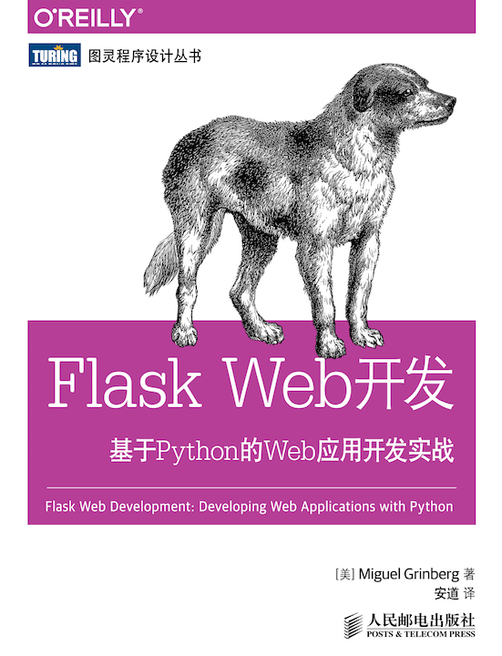
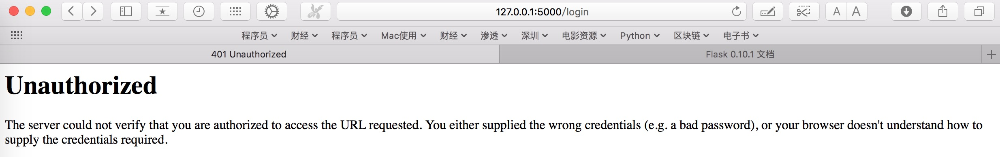

学习一门语言，除了熟悉语法知识之外，还需要懂一个框架，这样才具备生产力。Python生态强大在于它有众多各式各样的第三方包，有时光会Python语法解决不了问题，必须结合第三方框架协同来完成任务。

这里是我学习Flask Web开发过程中整理的笔记，我使用的资料是大名鼎鼎的“狗书”第一版和Flask官网手册。学习方法是照着“狗书”里面的内容依葫芦画瓢一步一步地边写边测。书作者[Miguel Grinberg](https://flaskbook.com)的网站上有最新版的内容，想获取第二版或视频教程可以移步观看。



这篇博文纪录学习过程中遇到的重点和难点，前后没有相关性，属于看到哪儿写到哪儿那种，大部分是摘抄，有个人思考的部分是“**[同步发送邮件？异步发送邮件？](#jump1)**” 、“**[数据库多对多关联关系](#jump2)**” 、“**[部署Python Flasky程序到Heroku](#jump3)**”这几节。

如果读者朋友发现哪里有写得不对的地方，欢迎指正。

### Flask网址重定向问题

```python
from flask import Flask
app = Flask(__name__)

@app.route('/projects/')
def projects():
    return 'The project page'

@app.route('/about')
def about():
    return 'The about page'

if __name__ == '__main__':
	app.run(debug=True)
```

<!--more-->

这个例子中，当你在浏览器中访问http://127.0.0.1:5000/projects 时（注意，这个URL最后面没有跟随斜线），会自动定向到http://127.0.0.1:5000/projects/ 页面，访问两个页面是同一个效果。

但是，当你访问http://127.0.0.1:5000/about/ 时，会提示404报错。访问http://127.0.0.1:5000/about 才能得到预期结果。

这两个路由的本质区别，就是网址的重定向问题。第一种情况中，规范的URL指向projects尾端有一个斜线。这种感觉很像在文件系统中的文件夹。访问一个结尾不带斜线的URL会被Flask重定向到带斜线的规范URL上面。第二种情况的URL结尾不带斜线，类似UNIX-like系统下的文件的路径名。访问结尾带斜线的 URL 会产生一个“404 Not Found”错误。

### 上下文全局变量

客户端发送的请求对象被Flask作为参数传入到视图函数中进行处理，如果视图函数在访问请求对象外，还需要其它对象，那么会变得异常复杂。于是Flask使用上下文将一些对象变成了全局变量。

| 变量名         | 上下文   | 说明                          |
| ----------- | :---- | :-------------------------- |
| current_app | 程序上下文 | 当前激活程序的程序实例                 |
| g           | 程序上下文 | 处理请求时用作临时存储的对象。每次请求都会重设这个变量 |
| request     | 请求上下文 | 请求对象，封装了客户端发出的HTTP请求中的内容    |
| session     | 请求上下文 | 用户会话，用于处理请求之间需要记住的"值"的字典    |

下面这个例子中，视图函数把request当作全局变量使用。要注意，这里把request用作全局变量是指在一个线程中作为全局变量使用用，不会干扰其它线程。多线程服务器中，不同线程处理不同客户端发送的不同请求时，每个线程看到的request对象必然各不不同。

```python
from flask import Flask,request
app = Flask(__name__)

@app.route('/')
def index():
	user_agent=request.headers.get('User-Agent')
	return '<p>Your browser is %s</p>' % user_agent

if __name__ == '__main__':
	app.run(debug=True)
```

### URL构建函数

使用url_for()这个构建函数来给视图函数构造 URL。它接受函数名作为第一个参数，接收关键字参数作为第二个参数，关键字参数对应URL规则的变量部分。

```python
from flask import Flask,url_for,redirect
app = Flask(__name__)

@app.route('/hello')
def hello_world():
	return redirect(url_for('index'))

@app.route('/')
def index():
	return 'Index Page'

@app.route('/user/<username>')
def show_user_profile(username):
	return 'User %s' % username

@app.route('/post/<int:post_id>')
def show_post(post_id):
	return 'Post %d' % post_id

@app.route('/projects/')
def projects():
	return 'The project page'

@app.route('/about')
def about():
	return 'The about page'

if __name__ == '__main__':
	with app.test_request_context():
		print url_for('hello_world')
		print url_for('index')
		print url_for('show_user_profile',username='jack')
		print url_for('show_post',post_id='1')
		print url_for('projects')
		print url_for('about')
		print url_for('about',next='/')
		print url_for('static', filename='style.css')
	app.run(debug=True)
```

查看with app.test_request_context()函数执行完的结果，如下：

	/hello
	/
	/user/jack
	/post/1
	/projects/
	/about
	/about?next=%2F
	/static/style.css
### 钩子函数

有些场景下，Flask在处理请求之前或之后，需要执行特定功能的代码。比如，在请求开始前，要创建数据库连接或对发起请求的用户进行认证。为了避免每个视图函数中都使用重复的代码，Flask设计了4种钩子函数来实现这些功能。

- before_first_request : 注册一个函数，在处理第一个请求之前运行。
- before_request : 注册一个函数，在每次请求之前运行。
- after_request : 注册一个函数，如果没有未处理的异常抛出，在每次请求之后运行。
- teardown_request : 注册一个函数，即使有未处理的异常抛出，也在每次请求之后运行。

钩子函数和视图函数之间共享数据一般使用上下文全局变量g。例如，before_request 处理程序可以从数据库中加载已登录用户，并将其保存到 g.user 中。随后调用视图函数时，视图函数再使用 g.user 获取用户。

```python
import sqlite3
from flask import g

DATABASE = '/database.db'

def connect_db():
    return sqlite3.connect(DATABASE)

@app.before_request
def before_request():
    g.db = connect_db()

# teardown_request在请求结束时运行，即使before_request运行失败或者从未运行过。
@app.teardown_request
def teardown_request(exception):
    if hasattr(g, 'db'):
        g.db.close()
```

### 错误代码重定向

下面这个例子使用redirect和url_for()构造函数将主页(‘/’)重定向到login页面，login页面调用abort函数返回401报错。

```python
from flask import Flask,url_for,redirect
app = Flask(__name__)

@app.route('/')
def index():
	return redirect(url_for('login'))

@app.route('/login')
def login():
	# abort函数放弃请求并返回错误代码
	# 401表示禁止访问,200表示一切正常,404表示页面不存在
	abort(401)

# 使用errorhandler()装饰器可以定制错误页面，下面定制401报错信息，当然也可以使用render_template('page_error.html')将401报错重定向到一个页面
# page_error函数类似于视图函数，它有另外一个名称叫做错误处理器，现在当人家提到错误处理器，你能明白人家说的是什么东西了
@app.errorhandler(401)
def page_error(error):
	#return render_template('page_not_found.html'),401
	return 'Page occurs error,error code is 401'
	
if __name__ == '__main__':
	app.run(debug=True)
```
在使用app.errorhandler(401)装饰器重定向之前，执行程序，返回“Unauthorized

The server could not verify that you are authorized to access the URL requested. You either supplied the wrong credentials (e.g. a bad password), or your browser doesn't understand how to supply the credentials required.”报错。



使用app.errorhandler(401)装饰器进行401报错重定向后，执行程序，返回结果变成“Page occurs error,error code is 401”。


### 上传文件

上传文件的基本工作流程如下：

1. 存在一个&lt;form&gt;标签，enctype值等于“multipart/form-data”，&lt;form&gt;标签里面包含&lt;input type=file&gt;标签。
2. WSGI应用程序通过request请求上下文里面的files字典访问文件。
3. 使用文件的save()方法将文件保存到指定的目录。

```python
# -*- coding: utf-8 -*-
"""
Created on Tue Feb 28 10:41:05 2018
#func:测试Flask上传文件
"""
import os
from flask import Flask,url_for,redirect,request,abort,escape,session,flash
from werkzeug import secure_filename
from flask import send_from_directory

# UPLOAD_FOLDER存储上传文件的地方,必须写全路径,使用相对路径然后在file.save操作那里进行路径拼接不成功
UPLOAD_FOLDER  = '/Users/jacksonshawn/PythonCodes/pythonlearning/flask2/upload'

# 允许上传文件类型的集合
ALLOWED_EXTENSIONS = set(['txt','pdf','png','jpg','jpeg','gif','html','csv'])

app = Flask(__name__)
# 配置上传文件目录
app.config['UPLOAD_FOLDER'] = UPLOAD_FOLDER
# 生成一个随机的密钥
app.secret_key = os.urandom(24)
# 涉资上传文件限制为最大16M
app.config['MAX_CONTENT_LENGTH'] = 16 * 1024 * 1024

def allowed_file(filename):
	return '.' in filename and filename.rsplit('.',1)[1] in ALLOWED_EXTENSIONS

@app.route('/',methods=['GET','POST'])
def upload_file():
	if request.method == 'POST':
		file = request.files['file']
		if file and allowed_file(file.filename):
			filename = secure_filename(file.filename)
			#print "filename is:",filename
			#print "cwd is:",os.getcwd()
			#print "file path:",os.path.join(app.root_path,app.config['UPLOAD_FOLDER'],filename)
			#print "path __file__:",os.path.dirname('__file__')
			file.save(os.path.join(app.config['UPLOAD_FOLDER'],filename))
			return redirect(url_for('uploaded_file',filename=filename))
		else:
			return "file type not allowed"
	return '''
	<!doctype html>
	<title>Upload new File</title>
	<h1>Upload new file</h1>
	<form action="" method=post enctype=multipart/form-data>
		<p>
			<input type=file name=file>
			<input type=submit value=upload>
		</p>
	</form>
	'''

@app.route('/upload/<filename>')
def uploaded_file(filename):
	# send_from_directory将上传的文件读取到浏览器中显示，如果设置as_attachment为True，则该文件会在浏览器中自动下载
	return send_from_directory(app.config['UPLOAD_FOLDER'],filename)

if __name__ == '__main__':
	app.run(debug=True)
```

### Flask-SQLAlchemy数据类型

SQLAlchemy这个ORM框架将面向对象操作转换为底层的数据库指令。我们不需要去管底层如何实现这种转换（当然，如果有兴趣学习一下Python的元类，弄懂底层实现机制也不是特别难的事），只需要将重点放在如何实现类的定义以及方法的调用上即可。

下面是SQLAlschemy常用的数据类型。

| 类型名          | Python类型           | 说明                            |
| :----------- | ------------------ | ----------------------------- |
| Integer      | int                | 普通整数，一般是32位                   |
| SmallInteger | int                | 取值范围小的整数，一般是16位               |
| BigInteger   | int或long           | 不限制精度的整数                      |
| Float        | float              | 浮点数                           |
| Numeric      | decimal.Decimal    | 定点数                           |
| String       | str                | 变长字符串                         |
| Text         | str                | 变长字符串，对较长或不限长度的字符串做了优化        |
| Unicode      | unicode            | 变长Unicode字符串                  |
| UnicodeText  | unicode            | 变长Unicode字符串，对较长或不限长度的字符串做了优化 |
| Boolean      | bool               | 布尔值                           |
| Date         | datetime.date      | 日期                            |
| Time         | datetime.time      | 时间                            |
| DateTime     | datetime.datetime  | 日期和时间                         |
| Interval     | datetime.timedelta | 时间间隔                          |
| Enum         | str                | 一组字符串                         |
| PickleType   | 任何Python对象         | 自动使用Pickle序列号                 |
| LargeBinary  | str                | 二进制文件                         |

下面是SQLAlchemy常用列选项。

| 选项名         | 说明                                    |
| ----------- | ------------------------------------- |
| primary_key | 如果设为True，这列就是表的主键                     |
| unique      | 如果设为True，这列不允许出现重复的值                  |
| index       | 如果设为True，为这列创建索引，提升查询效率               |
| nullable    | 如果设为True，这列允许使用空值；如果设为False，这列不允许使用空值 |
| default     | 为这列定义默认值                              |

下面是SQLAlchemy常用关系选项。

| 选项名        | 说明                                                         |
| ------------- | ------------------------------------------------------------ |
| backref       | 在关系的另一个模型中添加反向引用                             |
| primaryjoin   | 明确指定两个模型之间使用的联结条件。只在模棱两可的关系中需要指定 |
| lazy          | 指定如何加载相关记录。可选值有select(首次访问时按需加载)、 																					immediate(源对象加载后就加载)、joined(加载记录，但使用联结)、subquery(立即加载，但使用子查询)、noload(永不加载)和 dynamic(不加载记录，但提供加载记录的查询) |
| uselist       | 如果设为False，不使用列表，而使用标量值                      |
| order_by      | 指定关系中记录的排序方式                                     |
| secondary     | 指定多对多关系中关系表的名字                                 |
| secondaryjoin | SQLAlchemy无法自行决定时，指定多对多关系中的二级联结条件     |

下面是SQLAlchemy的查询过滤器。

| 过滤器         | 说明                         |
| ----------- | -------------------------- |
| filter()    | 把过滤器添加到原查询上，返回一个新查询        |
| filter_by() | 把等值过滤器添加到原查询上，返回一个新查询      |
| limit()     | 使用指定的值限制原查询返回的结果数量，返回一个新查询 |
| offset()    | 偏移原查询返回的结果，返回一个新查询         |
| order_by()  | 根据指定条件对原查询结果进行排序，返回一个新查询   |
| group_by()  | 根据指定条件对原查询结果进行分组，返回一个新查询   |

下面是SQLAlchemy查询执行函数。

| 方法             | 说明                                    |
| -------------- | ------------------------------------- |
| all()          | 以列表形式返回查询的所有结果                        |
| first()        | 返回查询的第一个结果，如果没有结果，则返回None             |
| first_or_404() | 返回查询的第一个结果，如果没有结果，则终止请求，返回404错误响应     |
| get()          | 返回指定主键对应的行，如果没有对应的行，则返回None           |
| get_or_404()   | 返回指定主键对应的行，如果没找到指定的主键，则终止请求，返回404错误响应 |
| count()        | 返回查询结果的数量                             |
| paginate()     | 返回一个Paginate对象，它包含指定范围内的结果            |

Flask-SQLAlchemy分页对象的属性。

| 属性       | 说明            |
| -------- | ------------- |
| items    | 当前页面中的记录      |
| query    | 分页的源查询        |
| page     | 当前页数          |
| prev_num | 上一页的页数        |
| next_num | 下一页的页数        |
| has_next | 如果有下一页，返回True |
| has_prev | 如果有上一页，返回True |
| pages    | 查询得到的总页数      |
| per_page | 每页显示的记录数量     |
| total    | 查询返回的记录总数     |

Flask-SQLAlchemy对象上可调用的方法。

| 方法                                                         | 说明                                                         |
| ------------------------------------------------------------ | ------------------------------------------------------------ |
| iter_pages(left_edge=2, left_current=2, right_current=3, right_edge=2) | 一个迭代器，返回一个在分页导航中显示的页数列表。这个列表的最左边显示 left_edge 页，当前页的左边显示 left_current 页，当前页的右边显示 right_current 页，最右边显示right_edge页。例如，在一个100页的列表中，当前页为第50页，使用默认配置，这个方法会返回以下页数：1、2、None、48、49、50、51、52、53、None、99、100。（None表示页数之间的间隔） |
| prev()                                                       | 上一页的分页对象                                             |
| next()                                                       | 下一页的分页对象                                             |


常用数据类型、常用列选项、常用关系选项在定义数据模型时使用，查询过滤器在shell里查询数据使用，需要结合具体例子才容易理解。

###  <span id="jump1">同步发送邮件？异步发送邮件？</span>

今天在测试Flask-mail发送邮件功能时，遇到很多次554错误。我使用的是网易邮箱，根据[网易邮箱报错信息](http://help.163.com/09/1224/17/5RAJ4LMH00753VB8.html)查到我所遇到的“554 DT:SPM”报错信息是<u>*“**554 DT:SPM 发送的邮件内容包含了未被许可的信息，或被系统识别为垃圾邮件。请检查是否有用户发送病毒或者垃圾邮件；**”*</u>

收发邮件的程序我之前写过，对我来说不是问题，但这个554还是卡了我半天，最后查到是**邮件主题**和**正文内容**不符合网易的安全规范，再将邮件主题和正文内容做出调整之后，邮件发送成功。

当然，我写在HTML文件里的正文内容，被网易把HTML语法信息全部过滤掉，只保留纯文本形式，然后才发送了出去。

另外，有一点值得说的是，我是通过Flask应用发送邮件，在浏览器网页里面点击按钮，后台程序才去执行SMTP发送邮件操作。没有采用异步方式时，发送时页面出现停滞，等发送完毕，浏览器才恢复正常，这个估计就是**同步阻塞**吧；采用异步方式发送时，感觉操作很畅快，点击发送后，只用了一小会儿，浏览器就恢复正常。

### Flask-Login管理用户认证状态

Flask-Login实现的用户方法如下。

| 方法                 | 说明                                       |
| ------------------ | ---------------------------------------- |
| is_authenticated() | 如果用户已经登录，必须返回 True，否则返回 False。           |
| is_active()        | 如果允许用户登录，必须返回 True，否则返回 False。如果要禁用账户，可以返回 False。 |
| is_anonymous()     | 对普通用户必须返回 False。                         |
| get_id()           | 必须返回用户的唯一标识符，使用 Unicode 编码字符串。           |

### <span id="jump2">数据库多对多关联关系</span>

今天在看《Flask Web开发》第12章讲解数据库表与表之间关联关系的时候，意外收获一种新的思维模式，它讲解的是表与表之间多对多关系，记录于此。

数据库设计中，我们比较好理解的是“**一对一**”（A表中一条记录对应B表中一个记录，比如，社交网站中一个用户对应角色表中的一个角色）和“**一对多**”（A表中一条记录对应B表中一组记录，比如，社交网站中一个用户对应文章表中发布的全部文章）。“**多对一**”和“**一对多**”是同一个关系，只是“多”的角度不一样。另外，可以将“**一对一**”看成是简化版的“**一对多**”关系，它限制了“多”的这一侧只能有一条记录。

这三种关系，都有一侧是单个实体，记录之间的联系通过外键实现，让外键指向这个实体，创建表时好操作。

那“**多对多**”（比如学生表和课程表，N个学生可以选同一套课程，N套课程可以被同一个学生选）这种关联关系，设计表结构时候如何处理呢？

书中给出的思路是，添加第三张表，称之为关联表，用它作为桥梁，将“**多对多**”关系分解成两个“**一对多**”关系。


（学生表和课程表通过注册表进行关联）

registrations表中，每一行都表示一个学生注册一个课程的记录。要想知道一个学生选择了哪些课程，先要从学生表和registrations表之间的一对多关系开始，获取这个学生在registrations表中的全部记录，然后通过registrations表和课程表之间的多对一关系，就可以查出该学生注册的全部课程。

要想知道一门课程有哪些学生注册过，从课程表和registrations表之间的一对多关系开始，获取这门课程在registrations表中的全部记录，然后通过registrations表和学生表之间的多对一关系，就可以查出这门课程有哪些同学注册。

不知道还有没有别的思路，我觉得这个模式分解的思路非常赞。

### <span id="jump3">部署Python Flasky程序到Heroku</span>

按照Flask web开发书中的步骤一步一步看到最后，成功被作者绕晕，照着书中的步骤写下来，项目代码和文档已变得非常混乱。最后几章里的精华依然很多，不过，我最感兴趣的是如何把整个项目部署到Heroku。

由于以前没有接触过这些，发布项目上线对我来说并不是一件容易的事。没玩过的东西，我都有兴趣尝试一下，于是直接Clone一份原作者的代码，花费了一整天的时间终于成功把它部署到Heroku上面。在部署过程中，遇到了很多问题，在前人的基础上， 我把我操作步骤都记录了下来，说不定会对其它朋友有帮助。

请移步[部署Python Flasky程序到Heroku](/2018/03/09/deploy-flaskapp-onto-heroku/)查看。
