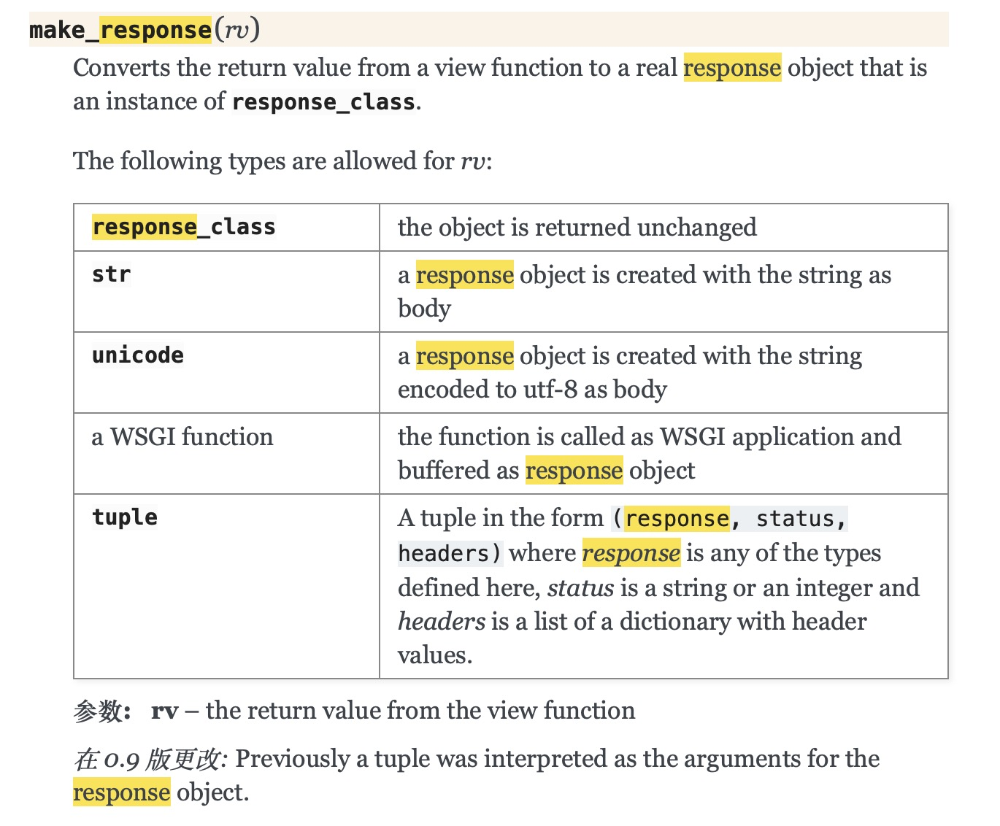

### Flask Route机制

Flask框架比Django后出来，砍掉了很多Django框架中冗余的东西，增加了很多新特性解决了Django框架的痛点。比如一个视图函数中，要控制用户在浏览器里输入的id是一个数字，Django在视图函数中通常使用正则表达式进行过滤，如下所示：

```python
urlpatterns = [
    path('', views.index),
    re_path('^users/(\d+)/$', views.users),
```


Flask则不需要这样，只需要在视图函数中使用converter类型的转换器来检查即可，如下所示：

```python
@blue.route('/users/<int:id>/')
def users(id):
    print('id:', id, type(id))
    return 'users id valid'
```


为什么可以像上面这样呢，是因为Flask是基于Werkzurg的一个框架，Flask的Route在Werkzurg基础上进行了一层封装，继承了Werkzurg里的这种用法。这种机制叫做Converter ，可以通过特定的语法，将 URL中特定部分转化成对应的Python变量。

<!--more-->

Flask中常用的converter类型有下面这几种：

- string：从url中接收斜线（"/"）之前的部分作为参数（默认使用string类型）

- int：接收整型

- float：接收浮点型

- path：接收全部url作为参数，可以接收斜线（"/"）后面的部分

- uuid：只接收uuid类型的字符串

- any：限定url中接收参数的值


```python
@blue.route('/getuser/<int:id>/')
def getuser(id):
    print('id:', id, type(id))
    return 'getuser success'

@blue.route('/getinfo/<string:token>/')
def getinfo(token):
    print('token:', token, type(token))
    return 'getinfo success'

@blue.route('/getinfo1/<path:token>/')
def getinfo1(token):
    print('token:', token, type(token))
    return 'getinfo1 success'

@blue.route('/getuuid/<uuid:uuid>/')
def getuuid(uuid):
    print('uuid:', uuid, type(uuid))
    return 'getuuid success'

@blue.route('/getany/<any("1","11","111"):num>/')
def getany(num):
    print('num:', num, type(num))
    return 'getany success'
```


可以将上面这几个路由映射到同一个视图函数上面：

```python
@blue.route('/getuser/<int:var>/')
@blue.route('/getinfo/<string:var>/')
@blue.route('/getinfo1/<path:ar>/')
@blue.route('/getuuid/<uuid:var>/')
@blue.route('/getany/<any("1","11","111"):var>/')
def get(var):
    print("var:", var, type(var))
    return 'get success'
```

Flask视图函数中默认支持GET、HEAD、OPTIONS，其余请求类型不支持，需要开发人员手动添加。


### Flask请求处理流程

先说一下Flask请求处理流程：

接收浏览器请求 => Flask创建一个协程或线程 => 创建请求上下文对象（称之为request_context，request_context采用threading.Local()方法创建，每一个线程中的request_context都相互独立，互不影响，request_context包含request、flash、session等初始化参数）=> 请求上下文对象入栈 => 创建该请求的应用上下文（称之为app_context，app_context结构和request_context结构基本一致）=> 应用上下文入栈 => 调用视图函数处理逻辑 => 创建Response对象 => 应用上下文出栈 => 请求上下文出栈 => 返回响应给浏览器


Flask默认使用make_response方法创建Response对象。你在视图函数里写的返回值，会被传递到make_response函数里，然后由其判断类型，解析称标准的response对象，再返回给浏览器。



我们称这为一次处理流程为一次请求的生命周期，g对象的作用范围就在这一次生命周期内。


### Flask四大对象

Request、Session、g、Config

g对象虽然是一个全局对象，但它无法做到跨路由传递参数，因为不相同的两个路由是两个独立的请求，A路由里的g对象数据，无法在B路由里被使用。


如果想实现跨路由传递参数，就需要借助session，session将每一次请求的记录做了持久化处理，即将上一次HTTP请求的会话结果保存了起来（可以存在DB、缓存、文件等），flask默认将session序列化、base64编码、加密后存在了客户端的cookie中。浏览器每次请求进来后，Flask创建请求上下文时会检查是否有session内容，有则读取，没有初始化为None，每次请求处理完后，会设置session值，没有启用session则不处理。


session实现机制简单来说，是这样一个过程：

1. request请求进来后，Flask会先去获取cookie的值
2. 对cookie的值进行base64解码，然后使用secret_key解密，赋值给session进行使用（加密解密模块是基于itsdangerous模块实现）
3. 请求处理完之后，对session数据加密，然后使用base64编码
4. 设置cookie


session处理流程中与request一样，同样存在入栈和出栈操作。


g对象在一次请求过程中，用于在不同视图函数间传递参数。


config对象和Flask的app.config模块功能一致，可以从环境变量里获取参数，它可以直接在模板中被引用，在视图函数中要使用，需要从current_app.config获取。


### Flask离线脚本

离线脚本是相对Flask应用请求来说的一个概念，比如你启动了一个Flask应用程序。有视图、有模型，模型连接着后台数据库flask_demo，在浏览器里输入一个路由地址，给数据库flask_demo里User用户表添加了一名用户。

这整个操作过程，都伴随在Flask的request_context（请求上下文）里完成。

如果你不启动这个Flask应用，如何给数据库flask_demo里User用户表插入一条记录呢？

这就是离线脚本可以干的事情。

这个时候没有Flask的在线应用环境可以使用，可以手工创建一个app_context（应用上下文），然后手动操作入栈和出栈，更新数据库表的记录。

```
# 获取到生成app
app = create_app().app
# 创建app_ctx
app_ctx = app.app_context()
# app_ctx 入栈
app_ctx.push()
# 对数据库进行操作
db.session.add(Users(name="大萨达所1"))
# 提交
db.session.commit()
app_ctx.pop()
```


### Flask Request对象

服务器在接收到客户端请求后，会自动创建request对象，request对象由Flask框架创建，可以给它添加属性，但不能修改或删除它的属性。

request对象具有如下属性：

url：完整url请求地址

base_url：去掉GET参数的url地址

host_url：只有主机和端口号的url地址

host：只有域名和端口号

path：路由中的路径

method：请求方法

remote_addr：客户端IP地址

args：GET请求参数（例如：接收/xxx/?id=3&username=jack中id和username这两个变量的值），但并不是GET请求专属，所有请求上传参数都可以从args属性中获取

form：POST请求参数（可以使用Postman进行模拟，除了接收POST请求上传的参数，form也可以接收PUT、PATCH、DELETE请求上传的参数；Django可以接收GET和POST请求上传的参数，但没法直接接收PUT、PATCH、DELETE请求上传的参数，只能间接从request.body中提取，这一点没有Flask方便）

（args和form都是ImmutableMultiDict类型，这个类型是Werkzug类对Python字典类型的封装）

files：文件上传

headers：请求头

cookies：请求中的cookie


### Flask Response对象

Response对象由开发人员构造，包含服务器返回给客户端的数据，Flask返回的Response通常可以是这4种类型，string，response对象，tuple，WSGI instance实例。

Response返回的4种形式：

1. 直接构建Response对象
2. 通过make_response方法返回数据，make_response包含返回的数据内容data以及返回状态码code
3. 直接返回字符串（也可以使用render_template将模板转换为html字符串）
4. 返回模板（本质和方法3一样）
5. 重定向

终止处理：

1. abort

   本质是一个Exception

2. errorhandler

   使用errorhandler进行异常捕获，比如捕获404、401，然后重定向到其它视图，让程序报错变得友好


### Session处理

Session的目的是实现跨请求共享数据，它出现的原因是：

1. web开发中HTTP请求都是"短连接"，尽管现在有keep-alive，但当前请求无法识别上一次请求
2. HTTP请求是无状态的；
3. HTTP请求从客户端发起Request到服务端返回Response就处理结束了；


常用Session的处理方法有：Cookie、Session、Token

Cookie客户端会话技术，数据存储在客户端，使用key-value结构存储；Flask框架背后的Cookie机制默认对中文字符进行了处理，可以保存用户设置的中文信息。


Flask框架的Session数据默认并不存储在服务器端，它是将Session数据进行序列化、Base64、zlib压缩、哈希等处理之后，保存到客户端的Cookie里面，Flask框架的Session技术允许你查看服务器端存储在客户端的Session数据，但不允许你修改。


Flask的session有效期默认是31天，Django里session有效期默认是15天。


Flask可以借助flask_session插件将Session数据存储在服务器端，将Session数据对应的key存储在cookie里面。

flask_session可以将Session数据存储在Redis、filesystem、memcached、sqlalchemy、mongodb等各类服务器终端中。如果是存储到Redis里面，通过RedisSessionInterface这个类的save_session方法，可以将数据进行pickler序列化，进行签名然后，存储在Redis里面。


### Flask Restful API

RESTful是一种软件架构风格，实现前后端分离的一种方式，前端通过异步请求的方式与后端交互，后端只负责数据展示。RESTful路径是名词复数，不能出现动词。每种URI代表一种资源，通过HTTP请求谓词来实现资源转换，如GET、POST、PUT、PATCH、DELETE。


RESTful核心在于将后端数据序列化。


默认返回字典，可以直接被序列化；如果返回内容中包含对象，需要先进行序列化处理。

常用序列化工具：

1. marshal函数
2. marshal_with装饰器
3. 序列化之前需要先定义序列化模板，模板使用字典格式，允许嵌套，value是fields.XXX类型，数据允许是任意格式
4. 如果数据与格式完全对应，数据就是预期结果；如果格式比数据字段多，依然可以正常返回，返回它的默认值；如果格式比数据中的字段少，依然可以正常返回，少的字段不会显示（以格式的模板为主）
5. 想要返回什么的格式以模板定义的内容为准
6. 格式中字段名需要与数据中字段名一致


### Flask模板

Flask模板使用Jinja2，与Django模板技术非常相像。使用方法都是先在父模板里定义block块，再在子模板里使用extends继承父模板，将要渲染的内容填充到子模板页面里面。

Flask在Django基础上增加了macro这个功能。


### Flask Bootstrap

html_attribs：给整个html添加属性


### Flask钩子对象

钩子函数是面向切面编程的一种方式，它可以动态介入请求流程。例如：before_request、after_request，和Django中中间件的作用非常类似。

以Django举例，一次web请求操作的流程是：

Client -> process_request（列表）

对process_request里每一项逐一进行处理

process_request -> url路由

url路由 -> process_view（列表） 

对process_view里每一项逐一进行处理

process_view -> views

views -> models

models -> views渲染模板

views -> response

response -> process_response（列表）

对process_response里每一项逐一进行处理


### Flask url_for函数


今天检查以前写的Flask代码，发现`url_for`里第一个参数对应的视图函数未定义，这个app也可以启动成功，似乎这有些不合逻辑。当我将`'static'`修改为其它未定义的视图函数时，app启动则报错。原来`static`是一个内置参数，看Flask源码里url_for函数的定义，它的第一个参数本质是一个`endpoint`，`endpoint`作用是给视图函数做标记，Flask服务端接收到浏览器发送过来的路由后，使用它来匹配对应的视图函数。


url_for函数定义中，将`static`写成`.static`也不会报错，使用`.static`这种写法表示Flask会去当前app对应的blueprint里去定位static这个内置的视图函数。


```
from flask import Flask
app = Flask(__name__)

@app.route('/', endpoint='index')
def index():
    return 'Hello World'
    
@app.route('/path')
def path():
    return url_for('static', filename='style.css')

if __name__ == '__main__':
		print(app.view_functions)
    print(app.url_map)
    app.run(debug=True, port=5000) 
```


其实，可以通过打印app.view_functions和app.url_map的值，查看app在运行前已经创建好了哪些视图函数，以及路由与视图函数的对照关系。


> {'static': <bound method _PackageBoundObject.send_static_file of <Flask 'python_learning_flask_markup_session'>>, 'index': <function index at 0x102c747a0>, 
> 'path': <function path at 0x10320ea70>}
>
> 
>
> Map([<Rule '/path' (GET, HEAD, OPTIONS) -> path>,
>  <Rule '/' (GET, HEAD, OPTIONS) -> index>,
>  <Rule '/static/<filename>' (GET, HEAD, OPTIONS) -> static>])


可以看到，在我们定义的2个路由之外，Flask默认还加载了一个/static/\<filename>路由，如果服务器当前运行目录下有static文件夹，文件夹里面有abc.txt这样一个静态文件。使用`http://127.0.0.1:5000/static/abc.txt`可以直接将静态文件内容输出到浏览器上面来。


从上面Map对象列表中可以看出，对每一个路由，Flask默认给它设置了GET、HEAD、OPTIONS方法，如果想使用别的方法访问路由，则需要手工指定。

