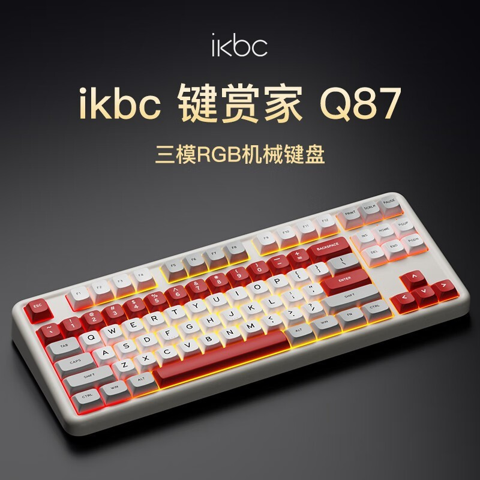

这个月入手了IKBC鉴赏家Q87机械键盘，以下是我的使用体验。

买机械键盘的动因是家里用的那台MBP键盘有几个按键明显出现按压后回弹异常，虽然不影响使用，字也能够敲得出来，但是担心万一有一天字打不出来影响使用那就麻烦大了，防范于未然，趁着这波国家补贴，就决定买一款机械键盘。

其实10年前机械键盘鼻祖CHERRY就已经开始流行了，我印象中卖得非常贵，随便一款就要六七百块钱。前几年它的专利过期，国产机械键盘于是遍地开花。现在随便在网上搜一圈，少说几十上百个品牌，从99元到3999元，各种价位的键盘评测文章视频到处都是，真得看花眼都不知道选谁。

最后结合同事和身边朋友的推荐，我买了三款回来，分别是**雷神ONCE81**、**达尔优A98Pro**和**IKBC鉴赏家Q87**。我从价格、颜值、配置、关注度、使用体验等方面说一下最终选择IKBC鉴赏家Q87的原因。

1. **雷神ONCE81**价格495元，电池容量4000mAh。红白机复古风格，它有一个LCD显示屏，可以显示剩余电量、连接模式、日期时间这些，右边还设计了一个可以旋转调节的按钮，设计还是挺能打的，也非常好看。毕竟是消费电子品牌大厂，它的macOS适配效果在三款中最佳，F1到F12功能键跟MBP自身键盘完全兼容，京东自营店铺关注人数240多万。
2. **达尔优A98Pro**价格221元，电池容量4000mAh。第一眼让我惊鸿一瞥，我觉得是三款中最好看的。厂家随键盘赠送了一个简易的透明遮尘罩，非常贴心实用。我要是用于Windows电脑，肯定就选它了。它的macOS适配效果三款中最差，F1到F12那一排功能键只有两三个适配成功，差强人意，其京东自营店铺关注人数20多万。
3. **IKBC鉴赏家Q87**价格220元，电池容量8000mAh。手感是三款里面最重的，可能跟电池容量有关系。它的颜值中规中矩，没达尔优惊艳，我甚至觉得可以被达尔优秒杀掉。不过适配macOS效果还不错，主要的功能键都适配成功。我买的这款送了一个手拖，我觉得聊胜于无，不如送防尘罩实用。IKBC京东自营店铺关注人数20多万。

键盘轴体什么的我关注得不多，国产轴体发明了太多名词我根本分不清楚它们有什么区别，只要敲击声音不太吵就行，我买的这三款都是差不多的麻将音，按键的回弹速度有些细微差别，我没太在意，也不是我关注的重点。本来还打算买两款抖音B站里评测很火的狼蛛狼途之类的回来，看了一下它俩京东自营店铺关注度太少就放弃了，我的预算是300元以内，最终就选择了IKBC。

用了一周后发现两个槽点，之前购买时没考虑全面，我也写一下。

1. 目前市面上机械键盘的键帽基本上都是不透光材质，做不到MBP自带键盘的那种透光性，晚上关灯环境下使用，苹果电脑键盘的透光性可以让你看清楚你敲的是哪个键，不至于敲错。市面上有透光性好的键盘，我买的这款不是，大多数机械键盘也都不是。
2. 晚上睡觉或办公室中午午休环境下，机械键盘的敲击声还是有点响的，可能会影响别人休息，如果对键盘敲击声音比较敏感或担心打扰别人，可以选择静音轴体。

就写这么些吧，整体上来说IKBC这款键盘我还是挺满意的，聊天打字敲起来比以前爽多了。如果大家有更好的适配macOS的机械键盘，欢迎给我推荐。

（最后声明：此文非带货贴，纯个人使用体验，友好交流，非喜勿喷。）