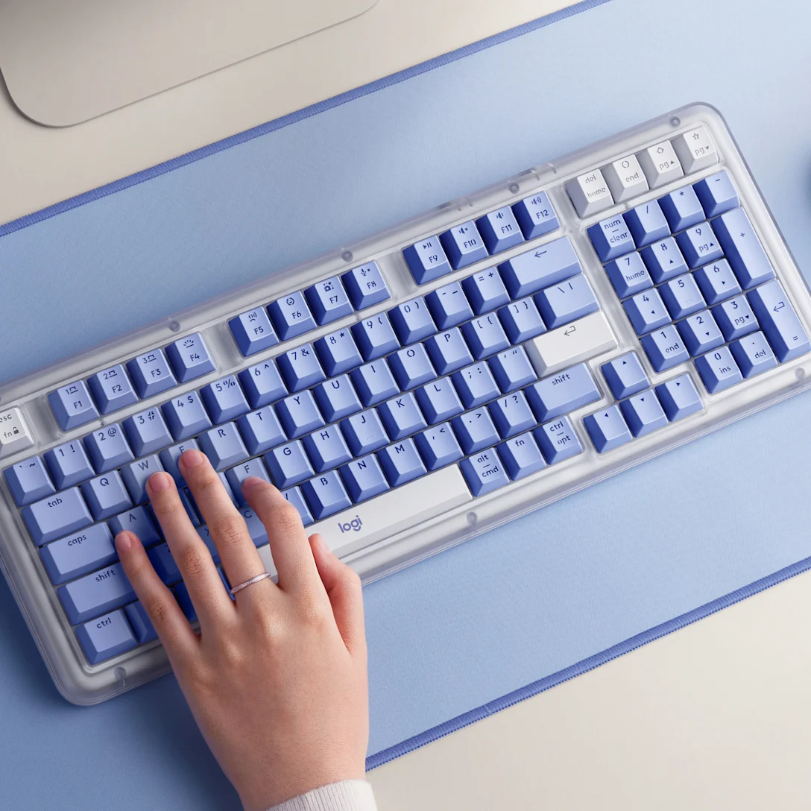

又买了一款机械键盘，这次买的是罗技ALTO KEYS K98M，国补价格431元，本来还打算再买两款回来进行比较，后来发现它非常好地解决我的一个痛点，就把它留了下来。

上一款机械键盘买的IKBC鉴赏家Q87，它的一些功能键适配macOS并不是很好，比如在我的macOS Mojave 10.14.5系统上，波浪号~就打不出来，但在另一台高版本的macBook上输出波浪号完全没问题。于是我想国际大厂出的键盘对macOS兼容性应该会更好一些（当然后来发现这完全是一个错误认知，macOS系统并未开放键盘协议给第三方厂商，除了苹果自家出的键盘，其余厂商都做不出完全与macOS兼容适配的键盘），所以这次只在CHERRY、罗技和雷神等几个大品牌里面选。

首先买回来的是CHERRY MX 2.0，国补价格299元。拿到手试用后发现它按键回弹不够灵敏，声音不干脆，后来与其它对比才发现它是MX结构并不是Gasket结构，并且它只支持连接一台设备，电池容量1500mAh。我突然就明白，CHERRY键盘的知名度高，这种300-400价位的入门键盘是不会给什么好配置的，想买好的CHERRY键盘，你得多掏钱才行。

然后就分别选了一款罗技K98M和雷神T96，雷神这款300元，由于缺货没发，就只剩下罗技这款了。我买回来主要用于办公，并且都是用于苹果电脑。其它功能点都大同小异，意外发现它的键帽是透光的，这让我非常惊喜，因为我有深夜关灯敲键盘的习惯，**透光键帽**的好处是一片漆黑之中键帽由于透光，每个按键的字符可以清晰可见，打字时不会敲错，市面上绝大多数键盘都是背光键盘，只是按键底部会出现亮光，那种亮光不能让你晚上打字时可以看得清键盘上的按键。我之前还特地搜过透光键盘，但没有找到合适的。这次阴差阳错地被我买回来，本来还打算再买两款回来进行比较，出于这个痛点把它留了下来。

此外这款键盘的按键回弹很舒服，声音清脆，跟IKBC鉴赏家Q87的麻将音完全不同，高版本的macOS还可以安装一个罗技的软件，让你自定义F1-F12功能键（这个功能我还没试），整体来说我觉得手感很不错。

要说罗技K98M的缺点也不是没有，它不是三模连接方式，只能使用蓝牙和USB连接器与电脑连接，并且电池容量也很小，只有1500mAh，如果你是Windows系统，选国产品牌的键盘，电池容量翻一倍价格是它的一半都不到。

用机械键盘的初衷是，延长苹果电脑自带键盘的使用寿命，我家里这台老的macbBook，自带键盘好几个按键已经进入生命末期，按压后明显出现回弹迟滞；使用机械键盘另外一个好处是保护你的颈椎，因为你用机械键盘之后，就必然会使用支撑架把电脑抬高，坐在电脑桌前眼睛自然就是平视电脑屏幕，显著解决低头现象。