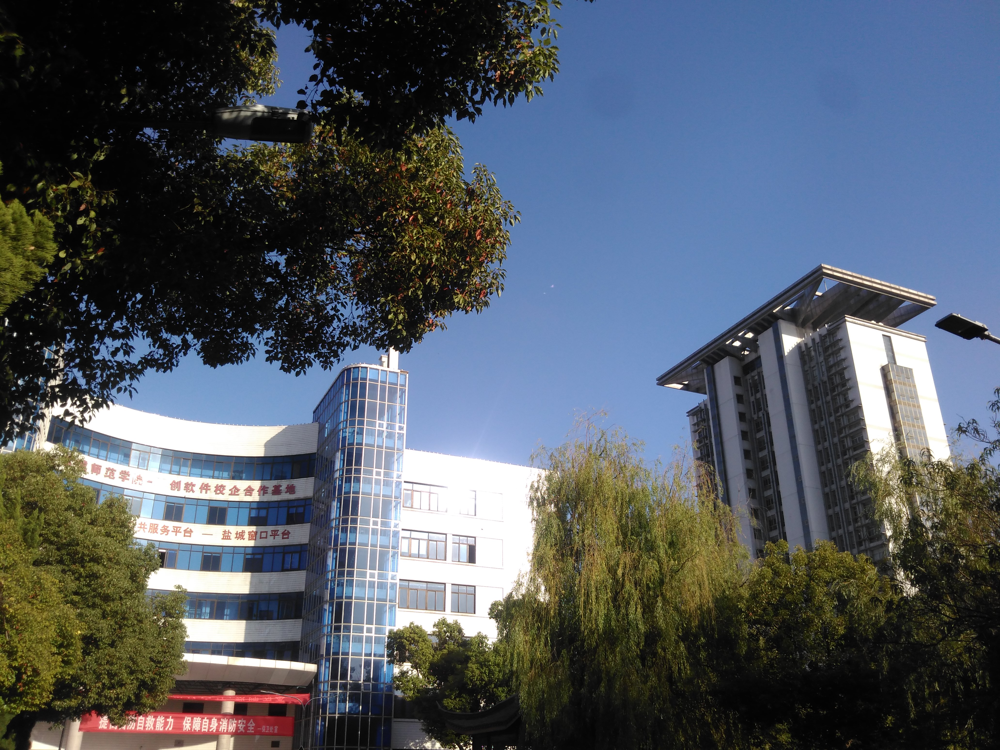

上周去盐城参加大学同学婚礼，时隔5年，再次回到母校。2012年我回去过一次，那时刚出校门两年，上海的一切都感觉新鲜，一个人回去，没人作伴，在校园里转了一圈，没感觉离毕业有多遥远。

#### 关于大学的回忆

转眼间，我们都已经是30岁的人，算算离我们大一进校园那会儿，已经11年过去了，打车到盐师门口的那一瞬间，那感觉像极了2006年家人带我去学校报到的场景，对面街道上的网吧、面馆、校门口附近的眼镜店、打印店、工行的ATM机......初入校门的那种感觉一幕幕映入眼帘。

我们在校园里走走逛逛，回忆着读书那时的一切，大家有说有笑，一件件囧事不断从大伙的回忆里蹦出来，有些记得很清楚，有些已经完全没印象，很多情景历历在目。老校区没多大变化，因为地处市中心，能够用于扩建的土地面积有限，我们大一那会儿就在市郊建了新校区，现在大部分院系都搬过去了，留在老校区的学生和教职员工少了将近一半，冷清很多。

来一张盐师的近照。

<!--more-->

#### 尴尬的高考分数

2006年高考，我的分数并不理想，领成绩单前预估分数，我预计有560分左右，结果只有519分，仅仅过二本线几分，很尴尬的成绩，我填的省会学校全部掉档，“阳光招生”计划把我调剂到了盐城师范学院。

##### 理综考得最糟糕

我记得很清楚，数学分我估得很准，预计118实际得了116分；英语预计118，结果只有108；语文估105分，实际95左右，因为有作文和主观题，语文分数并不好估；反正语数外三门总分实际结果和我预估的差不多。理综完完全全考砸了，物理没考好，生物得分低得超出我的想象，好像没超过30分，要知道理综三门每门满分都是100分。当时我挺不服气的，很怀疑是不是“生物试卷改分改错了”或者“统计错误”之类的情况发生，但怀疑也没办法，最终只能接受519分这个现实，去了盐城师范学院，读了师范类的计算机专业。

##### 意向中的专业是？幸好没有上

知道当初我想填报的第一专业是什么吗？说出来现在自己都觉得莫名其妙，当时填的第一专业是市场营销，后面几个想填的专业好像都跟商科有关，反正压根就没想过学计算机。现在回头来看，庆幸当年没有学那什么市场营销，学那个搞不好现在会混得更糟，为什么这么说，原因后面会讲。

##### 沉迷网游

学校不是我选的，专业也不是自己喜欢的，可想而知，我在大学过得有多郁闷了。大学第一年，我们开C语言课，一堂理论，一堂上机实操，在Turbo C编译器里面敲C语言代码，学了没多久就讨厌C语言，感觉无聊、枯燥、不知道学这玩意儿能干嘛。很快在校门口的网吧找到归宿，办了张会员卡，从此便是那儿的常客，那时流行一句话“男生的电脑是游戏机，女生的电脑是DVD”，大一厌学情绪产生后，我就沉迷网游了，那时玩得最多的一款游戏叫《水浒Q传》，Q版卡通人物、2.5D、RPG角色扮演。每次一戴上耳机，战斗一开打，我就沉迷到自己的游戏世界里面，幻想自己是一个骑着马的侠客，仗剑走天涯。课堂上，教我们C语言的院长在黑板前写写画画、讲得唾沫横分，我坐在下面脑子里想的全是如何打怪升级，结果可想而知，期末考试挂两科，一门C语言、一门计算机导论，都是必修专业课。年轻的班主任老师很有责任心，果断在学期末打电话到我家，对我进行批评教育。过年亲戚们串门做客，我叔叔跟我说“你这个老师还挺负责，不是我听说一般大学老师都不管学生成绩的么...…”。第二学期奋发图强，补考轻松过关，高等数学破天荒考了95分，拿了一次三等奖学金，300块，很快这钱就被我冲进网吧会员卡。

##### 二本大学的学生普遍缺乏方向感和目标

大二后课程内容明显增多，课程难度也逐步加大。我们是师范类计算机，培养方向是回去当计算机老师，但不知道教学大纲是怎么制订的，学的内容多而且杂。

> 专业课几乎覆盖计算机各个方向，组成原理、操作系统、程序设计原理、编译原理、数据库、算法与数据结构、网络原理、信息论……
>
> 计算机需要数学基础，于是我们上高等数学、离散数学、线性代数......
>
> 要当老师呢，教育心理学我们也开......
>
> 电路基础得懂一点吧，我们学物理电路、逻辑电路，去物理楼做与非门实验......
>
> 不知道咋回事，大一到大三，英语一直都在上......

我和大多数同学一样，没有具体目标，学校安排什么课就去上什么，考试能过关就行。虽然对软件一点兴趣都没有，但不知道是教网络原理的老师课讲得有意思，还是网络原理比较好学，我对OSI 7层架构、TCP/IP协议、收发数据包的滑动窗口协议、路由器、交换机配置等等这些网络工程的内容兴趣十足，去旁听网络工程专业的Linux课，先后考过《网络管理员》和《网络工程师》两个证书，分数还都挺高，让网络专业的同学刮目相看，如果不是大四我们去常熟参加了IBM-ETP培训，可能毕业后就走网络工程这条路了。

##### 对编程重要性的认识

很多年后，我才意识到，真想把网络原理学好，其实也还是需要懂编程的。TCP/IP协议或者什么路由协议你再熟悉、或者对路由器配置组网再熟练，它们也需要通过程序去实现游戏规则，需要通过程序去实现彼此之间的通信。

这次同学结婚，我和他们感慨，小强（一毕业进阿里巴巴，干了4年后拿到公司股票，我们宿舍的人生赢家）读大学那会儿（10年前）就开始看《人月神话》和Ajax方面的东西，我是到2016年才开始读《软件随想录》《简约之美》这类讲软件设计的书，今年才看Ajax具体的实现方式，相比之下，这差距就拉开很远。

#### 一些认识和思考

毕业工作这么些年后，随着认知的提升，阅历的丰富，我想明白了很多事情。比方说，几乎每一个考二本的人都会认为自己当年高考没考好，然后会心高气傲，做事眼高手低，认为自己很了不得，其实大多数不过如此，哈哈，这典型说的就是我自己。

##### 认命：自己就只有考二本大学的能力

得承认确实有高考发挥失常的情况，但毕竟是少数，绝大多数人（包括我自己）其实也就只具备考二本的实力。为什么这么说？因为绝大多数人都会高估自己的实力，每个人对自己的认识都有很主观的成分，随着年龄增长、阅历丰富、认知健全起来后，逐渐趋于客观理性地认识自己，古人说的“四十不惑，五十知天命”可能也含有这层意思在里面吧。

##### 名校比非名校强在哪些地方？

第二点想明白了名校学生比非名校学生强在什么地方。人群中智商成正太分布排列，这大家都知道。顶尖名校（中科大少年班、清北复交等）招收的学生可能智商确实比普通人高一些，但天才毕竟是少数，绝大多数名校生智商和我们其实差不多，那为什么他们比我们强呢（普遍来说）？我觉得大概有这几点。

> 1、学习方法对路，理解能力强，他们在这两块做得比我们好。比如很多年后，我才知道考试过程中，不应该追求做完题后，用多余时间把答案检查一遍；而应该追求一次性把题做对，做完后不检查，因为检查多半没用，你的思维方式是固定的，即使有错，你多半也检查不出来。这是吴军在《硅谷来信》里面讲的一点应试法则。
>
> 2、名校师资力量强，尖子生加名师，产生正反馈，形成"强者更强"的马太效应。
>
> 3、心智成熟，这表现在很多方面，比如当年我拉同学去听安利的营销课，他听一次就觉得不靠谱，理由是“一个容易赚钱的生意，别人是不会拿出来跟陌生人分享的”，好多年后我才明白这个道理。
>
> 4、目标明确，方向感强，很早或者较早地就知道自己想要什么，其实第四点可以归结进第三点。

#### 幸好学的是软件编程

没有考上好大学，但庆幸的是无意中选对了好专业，并且计算机这门专业非常培养逻辑思维能力和动手能力，你需要大量时间思考和编码，才能达成目标，不像“市场营销”这类专业，很多人在学校混4年都能够毕业，学不到多少实质性的东西。

有一句玩笑话说“未来社会不懂编程的人就如同《哈利波特》世界里不会魔法的麻瓜”，这话虽有些绝对，但说得很形象。其实技术变革对人类社会的影响是最大最深远的，我选对了好专业，很长时间里面却一直没有拿它当回事，在今年大量阅读技术博客和行业大拿们的文章后，在大学里面没有好好学编程，有时感觉很遗憾，但没办法，那个时候认识不到这么多。

现在想把代码写好，欠缺的那些东西只能一点点地补了......

##### 编程这份职业错选了COBOL这门语言...

走上编程这条路，还有一点遗憾的是选错了语言。大四那年，我们参加江苏省教育厅联合IBM等机构举办的第一届IBM-ETP培训，学了COBOL和日语，走进了主机编程这条路，工作7年之后才发现COBOL这门语言有其极大的局限性，而且完全落后于整个软件产业的发展，蓦然步入三十而立的年头，突然发现自己掌握的是一门日趋衰退的技能，以后可能会面临艰难转型的处境，有时候会焦虑，一声叹息，但又能怎么办呢？

只能重新选择一条赛道，栉风沐雨，砥砺前行。