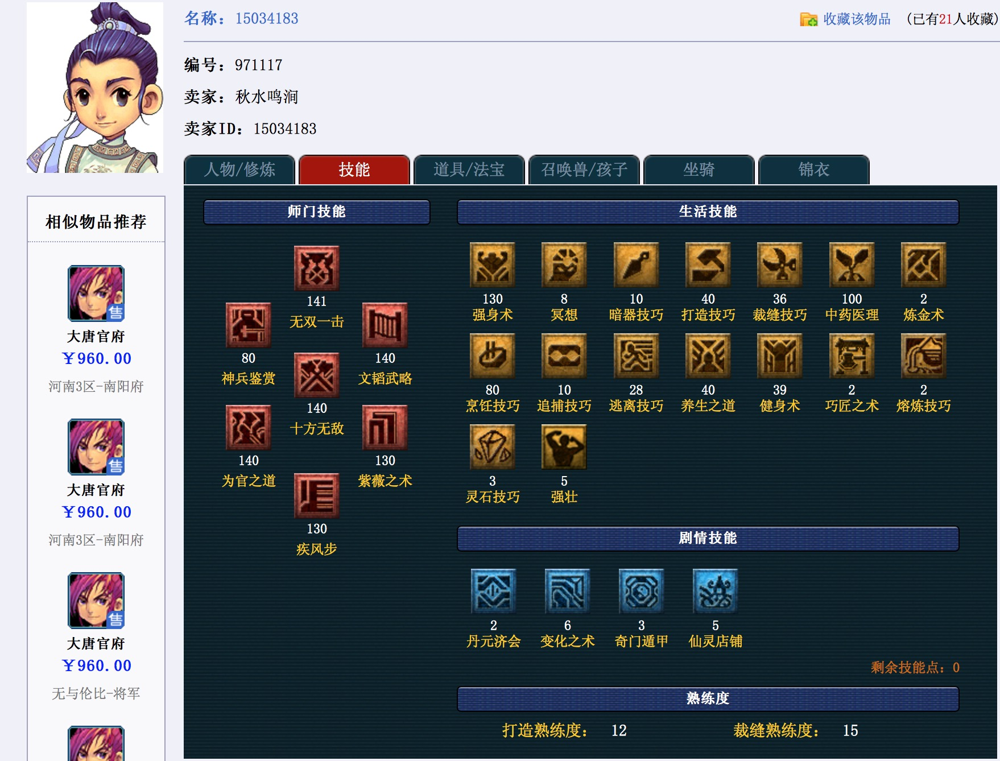

（题图来自梦幻西游官方壁纸）

今天收到网易游戏发来的短信通知，挂在藏宝阁里面的游戏帐号交易成功，卖了1200块，扣除60元手续费，我可以拿到1140块。

前两天还担心这破号没人要，寻思着是不是要把价格调低一点出手（游戏帐号贬值很快，梦幻西游是一款问世了十几年的老游戏），今天早上被土豪直接秒掉（我设置了可还价，我的底价是950元，对方没还价直接买走），瞬间有种“喜大普奔”的感觉。

这是我3年前买的帐号，玩了半年后放那儿一直没动，本来打算留着珍藏。去年想着，玩游戏的时间越来越少，游戏帐号砸手里只会一直贬值，没意义，还不如把号卖掉。于是11月份把号上架，挂了1000块，有好几个人来询价，但没达到我的心里价位，没卖出去。

<!--more-->

**春节临近，消费欲望被刺激起来**。<u>我心想，学生们年底都有钱，平时舍不得买的东西可能这时候会出手，我把价格调一调，或许可以卖个好价钱。</u>提价到1200块，打算被人砍个一、两百块就脱手，没想到直接被秒掉。我猜对方可能是个大学生吧，有消费能力，又有打游戏的时间，学习枯燥，玩游戏来解闷；应该是个老玩家，对这游戏有感情，和我一样，愿意花钱买高级号玩。

我特意翻了一下购买记录，2014年3月份买的，1030元。<u>不考虑货币贬值，不考虑其它游戏花费，这帐号赚了110块钱。</u>

下面是游戏角色截图，数据属性还是不错的。

技能质地也不差。

召唤兽（俗称“宝宝”）都一般般，就这个孩子能拿得出手。非RMB玩家，我的角色装备差点，就不贴图了。

成交记录截图。

有点小感慨，网易的游戏真不赖，第一次玩梦幻西游是2005年，那时我上高三。过了十几年，这游戏现在依然火爆，**4年前的帐号，搁现在还能卖出去赚钱**，估计也“只此一家，别无他店”了吧。