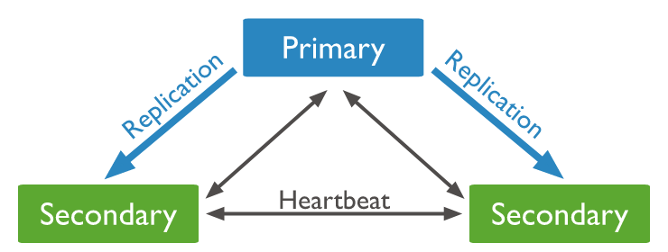
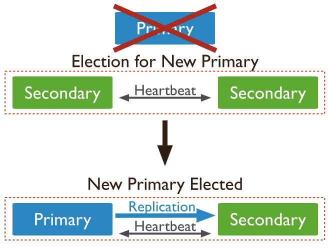
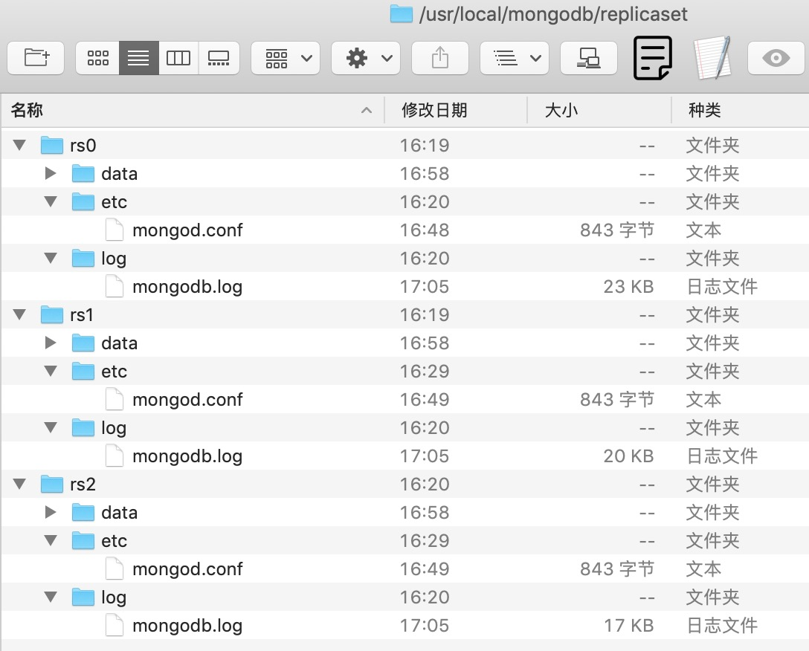
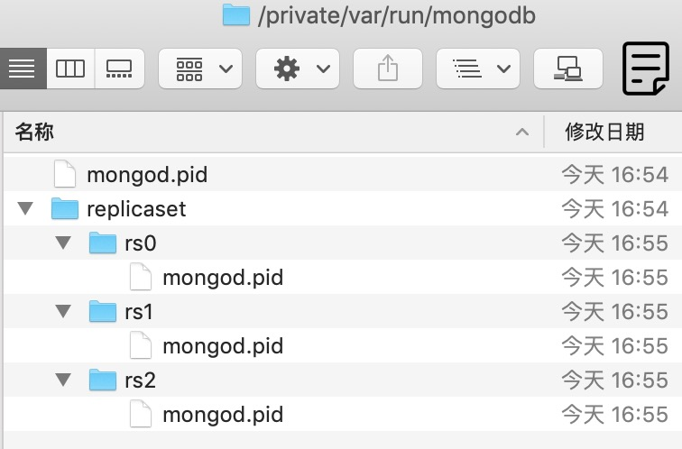

半年前写过一个爬虫程序，用MongoDB作为持久化工具。今天把之前的爬虫程序整理一番，发现对MongoDB的操作有点生疏，在此做一个整理。

本文只讲解macOS系统下MongoDB的使用方式，版本号是v4.2.8，不涉及Windows或Linux系统，如果存在偏差，请自行查阅相关文档。

### Standalone模式

我们知道，mongodb启动的命令是`mongod`，它有两种方式启动，一是命令行带参数，二是配置文件方式。用命令行带参数启动方式比较简单省事，甚至你直接在终端里输入`mongod`就可以启动MongoDB服务（注意，这种方式启动成功的前提是已经创建好`/data/db`目录，并且设置成功相应的权限，`/data/db`目录是MongoDB默认存放数据的地方，就和MySQL一样数据库里每一条记录最终会存储在硬盘的某一个文件夹下面一样（在MySQL shell里输入`show variables like '%datadir%'`即可查看数据库对应文件夹的位置）；只不过MongoDB需要自己先定义好）。

一般情况下，都应该使用指定配置文件方式启动。

- 命令行方式启动 
  这种方式就是启动的时候不用配置文件，配置文件里的配置项都直接写在命令行上。

  `mongod --dbpath=/usr/local/mongodb/data/ --logpath=/usr/local/mongodb/log/mongodb.log`

  命令行方式比较繁琐，而且需要手动敲一长串参数文件，不常用。

  

- 配置文件方式启动

  将默认启动参数以yaml文件格式写到一个配置文件里。使用`mongod -f /XXX/mongod.conf`方式启动。

  

下面便是我使用的配置文件，路径我选择使用`/usr/local/mongodb/etc/mongod.conf`。

```
# for documentation of all options, see:
#   http://docs.mongodb.org/manual/reference/configuration-options/

# where to write logging data.
 systemLog:
    destination: file
    logAppend: true
    path: /usr/local/mongodb/log/mongodb.log

# Where and how to store data.
 storage:
    dbPath: /usr/local/mongodb/data/
    journal:
        enabled: true

# how the process runs
 processManagement:
    fork: true  # fork and run in background
    pidFilePath: /var/run/mongodb/mongod.pid  # location of pidfile

# network interfaces
 net:
    port: 27017
    bindIp: 127.0.0.1  

 security:
    authorization: enabled
```

启动命令：

```
mongod -f /usr/local/mongodb/etc/mongodb.conf
```

如果启动成功，在浏览器打开http://localhost:27017 ，能看到以下提示信息。

```
It looks like you are trying to access MongoDB over HTTP on the native driver port.
```


### ReplicaSet模式

上面使用**单机（Standalone）**模式启动MongoDB，实际生产环境中，单机模式面临着很大的风险，一旦数据库服务出现问题，就会导致线上服务出现异常甚至崩溃，我们需要对MongoDB做相应的主备处理，提高数据库服务的可用性。这就是**复制集（Replica Set）**模式。

Replica Set是一堆mongod实例集合，它们有着同样的数据内容，包含三类角色：

1. 主节点（Primary）：接收所有的写请求，然后把修改同步到所有Secondary。一个Replica Set只能有一个Primary节点，当Primary挂掉后，其他Secondary或者Arbiter节点会重新选举出来一个主节点。默认读请求也是发到Primary节点处理的，如需要转发到Secondary需要客户端修改一下连接配置。
2. 副本节点（Secondary）：与主节点保持同样的数据集。当主节点挂掉的时候，参与选举。
3. 仲裁者（Arbiter）：不保存数据，不参与竞选，只参与投票。使用Arbiter可以减轻数据存储的硬件需求，运行Arbiter的机器不需要过高的资源需求，它的作用是当两个Secondary节点投票结果一致时，可以决定哪一个节点胜出升级为Primay节点；很重要的一点是，在生产环境下它和其他数据节点不要部署在同一台机器上。

注意，一个自动failover的Replica Set节点数必须为奇数，目的是选举投票的时候要有一个大多数才能进行选主决策。

贴两张图展示一下复制集模式，详细介绍请自行搜索查阅。





复制集模式，需要分别启动3个独立的`mongod`服务，我创建了一个新文件夹replicaset用于存放3个节点的数据，如下所示。




在`/var/run`目录下创建replicaset文件夹，在里面存放3个节点各自对应的PID文件。



下面列出其中一个节点rs0的配置文件信息，rs1和rs2参照rs0配置即可，端口号依次用27017、27018、27019。

```
# where to write logging data.
 systemLog:
    destination: file
    logAppend: true
    path: /usr/local/mongodb/replicaset/rs0/log/mongodb.log

# Where and how to store data.
 storage:
    dbPath: /usr/local/mongodb/replicaset/rs0/data/
    journal:
        enabled: true

# how the process runs
 processManagement:
    fork: true  # fork and run in background
    pidFilePath: /var/run/mongodb/replicaset/rs0/mongod.pid  # location of pidfile

# network interfaces
 net:
    port: 27017
    bindIp: 127.0.0.1

 security:
    authorization: disabled

 replication:
   oplogSizeMB: 64
   replSetName: rstest
```

打开终端，依次执行下面3条命令，即启动了3个mongod后台服务。

`mongod -f /usr/local/mongodb/replicaset/rs0/etc/mongod.conf`

`mongod -f /usr/local/mongodb/replicaset/rs1/etc/mongod.conf`

`mongod -f /usr/local/mongodb/replicaset/rs2/etc/mongod.conf`


#### 1. ReplicaSet初始化

在终端输入mongo（不指定节点IP地址和端口号，默认等同于输入mongo 127.0.0.1:27017），输入`rs.status()`命令，可以看到replset当前没有初始化。

```shell
> rs.status()
{
	"ok" : 0,
	"errmsg" : "no replset config has been received",
	"code" : 94,
	"codeName" : "NotYetInitialized"
}
```


整理如下replset配置信息，执行`rs.initiate(conf)`命令，返回`{ "ok" : 1 }`表示节点部署成功。

```
conf = {
    "_id" : "rstest",
    "members" : [
        { "_id" : 0,  "host" : "127.0.0.1:27017" },
        { "_id" : 1,  "host" : "127.0.0.1:27018" },
        { "_id" : 2,  "host" : "127.0.0.1:27019" }
    ]
}
```

部署成功后，会自动选举一个Primay节点。

输入`rs.status()`查看状态（我用`......`省略掉无效内容），可以看到members数组里有三个成员，`stateStr`代表节点的类型；`health`代表节点的状态，1表示健康；注意看27018和27019两个节点里有`syncingTo`这个参数，表示它们与27017保持同步。

```
{
	"set" : "rstest",
	"date" : ISODate("2020-07-08T14:37:09.527Z"),
	"myState" : 1,
	......
"members" : [
		{
			"_id" : 0,
			"name" : "127.0.0.1:27017",
			"health" : 1,
			"state" : 1,
			"stateStr" : "PRIMARY",
			"uptime" : 100,
			"optime" : {
				"ts" : Timestamp(1594259842, 1),
				"t" : NumberLong(1)
			},
			"optimeDate" : ISODate("2020-07-09T01:57:22Z"),
			"syncingTo" : "",
			"syncSourceHost" : "",
			"syncSourceId" : -1,
			"infoMessage" : "could not find member to sync from",
			"electionTime" : Timestamp(1594259802, 1),
			"electionDate" : ISODate("2020-07-09T01:56:42Z"),
			"configVersion" : 1,
			"self" : true,
			"lastHeartbeatMessage" : ""
		},
		{
			"_id" : 1,
			"name" : "127.0.0.1:27018",
			"health" : 1,
			"state" : 2,
			"stateStr" : "SECONDARY",
			"uptime" : 55,
			"optime" : {
				"ts" : Timestamp(1594259842, 1),
				"t" : NumberLong(1)
			},
			"optimeDurable" : {
				"ts" : Timestamp(1594259842, 1),
				"t" : NumberLong(1)
			},
			"optimeDate" : ISODate("2020-07-09T01:57:22Z"),
			"optimeDurableDate" : ISODate("2020-07-09T01:57:22Z"),
			"lastHeartbeat" : ISODate("2020-07-09T01:57:24.583Z"),
			"lastHeartbeatRecv" : ISODate("2020-07-09T01:57:25.341Z"),
			"pingMs" : NumberLong(0),
			"lastHeartbeatMessage" : "",
			"syncingTo" : "127.0.0.1:27017",
			"syncSourceHost" : "127.0.0.1:27017",
			"syncSourceId" : 0,
			"infoMessage" : "",
			"configVersion" : 1
		},
		{
			"_id" : 2,
			"name" : "127.0.0.1:27019",
			"health" : 1,
			"state" : 2,
			"stateStr" : "SECONDARY",
			"uptime" : 55,
			"optime" : {
				"ts" : Timestamp(1594259842, 1),
				"t" : NumberLong(1)
			},
			"optimeDurable" : {
				"ts" : Timestamp(1594259842, 1),
				"t" : NumberLong(1)
			},
			"optimeDate" : ISODate("2020-07-09T01:57:22Z"),
			"optimeDurableDate" : ISODate("2020-07-09T01:57:22Z"),
			"lastHeartbeat" : ISODate("2020-07-09T01:57:24.583Z"),
			"lastHeartbeatRecv" : ISODate("2020-07-09T01:57:25.340Z"),
			"pingMs" : NumberLong(0),
			"lastHeartbeatMessage" : "",
			"syncingTo" : "127.0.0.1:27017",
			"syncSourceHost" : "127.0.0.1:27017",
			"syncSourceId" : 0,
			"infoMessage" : "",
			"configVersion" : 1
		}
	],
	......
}
```

注意：

1. 如果以上部署不成功，将3个节点`dbPath`文件夹下面的内容清空重新部署即可。

2. 上述操作都在27017这个节点的`mongo`这个shell里完成。

   

如果第一次只部署一个节点，第一个节点会默认设置为Primary节点；后续再添加的节点，会自动成为Secondary节点。

```
conf = {
    "_id" : "rstest",
    "members" : [
        { "_id" : 0,  "host" : "127.0.0.1:27017" }
    ]
}
```

登录一个`mongo终端`（默认使用27017），执行`rs.initiate(conf)`成功后。

```
{
	"set" : "rstest",
	"date" : ISODate("2020-07-09T02:13:29.964Z"),
	"myState" : 1,
	"term" : NumberLong(1),
	"syncingTo" : "",
	"syncSourceHost" : "",
	"syncSourceId" : -1,
	......
	"members" : [
		{
			"_id" : 0,
			"name" : "127.0.0.1:27017",
			"health" : 1,
			"state" : 1,
			"stateStr" : "PRIMARY",
			"uptime" : 327,
			"optime" : {
				"ts" : Timestamp(1594260802, 7),
				"t" : NumberLong(1)
			},
			"optimeDate" : ISODate("2020-07-09T02:13:22Z"),
			"syncingTo" : "",
			"syncSourceHost" : "",
			"syncSourceId" : -1,
			"infoMessage" : "could not find member to sync from",
			"electionTime" : Timestamp(1594260802, 2),
			"electionDate" : ISODate("2020-07-09T02:13:22Z"),
			"configVersion" : 1,
			"self" : true,
			"lastHeartbeatMessage" : ""
		}
	],
	......
}
```


再依次执行`rs.add("127.0.0.1:27018")`和`rs.add("127.0.0.1:27019")`将另外两个节点加入`rstest`这个复制集，也可以得到和上面相同的结果。


#### 2. 验证ReplicaSet部署结果


进入Primary节点，写入数据：

```shell
rstest:PRIMARY> use test
switched to db test
rstest:PRIMARY> show collections
rstest:PRIMARY> db.test.insert({'name': 'jackson'})
WriteResult({ "nInserted" : 1 })
rstest:PRIMARY> show collections
test
rstest:PRIMARY> db.test.find()
{ "_id" : ObjectId("5f06e0a7051a1b4f12f407bb"), "name" : "jackson" }
```


进入Secondary节点，查看数据：

```shell
rstest:SECONDARY> rs.slaveOk()
rstest:SECONDARY> use test
switched to db test
rstest:SECONDARY> show collections
test
rstest:SECONDARY> db.test.find()
{ "_id" : ObjectId("5f06e0a7051a1b4f12f407bb"), "name" : "jackson" }
```


#### 3. ReplicaSet pymongo连接测试

MongoDB连接字符串：

对于单机模式下的数据库连接，使用`mongo://127.0.0.1:27017/test`进行连接；

对于复制集模式，除了上面的方式外，也可以使用

`mongodb://127.0.0.1:27017,127.0.0.1:27018,127.0.0.1:27019/test?replicaSet=rstest`进行连接。


```
mongodb://[username:password@]host1[:port1][,host2[:port2],...[,hostN[:portN]]][/[database][?options]]
```

测试代码如下：

```python
# -*- coding: utf-8 -*-
"""
测试读取replicaset数据
"""

import pymongo

# client = pymongo.MongoClient('localhost',27019)
client = pymongo.MongoClient('mongodb://127.0.0.1:27017,127.0.0.1:27018,127.0.0.1:27019/test?replicaSet=rstest')

db = client['test']
table = db['test']

content = [item for item in table.find()]
print('content:', content)

```


#### 4. 关闭方法

关闭方法：

1. 使用./mongo进入shell控制台，输入use admin，然后输入db.shutdownServer()关闭服务。

2. 直接kill进程号

   

**参考资料：**

- [MongoDB安装、配置、启动（MAC）](https://blog.csdn.net/u010311313/article/details/46948995)
- [Mac环境下安装和配置MongoDB](http://www.imooc.com/article/22733)
- [MongoDB Tutorial](http://api.mongodb.com/python/current/tutorial.html)