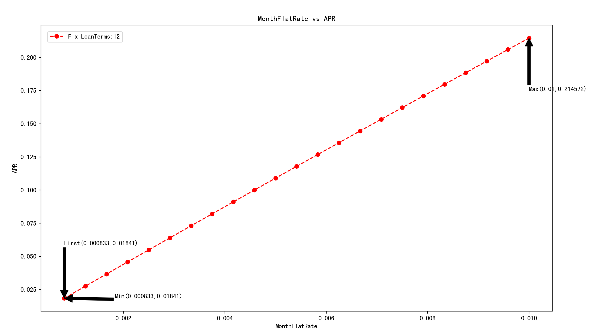

（Photo by [Annie Spratt](https://unsplash.com/photos/nUZBAButMLA?utm_source=unsplash&utm_medium=referral&utm_content=creditCopyText) on [Unsplash](https://unsplash.com/search/photos/dollar?utm_source=unsplash&utm_medium=referral&utm_content=creditCopyText)）


在[通过月平息计算实际年利率](/2018/10/15/monthly-flat-rate/)一文，计算<u>**实际年利率(APR)**</u>过程中，我发现了三个特点。


1、APR的多少与贷款金额没有关系，给定<font color=FFC110>**月平息利率**</font>和<font color=FFC110>**贷款期限**</font>，就可以把APR算出来。

2、给定**月平息利率**后，并不是**贷款期限**越长，APR就越大，贷款期限与APR存在一个非线性关系。

3、给定**贷款期限**后，APR会随**月平息利率**增大而增大，它们也呈现出非线性关系。

<!--more-->

**固定年平息利率为2.5%，查看APR与贷款期限的关系**

当固定年平息利率为2.5%时，即月平息利率为0.2083%，贷款期限从6个月到360个月，APR取值如下图所示。


​					（横坐标：贷款期限；纵坐标：实际年利率APR）

第一个取值，APR最大那个值，APR最小那个值分别如下，也就是图中箭头标注的地方。

```python
First Terms & APR: 6 0.0427304399998
Max Terms & APR: 42 0.0475525199998
Min Terms & APR: 360 0.0415012799998
```


我们发现：

1.贷款期限从6个月增加到42个月过程中，APR会逐渐增大；

2.贷款期限等于42个月时，APR达到极大值，等于0.047553；

3.贷款期限从42个月增加到360个月过程中，APR逐渐减小；

4.贷款期限等于360个月时，APR达到极小值，等于0.041501；


------


**固定年平息利率为4.8%，查看APR与贷款期限的关系**

当固定年平息利率为4.8%时，即月平息利率为0.4%，贷款期限从6个月到360个月，APR取值如下图所示。


​							（横坐标：贷款期限；纵坐标：实际年利率APR）

第一个取值，APR最大那个值，APR最小那个值分别如下，也就是图中箭头标注的地方。

```python
First Term & APR: 6 0.0818222399996
Max Term & APR: 30 0.0896785199996
Min Term & APR: 360 0.0718505999997
```


我们发现：

1.贷款期限从6个月增加到30个月过程中，APR会逐渐增大；

2.贷款期限等于30个月时，APR达到极大值，等于0.089679；

3.贷款期限从30个月增加到360个月过程中，APR逐渐减小；

4.贷款期限等于360个月时，APR达到极小值，等于0.071851；

5.年平息利率增加后，APR取极大值的位置提前了；（年平息4.8%时，30期时APR最大；年平息2.5%时，42期最大）；


几乎可以肯定的是，如果贷款期限继续增大，APR还会继续减小，但一般来说，贷款的年期很少会超过30年，我们就不去进行后面的计算了。不过，我认为，即使APR继续减小，但它也是有一个极限值，这个极限值是多少，哪天有空我们再来推算它。


------


**固定贷款期限为12个月，查看APR与月平息利率的关系**

当固定贷款期限为12个月时，月平息利率从0.0833%到1%（即年平息利率从1％到12%），APR取值如下图所示。



​						（横坐标：月平息利率；纵坐标：实际年利率APR）

第一个取值，APR最大那个值，APR最小那个值分别如下，也就是图中箭头标注的地方。

```python
First Flatrate & APR: 0.000833333333333 0.01840968
Max Flatrate & APR: 0.01 0.214571640004
Min Flatrate & APR: 0.000833333333333 0.01840968

```


我们发现：

1.月平息利率从0.0833%增加到1%过程中，APR会逐渐增大；

2.APR与月平息利率的比值，第一期为0.01841/0.000833=22.1008，最后一期为0.214572/0.01=21.4572；

3.APR与月平息利率的比值逐渐减小；

4.APR与月平息利率看图形感觉像是线性关系，但实际是非线性关系；


------


**固定贷款期限为48个月，查看APR与月平息利率的关系**

当固定贷款期限为48个月时，月平息利率从0.0833%到1%（即年平息利率从1％到12%），APR取值如下图所示。


​						（横坐标：月平息利率；纵坐标：实际年利率APR）

第一个取值，APR最大那个值，APR最小那个值分别如下，也就是图中箭头标注的地方。

```python
First Flatrate & APR: 0.000833333333333 0.01934748
Max Flatrate & APR: 0.01 0.207536160002
Min Flatrate & APR: 0.000833333333333 0.01934748
```


我们发现：

1.月平息利率从0.0833%增加到1%过程中，APR会逐渐增大；

2.APR与月平息利率的比值，第一期为0.019347/0.000833=23.22569028，最后

一期为0.207536/0.01=20.7536；

3.APR与月平息利率的比值逐渐减小；

4.APR与月平息利率看图形感觉像是线性关系，但实际是非线性关系；

5.APR与月平息利率的比值在一个常数附件波动，因此有"<font color=FFC110>**<u>将月平息乘以常数21.5就近似得到APR的值</u>**</font>"这一说法；


可以推测的是，如果月平息利率继续增大，APR会随之继续增大，APR与月平息利率的比值将会继续减小；由于金融机构发放贷款的利率严格受到政府监管，上述计算中，月平息利率上限我使用了1%，这个值已经很大了；再大就显得不太现实，过高的利率，监管机构是不会准许的，客户也不会傻到以这么高的利率来借钱。

但从数学计算的角度，即便月平息利率真的可以无限大，我觉得APR最终也会达到一个极限值，无法再增加下去。