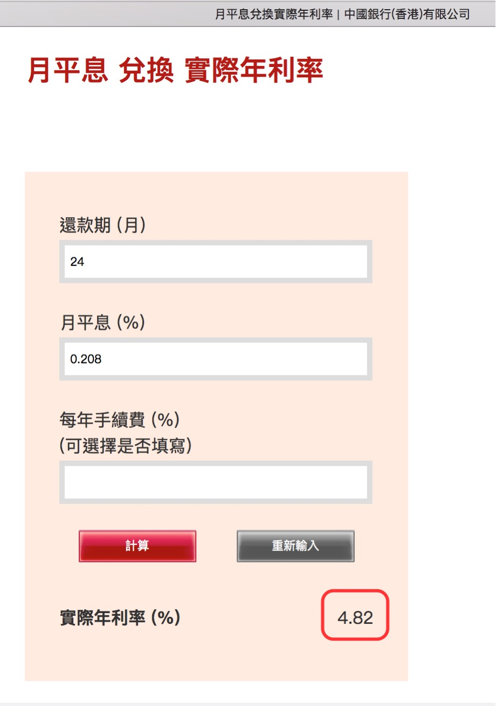
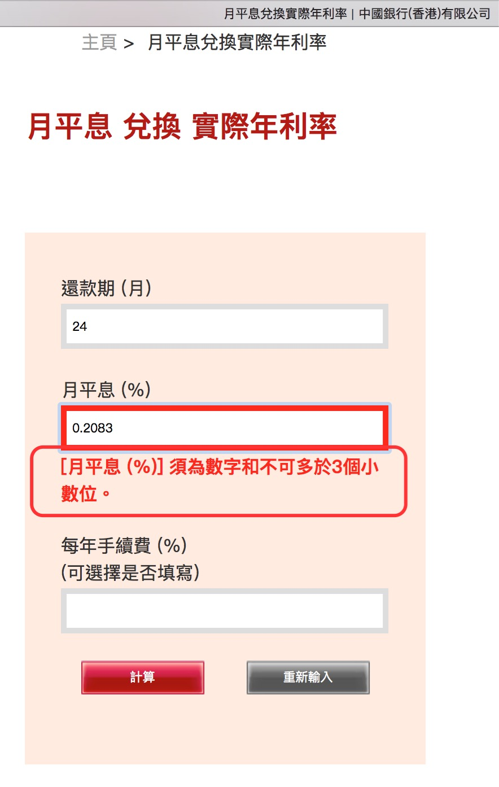
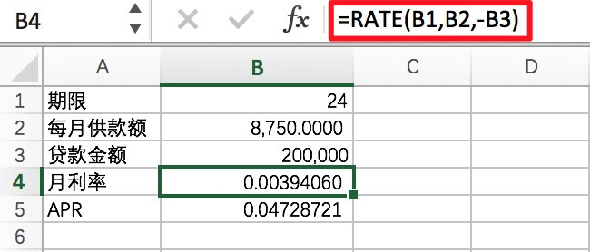

(Photo by [Kenny Luo](https://unsplash.com/photos/1QbVbWjh9uY?utm_source=unsplash&utm_medium=referral&utm_content=creditCopyText) on [Unsplash](https://unsplash.com/search/photos/flat-rate?utm_source=unsplash&utm_medium=referral&utm_content=creditCopyText))


很多金融机构发放贷款都以"月平息低至多少多少"作为卖点来吸引顾客，如果要知道这笔贷款的实际利率是多少，就需要转化为**<u>实际年利率(APR)</u>**进行计算比较。

比如，贷款20W，年平息2.5%（对应月平息就是2.5%/12=0.2083%），期限24个月，计算出贷款总利息为10,000，每月供款金额为8750.00，那么它的实际年利率是多少呢？

[中银香港](https://www.bochk.com/sc/home/calculators/flatratevsapr.html)提供了一种计算方法，但它有一个问题，它的月平息利率最多只能输入3位小数，算出来的值不够准确。

<!--more-->



此外，如果月平息利率想输入四位小数计算得更精确一些，如下图输入0.2083，它会直接提示报错。



可能这个网站一般人都不会去用吧，他们也就不去更新维护了，但作为金融领域专业人士的我（“咳咳”，有点吹牛逼了，请允许我往自己脸上贴这个金。），是无法容忍这个结果的。

要知道，小数精确位数不够，在金融领域实际计算出来的误差可以大到吓人啊。


我们得另谋它法。


在CCBA项目中，我们经常要对一笔Addon贷款进行实际年利率的计算，最开始就是用的这种方法，发现它计算出来的结果并不准确后，我们用了行方提供的一个Excel计算工具才得以解决问题。我们借鉴那个工具里面的Excel Rate函数来进行计算。


方法一：使用[Excel Rate函数](https://support.office.com/zh-cn/article/RATE-函数-9f665657-4a7e-4bb7-a030-83fc59e748ce)进行计算APR。


**Step1 - 根据年平息计算出每月供款额**

(20W+200,000\*2.5%*2)/24=8750


**Step2 - 根据等额本息月供款额计算公式，计算每个月的月利率**

200,000\*X\*(1+X)$^{24}$/[(1+X)$^{24}$-1]=8750

这是一个一元24次方程，它并没有一个固定的求根公式。你是无法通过解方程算X的值的。怎么办啊？Excel里面的Rate函数可以帮上忙。




**Step3 - 将每个月的月利率（单元格B4）乘以12就可以得到实际年利率APR**

APR=0.00394060*12=0.04728721


方法二：写一个Python程序来计算APR。（我发现Python语言干这种事情非常轻巧、方便。）


```python
#!/usr/bin/env python2
# -*- coding: utf-8 -*-
"""
Created on Sun Dec 16 11:26:42 2018
@author: jacksonshawn
"""

from __future__ import division
from math import pow

def calc_flat_2_apr(LoanMonthFlatRate, LoanTerms, *LoanAmt):
    
    '''
    calc_flat_2_apr: 根据月平息利率计算实际年利率(APR)

    参数依次为月平息利率, 贷款期限(单位月), 贷款金额
    月平息利率必输, 并且必须是月平息, 不能是年平息
    贷款期限必输
    贷款金额选输
    '''

    if len(LoanAmt) != 0:

        Month_repayment = LoanAmt[0] / LoanTerms + LoanAmt[0] * LoanMonthFlatRate
        Interest_tot = LoanMonthFlatRate * LoanTerms * LoanAmt[0]
        print "Month_repayment is:", Month_repayment
        print "Interest_tot is:", Interest_tot
    
    Max_MPR = 1 / LoanTerms + LoanMonthFlatRate
    
    # 给MPR变量分配一个初始值(根据实际取值的大小预估的初始值)
    MPR = 0.00000001

    while (MPR < Max_MPR):
            
        temp1 = pow((1 + MPR), LoanTerms)
        temp2 = MPR * temp1 / (temp1 - 1) 

        # 因为一元N次(N>=5)方程没有固定求根公式,这里的策略是给定初始值和步长后,
        # 计算出一个误差在可接收范围内最接近正确值的结果出来,这个误差控制参数我将其设置为0.00000001
        if abs(temp2 - Max_MPR) <= 0.00000001:    
            return MPR, Max_MPR
            break
        else:    
            # MPR是一个自增变量,每次增长的步长为0.00000001,这也是一个预估的数值
            MPR = MPR + 0.00000001

if __name__ == "__main__":
    
    # 参数依次为月平息利率, 贷款期限(单位月), 贷款金额
    MPR, Max_MPR = calc_flat_2_apr(0.025/12, 24)
    APR = MPR * 12
    print "MPR is:", MPR
    print "Max_MPR is:", Max_MPR
    print "APR is:",APR
```

计算结果如下：

```python
MPR is: 0.00394058999998
Max_MPR is: 0.04375
APR is: 0.0472870799998
[Finished in 0.4s]
```


需要注意的是，这里计算得出的数值0.0472870799998，它是一个近似值，并不是精确值，是一个误差被我控制在0.00000001之内的结果。


你可以认为方法一里面Excel Rate函数计算出来的0.04728721是精确值。与其相比，Python程序计算出来的0.0472870799998，与精确值非常接近，可以将其当作精确值使用。


**参考资料**

- [月平息兑换实际年利率](https://www.bochk.com/sc/home/calculators/flatratevsapr.html)
- [Excel RATE 函数](https://support.office.com/zh-cn/article/rate-函数-9f665657-4a7e-4bb7-a030-83fc59e748ce)

