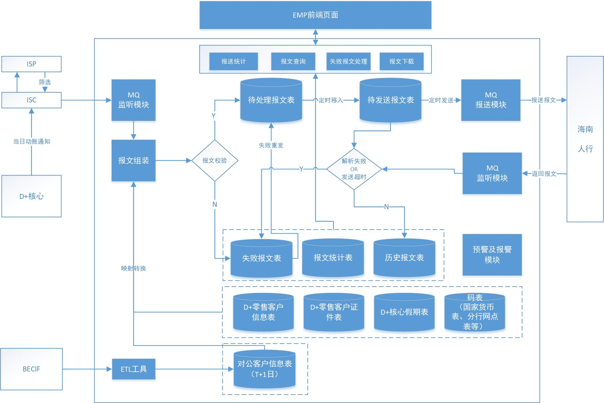

(Photo by [Jeff Sheldon](https://unsplash.com/@ugmonk) on [Unsplash](https://unsplash.com/photos/JWiMShWiF14))

上个月参与了一个资金监管报送项目，团队成员辛苦奋战一个月最终将项目投产上线。

项目的需求背景是：人行需要监管海南省内各金融机构下客户账户的进出岛资金交易，要求各金融机构按照人行制定的标准将监管报送系统在3月底上线。我们接到需求通知是2月22日，意味着要在不到一个半月的时间里面将这个系统开发出来并完成生产上线。

如果是一个熟练的团队，这不是啥难题，这个项目并不大，它只需按照人行的要求将客户的动帐记录组装成报文推送给人行服务器；但我们是一个临时组建起来的团队，小组6个人此前互相不认识，并且几乎都不熟悉行内的开发环境，像PL/SQL,IBM MQ,Oracle ESB,Hadoop ETL,GitLab这些对我们来说都是陌生的，都有不小的学习成本，而且最关键的是工期压得很紧，一个月多一点的时间得出活儿啊，团队面临不小的挑战。

<!--more-->

刚开始一周都在熟悉开发环境，了解业务需求，后来决定使用SpringBoot+EMP(EMP是行内的一个前端框架)来做，版本管理工具使用GitLab，数据存储使用Oracle，动帐记录通过订阅MQ的方式获取T+0实时交易记录，映射表通过ETL从Hadoop数仓抽取(每日自动日清)，然后使用Quartz定时向人行MQ服务器进行数据报送。

大致的流程图长这样，数据源来自客户账户每日产生的交易记录，经过采集、清洗、加工、存档、报送、响应应答、最终存档入库，然后向前端展示。

计划得很好，实施起来各种问题一大堆。项目经理的不称职😰、Git代码管理的混乱、团队成员承受不了项目压力而离职、不服从项目管理、组员互相之间的不信任、
技术Leader的缺失、甲乙双方沟通理解的分歧、项目进度带来的压力等等等等，软件开发项目中可能出现的问题几乎都被我们遇到了。

整个团队的压力可想而知，随时都有散摊子的可能。更加不幸的是，我就是那个集万千压力于一身的项目经理。😥

得益于领导们的紧急救火，后来我们将整个项目扳回了正轨，投产上线成功后，收到了行方领导专程发来的感谢信，我们的付出得到了肯定，下面说一下我的几点收获。

1.大型软件项目中，数据的跨系统交互一般都会使用企业级的数据交互总线，如行方系统使用的Oracle ESB(Oracle Enterprise Service Bus)。如果需要跟多个系统进行数据交互，每一个都使用API去调上游的接口，这不现实；因此大型项目架构中，跨系统的数据请求，由统一的ESB总线去完成数据交互，既简捷又高效。

2.动帐交易数据的聚集。大型银行通常有上百个系统，与钱打交道的一般有结售汇、个贷、网银、第三方存管、支付(快捷支付、网联支付、无卡支付等)、卡交易、柜面、行内对转这些系统。对我们报送系统来说，我们需要从它们那里取数，如果要逐个去上游系统拿，那就太复杂了。好在行方已经将这些上游系统生产出来的交易记录聚合到了一个平台，我们现在只需要去平台订阅数据，就可以拿到客户实时的动帐交易记录，一切设计都变得简单。

3.生产者与消费者模型。在上面那张流程图中，生产交易数据的上游系统，它们是生产者，我们是消费者；但对人行来说，我们生产符合监管要求的报送数据，我们是生产者，人行变成了消费者。

4.Java替代COBOL的速度比我们相信中的快。国内各大中型银行都在推动去IOE化(即替换掉以IBM、Oracle、EMC为代表的国外软硬件产品)。主机开发人员赖以生存的软件开发环境惨遭厄运，逐步在被Java取代。软件行业在中国发展了几十年，国内每年毕业这么多Java程序员，COBOL被Java取代的速度比我们预想中得大大加快了。