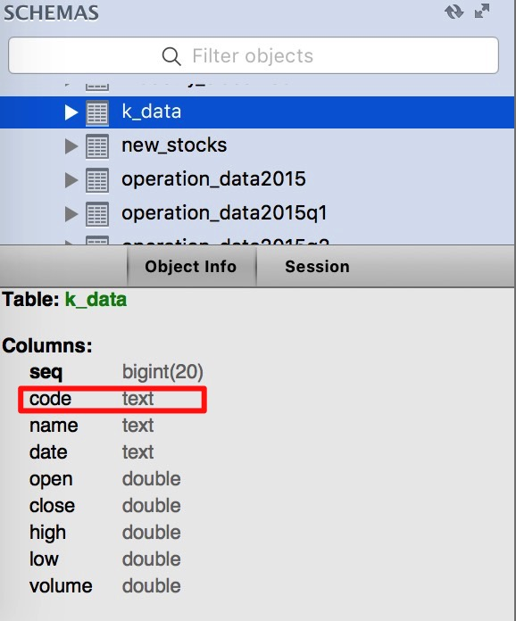

（Photo by [Fredrick Kearney Jr](https://unsplash.com/photos/7F_FcLhrsds?utm_source=unsplash&utm_medium=referral&utm_content=creditCopyText) on [Unsplash](https://unsplash.com/search/photos/error?utm_source=unsplash&utm_medium=referral&utm_content=creditCopyText)）

今天在使用pandas.DataFrame.to_sql这个接口，将Tushare获取的一个DataFrame写入MySQL时，出现如下报错。

> PGM:writedb:write_records_into_mysql:error: (_mysql_exceptions.OperationalError) (1170, "BLOB/TEXT column 'code' used in key specification without a key length") [SQL: u'CREATE INDEX ix_k_data_code ON k_data (code)'] (Background on this error at: http://sqlalche.me/e/e3q8)

这个错误在创建MySQL表时很常见，当键值字段是变长的BLOB或TEXT类型，MySQL引擎无法生成索引。

很遗憾，尽管知道原因，也尝试过几乎所有可行的办法，但就是没法解决。很无奈，编程工作就是如此，半年前的代码，核心程序不变，搁现在重构一下，就跑不通了。

心情灰暗了一整个上午，下面是报错详细内容。

最近在将半年前写的Python股票分析程序重构，打算写一个标准的Python包出来。write_records_into_mysql是所有程序写入MySQL的接口，它有两个必输参数，分别是df和table_name；三个默认参数，分别是conn、if_exists、dtype。

其它细节不贴，一眼就能看明白，这个函数主要作用是调用pandas.DataFrame.to_sql接口，将df写入数据库。to_sql接收的参数和write_records_into_mysql接收的参数其实是一样的，乍一看这里好像存在重复封装，为什么不直接调用to_sql写数据库，而要采用调用write_records_into_mysql的方式？这是一个好问题。

<!--more-->

```python
def write_records_into_mysql(df,
                             table_name,
                             conn=engine,
                             if_exists='replace',
                             dtype=None):
    
    try:
        print "*** write_records_into_mysql参数if_exists是 ***:",if_exists
        df.to_sql(table_name,
                  conn,
                  if_exists='replace',
                  dtype=None
                  )
    except Exception as e:
        print_msg(PGMname, 
                  write_records_into_mysql.func_name,
                  'error',
                  e)    
    else:
        print_msg(PGMname, 
                  write_records_into_mysql.func_name,
                  'success')
```

主调函数里面核心代码块是这样的，在一个循环体里面，传入stock_code和issue_date两个参数，调用Tushare的API（**get_k_data**函数）获取个股日K线数据。

如果获取成功，将返回的df存入MySQL；如果获取失败，使用continue语句跳出本次循环，处理下一只股票。

```python
            # 使用股票代码和发型日期作为参数获取日K线数据
            k_data_by_code = get_k_data_from_tushare(stock_code, issue_date)
            
            # 如果没有获取到K线数据，k_data_by_code返回值会是None，使用
            # continue跳出本次循环，继续处理下一只股票
            if k_data_by_code is None:
                continue
            
            print "AAA k_data_by_code.head(1):",k_data_by_code.head(1)
            print "AAA k_data_by_code.index:",k_data_by_code.index
            
            # 将dataframe的index转换成列'seq'
            k_data_by_code['seq'] = k_data_by_code.index
            print "BBB k_data_by_code.head(1):",k_data_by_code.head(1)
            print "BBB k_data_by_code.index:",k_data_by_code.index
            
            # 将dataframe的列'seq'+'code'转换成index
            # drop=True表示将这两列从column中删掉
            # verify_integrity=True表示检查新索引是否存在重复
            k_data_by_code = k_data_by_code.set_index(['seq','code'], 
                                                      drop=True,
                                                      verify_integrity=True)
            
            print "CCC k_data_by_code.head(1):",k_data_by_code.head(1)
            print "CCC k_data_by_code.index:",k_data_by_code.index
            
            # 将参数stock_name插入到第一列，列名定义为'name'
            k_data_by_code.insert(0,'name',stock_name)
            print "DDD k_data_by_code.head(1):",k_data_by_code.head(1)
            print "DDD k_data_by_code.index:",k_data_by_code.index
            
            # dict_k_data是以sqlalchemy格式定义的一个字典
            dict_k_data ={
                 'seq':Float,
                'code':String(06),
                'name':String(32),
                'open':Float,
               'close':Float,
                'high':Float,
                 'low':Float,
              'volume':Float,
                'date':Date
                }
                    
            write_records_into_mysql(k_data_by_code, 'k_data', dtype=dict_k_data)
```

如果你们不熟悉Pandas和DataFrame，这里我先举一个例子，帮助大家理解。

> 在REPL里面引入Tushare包。
>
> in[2]获取个股"002930"日K线数据。
>
> out[3]输出df1的内容，我只输出了第一行。
>
> out[4]可以看到df1的索引，索引其实就是这条记录的键值，但在DataFrame里面，它叫index，不叫key。
>
> out[5]可以看到df1有哪些栏位。

> ```shell
> In [1]: import tushare as ts
> In [2]: df1 = ts.get_k_data('002930')
>
> In [3]: df1.head(1)
> Out[3]: 
>          date   open  close   high    low  volume    code
> 0  2018-03-28  10.24  12.28  12.28  10.24   426.0  002930
>
> In [4]: df1.index
> Out[4]: RangeIndex(start=0, stop=3, step=1)
>
> In [5]: df1.columns
> Out[5]: Index([u'date', u'open', u'close', u'high', u'low', u'volume', u'code'], dtype='object')
> ```
>

好了，我们回归正题。

上面的程序，我取到k_data_by_code数据后，做了如下几步操作。

1. 将这个df的索引转换成当前df里面的一个列‘seq’。AAA显示这个df修改前的格式。

   > AAA k_data_by_code.head(1):          date   open  close   high    low  volume    code
   > 0  2018-03-28  10.24  12.28  12.28  10.24   426.0  002930
   > AAA k_data_by_code.index: RangeIndex(start=0, stop=3, step=1)

   BBB显示将index转换为‘seq’列后的格式。

   > BBB k_data_by_code.head(1):          date   open  close   high    low  volume    code  seq
   > 0  2018-03-28  10.24  12.28  12.28  10.24   426.0  002930    0
   > BBB k_data_by_code.index: RangeIndex(start=0, stop=3, step=1)

2. 使用set_index函数，给这个df设置新的索引，在原来索引的基础上增加了列‘code’。CCC显示将‘seq’和‘code’联合设置为索引后的格式。

   > CCC k_data_by_code.head(1):                   date   open  close   high    low  volume
   > seq code                                                  
   > 0   002930  2018-03-28  10.24  12.28  12.28  10.24   426.0
   > CCC k_data_by_code.index: MultiIndex(levels=[[0, 1, 2], [u‘002930’]],labels=[[0, 1, 2], [0, 0, 0]],names=[u‘seq’, u‘code’])

3. 接着将stock_name插入到df里面，插入位置是第一列。DDD显示插入新列‘name’后的格式。

   > DDD k_data_by_code.head(1):             name        date   open  close   high    low  volume
   > seq code                                                        
   > 0   002930  宏川智慧  2018-03-28  10.24  12.28  12.28  10.24   426.0
   > DDD k_data_by_code.index: MultiIndex(levels=[[0, 1, 2], [u‘002930’]],labels=[[0, 1, 2], [0, 0, 0]],names=[u‘seq’, u‘code’])

4. 定义字典变量dict_k_data，当MySQL引擎创建表时，会用它生成表的属性。

5. 最后调用write_records_into_mysql函数，把这个df和表名‘k_data’作为参数传进去，将df里的内容写入MySQL。

print语句显示上面这几步操作都执行成功。数据库表‘k_data’也生成成功，表结构如下，但奇怪的是‘code’那一列的类型为TEXT，并不是预期的VARCHAR(06)。



以上便是，整个操作报错的全过程。

查StackOverflow，参考[Can pandas with MySQL support text indexes?](https://stackoverflow.com/questions/38522513/can-pandas-with-mysql-support-text-indexes)这篇文章提到的方法，使用dtype={'code':VARCHAR(k_data_by_code.index.get_level_values('code').str.len().max())}调用write_records_into_mysql函数，依然报同样的错。

这篇文章里全部代码，逻辑和半年前一模一样，为什么当时可以成功，现在就不行呢，我想不明白原因，哪位大神可以指点一下迷津？

**参考资料：**

- [pandas对象保存到mysql出错提示“BLOB/TEXT column used in key specification without a key length”解决办法](http://www.cnblogs.com/zhangjpn/p/6133793.html)
- [Can pandas with MySQL support text indexes?](https://stackoverflow.com/questions/38522513/can-pandas-with-mysql-support-text-indexes)
- [MySQL error: key specification without a key length](https://stackoverflow.com/questions/1827063/mysql-error-key-specification-without-a-key-length)