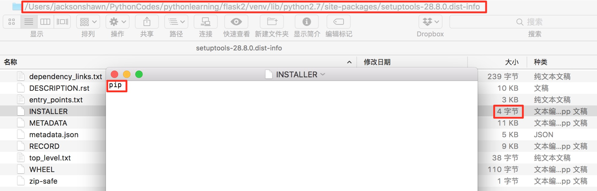
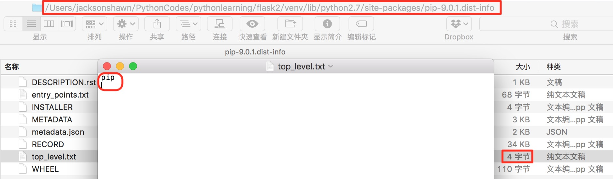
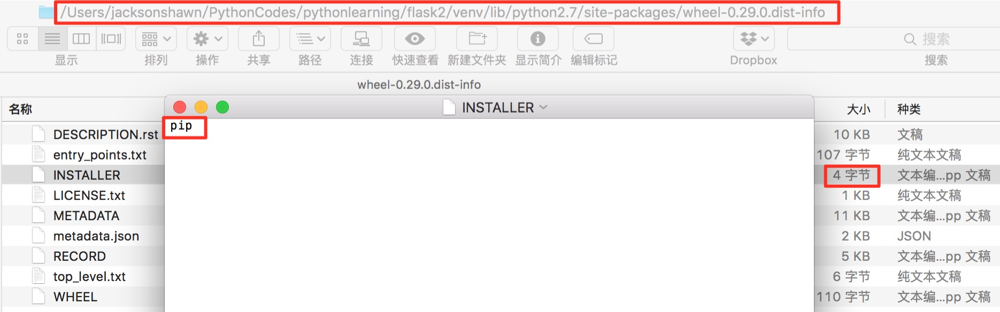
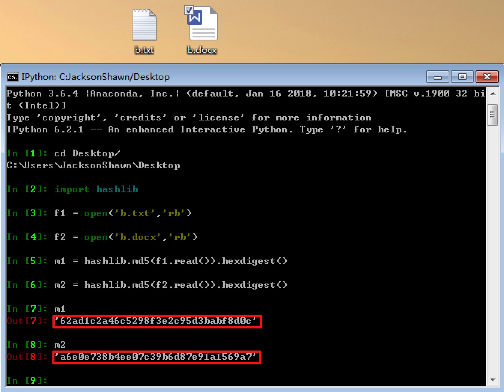
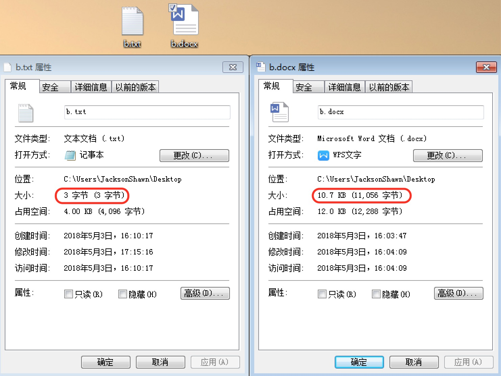
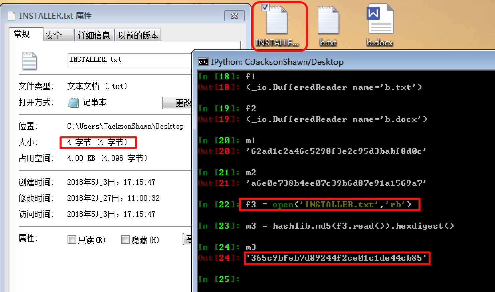
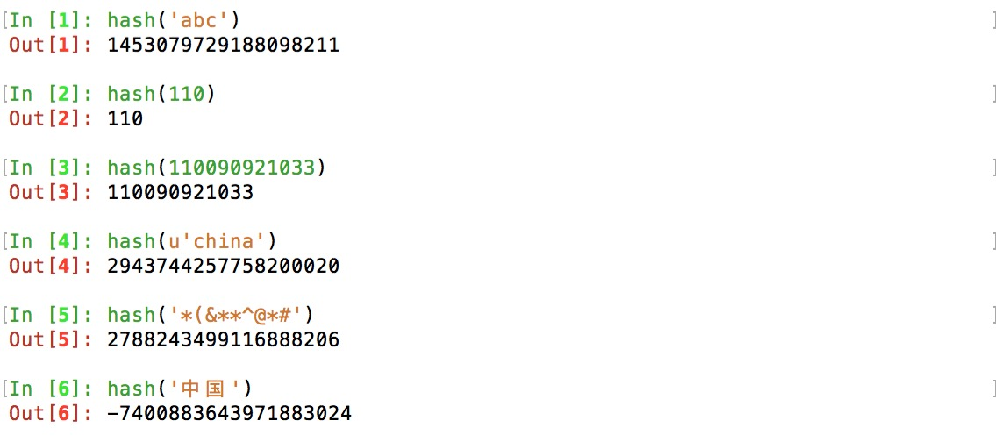
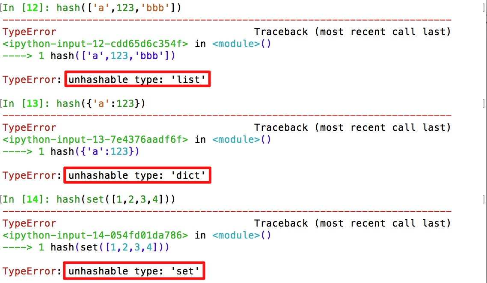

今天写了一个程序，扫描指定目录，遍历这个目录及子目录下全部文件，生成每一个文件的md5值，记录到一个字典变量，然后在这堆记录里面找出重复的文件。

之前看廖雪峰老师博客中[**摘要算法简介**](https://www.liaoxuefeng.com/wiki/0014316089557264a6b348958f449949df42a6d3a2e542c000/0014319556588648dd1fb0047a34d0c945ee33e8f4c90cc000)这篇文章，他把md5值讲得很透彻，但我理解起来一直有一些朦朦胧胧的疑惑没有解开，把这个程序测试通过后，我感觉才真正搞懂了md5值，于是有了这篇文章。

<!--more-->

首先，介绍一下我写的这个程序。

1、递归遍历给定目录下的全部文件，将文件路径存入到一个列表。

2、利用hashlib.md5函数计算每一个有文件的md5值，将文件路径和md5值，存储到字典变量md5_dict。字典变量的结构是｛**“文件路径”：“文件的md5值”**｝，注意字典里存放的是文件的md5值，不是文件所在路径的md5值。

3、每生成一个文件的md5值出来后，先到字典变量dup_dict里面去匹配，如果md5值匹配成功，说明文件内容存在重复，那么将这个出现重复的记录写入字典变量dup_dict。

生成文件路径的函数dirlist如下。    

```python
def dirlist(path, allfile, shortcutfile): 
    filelist =  os.listdir(path)  

    for filename in filelist:  
        # 排除隐藏文件
        if not filename.startswith('.'):
            filepath = os.path.join(path, filename)  
            		
            if os.path.isdir(filepath):  
                # 如果是folder，调用函数自身
                dirlist(filepath, allfile, shortcutfile)  
            elif os.path.isfile(filepath):   
                # 如果是file，将文件路径存入allfile列表
                allfile.append(filepath)
            else:
                # 遍历时如果既不是folder也不是file，那么很可能就是替身变量，
                # 将文件路径存入shortcutfile列表
                # macOS里面的替身变量，你可以理解成Windows里面的快捷方式
                shortcutfile.append(filepath)
        else:
            filepath = os.path.join(path, filename)
            if os.path.isdir(filename):  
                print "%s is a hidden folder" %filepath
            else:
                print "%s is a hidden file" %filepath

    return allfile, shortcutfile
```
计算md5值的函数gen_md5如下。

```python
def gen_md5(file_list):
    for file_path in file_list:

        #得到文件属性
        statinfo=os.stat(file_path)
        #文件大小
        sizefile=statinfo.st_size
        #创建时间
        createtime=formattime(statinfo.st_ctime)
        #修改时间
        changetime=formattime(statinfo.st_mtime)
        #浏览时间
        readtime=formattime(statinfo.st_atime)

        # 给小于20M的文件生成md5值
        if 0 < sizefile <= 20000000:

            with open(file_path, 'rb') as fp:
                md5_value = hashlib.md5(fp.read()).hexdigest()

            if md5_value in md5_dict.values():
                dup_dict[file_path] = md5_value
            else:
                md5_dict[file_path] = md5_value
```

运行结果出来后，我检查dup_dict字典里的记录发现“365c9bfeb7d89244f2ce01c1de44cb85”这个md5值出现了三次，键值对记录如下。

> '/Users/jacksonshawn/PythonCodes/pythonlearning/flask2/venv/lib/python2.7/site-packages/setuptools-28.8.0.dist-info/INSTALLER': '**365c9bfeb7d89244f2ce01c1de44cb85**' 
>
> '/Users/jacksonshawn/PythonCodes/pythonlearning/flask2/venv/lib/python2.7/site-packages/pip-9.0.1.dist-info/top_level.txt': '**365c9bfeb7d89244f2ce01c1de44cb85**' 
>
>  '/Users/jacksonshawn/PythonCodes/pythonlearning/flask2/venv/lib/python2.7/site-packages/wheel-0.29.0.dist-info/INSTALLER': '**365c9bfeb7d89244f2ce01c1de44cb85**'

通过文件路径查看每一个文件的内容，结果如下。每一个文件的内容都是一个单词“pip”，文件大小均为4字节。可以看出，不同的文件名，只要内容相同，计算出来的md5值是同一个。



（图1）



（图2）



（图3）

原本到这里就可以愉快地发布这篇文章了，但是，好奇的我，脑子里产生一个问题，“在Python3里面计算这个文件的md5值，结果会一样吗？”

我打开虚拟机，在Win7里面创建一个b.txt文件和一个b.docx文件，各自都只有一行内容，一个单词“pip”，然后使用在Python3.6.4环境下计算着这两个文件的md5值。结果出人意料，TXT文件的md5值是**62ad1c2a46c5298f3e2c95d3babf8d0c**，Word文件的md5值是**a6e0e738b4ee07c39b6d87e91a1569a7**，都不是预期的结果。

于是，我陷入了沉思，那些朦朦胧胧的疑惑再次萦绕脑海。“同样的内容，Python2和Python3计算出来的md5值难道不一样吗？”



（图4）

网上搜了一大圈，都找不到答案。在微信群里发帖提问，经一个网友提醒，才发现在Win7里面新建的TXT和Word文件，并不是macOS里面的原文件，它们不是同一个东西。macOS里的原文件大小是4字节，而Win7里面的TXT和Word文件分别是3字节和11056字节。这就是md5值不一样的真正原因，即便它们的内容是相同的。



（图5）

直接将macOS里原文件复制到Win7，得到INSTALLER.txt文件，再计算md5值，这次得到的结果就和预期一致了。



（图6）

紧接着，我在macOS里面将图1（你选图1、图2、图3任意一个都可以）里的文件，加上一个换行符，计算它的md5值，也得到一个不同于**365c9bfeb7d89244f2ce01c1de44cb85**的结果，很简单，文件内容变了。这下我才真正理解廖雪峰Python教程hashlib那一节里面那段话的含义。md5值的意义主要在于防篡改，哪怕你只改动了一丁点内容，md5值也会发生变化。

> 举个例子，你写了一篇文章，内容是一个字符串`'how to use python hashlib - by Michael'`，并附上这篇文章的摘要是`'2d73d4f15c0db7f5ecb321b6a65e5d6d'`。如果有人篡改了你的文章，并发表为`'how to use python hashlib - by Bob'`，你可以一下子指出Bob篡改了你的文章，因为根据`'how to use python hashlib - by Bob'`计算出的摘要不同于原始文章的摘要。

**结论：**

其实，同一个文件或字符，在任何语言、环境里计算出来的md5值都是相同的，因为全世界的MD5摘要算法都一样。在极特殊条件下，md5值会出现碰撞，但它太特殊我们一般遇不到，可以忽略不计。如果对同一个文件或字符，你计算出来的md5值不同，那么肯定是这个文件或字符发生了变化，如同Win7里那个b.txt文件，内容也是“pip”，但实际上和macOS里的INSTALLER并不是同一个文件。

**几点补充：**

第一，**md5值**和**哈希值**是两个概念，千万别搞混淆。MD5是最常见的一种摘要算法，它计算出来的结果称为md5值，它是一个32位长度的16进制字符串。哈希值是一个整型数字，它主要用于字典查找时比较字典的key值，对于Python来说，每一个可哈希的对象都有一个哈希值，像int、str、unicode、tuple这些对象，都可以计算它们的哈希值，见图7；像list、dict、set这些对象，则没有哈希值，见图8。

> `hash`(*object*)
>
> Return the hash value of the object (if it has one). Hash values are integers. They are used to quickly compare dictionary keys during a dictionary lookup. Numeric values that compare equal have the same hash value (even if they are of different types, as is the case for 1 and 1.0).

上面是Python里面对哈希值下的定义，出处[Python hash definition](https://docs.python.org/2.7/library/functions.html#hash)。Java语言里面有一个hashCode类型，和Python里面的哈希值是一个意思，它也是一个整型数字。



（图7）



（图8）

第二，dirlist函数里使用到了递归，从打印结果来看，这个递归调用，实现了类似深度优先的效果。当发现是文件时才收集文件路径，是文件夹则调用本身，遍历下一层，循环往复。因此，文件路径深的会先被扫描到allfile列表里面，文件路径浅的后被扫描到。

第三，dirlist函数里面判断文件类型时又一个else分支，满足else分支的文件路径会被写入shortcutfile列表。这个shortcutfile列表存入的都是“替身变量”，在macOS里叫法是“替身变量”，在Windows里面叫法是快捷方式。我在测试中发现，对于实体文件的“替身变量”，计算出来的md5值和原文件的md5值一样；但对于一些软连接“替身变量”，没法计算md5值。这一点，有待日后进一步观察和研究。