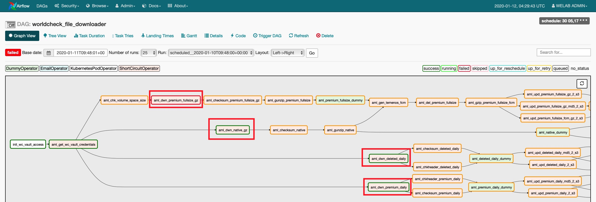

Airflow pipeline作业流遇到这样一个问题：使用paramiko下载小文件成功，下载大文件出现`Server connection dropped`报错。


------

**问题描述**

下图可以看到`aml_dwn_native_gz`、`aml_dwn_deleted_daily`、`aml_dwn_premium_daily`三个作业执行成功，但`aml_dwn_premium_fullsize_gz`出现报错。



<!--more-->

四个下载作业均使用`ShortCircuitOperator`，代码块如下所示，唯一不同的是传入的参数`filename1`和`filename2`在k8s配置文件中对应的文件名不同。

```python
# Airflow premium fullsize process
aml_dwn_premium_fullsize_gz = ShortCircuitOperator(
    task_id='aml_dwn_premium_fullsize_gz',
    provide_context=True,
    python_callable=load_function('worldcheck_file_downloader.aml_download_files.\
                                    aml_download_files','aml_download_files'),
    executor_config={
            'KubernetesExecutor': {
                'image': '|| getenv "IMAGE_AIRFLOW" ||',
                "volumes": [
                    {
                        "name": "airflow-download",
                        "persistentVolumeClaim": {
                            "claimName": '|| getenv "TASKS_PVC" ||'
                        }
                    },
                ],
                "volume_mounts": [
                    {
                        "mountPath": '|| getenv "VOLUME_MOUNT_PATH" ||',
                        "name": 'airflow-download',
                    },
                ]
            },
        },
    op_kwargs={'sftphost': '|| getenv "SFTP_HOST" ||',
               'sftpport': '|| getenv "SFTP_PORT" ||',
               'sftpremotepath1': '|| getenv "SFTP_REMOTEPATH1" ||',
               'sftpremotepath2': '|| getenv "SFTP_REMOTEPATH2" ||',
               'sftpusername': '|| getenv "SFTP_USERNAME" ||',
               'sftppassword': '|| getenv "SFTP_PASSWORD" ||',
               'worldcheck_download_basedir': '|| getenv "DOWNLOAD_BASEDIR" ||',
               'filename1': '|| getenv "PREMIUM_FULLSIZE_GZ" ||',
               'filename2': '|| getenv "PREMIUM_FULLSIZE_GZ_MD5" ||'},
    email_on_failure=True,
    email='|| getenv "AIRFLOW_EMAIL_LIST" ||',
    dag=dag)
```


------

**日志分析**

```verilog
[2020-01-10 03:08:27,906] {logging_mixin.py:112} INFO - [2020-01-10 03:08:27,906] {transport.py:1819} INFO - Connected (version 2.0, client Twisted)
[2020-01-10 03:08:28,182] {logging_mixin.py:112} INFO - [2020-01-10 03:08:28,182] {local_task_job.py:124} WARNING - Time since last heartbeat(0.07 s) < heartrate(5.0 s), sleeping for 4.928218 s
[2020-01-10 03:08:29,824] {logging_mixin.py:112} INFO - [2020-01-10 03:08:29,824] {transport.py:1819} INFO - Authentication (password) successful!
[2020-01-10 03:08:29,996] {logging_mixin.py:112} INFO - [2020-01-10 03:08:29,995] {sftp.py:158} INFO - [chan 0] Opened sftp connection (server version 3)
[2020-01-10 03:08:30,839] {logging_mixin.py:112} INFO - ftpclient.py sftp_get filename_fullpath: <class 'str'> /var/data/k8s/download/202001/daily_check.csv.gz
[2020-01-10 03:08:33,280] {logging_mixin.py:112} INFO - [2020-01-10 03:08:33,279] {local_task_job.py:124} WARNING - Time since last heartbeat(0.06 s) < heartrate(5.0 s), sleeping for 4.938538 s
......
[2020-01-10 03:29:38,638] {logging_mixin.py:112} INFO - [2020-01-10 03:29:38,637] {local_task_job.py:124} WARNING - Time since last heartbeat(0.07 s) < heartrate(5.0 s), sleeping for 4.927038 s
[2020-01-10 03:29:41,907] {logging_mixin.py:112} WARNING - 2020-01-10 03:29:41,906 - 10 -    ERROR -  184 - sftp_get:sftp_get downloader.csv.gz error:sftp_get filename_fullpath /var/data/k8s/download/202001/daily_check.csv.gz error:<class 'paramiko.ssh_exception.SSHException'>:Server connection dropped:
[2020-01-10 03:29:41,918] {logging_mixin.py:112} INFO - [2020-01-10 03:29:41,906] {ftpclient.py:184} ERROR - sftp_get:sftp_get downloader.csv.gz error:sftp_get filename_fullpath /var/data/k8s/download/202001/daily_check.csv.gz error:<class 'paramiko.ssh_exception.SSHException'>:Server connection dropped:
[2020-01-10 03:29:41,921] {logging_mixin.py:112} WARNING - --- Logging error ---
[2020-01-10 03:29:41,911] {logging_mixin.py:112} WARNING - 2020-01-10 03:29:41,906 - 10 -    ERROR -  184 - sftp_get:sftp_get downloader.csv.gz error:sftp_get filename_fullpath /var/data/k8s/download/202001/daily_check.csv.gz error:<class 'paramiko.ssh_exception.SSHException'>:Server connection dropped:
Exception in thread Thread-3:
Traceback (most recent call last):
  File "/usr/local/lib/python3.7/threading.py", line 926, in _bootstrap_inner
    self.run()
  File "/usr/local/lib/python3.7/threading.py", line 870, in run
    self._target(*self._args, **self._kwargs)
  File "/usr/local/lib/python3.7/site-packages/paramiko/sftp_file.py", line 538, in _prefetch_thread
    self, CMD_READ, self.handle, long(offset), int(length)
  File "/usr/local/lib/python3.7/site-packages/paramiko/sftp_client.py", line 837, in _async_request
    self._send_packet(t, msg)
  File "/usr/local/lib/python3.7/site-packages/paramiko/sftp.py", line 198, in _send_packet
    self._write_all(out)
  File "/usr/local/lib/python3.7/site-packages/paramiko/sftp.py", line 164, in _write_all
    raise EOFError()
EOFError
```

可以看到，中间有20多分钟持续输出heartbeat warning message，于是以为`Server connection dropped`报错是Airflow hearbeat warning message太多所致，其它3个paramiko download作业能够执行成功，唯有这一个因为待下载的文件size巨大（670MB），需要耗费的时间较多，Airflow打印了很多hearbeat warning message，从log日志中看到cpu time经常性地被sleep函数占用，故而无法给paramiko download作业分配执行时间。


------

**原因排查**

第一时间在Stack Overflow上面发帖求助。

Stack Overflow求助帖：[Airflow heartbeat warning log cause ssh connection dropped](https://stackoverflow.com/questions/59676480/airflow-heartbeat-warning-log-cause-ssh-connection-dropped)

后来翻来覆去地看Airflow `local_task_job.py`程序源码，发现不是hearbeat warning message的问题，即使把这些warning message给disable掉，我推断情况可能还是会如此（这里因为k8s中跑的Airflow image我没有权限修改，并没有尝试）。

后来搜索`paramiko EOFError`报错，发现很多人遇到了类似的问题，详细见别人在GitHub上发的这个求助帖。

GitHub求助帖：[SFTP: Downloading Large Files Hangs](https://github.com/paramiko/paramiko/issues/926)


为什么使用paramiko下载小文件能成功，下载大文件会报错，原因目前并没有探明。

我的一个推测是，paramiko创建ssh连接后，使用ssh对象实例化一个sftp对象，通过这个sftp对象去完成文件下载动作，由于large size文件下载需要耗费大量时间，ssh对象在下载过程中被Python虚拟机gc机制当作垃圾给回收掉了，这样就出现了"Server connection dropped"。


------

**解决方法**

最后参照GitHub上该博主的建议，使用shutil.copyfileobj替换paramiko sftp.get下载功能，测试后发现large size文件可以下载成功。

```python
class FtpClient(object):
    """
    Create sftp instance;then implemnet all sftp methods
    """
    def __init__(self, sftphost, sftpport, sftpusername, sftppassword):
        self.hostname = sftphost
        self.port = sftpport
        self.username = sftpusername
        self.password = sftppassword
        try:
            if type(self.port) is str:
                self.port = int(self.port)

            self.client = paramiko.Transport((self.hostname, self.port))
            self.client.connect(username=self.username,
                                password=self.password)
        except Exception as e:
            logger.error('%s:%s:%s:%s',
                         inspect.stack()[0][3],
                         'paramiko connect error',
                         type(e),
                         e)
            self.sftp = None
            return
        else:
            self.sftp = paramiko.SFTPClient.from_transport(self.client)
    
    def sftp_downloads(self, remote_directory, filename, filename_fullpath):
        # set server directory as pwd
        self.sftp_chdir(remote_directory)
        
        # 旧方法下载大文件会出现Server connection dropped
        # self.sftp.get(filename, filename_fullpath, callback=self.sftp_get_callback)
        
        # 新方法下载大文件成功
        with self.sftp.open(filename, 'rb') as fp:
            shutil.copyfileobj(fp, open(filename_fullpath, 'wb'))
```

后续有新的发现，再做更新。


**参考资料**

- [SFTP: Downloading Large Files Hangs](https://github.com/paramiko/paramiko/issues/926)
- [Paramiko Fails to download large files >1GB](https://stackoverflow.com/questions/12486623/paramiko-fails-to-download-large-files-1gb)
- [Airflow heartbeat warning log cause ssh connection dropped](https://stackoverflow.com/questions/59676480/airflow-heartbeat-warning-log-cause-ssh-connection-dropped)