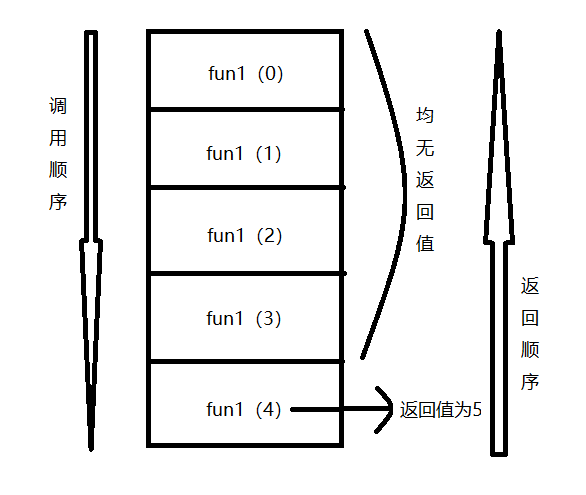

(Photo by [Karine Zenda](https://unsplash.com/@karinezenda?utm_source=unsplash&utm_medium=referral&utm_content=creditCopyText) on [Unsplash](https://unsplash.com/search/photos/program?utm_source=unsplash&utm_medium=referral&utm_content=creditCopyText))

上篇[Python实现股票黑名单](/2019/08/10/stock-blacklist)使用双层循环将巨潮网里司法冻结的股票记录爬取下来之后，想着使用递归来实现这个处理，结果发现踩到一个大坑，递归函数处理完列表后，返回结果一直是None，这一篇记录一下具体的解决办法。

原问题经过简化后，其实就是这样一个函数，前面N次执行给列表赋值，最后一次将列表返回，返回之前打印列表，显示其内容有值，返回后结果却一直为None。

将问题简化后的F1函数如下：

```python
def F1(i):
    if i == 5:
        print("L1:", L1)
        return L1
    else:
        L1.append(i)
        i = i + 1
        F1(i)
        
if __name__ == '__main__':
    L1 = []
    L1 = F1(1)
    print("Main L1:", L1)
```

函数F1执行结果：

```python
('L1:', [1, 2, 3, 4])
('Main L1:', None)
```

print语句显示列表L1有值，return之后的结果为什么一直None呢？最开始以为是没有给列表L1添加global关键字的原因。

<!--more-->

使用了global关键字的F2函数。

```python
def F2(i):
    global L2
    if i == 5:
        print("L2:", L2)
        return L2
    else:
        L2.append(i)
        i = i + 1
        F2(i)
        
if __name__ == '__main__':
    L2 = []
    L2 = F2(1)
    print("Main L2:", L2)
```

使用了global关键字之后，函数F2执行结果如下所示，可见并不是没有设置global关键字的缘故。

```python
('L2:', [1, 2, 3, 4])
('Main L2:', None)
```

在排查过程中，我想起来使用双层循环时，返回列表并没有问题，问题应该是出在递归的处理机制上，在微信群和学Python的朋友讨论了一番之后，有一个朋友点明了问题原因：return语句返回的列表对象是函数第一次执行的结果，并不是最后一次执行的结果。

恰好这时，在CSDN上看到了[Python 递归函数返回值为None的解决办法](https://blog.csdn.net/Ha_hha/article/details/79393041)这篇文章，和我遇到的情形几乎一模一样，里面有张图非常形象地展示了递归调用return语句的处理过程，看完后瞬间秒懂。



函数F1前几次递归调用并没有返回值，最后一次返回时，F1(5)将F1(5)执行结果返回给F1(4)，然后F1(4)将F1(4)执行结果返回给F1(3)，F1(3)将F1(3)执行结果返回给F1(2)，F1(2)将F1(2)执行结果返回给F1(1)，F1(1)将F1(1)执行结果返回给main函数中的L1；由于没有返回值，Python语言默认会返回None，因此列表L1的结果就是None。

搞清楚了原因所在，那如何将函数的最后一次执行结果返回回来呢？

------

我没有朝这个方向去想，我是反过来想，如果不返回列表，在if分支里返回None退出递归处理，这样得到的结果会如何呢？测试了一下发现结果符合预期，如下函数F3所示。歪打正着得刚好满足了"递归三要素"，这个后面会说。

```python
def F3(i):
    if i == 5:
        print("L3:", L3)
        return None
    else:
        L3.append(i)
        i = i + 1
        F3(i)
        
if __name__ == '__main__':
    L3 = []
    F3(1)
    print("Main L3:", L3)
```

函数F3执行结果如下，符合预期：

```python
('L3:', [1, 2, 3, 4])
('Main L3:', [1, 2, 3, 4])
```

列表L3对F3函数来说本身就是全局变量，F3函数执行完之后，L3就是最后一次执行结果。

------

微信群里一位朋友提供了他的解决办法，如下函数F4所示，前面4次执行过程中，返回函数F4自身的执行结果，当递归终止条件达到后，再返回列表L4，这时就将函数F4最后一次执行结果返回了回来。

```python
def F4(i):
    if i == 5:
        print("L4:", L4)
        return L4
    else:
        L4.append(i)
        i = i + 1
        return F4(i)
        
if __name__ == '__main__':
    L4 = []
    L4 = F4(1)
    print("Main L4:", L4)
```

函数F4执行结果：

```python
('L4:', [1, 2, 3, 4])
('Main L4:', [1, 2, 3, 4])
```

必须承认函数F4这种写法更加清晰地展现了递归的处理机制，每一次返回函数F4自身的执行结果，就是无限趋近于终止条件"return L4"。

F3函数和F4函数这两种写法都得到了想要的结果，现在重点来了：F3和F4有什么区别呢？

在给出结论之前，先说一下"递归三要素"：

> #The Three Laws of Recursion
>
> Like the robots of Asimov, all recursive algorithms must obey three important laws:
>
> 1. A recursive algorithm must have a **base case**.
> 2. A recursive algorithm must change its state and move toward the base case.
> 3. A recursive algorithm must call itself, recursively.

我的理解是：

1、递归函数必须要有一个终止条件。上面F1,F2,F4函数中"return 列表"就是终止条件；F3函数的"return None"是终止条件。

2、递归函数执行状态，每一次调用都需要趋近它的终止条件，否则就不是递归。

3、递归函数需要调用函数本身。这一点最好理解。

仔细思考第2点，函数F1和F2每次执行并没有趋近于递归的终止条件，所以我认为形势上看起来像递归，但并不是真正的递归。

Python函数调用处理的一个默认机制是，如果没有返回值默认视为返回None。F3函数的else分支里虽然没有return语句，但其实它隐性地返回了None，无限趋近于终止条件"return None"，恰好符合"递归三要素"的第2点。它的处理逻辑是通畅的，虽然没有F4好理解，但看起来更加简洁。

至于递归实现和双层循环实现，哪个处理速度更快，测试下来后其实差不多，双层循环有时候还更快一些，这个就不去详细比较了，性能瓶颈在网页IO请求环节。

想起前辈先贤们总结的一点经验：递归是很好的解决方案，但有时候并不是最佳的解决方案。


**参考资料**

- [Python 递归函数返回值为None的解决办法](https://blog.csdn.net/Ha_hha/article/details/79393041)
- [The Three Laws of Recursion](https://runestone.academy/runestone/books/published/pythonds/Recursion/TheThreeLawsofRecursion.html)

