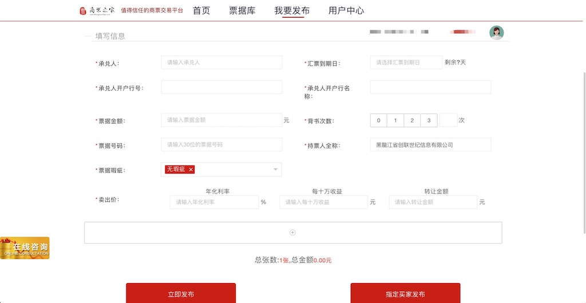

(Photo by [Bram Naus](https://unsplash.com/@bramnaus?utm_source=unsplash&utm_medium=referral&utm_content=creditCopyText) on [Unsplash](https://unsplash.com/search/photos/computer?utm_source=unsplash&utm_medium=referral&utm_content=creditCopyText))

因项目工作的需要，使用Selenium写了一个模拟登录程序，实现登录后自动提交测试数据，将测试同事的双手解放了出来。

因为上传图片需要与操作系统交互，MacOS上没有找到这个交互动作的解决方案，目前只在Windows实现了自动提交发布数据的功能，下面是对这个程序的简单介绍。

首先要搞定登录，登录页面长这样。

（图1-登录页面）

在模拟登录过程中遇到好几个问题，Base64转码换行符问题更是耽搁了将近一周时间，下面一一进行说明。

<!--more-->

> 1、窗口句柄的处理
>
> 左下角这个"在线咨询"控件，WebDriver打开页面时会弹出一个对话框。对话框我就不去截图了，很多网站都会有。这个对话框在登录页面的上一层，它占据了WebDriver当前窗口控件的句柄，要先把它干掉，否则拿不到登录页面上的HTML元素。
>
> 
>
> 2、验证码"VKI4"图片验证码的获取
>
> 写到这里我突然意识到，我在程序里做了无用功，写了多余的程序（反证了写技术博客的好处😄）。程序代码中，我的处理是：先将这个Base64编码的验证码字符串解码为图片二进制流，然后生成图片，再编码为Base64调用百度的文字识别OCR接口，去提取文本。看见没有，绕了一大圈，直接获取元素的Base64编码调百度的OCR接口即可。
>
> 我之前的处理遇到一个问题，Base64编码的字符串解码后，由于对换行符没有处理，导致刚开始生成的图片，打开时总是报错"Image Broken"。耽搁的一周时间里，我采取的Plan B是用元素坐标先定位验证码位置，将整个页面全屏截图，然后从大图中扣小图这种方式。Plan B是可行的，但觉得很麻烦，后来问题解决后将这个方法放弃了。
>
> 
>
> 3、生成验证码图片
>
> 将Base64编码字符串解码为二进制流之后，最开始生成图片是保存到本地硬盘，调百度OCR时再读进内存。后来觉得这样一出一进，多了两次IO操作，改为使用StringIO模块（Python3里面是BytesIO模块），将二进制流直接写入内存，不进行IO处理，我没有比较过执行时间，理论上这样处理会快很多。
>
> 
>
> 4、文字识别
>
> 刚开始使用Tesseract OCR进行文字识别，考虑到它的可移植性比较差，准确性没有商业产品高，后面就放弃了。

模拟登录成功后，接下来要考虑页面逻辑控制。哪些元素先出来，哪些元素在哪些页面才出来。这些熟练掌握Selenium的WebDriverWait和Expected Condition方法后即刻轻松解决。

"我要发布"页面上这些测试数据，简单的Faker包都可以搞定，复杂一点的比如身份证和统一社会信用代码，最后一位涉及到有效性校验，于是专门写了一个CPData类，感兴趣的朋友可以拿去参考。

（图2-测试数据发布页面）

在上图这个页面，图片上传稍微特殊一些，它不是简单的Input标签，不能够直接使用WebDriver的sendKeys方法。

先要点击图片，触发操作系统打开图片上传窗口。需要使用AutoIt辅助完成图片上传，于是参照网上教程分别生成了一个32位和64位的exe程序，由于AutoIt只在Windows平台才有，这个程序只能在Windows环境下运行。

第一次使用Selenium写模拟程序，过程是艰辛的，结果是美好的。这个程序在Python2.7和Python3.5环境下分别测试过，都能执行，以后再也不用自己手工输入一大堆测试数据了。

使用[Bandicam](https://www.bandicam.cn)做了一个自动登录提交测试数据的录屏，11M多一点，有兴趣的可以去[百度网盘](https://pan.baidu.com/s/1LgKgYp7R5U9pn14Pg_JYig)下载查看，提取密码:euho。全文代码见[GitHub](https://github.com/benbendemo/learning-python/tree/master/python-selenium)。

最后补充一段Selenium的发展历史，Selenium单词本意是硒元素，作者为了对抗QTP mercury（汞元素），才取名叫Selenium，我觉得挺有意思。

> Jason Huggins在2004年发起了Selenium项目，当时身处ThoughtWorks的他，为了不想让自己的时间浪费在无聊的重复性工作中，幸运的是，所有被测试的浏览器都支持Javascript。Jason和他所在的团队采用Javascript编写一种测试工具来验证浏览器页面的行为；这个JavaScript类库就是Selenium core，同时也是seleniumRC、Selenium IDE的核心组件。Selenium由此诞生。
>
> 关于Selenium的命名比较有意思，当时QTP mercury是主流的商业自化工具，是化学元素汞（俗称水银），而Selenium是开源自动化工具，是化学元素硒，硒可以对抗汞。

**参考资料**

- [Selenium Python](http://www.testclass.net/selenium_python/)
- [Python爬虫Selenium库](https://www.cnblogs.com/zhaof/category/1007686.html)