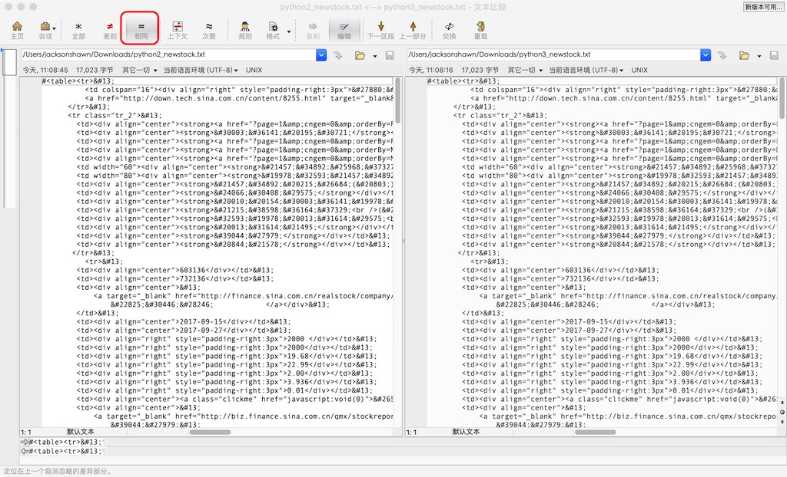
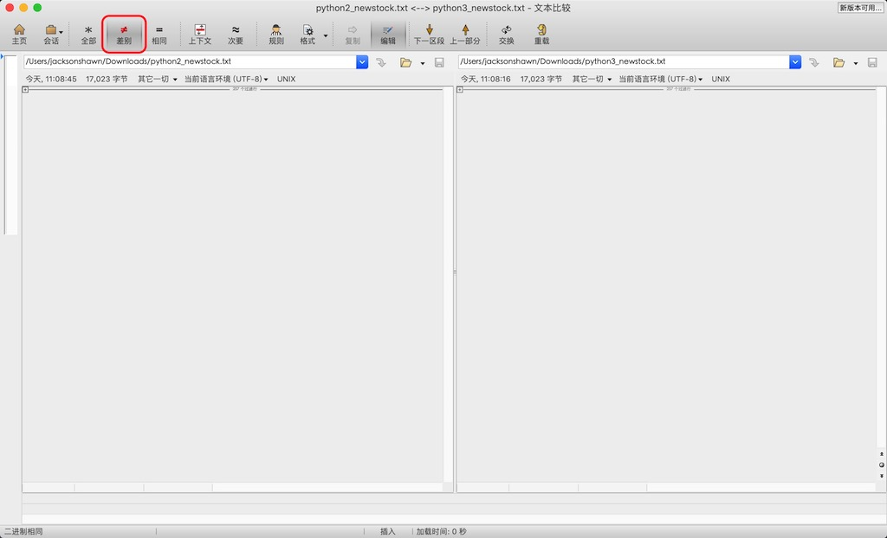
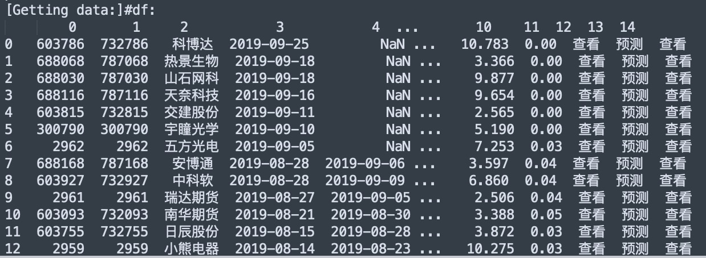
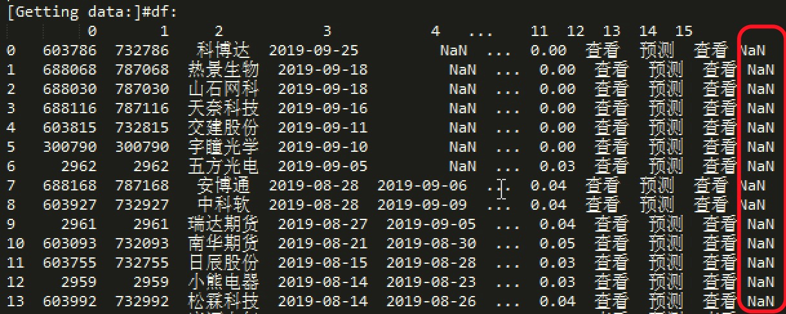

（Photo by [Eduardo Flores](https://unsplash.com/@eduardoflorespe?utm_source=unsplash&utm_medium=referral&utm_content=creditCopyText) on [Unsplash](https://unsplash.com/t/nature?utm_source=unsplash&utm_medium=referral&utm_content=creditCopyText)）

前几天在Python3里面调用Tushare的new_stocks接口，一直遇到这个报错"Length mismatch: Expected axis has 13 elements, new values have 12 elements"。

```python
# -*- coding: utf-8 -*-
import tushare as ts

df = ts.new_stocks()
print("df:\n",df.head(3))
```

奇怪的是，这段代码在Python2里能够正常运行，不报错。

开始了定位Bug的奇妙之旅，首先发现错误是从Tushare包reference.py模块里_newstocks函数报出来的；根据报错信息关键字axis，推测出错行数应该在447-452之间。

最开始怀疑是两个版本获取的数据源有差异，将加上了<table>标签的***sarr***变量值分别在Python2和PYthon3环境下打印出来，使用Beyond Compare对比，结果发现没有任何差别。

<!--more-->



（图1-Beyond Compare对比结果）



（图2-Beyond Compare对比结果）

数据源既然一致，那问题可能出在解析HTML生成dataframe的这几行代码上，首先分析这一行。

```python
df = pd.read_html(StringIO(sarr), skiprows=[0, 1])[0]
```

对比Python2和Python3下的执行结果，果然发现了问题，Python3返回结果有16列，多出来一列'NaN'。



（图3-Python2执行结果）



（图4-Python3执行结果）

同样一段HTML文本，在Python3环境下执行，会额外返回一列'NaN'，这是pandas.compat模块的StringIO函数的问题，已经明显超出了我的能力范围，各种Pandas的Issue看了一圈后，毫不犹豫地提了一个Issue给他们开发人员。

分析出原因后，这个问题就好解决了，将下面这行代码修改成这样，Python3下执行new_stocks函数就不报错了。

```python
if ct.PY3:
    # 如果是Python3，将第15列也drop掉  
    df = df.drop([df.columns[idx] for idx in [12, 13, 14, 15]], axis=1)
else:
    df = df.drop([df.columns[idx] for idx in [12, 13, 14]], axis=1)
```

**参考资料**

- [GitHub Pandas Issue](https://github.com/pandas-dev/pandas/issues/28355)