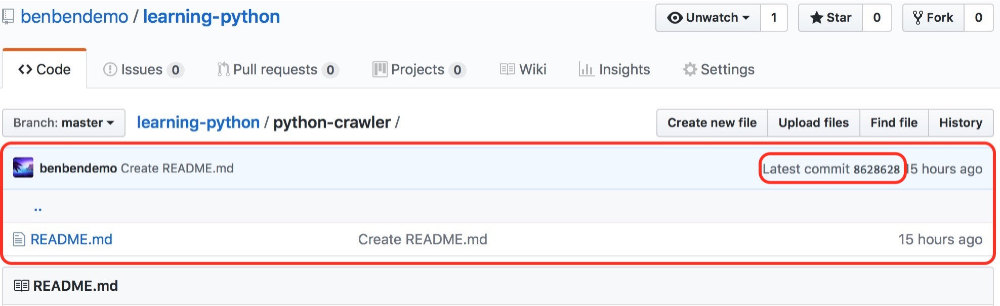
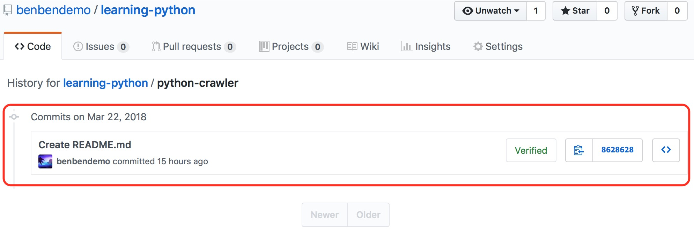

（Photo by [Alex Vasey](https://unsplash.com/photos/jWaUBjlx0Sw?utm_source=unsplash&utm_medium=referral&utm_content=creditCopyText) on [Unsplash](https://unsplash.com/?utm_source=unsplash&utm_medium=referral&utm_content=creditCopyText)）

昨天提交代码到GitHub仓库时，不小心把敏感信息（登陆账号和登陆密码）提交了上去。发现后立马在GitHub上修改源代码，将里面的敏感信息删除，删除后查看这个文件的历史操作记录，包含敏感信息的历史版本仍然存在。

以为删除文件可以解决这个问题，然而并非如此，把整个文件删除后，历史记录并没有被清空，反而增多一条删除文件的操作，前面两步操作的记录仍然存在。

网上搜了一大圈解决办法，最终找到的解决办法如下。

<!--more-->

1.将Repository使用git clone到本地，在终端使用“git log”查看提交记录。GitHub会为每一次commit操作生成哈希值，用这个哈希值来记录你的提交记录。

```shell
JacksonShawnMBP:learning-python jacksonshawn$ git log
commit 69658b34013ae1a894f84e161c326a3b5b63f05f
Author: 大西洋暖流 <xc0910@hotmail.com>
Date:   Thu Mar 22 18:35:26 2018 +0800

    Delete python_learning_crawler_laidu_new.py

commit fa3aa61aa04c90afa5bef3e27f8a0eb80388b6bf
Author: 大西洋暖流 <xc0910@hotmail.com>
Date:   Thu Mar 22 18:32:03 2018 +0800

    Update python_learning_crawler_laidu_new.py

commit 0f6f7b72667830e407880271e6ebc24abba232c5
Author: 大西洋暖流 <xc0910@hotmail.com>
Date:   Thu Mar 22 18:31:21 2018 +0800

    Add files via upload

commit 8628628991470b26e698d98e986a54fa6b5f4352
Author: 大西洋暖流 <xc0910@hotmail.com>
Date:   Thu Mar 22 18:30:01 2018 +0800

    Create README.md
```

2.定位你误操作的那一个版本，我上传包涵敏感信息的操作是“0f6f7b72667830e407880271e6ebc24abba232c5”。我们取它之前的版本，就是哈希值为“8628628991470b26e698d98e986a54fa6b5f4352”的那一版本。

3.使用“git reset —hard 8628628991470b26e698d98e986a54fa6b5f4352”操作，将历史记录重置到这个版本。

```shell
JacksonShawnMBP:learning-python jacksonshawn$ git reset --hard 8628628991470b26e698d98e986a54fa6b5f4352
HEAD is now at 8628628 Create README.md
```

4.使用“git push origin HEAD —force”，PUSH到GitHub。

```shell
JacksonShawnMBP:learning-python jacksonshawn$ git push origin HEAD --force
Total 0 (delta 0), reused 0 (delta 0)
To https://github.com/benbendemo/learning-python.git
 + 0f6f7b7...8628628 HEAD -> master (forced update)
```

5.查看GitHub仓库，版本号被重置到我指定的“8628628991470b26e698d98e986a54fa6b5f4352”版本，最新标签号被回退为“8628628”。



6.查看这个Repository的历史记录，前面几步操作的历史记录也都被清除掉，这样就解决了泄漏敏感信息的风险。😊



我没有参照GitHub官网这篇文章[Removing sensitive data from a repository](https://help.github.com/articles/removing-sensitive-data-from-a-repository/)给出的指示进行操作，原因是我的情况不符合文中描述的内容。因为我在发现上传敏感信息后，直接将带敏感信息的整个文件删掉过，这篇文章给出的指示操作有一个要求是，带敏感信息的文件没有被删除，才可按照它的方法清楚历史记录。