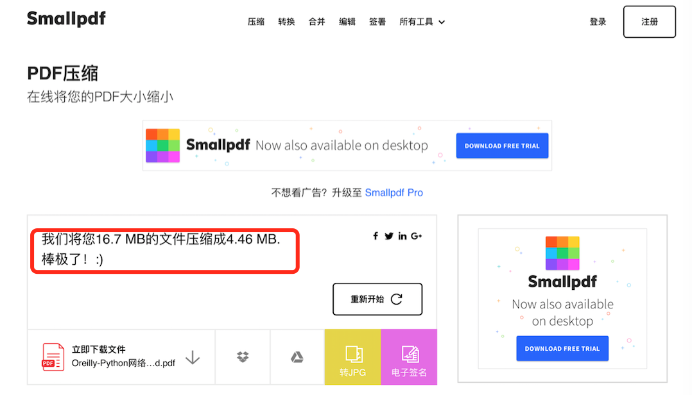

（Photo by **Aleks Dorohovich** on **Unsplash**）

最近学习Python，被元类和ORM框架那一块内容卡住，廖雪峰的教程翻来复去看了好几遍，ORM那块一直弄不懂。

想通过行方同事传两份Python资料到我们内网环境，方便写代码时查阅，但PDF文档太大，超出附件的大小限制（7M），没法将文档通过邮件附件传进内网。

直到昨天发现[Smallpdf](https://smallpdf.com)这个**免费**在线压缩工具，解决了我的大问题。一本16.7M的PDF文档被压缩为4.6M，另一本18M的PDF文档被压缩为6.7M，翻看了一下压缩后的文档，感觉质量并没有受损（肉眼没察觉出来），文档目录、导航、页眉页脚等功能全部保留下来，非常赞。

除此之外，这个在线工具还提供PDF转Word，PDF转JPEG、文档加密、多个文档合并等功能，非常实用，将这个工具推荐给大家。

<!--more-->

