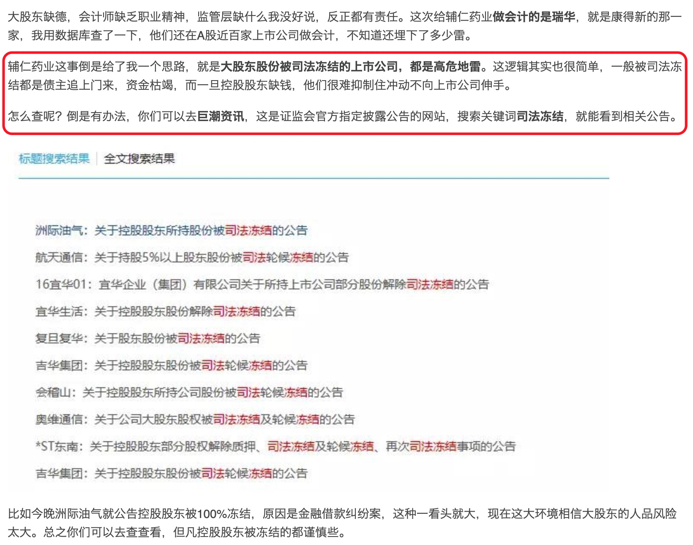
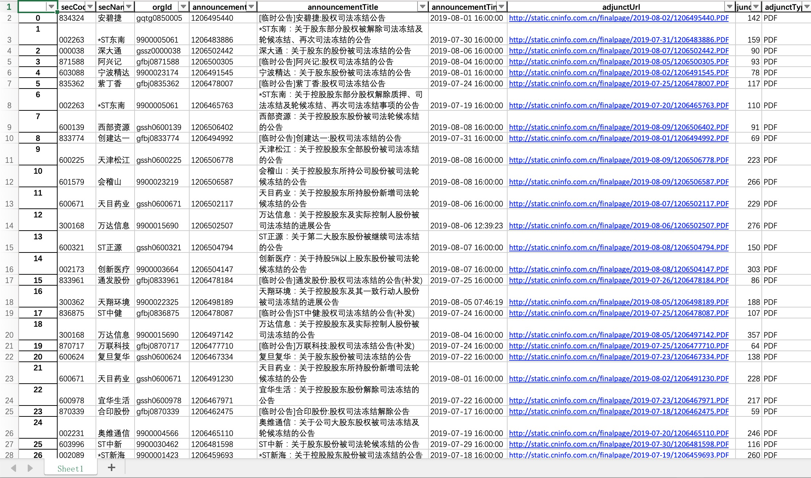

（Photo by rawpixel.com on Unsplash）

7月25日晚上看招财大牛猫的财经夜报，他提到过说“上市公司大股东，凡是股份有被司法冻结过，表明财务状况非常糟糕，建议投资者不要去碰”。



里面还特意提到可以去[巨潮网](http://www.cninfo.com.cn/new/index)查询“股份被司法冻结”的信息，当时看完就在想，这不就是我们Pythoner擅长干的事情吗。

<!--more-->

进到巨潮网搜了一下，司法冻结相关的记录有3800多条；一开始担心HTML页面元素复杂，要翻380页，数据量有点大，用requests库实现的爬虫可能吃不消，在考虑是不是要用Scrapy框架。犹豫之中，用Chrome的开发者模式突然间发现巨潮网提供了非常友好的API接口，试着写了一个requests爬虫，一顿猛如虎的操作之后，所有目标数据就都搞到手了。

```python
# -*- encoding:utf-8 -*-
"""
pgm:python_learning_cninfo2.py
ref:获取巨潮网司法冻结的股票名单
"""

import time
import json
import requests
import pandas as pd
from datetime import datetime
from functools import wraps


def decorator(f):

    @wraps(f)
    def func(*args, **kwargs):
        t1 = time.time()
        res = f(*args, **kwargs)
        t2 = time.time()
        print("Function %s takes %s time" % (f.__name__, (t2-t1)))
        return res
    return func


def format_timestamp(timestamp):
    # 将日期格式化处理
    temp = int(str(timestamp)[:10])
    datearray = datetime.utcfromtimestamp(temp)
    return datearray.strftime("%Y-%m-%d %H:%M:%S")


def replace_char(chardata):

    return chardata.replace('<em>', '').replace('</em>', '')


def get_page_nums(first_page_url):

    resp = requests.get(first_page_url)
    resp_dict = json.loads(resp.text)
    stock_totalAnnouncement = resp_dict['totalAnnouncement']
    stock_totalRecordNum = resp_dict['totalRecordNum']
    return max(stock_totalAnnouncement, stock_totalRecordNum)


@decorator
def gen_dataframe(data):

    df_columns = [
                'id',
                'secCode',
                'secName',
                'orgId',
                'announcementId',
                'announcementTitle',
                'announcementTime',
                'adjunctUrl',
                'adjunctSize',
                'adjunctType',
                'storageTime',
                'columnId',
                'pageColumn',
                'announcementType',
                'associateAnnouncement',
                'important',
                'batchNum',
                'announcementContent',
                'orgName',
                'announcementTypeName']

    try:
        df = pd.DataFrame(data=data, columns=df_columns)
    except Exception as e:
        print("gen_dataframe error:", type(e), e)
    else:
        pass

    try:
        df.to_excel('stock_blacklist_all.xlsx')
    except Exception as e:
        print("generate excel error:", type(e), e)
    else:
        pass


@decorator
def main(index_url, page_cnt):

    pdf_url_prefix = 'http://static.cninfo.com.cn/'
    stock_list_all = []
    for pos in range(1, page_cnt/10+1):
        page_url = index_url + str(pos)
        resp = requests.get(page_url)
        resp_dict = json.loads(resp.text)
        stock_list = resp_dict['announcements']
        for i in range(len(stock_list)):
            stock_id = stock_list[i]['id']
            stock_secCode = stock_list[i]['secCode']
            stock_secName = stock_list[i]['secName']
            stock_orgId = stock_list[i]['orgId']
            stock_announcementId = stock_list[i]['announcementId']
            stock_announcementTitle = replace_char(stock_list[i]['announcementTitle'])
            stock_announcementTime = format_timestamp(stock_list[i]['announcementTime'])
            stock_adjunctUrl = pdf_url_prefix + stock_list[i]['adjunctUrl']
            stock_adjunctSize = stock_list[i]['adjunctSize']
            stock_adjunctType = stock_list[i]['adjunctType']
            stock_storageTime = stock_list[i]['storageTime']
            stock_columnId = stock_list[i]['columnId']
            stock_pageColumn = stock_list[i]['pageColumn']
            stock_announcementType = stock_list[i]['announcementType']
            stock_associateAnnouncement = stock_list[i]['associateAnnouncement']
            stock_important = stock_list[i]['important']
            stock_batchNum = stock_list[i]['batchNum']
            stock_announcementContent = stock_list[i]['announcementContent']
            stock_orgName = stock_list[i]['orgName']
            stock_announcementTypeName = stock_list[i]['announcementTypeName']
            stock_list_one = [
                            stock_id,
                            stock_secCode,
                            stock_secName,
                            stock_orgId,
                            stock_announcementId,
                            stock_announcementTitle,
                            stock_announcementTime,
                            stock_adjunctUrl,
                            stock_adjunctSize,
                            stock_adjunctType,
                            stock_storageTime,
                            stock_columnId,
                            stock_pageColumn,
                            stock_announcementType,
                            stock_associateAnnouncement,
                            stock_important,
                            stock_batchNum,
                            stock_announcementContent,
                            stock_orgName,
                            stock_announcementTypeName]
            stock_list_all.append(stock_list_one)
    return stock_list_all

if __name__ == '__main__':

    index_url = 'http://www.cninfo.com.cn/new/fulltextSearch/full?searchkey= \
    %E5%8F%B8%E6%B3%95%E5%86%BB%E7%BB%93&sdate=&edate=&isfulltext=false&sortName=nothing&sortType=desc&pageNum='
    first_page_url = index_url + str(0)
    page_cnt = get_page_nums(first_page_url)
    stock_list_all = main(index_url, page_cnt)
    gen_dataframe(stock_list_all)
```

主程序是main函数，一个双层循环，将每个页面的数据提取后，添加到列表stock_list_all中，然后使用Pandas将其转换为一个DataFrame对象，最后将DataFrame导出到Excel表格。

Excel内容结果如下：




将股票代码、公司名称、被冻结时间、证监会公告PDF文档链接等信息都提取了出来。需要表格原件的请登录[百度网盘](https://pan.baidu.com/s/1CLTtN7sXZySn4V45fU4jkQ)下载，提取密码**tf04**。

使用双层循环实现之后，突发奇想如果用递归处理会怎么样呢，速度是不是会更快一些呢？递归处理过程中遇到一个大坑，详细见下一篇文章[一个Python递归问题](/2019/08/11/python_recursion_problem)。

最终问题解决了，递归实现的源代码放在[GitHub](https://github.com/benbendemo/learning-python)上，有兴趣的朋友自己去看吧。