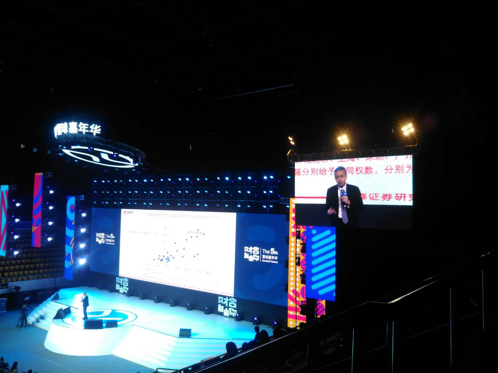
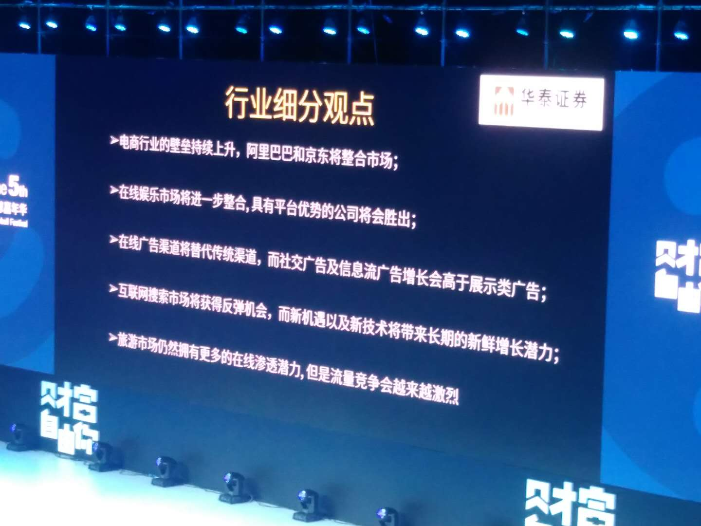

12/09日一大早，出门前往深圳体育馆参加雪球嘉年华活动。到达活动现场，时间不到9:00，入场处排满长队，保安在维持秩序，拦着一大堆人不让进，不知道是什么原因，大家焦急地等待着，据说前面已经放了4000多人进去，我是第一次参加雪球的嘉年华活动，看到现场有这么多人，有些出乎我的意料。

入场后，巴曙松正在台上分享，他讲了几个比较有意思的话题。其中调侃说“中国是全世界最盛产经济学家的地方”，我心领神会地一笑，因为江南愤青多次说过类似的观点，对于这个观点，我并不感觉陌生。

重头戏是听李迅雷的分享，这是我参加这次雪球嘉年华最主要的目的，目睹一下这位经济学家的尊容，听一下他最新的研究结果。李迅雷团队研究中国宏观经济形势，研究了30多年，在国内还是很有水准的。可惜，我水平有限，李迅雷那天讲了很多话题，很多专业术语，大部分我听不懂。

他讲的下面这几点我印象深刻，那天分享在朋友圈，也引起好几个好友讨论。

> 1、中国的14亿人口大致可以分为两拨，**3亿多中高等收入人群**和**10亿多中低等收入人群**，他是按照平均年收入和平均可支配年收入来划分的。他的意思是，前面这拨其实就相当于一个美国，这个阶层的消费升级是可以期待的，他们有需求、也具备消费能力。
>
> 2、关于人口净流入和净流出的研究。京津冀地区人口净流出大概在5%左右，浙江人口净流入22%，安徽和江西分别是净流入10%和8%，说明这两个省份具备吸引力。我有点惊讶的是江苏人口是净流出的，0.5%左右。
>
> 3、他讲广东省2018年经济形势，重点看好广州、深圳、东莞、佛山这4个城市，产业机构有积累、有优势，2018年**只有结构性投资机会，不存在全国普遍性的行情**。
>

<!--more-->

接下来好几位嘉宾分享，都提不起多大兴趣，唯一有收获的是华泰证券的一位TMT研究员，她对国内互联网领域的趋势分析，对我有启发，AT已经是绝对的巨无霸，只要它们扶持或者入股一家公司，这家公司就具备无限放大盈利能力的可能性，典型是最近上市的<u>**趣店(NYSE:QD)**</u>。

芝麻信用入股趣店，推动趣店的互金业务高速成长，直接催生互金龙头的诞生。(以IPO时的市值论)

我准备抽时间把支付宝和微信这两个超级APP里布局的全部互联网产品都体验一下，分析幕后的公司，挖掘潜在的投资机会，这是这位研究员带给我的启发。

下午收获寥寥，第二天的活动没去听，就写这么多吧。
