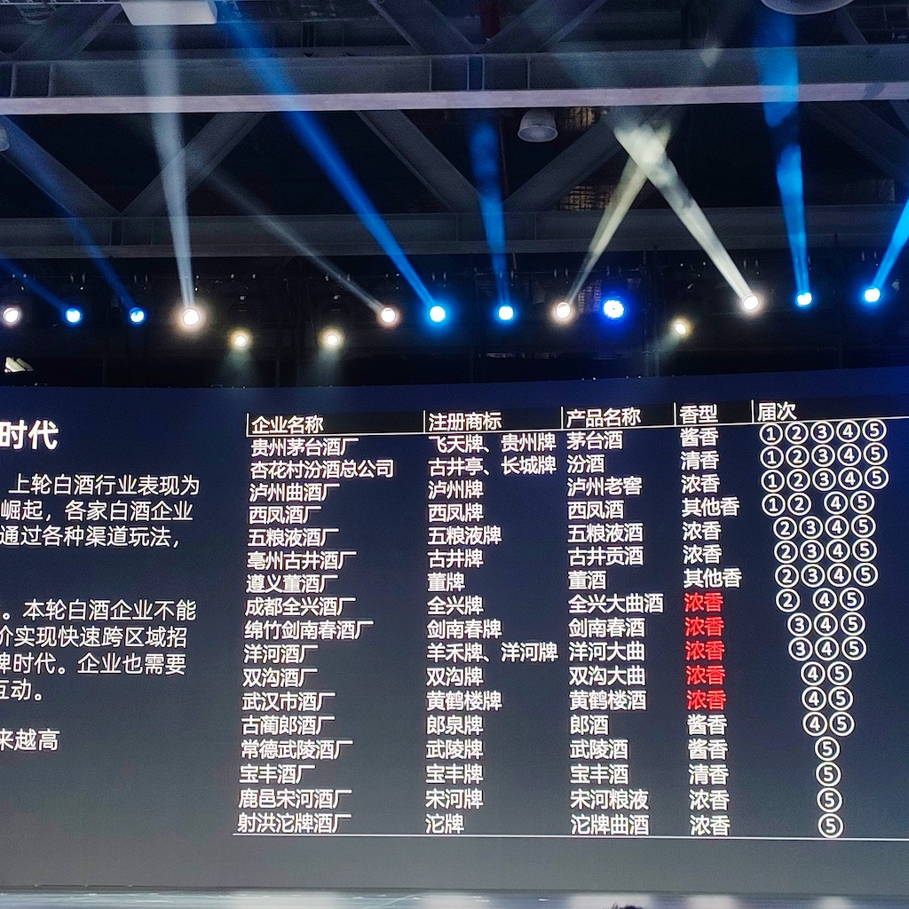
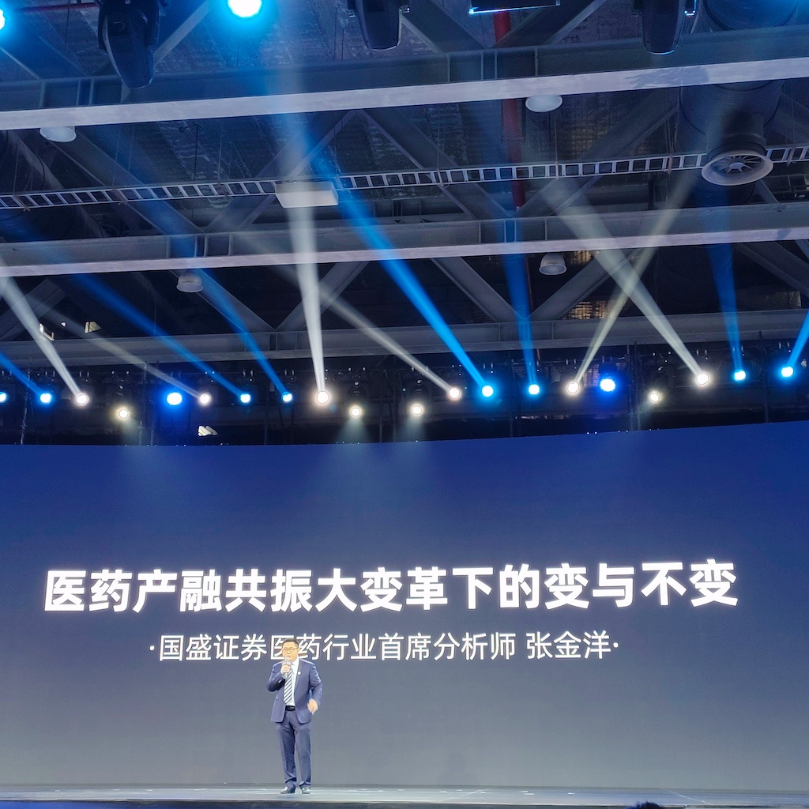
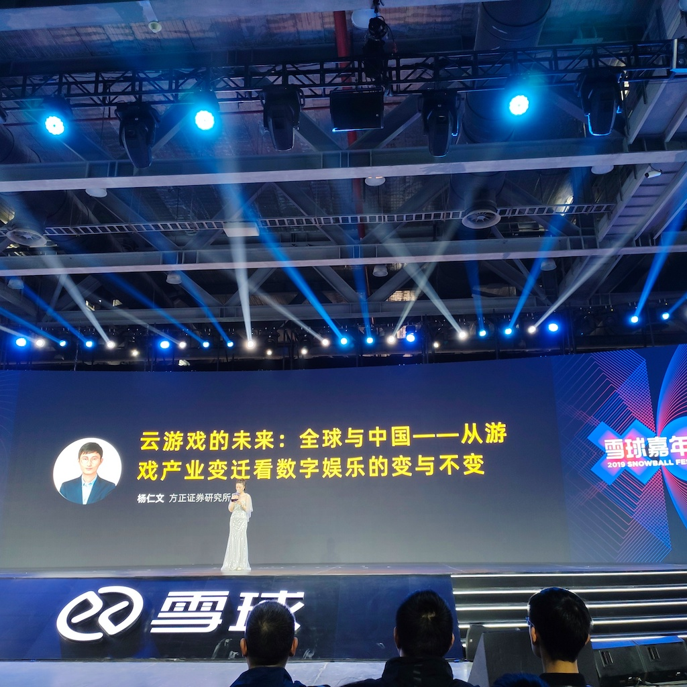
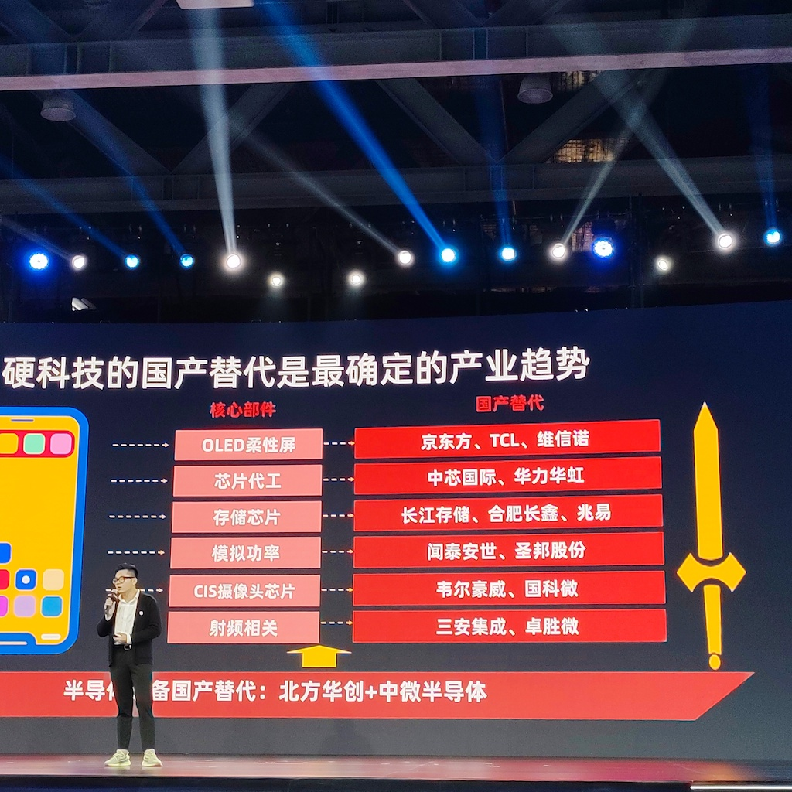
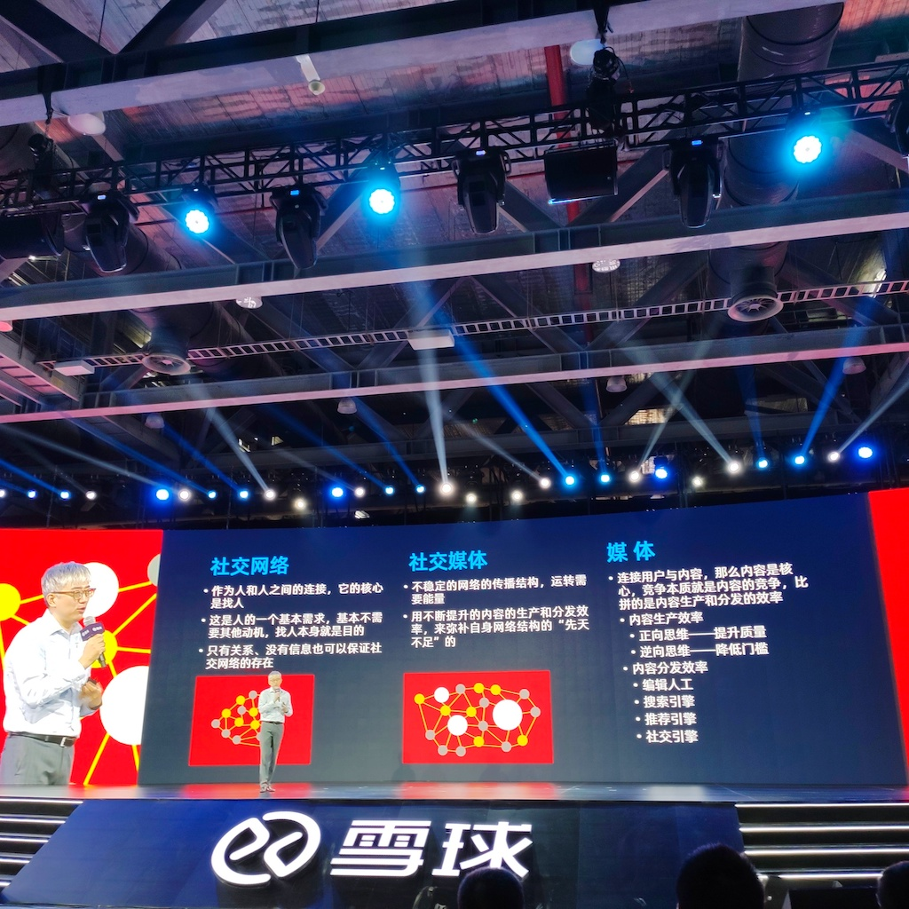
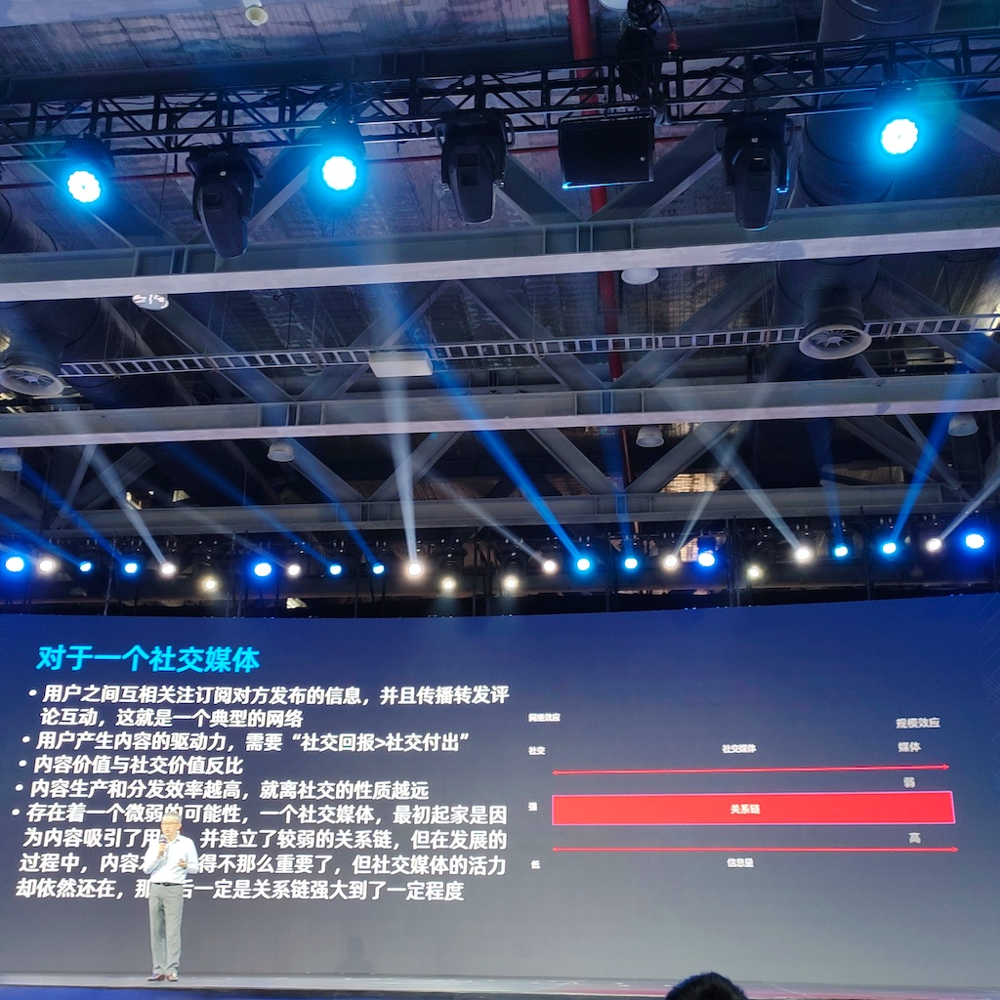

今天去广州参加2019年雪球嘉年华活动，收获很多，在此整理记录一下。

我参加这个活动的目的是去听雪球上各路大V对证券投资的分析，以及听券商分析师们对行业的研究与分析。

<!--more-->

招商证券食品饮料行业首席分析师**杨勇胜**，在食品饮料领域研究了8年。今天在台上讲白酒的投资逻辑，将2001年至今白酒行业的变与不变讲述了一遍，令人耳目一新。听他讲完这份PPT，我才知道白酒有酱香、浓香、清香和其它香这样的分法。

（图1-招商证券食品饮料行业分析师杨勇胜）

国盛证券医药行业首席分析师**张金洋**，在台上讲整个医药股的投资逻辑，从宏观政策到细分领域等各个方面由点到线再到面得介绍，一听就是有高水平的人。时间仓促，我感觉他还没把整个内容讲完，就匆匆下去了，有点意犹未尽。

（图2-国盛证券医药行业首席分析师张金洋）

方正证券研究所所长**杨仁文**讲述云游戏的未来，他有一句话让我印象深刻。”技术变革导致游戏设备的变迁，能够带来投资机会“。他从街机（我们小时候去游戏厅打的那种游戏机）到主机（Xbox和PlayStation）再到PC机（端游和页游）然后到手游，分析了每一次游戏硬件设备变革所带来的增量市场空间。接下来的一波浪潮他认为是5G+VR设备。

（图3-方正证券研究所所长杨仁文）

方正证券科技行业首席分析师**陈杭**讲5G和芯片股的投资逻辑，虽然没有讲出令我印象深刻的观点，但对整个行业周期和上下游趋势的发展做了详细介绍，重点说到了国产替代这个过程，让我对这个产业周期有了一个朦胧的认识。

（图4-方正证券科技行业首席分析师陈杭）

雪球创始人**方三文**分享新能源汽车的投资理念，这几天刷新了我的认知。

> 汽车产业是仅次于房地产的第二大产业，中国房地产行业每年产值10万亿，汽车行业产值3-4万亿
>
> 纯电动车适合用于有充电桩家庭的第二辆车
>
> 电动车在动力性能（**百公里加速时间**）上秒杀燃油车，但乘坐体验和安全性并不一定比燃油车强
>
> 电动车可以晚上停在家里充电，燃油车必须去加油站加油，这个方面电动车有优势

华兴资本董事总经理**刘佳宁**讲述社交网络、社交媒体和媒体这3者的关系，令人醍醐灌顶，我觉得用文字写不清楚他所讲的内容，得现场听才有意思。了解了这3者之间的关系后，就可以对我们每天使用的雪球、知乎、B站、微博、微信、抖音、头条这些App多一个维度的认识。

（图5-华兴资本董事总经理刘佳宁）

（图6-华兴资本董事总经理刘佳宁）

雪球CEO**李楠**说中环股份董事长称雪球上的评论是“乡间俗谈”，哈哈，莫名戳中笑点。

雪球人气用户**林园**对投资风险的认识，令人印象深刻。

其它介绍自己公司的宣传稿，我就不写了，一整天的活动听下来，最大的几点感受是：

1. 听这些雪球大V和分析师的演讲，可以培养大局观，对提升炒股水平一点用也没有；
2. 投研能力是非常专业的一个能力，不是普通散户（比如说我）轻易能学得到的；
3. 普通散户如果既缺乏投研能力，又不擅长使用数据进行基本面分析，直接与正规军在市场中贴身肉搏，很难在市场中存活。即便通过自身学习，掌握了一定的分析能力，但如果对趋势的反转、拐点的来临把握不到位，也还是很难赚钱。

想到这里，我觉得对于普通散户来说，挣市场波动的钱可能比挣价值的钱或成长的钱，要容易一些。于我来说，我具备编程能力，可以借助Tushare这一类工具对市场指数、个股信息作一些数据化分析，这或许是一个可以尝试的方向。